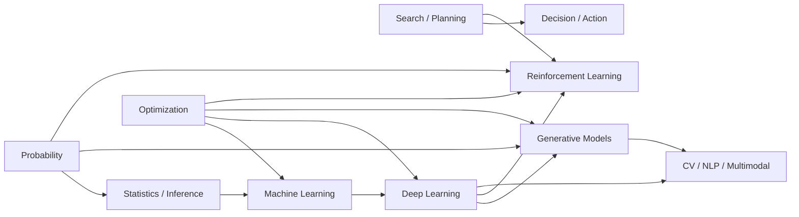

# 人工智能与机器学习 Subject Atlas：从求解、学习到生成与决策

> 类型：Atlas
> 状态：Atlas 工作稿，待人工确认；当前目标是先铺横向主干，不提前锁定研究方向。

## 0. Mother Question

人工智能的算法很多，但当前学习不按“算法名录”组织，而围绕一个更稳定的问题：

> **当一个系统需要在复杂、未知或不确定的环境中完成任务时，它怎样表示问题、寻找解、从数据或交互中获得规律，并把这些规律变成预测、生成或行动？**

这张 Atlas 先用五类责任压缩整个视野：

\[
\boxed{
\text{AI}
=
\text{Representation}
+\text{Inference / Search}
+\text{Learning}
+\text{Optimization}
+\text{Decision / Action}
}
\]

它不是对所有 AI 子领域的最终分类，而是当前用于学习和路由的工作地图。

## 1. 当前学习目标：先铺横杠，再决定竖杠

第一阶段不追求在某一方向达到研究深度，而要求对下列七块都能回答四个问题：

1. **Problem**：它为什么存在，解决什么母问题？
2. **Representation**：问题被表示成什么对象？
3. **Core Algorithms**：第一批必须认识的算法是什么？
4. **Relationship**：它向哪些领域提供输入，又依赖哪些领域？

完成横向主干后，再通过真实推导、代码、小实验和论文片段观察自己更喜欢：Optimization、Learning Theory、Generative Models、RL、Scientific ML、CV/NLP，还是其他方向。

## 2. 七块横向主干

| 模块 | 它真正解决的问题 | 第一批算法 / 对象 | 与其他模块的关键连接 |
|---|---|---|---|
| **Search** | 规则大体已知，但可能状态太多时，怎样找到解或好行动？ | BFS、DFS、Uniform Cost、A*、Minimax、α-β、CSP | 为规划、博弈、部分 RL 与推理提供“在可能性空间中选择”的母模型 |
| **Probability** | 世界状态、数据和观测不确定时，怎样表示并更新信念？ | Random Variable、Conditional Probability、Bayes Rule、Gaussian、MLE/MAP、Monte Carlo | 为统计学习、生成模型、不确定决策提供语言 |
| **Machine Learning** | 映射或规律无法直接手写时，怎样从数据中估计它？ | Linear/Logistic Regression、KNN、Trees、Boosting、SVM、PCA、K-means | 把 Probability、Statistics、Optimization 汇入“从经验改进模型” |
| **Optimization** | 已经有目标函数后，怎样找到好的参数或行动？ | GD、SGD、Momentum、Adam、Newton/BFGS、KKT、Proximal Method | 是 ML/DL 训练的执行引擎，也连接控制、RL 与科学计算 |
| **Deep Learning** | 怎样构造可学习的高表达函数处理高维、复杂结构数据？ | MLP、Backprop、CNN、RNN、ResNet、Attention、Transformer | 为视觉、语言、生成、RL 等提供可学习表示与函数逼近器 |
| **Reinforcement Learning** | 行动会影响未来数据且奖励延迟时，怎样学习长期决策？ | MDP、Bellman Equation、DP、MC、TD、Q-learning、Policy Gradient、Actor-Critic | Probability + Sequential Decision + Optimization；深度网络产生 Deep RL |
| **Generative AI** | 怎样学习数据分布或生成过程，并从中产生新样本？ | Autoregressive、VAE、GAN、Diffusion、Flow Matching | Probability + DL + Optimization；与语言模型、视觉生成和表示学习汇流 |

## 3. 三条必须反复复原的主链

### 3.1 学习链：Data → Model → Objective → Optimization → Generalization

\[
\boxed{
\text{Data}
\rightarrow
\text{Model } f_\theta
\rightarrow
\text{Objective}
\rightarrow
\text{Optimization of }\theta
\rightarrow
\text{Generalization}
}
\]

这是第一条学习主梁。以后遇到任何监督学习或深度学习模型，先问：

- 数据和任务是什么？
- 模型族能表示什么？
- 目标函数为什么这样写？
- 参数怎样被优化？
- 为什么训练集之外还能工作？

### 3.2 概率链：Unknown → Distribution → Conditioning / Inference → Decision

\[
\boxed{
\text{Unknown}
\rightarrow
p(\cdot)
\rightarrow
\text{Condition / Infer}
\rightarrow
\text{Decision}
}
\]

Probability 不是旁边的一门数学课，而是表示“不知道”的语言。后续的 likelihood、Bayesian inference、cross entropy、latent variable、generative model 都要回到这条链上。

### 3.3 决策链：State → Action → Transition → Reward → Long-term Return

\[
\boxed{
S_t\rightarrow A_t\rightarrow S_{t+1},R_t
\rightarrow
\text{long-term return}
}
\]

这条链把静态预测推进到“行动改变未来”的问题，也是 Search、Dynamic Programming、Optimal Control 与 RL 汇流的位置。

## 4. 模块之间不是并排关系



当前把这些箭头当作**待学习中不断验证的关系**。Atlas 只拥有路由，不在这里展开每条接口的完整理论。

## 5. 数学 Foundation：只在算法需要时补

本分支采用：

\[
\boxed{
\text{Problem}
\rightarrow
\text{Algorithm}
\rightarrow
\text{Math Gap}
\rightarrow
\text{Fill the Gap}
\rightarrow
\text{Return to Algorithm}
}
\]

而不是“先学完所有数学，再开始 AI”。

| 数学语言 | 在 AI 中第一次真正需要它的典型位置 | 当前路由 |
|---|---|---|
| 线性代数 | 线性模型、PCA、神经网络、Attention、低秩表示 | 优先 Use `../../10_数学一/20_线性代数/`；ML 特有的矩阵微积分/高维结构按需扩展 |
| 微积分 / 多元微分 | Gradient、Backprop、Taylor、局部近似 | 优先 Use `../../10_数学一/10_高等数学/`；Jacobian/Hessian/自动微分按算法需要深化 |
| 概率与统计 | likelihood、generalization、不确定性、latent variables | 优先 Use `../../10_数学一/30_概率论/`；Bayesian / information-theoretic 内容按需扩展 |
| Optimization | 模型训练、约束、收敛、regularization | 本 Atlas 的横向核心之一；后续可独立成为研究方向 |
| Information Theory | Cross Entropy、KL、Mutual Information、Language Modeling | 当前作为 Foundation Extension，等生成模型/学习理论触发 |
| ODE / Dynamical Systems / Stochastic Process | Neural ODE、Diffusion、Optimal Control、Scientific ML | 当前作为 Extension，等对应方向触发 |

### Anti-Pattern：不要把数学基础重复抄一遍

复试 AI 笔记只记录**某个数学对象在算法中的新解释责任**。如果一个定义已经由数学一 Owner 完整拥有，这里只写 Use 和接口，不重新建立第二份真相。

## 6. 当前 Topic / Bridge / Integration 规划

这些只是**规划归属**，不等于已有成熟 Handbook。

### Topics

| ID | 规划 Topic | Mother Question | 当前状态 |
|---|---|---|---|
| AI-T01 | Search 与状态空间求解 | 当解藏在巨大可能性空间中，怎样系统寻找？ | 规划，正文未建 |
| AI-T02 | 概率建模与统计推断 | 怎样用分布表示未知，并从数据更新它？ | 规划，正文未建 |
| AI-T03 | Statistical Learning | 怎样从有限样本选择能泛化的模型？ | 规划，正文未建 |
| AI-T04 | Optimization for Learning | 目标已知后，参数怎样被有效更新？ | 规划，正文未建 |
| AI-T05 | Deep Neural Networks | 深层可学习函数为什么能表示并训练复杂映射？ | 规划，正文未建 |
| AI-T06 | Reinforcement Learning | 怎样在交互、延迟奖励和探索中学习策略？ | 规划，正文未建 |
| AI-T07 | Generative Models | 怎样表示并学习数据生成分布，再进行采样？ | 规划，正文未建 |

### Candidate Bridges

当前先记录接口，不急着独立建册：

- **Probability → Loss / Estimation**：likelihood 怎样变成 loss；
- **Differentiation → Backprop / Optimization**：局部导数怎样变成大模型参数更新；
- **Optimization → Learning**：优化训练误差为什么不自动等于泛化；
- **Search / Dynamic Programming → RL**：已知模型求最优决策怎样过渡到未知模型下学习；
- **Probability → Generative Modeling**：density / likelihood / sampling 各自扮演什么角色；
- **Continuous Dynamics → Diffusion / Flow / Control**：生成与控制何时共享 ODE/SDE 语言。

只有通过 Bridge Validity 与 Standalone Promotion 两道 Gate 后，才建立独立 Bridge Handbook。

### First Integration Candidate

第一条实际学习路线先不从“最新 Transformer”开始，而从：

> **Linear Regression → Logistic Regression → Neural Network：到底什么叫学习？**

沿一个完整过程反复追踪：

\[
\text{Data}
\to
\text{Model}
\to
\text{Probability Assumption}
\to
\text{Loss}
\to
\text{Optimization}
\to
\text{Prediction}
\to
\text{Generalization}
\]

它更像一个 Integration：组合 Probability、Statistics、Optimization 与 Model Representation，而不是重新拥有这些机制。

## 7. 推荐学习路由

```text
Round 0  读这张 Atlas，只建立问题地图
    ↓
Round 1  First Integration：Linear → Logistic → Neural Network
    ↓
Round 2  Probability / Statistics + Statistical Learning
    ↓
Round 3  Optimization + Deep Neural Networks
    ↓
Round 4  Search / Sequential Decision → RL
    ↓
Round 5  Generative Models
    ↓
Round 6  CV / NLP / Scientific ML / Learning Theory 等方向体验
    ↓
选择一条竖杠，开始论文级深入
```

这不是死板先修链。学习中如果某个算法先暴露数学缺口，就局部补齐后返回主线。

## 8. 怎样判断未来更适合哪条竖杠

不按“哪个方向现在最火”决定，而观察自己在真实任务中的持续兴趣：

| 候选方向 | 重点观察的问题偏好 |
|---|---|
| Optimization | 是否喜欢目标函数、几何、收敛、数值算法和训练动力学？ |
| Learning Theory | 是否喜欢“为什么能泛化”、复杂度、界、证明和统计性质？ |
| Generative Models | 是否喜欢概率分布、latent variable、sampling、ODE/SDE 与生成机制？ |
| Reinforcement Learning | 是否喜欢动态决策、Bellman、exploration、control 与长期信用分配？ |
| Scientific ML | 是否喜欢 PDE/ODE、数值分析、物理约束与机器学习结合？ |
| CV | 是否喜欢空间结构、视觉表征、检测/分割/生成等任务？ |
| NLP / LLM | 是否喜欢序列、语言建模、Transformer、推理与 post-training？ |

真正的判据不是“看介绍时觉得酷”，而是：**当进入这个方向最麻烦的数学、实验和失败案例以后，是否仍愿意继续追。**

## 9. External Source Routing（当前会话已有材料）

这些书作为 Source / Reference 使用，不自动成为 Canonical Owner：

- **Russell & Norvig, _Artificial Intelligence: A Modern Approach_**：AI 全景、Search、Planning、Probability、Learning、RL 的广域地图；
- **Kevin P. Murphy, _Probabilistic Machine Learning: An Introduction_**：Probability → Statistics → Decision Theory → Information Theory → Linear Algebra → Optimization → ML/DL 的统一概率视角；
- **Xiaojing Ye, _Mathematical Foundations of Deep Learning: Theory and Algorithms_**：Function Approximation、Network Training、Optimal Control、RL、Generative Models 的数学主线；
- **Clark & Berry, _Models Demystified_**：建模、评价、估计、优化与常用 ML 模型的实践直觉。

后续真正学习某个 Topic 时，再按 Topic 做 Source Diff，不按书的目录机械抄写。

## 10. Stop Boundary

这张 Atlas 不负责：

- 展开 Universal Approximation、Backprop、Bellman、Diffusion 等完整推导；
- 罗列所有网络架构或“最新模型”；
- 在尚未体验方向前替使用者选择研究方向；
- 重写数学一已经拥有的基础定义；
- 把 CV / NLP 当作与 Probability / Optimization 同层的基础机制强行并排。

这些都应路由到后续 Topic、Bridge、Integration 或方向专题。
