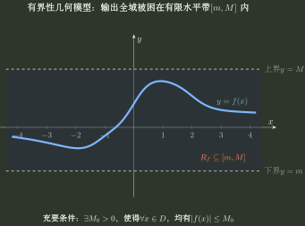

# 值域、有界性与单射

> 训练定位：输出可达、输出是否被有限范围控制、原像数量、陪域/值域、单射、分段值域拼接，以及它们与反函数的接口。  
> 模型归属：[《函数对象、表示与结构》](函数对象_表示与结构.tex)。值域与有界性研究像集 $f(D)$；单射性研究原像集 $f^{-1}(\{y\})$ 的元素个数。三者都与输入、输出之间的对应关系有关，但不是同一个“输出集合形状”问题。

## 母题一：值域问的不是“像哪个区间”，而是哪些输出真的能够达到

对固定输出 $y$，研究

$$
P_y=\{x\in D:f(x)=y\}.
$$

于是

$$
y\in f(D)
\iff
P_y\ne\varnothing.
$$

值域问题本质上问：

> 对这个 $y$，至少有没有一个合法输入能产生它？

### 变式轴

- 基本函数直接读值域；
- 平移、伸缩以后值域随纵向变换改变；
- 分段函数由各段值域做并集；
- 复合函数先看内层实际可达范围，再看外层在这部分输入上的输出；
- 参数改变以后可达范围改变；
- **题目用方程 $f(x)=y$ 反向刻画值域**。

### 局部规则：值域先走结构路径，结构不足再切函数形状

**触发信号**：要求值域、参数可达范围或分段输出范围。

**第一动作**：先检查基本函数范围、纵向坐标变换、分段值域并集、复合的实际输入范围或方程 $f(x)=y$ 的代数约束，尽量直接描述哪些输出可达。

**检查与退出**：若这些结构已经确定完整值域就停止；只有当可达边界仍依赖区间内的单调、极值或整体形状时，才切到专题04，避免在 Topic01 里复制整套导数判形机制。

---

## 母题二：有界性只问“全部输出能否被统一装进有限范围”

在集合 $D$ 上，若存在常数 $M>0$ 使

$$
\lvert f(x)\rvert\le M,\qquad \forall x\in D,
$$

则称 $f$ 在 $D$ 上有界。等价地，值域满足

$$
f(D)\subseteq[-M,M].
$$

因此，有界性既不描述函数变化得快不快，也不等同于连续；它的正式判据只是：是否存在 $M>0$ 使对所有 $x\in D$ 都有 $\lvert f(x)\rvert\le M$。

把有界性想成“输出轴上的有限盒子”比记 $\lvert f(x)\rvert\le M$ 更稳：函数在里面怎样振荡、是否连续、有没有极值点都可以不同；只要所有实际输出始终逃不出一个有限水平带，就是有界。

### 三个一定要分开的概念

- **有界**：只要求存在统一常数 $M>0$ 使 $\lvert f(x)\rvert\le M$；
- **存在最大/最小值**：还要求边界值真的被取到；
- **连续**：描述局部输入扰动怎样传到输出，不等价于有界。

最小反例：

$$
f(x)=x,\qquad x\in(0,1)
$$

有界，但既没有最大值也没有最小值；而

$$
f(x)=\frac1x,\qquad x\in(0,1)
$$

在开区间上连续，却无界。

所以看到“连续”时必须继续问：**定义域有没有把输入关住，边界处有没有逃逸？**

### 三条常用充分路径，但前提不能省

#### 一、闭区间连续

若

$$
f\in C[a,b],
$$

则 $f$ 在 $[a,b]$ 上有界，而且还能取得最大值和最小值。完整机制由专题04拥有；这里把它当作有界性的调用接口。

#### 二、开区间连续 + 两端有限极限

若 $f$ 在 $(a,b)$ 上连续，并且

$$
\lim_{x\to a^+}f(x),\qquad \lim_{x\to b^-}f(x)
$$

都存在且为**有限实数**，则 $f$ 在 $(a,b)$ 上有界。

这里“存在”不能偷偷包含 $+\infty$ 或 $-\infty$；例如 $1/x$ 在 $(0,1)$ 上虽然有 $x\to0^+$ 的扩展极限 $+\infty$，但显然无界。

对 $(a,+\infty)$、$(-\infty,b)$、$\mathbb R$ 也用同一想法：有限端点看单侧有限极限，无穷端看 $x\to\pm\infty$ 的**有限极限**，中间剩下的闭区间再由连续性控制。

#### 三、有限区间上导数有界

若 $I$ 是有限区间，$f$ 在 $I$ 的内部可导，并且对所有内部点有

$$
\lvert f'(x)\rvert\le K,
$$

则任选一个内部点 $x_0$。对任意内部点 $x$，在 $x$ 与 $x_0$ 之间的闭线段上使用中值定理可得

$$
\lvert f(x)-f(x_0)\rvert\le K\lvert x-x_0\rvert.
$$

由于 $I$ 的长度有限，全部内部函数值被统一控制；若某个端点属于 $I$，它只额外增加一个已经定义好的有限函数值，把这些有限个端点值并入上界即可。因此 $f$ 在 $I$ 上有界。

**有限区间是关键前提。** 在整个实轴上取

$$
f(x)=x,
$$

虽然 $f'(x)=1$ 有界，但 $f$ 本身无界。

### 反例库：把“有界”从其他标签里剥离出来

- 有间断点仍可能有界：$\operatorname{sgn}x$ 在 $0$ 间断，但 $\lvert\operatorname{sgn}x\rvert\le1$；
- 周期也不自动有界：定义
  $$
  f(x)=\frac1{\lvert\sin \pi x\rvert}\quad(x\notin\mathbb Z),\qquad f(n)=0\quad(n\in\mathbb Z).
  $$
  该函数是 $1$ 周期函数，但在每个整数附近都无界；若函数在 $\mathbb R$ 上连续且具有非零周期，则可由一个闭周期区间上的有界性推出全局有界；
- 有界不保证取到最值：$f(x)=x$ 在 $(0,1)$ 上就是最小反例。

### 局部规则：有界题先找输出可能逃向无穷的位置

**触发信号**：要求判断函数在给定定义域/区间上是否有界，且函数含端点、无穷远、分母零点、根式/对数边界或分段接口。

**第一动作**：不要机械地“先找所有间断点”，而按顺序扫描：

1. 定义域有限端点与 $\pm\infty$；
2. 分母为零、根式/对数的定义域边界、分段接口；
3. 对每个候选点看局部主阶：是有限跳跃、可去，还是仍留下负幂/无穷增长；
4. 剩余闭合或远离危险点的部分再用连续性、单调性或已知界统一控制。

**检查与退出**：找到任一真实无界逃逸机制即可否定全域有界；若所有危险位置都被压成有限行为，还必须继续控制剩余部分，不能仅凭“危险点都没爆炸”就结束。若控制需要完整极限或区间形状理论，转 Topic02/04 调用对应机制。

也就是说，真正的问题是

$$
\boxed{\text{哪里可能逃逸？逃逸机制是否真的存在？}}
$$

而不是“哪里不连续”。

### 例：用局部主阶判断有界性

考虑

$$
f(x)=\frac{\lvert x\rvert\sin(x-2)}{x(x-1)(x-2)^2}.
$$

第一动作不是“找间断点以后全部判无界”，而是逐个看危险点的**剩余阶数**：

- $x=0$：$\lvert x\rvert/x=\operatorname{sgn}x$，左右极限不同，所以这里有跳跃型间断，但两侧函数值都保持有限；
- $x=1$：$\sin(-1)\ne0$，仍剩 $1/(x-1)$ 型爆炸；
- $x=2$：$\sin(x-2)\sim x-2$ 只消掉一个 $(x-2)$，仍剩 $1/(x-2)$ 型爆炸。

因此在 $x=1$ 或 $x=2$ 的任意邻域内函数都无界；而在区间 $(-1,0)$ 上，函数远离这两个无界点，且 $x\to0^-$ 时函数值保持有限，所以该区间上有界。

这个例子要留下的不是选项，而是：

$$
\boxed{\text{间断点}\ne\text{无界点};\qquad\text{真正看局部主阶是否留下负幂}.}
$$

---

## 母题三：陪域和值域不能混成一个集合

若

$$
f:D\to B,
$$

则 $B$ 是声明的陪域，$f(D)$ 是实际值域。

$$
f(D)\subseteq B.
$$

### 训练信号

- 问满射：检查 $f(D)=B$；
- 问双射：既要单射，又要对给定陪域满射；
- 问通常意义下的反函数：反函数输入来自原函数实际值域 $f(D)$；
- 同一个逐点公式换了陪域，满射/双射结论可能变化，但函数值本身没有变化。

对象层的完整区分见 [函数对象与定义域](函数对象与定义域.md)。

---

## 母题四：单射等价于每个输出的原像至多含一个元素

单射要求

$$
f(x_1)=f(x_2)\Longrightarrow x_1=x_2.
$$

等价地，若 $f:D\to B$，则

$$
\forall y\in B,\qquad \lvert P_y\rvert\le1.
$$

若只在实际值域 $f(D)$ 上计数，也可写成

$$
\forall y\in f(D),\qquad \lvert P_y\rvert=1.
$$

### 几何检查

- 竖线检查：当前关系是不是函数；
- 横线检查：函数是否单射；若目标集合取实际值域 $f(D)$，单射即保证逆映射存在。

这两个检查不要混淆。

### 可以直接判定非单射的典型结构

- 偶函数的对称定义域同时含 $x$ 与 $-x$；
- 非恒定周期函数在完整周期域上重复取值；
- 分段函数不同段的值域发生重叠；
- 偶次幂、绝对值等存在不同输入取得相同函数值的结构。

---

## 母题五：严格单调可以推出单射，但它不是单射的定义

若函数在区间上严格递增或严格递减，则一定单射。

但是：

- “单调不减/不增”若允许平台区间，不能保证单射；
- 单射本身不等于严格单调；
- 在非区间或离散定义域上，更不能把二者机械等同。

若题目只问 $f:D\to f(D)$ 是否存在反函数，可以直接检查单射条件；若已经证明函数在相应区间严格单调，则可由严格单调性推出单射。

完整单调训练见 [单调性](单调性.md)。

---

## 母题六：分段函数先拼值域，再判断全局单射

设

$$
f(x)=f_i(x),\qquad x\in D_i.
$$

### 求值域

先求每段值域 $R_i$，再做

$$
R_f=\bigcup_i R_i.
$$

### 判断全局单射

必须同时满足：

1. 每一段内部单射；
2. 不同段值域互不重叠。

只检查“每段都单调”是不够的。

### 求反函数

如果全局单射成立，反函数按原各段值域分段，而不是照抄原定义域分段条件。详细训练见 [反函数](反函数.md)。

---

## 母题七：限制定义域的目的，是使限制映射成为单射

若原函数 $f:D\to f(D)$ 不是单射，可以选择子集 $I\subseteq D$，研究限制映射

$$
f\vert_I:I\to f(I).
$$

只有当限制映射 $f\vert_I:I\to f(I)$ 单射时，它才存在反函数 $(f\vert_I)^{-1}:f(I)\to I$。所谓“限制区间求反函数”，数学上就是选择这样的单射限制。

### 典型对象

- $x^2$：限制到 $x\ge0$ 或 $x\le0$；
- $\lvert x\rvert$：限制半轴；
- 正弦、余弦：限制到严格单调主支；
- 周期函数：若要限制定义域后求逆，必须实际找到一个单射限制；一个周期区间本身并不自动保证单射；
- 分段函数：除检查每一段内部是否单射外，还要检查不同分段的值域是否相交。

---

## 母题八：值域与结构可以互相提供约束，但不要越权

### 可以直接用的结构

- 基本函数已知值域；
- 纵向平移/伸缩直接搬运值域；
- 偶次幂、绝对值给出非负性；
- 有界性给出 $f(D)\subseteq[-M,M]$ 这样的整体包含关系；
- 单射只控制原像数量，不自动给出值域端点。

### 需要切换专题04的情况

如果题目必须通过单调区间、极值、最值或凹凸来确定值域，则进入专题04，不把导数判形机制重复写进本文件。

---

## 独立检查

1. 我求的是陪域还是实际值域？
2. 我是否真正证明了区间里的每个输出都能达到，而不只是证明“函数值不会超出这个范围”？
3. 判断单射时，我是在数合法原像，还是误把“单调”当定义？
4. 分段函数是否检查了不同分段的值域是否相交？
5. 限制定义域以后，是否已经满足 $f(x_1)=f(x_2)\Rightarrow x_1=x_2$？
6. 判断有界时，我是在检查“所有输出能否统一装进有限范围”，还是把连续/无间断误当成有界？
7. 若用了闭区间连续、端点极限或导数有界来判有界，对应的区间条件与有限极限条件是否真的满足？
8. 反函数定义域是否回到原函数实际值域？

## 代表题与证据

优先补入：值域方程法、分段值域拼接、有界但不取最值、连续开区间却无界、间断但有界、有限区间导数有界、同式不同陪域、限制定义域获得单射、直接证明单射、值域与反函数联动。