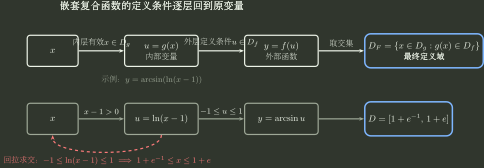

# 函数对象与定义域

> 训练定位：函数对象的确定、定义域条件、陪域/值域区分，以及“关系能否定义单值函数”的对象边界。  
> 模型归属：[《函数对象、表示与结构》](函数对象_表示与结构.tex)。定义、证明与机制边界以规范正文为准。

## 母题一：多个定义域条件怎样统一到原变量

### 核心思路

把每一层运算的定义条件都写出来，再统一改写成关于原变量的条件：

$$
D=C_1\cap C_2\cap\cdots\cap C_m.
$$

图中的箭头表示**定义条件怎样由外层要求逐层回拉到原变量**，不是运算先后顺序。每经过一层，就会增加一个合法输入条件；只有把所有条件都改写成关于同一个原变量 $x$ 的条件后，才能真正取交集。

常见定义条件：

- 分母：分母不为零；
- 偶次根式：被开方量非负；
- 对数：真数严格为正；
- 反正弦、反余弦：内层值落在 $[-1,1]$；
- 正切、余切：相应分母不为零；
- 复合函数：内层输入合法，并且内层输出还要落进外层定义域；
- 分段函数：先满足分段条件，再满足该段解析式自身的定义条件。

### 变式轴

- 根式、对数、分式互相嵌套；
- 反三角与对数复合；
- 外层定义条件反过来加强内层条件；
- 分段条件与解析式自身的定义条件同时出现；
- 化简后原来的禁点被隐藏；
- 给出复合后的定义域反求参数。

### 为什么先列条件再化简

定义域题首先是在求所有定义条件的交集，而不是先做代数化简。若先化简，约分、平方、开方等操作可能把原禁点或分支条件隐藏掉，因此必须先把每一层运算的合法条件记录下来。

### 局部规则：从内到外列定义条件，最后取交集

**触发信号**：出现根式、对数、分母、反三角、多层复合或分段条件，并要求定义域、参数范围或合法输入集合。

**第一动作**：从最内层开始逐层写出定义条件，每得到一个新条件都改写成关于原变量的条件，最后统一取交集并化简。

**检查与退出**：检查是否存在冗余条件、互相矛盾的条件，或被更强条件自动蕴含的条件；只有所有条件都已经改写到同一个原变量并完成交集化简后，才结束定义域分析。

例如

$$
h(x)=\arcsin(\ln(x-1))
$$

真正的强条件是

$$
-1\le \ln(x-1)\le 1,
$$

于是

$$
D_h=[1+e^{-1},1+e].
$$

外层反正弦给出的条件已经蕴含 $x-1>0$，因此无需再额外保留一个独立的对数真数条件。

---

## 母题二：解析式相同，不代表函数对象相同

### 问题表示

比较函数对象时，至少检查

$$
\text{定义域}+\text{逐点对应规律}.
$$

如果题目显式写成映射 $f:D\to B$ 并讨论满射或双射，还要保留陪域 $B$。

### 典型变式

- $\dfrac{x^2-1}{x-1}$ 与 $x+1$：解析式化简后相同，但前者仍缺少 $x=1$；
- 同一个解析式配不同定义域；
- 同一逐点公式配不同陪域，导致满射/双射判断不同。

这一母题只负责回答“两个函数对象是否相同”。至于平方、开方、消元、参数消去等表示变换会丢失什么信息，统一转到 [函数表示与信息保护](函数表示与信息保护.md) 处理，避免两份文件重复维护同一套规则。

---

## 母题三：陪域、值域与函数相等

### 核心区分

若

$$
f:D\to B,
$$

则：

- $D$ 是允许输入；
- $B$ 是声明的目标集合；
- $f(D)$ 才是实际值域。

因此

$$
f(D)\subseteq B.
$$

满射问 $f(D)=B$；反函数真正允许输入的是原函数的实际值域 $f(D)$。

### 重要边界

- 基础微积分里常省略陪域，所以比较两个实函数时通常检查“定义域相同 + 定义域内逐点函数值相同”；
- 一旦题目显式给出 $f:D\to B$ 并讨论满射、双射，陪域就是映射对象的一部分，不能忽略；
- “值域相同”不等于“函数相同”，因为逐点对应规律还可能不同。

---

## 母题四：先判断题目给的是函数，还是一般关系

### 典型信号

- 隐式方程 $F(x,y)=0$；
- 参数方程 $x=x(t),y=y(t)$；
- 分段定义；
- 图像或轨迹。

### 局部规则：关系写成函数前先检查单值性

**触发信号**：出现隐式方程、参数曲线、轨迹或图像，并要求写成 $y=f(x)$、求定义域/值域，或继续做函数性质判断。

**第一动作**：在当前研究范围内检查每个合法的 $x$ 是否至多对应一个 $y$；若不是，先按题意限制分支或明确它只是一般关系。

**检查与退出**：确认所选分支覆盖范围与原条件一致；若同一个 $x$ 仍对应多个 $y$，就不能把整个关系当作单值函数。只有单值性与研究范围都钉死后，才进入后续函数分析。

例如

$$
x^2+y^2=1
$$

描述的是一个关系。对同一个 $x\in(-1,1)$ 通常有两个 $y$，因此整圆不是一个全局单值函数；只有选上半圆或下半圆分支以后，才得到对应函数。

更完整的表示训练见 [函数表示与信息保护](函数表示与信息保护.md)。

---

## 独立检查

做完定义域或对象识别以后至少问一次：

1. 当前对象的定义域到底是什么？
2. 有没有某个原来的禁点在化简后“消失”了，从而让我误认成另一个函数？
3. 如果题目显式给了陪域，我有没有把陪域和值域混成同一个集合？
4. 如果是隐式或参数对象，我有没有未经检查就把它当成全局单值函数？
5. 如果错误来自平方、开方、消元或选支，我是否已经转到“函数表示与信息保护”检查需要恢复的原定义域、符号、参数范围或分支条件？

## 代表题与证据

待从数学一真题、错题与陌生题压力测试中补索引。优先收集：多层定义条件取交集、约分后定义域改变、同式不同定义域、同式不同陪域、隐式关系误判函数。