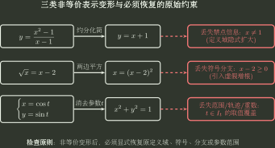

# 函数表示与信息保护

> 训练定位：显式、分段、隐式、参数表示之间的切换，以及约分、平方、消元、选支时的信息保护。  
> 模型归属：[《函数对象、表示与结构》](函数对象_表示与结构.tex)。本文件训练“换表示时怎样不换掉对象”。

## 母题一：先问当前表示保留了什么、隐藏了什么

同一个函数对象可以有多种表示。换表示的目的不是追求“写得更熟”，而是暴露当前最需要的信息；与此同时，也要知道新表示可能隐藏或丢失什么。

| 表示 | 最直接暴露 | 最容易丢失或误判 |
|---|---|---|
| 显式 $y=f(x)$ | 输入到输出的单值对应 | 可能忽略定义域 |
| 分段函数 | 不同输入区域的不同规则 | 忘记分界点、各段定义域和值域拼接 |
| 隐式关系 $F(x,y)=0$ | $x,y$ 的整体关系 | 把多值关系误当全局函数 |
| 参数表示 $x=x(t),y=y(t)$ | 轨迹生成、覆盖顺序与方向 | 消元后丢掉参数区间、覆盖次数与方向 |
| 图像 | 几何结构、值域、单射与对称直觉 | 只凭示意图猜精确边界 |

### 表示选择的判断轴

不要先问“哪种写法最熟悉”，而要先问：

> 当前目标最依赖哪类信息？换一种表示以后，这些信息是否仍然可追踪？

这里是在解释表示选择的原则，不单独生成一条局部规则；真正执行变形时统一调用后文“先固定原对象，再记录非等价变形需要恢复的条件”。

---

## 母题二：四类常见的非等价变形风险

### 一、约分扩大定义域

$$
\frac{x^2-1}{x-1}=x+1
$$

这个等式只在原来的 $x\ne1$ 上成立。约分只是让禁点从新解析式中“看不见”了，并没有让原函数在 $x=1$ 处获得定义。

### 二、平方增加候选分支

从

$$
\sqrt{x}=x-2
$$

两边平方得到的解，只能视为候选。平方会抹掉原式两边的符号关系，因此最后必须回到原方程检查。

### 三、参数消元丢失覆盖与方向

参数曲线消去 $t$ 后，往往只剩下轨迹本身；但原参数区间还同时决定：

- 是否只覆盖整条曲线的一部分；
- 是否重复经过同一点；
- 经过顺序和方向。

### 四、把局部分支冒充成全局对象

反三角函数、隐函数、反函数经常都需要先选定一个单值或单射分支。局部分支上的公式不能自动升级成全局结论。

三行图分别对应三类需要恢复的约束：约分可能隐藏原定义域中的禁点；平方会丢失原方程的符号条件；参数消元可能丢失参数区间、覆盖次数和方向。**式子变短不代表新表示与原对象等价。**

---

## 母题三：参数表示能不能安全消元

### 检查链

$$
\text{参数区间}
\to
\text{轨迹覆盖}
\to
\text{是否重走}
\to
\text{能否消元}
\to
\text{消元后还剩哪些限制}.
$$

### 典型错误

- 得到笛卡尔方程后忘记原参数区间，只保留整条曲线；
- 消元以后把本来两次覆盖的轨迹当成只走一次；
- 后续问题需要方向，却把参数方向丢掉；
- 同一个 $x$ 对应多个参数值、多个 $y$，却直接写成 $y=f(x)$。

---

## 母题四：分段表示不是几段互不相干的公式

对

$$
f(x)=
\begin{cases}
f_1(x),&x\in D_1,\\
f_2(x),&x\in D_2,
\end{cases}
$$

始终把它当成一个整体对象。

### 训练时固定检查

- $D_1,D_2$ 是否覆盖完整定义域，有没有重叠或遗漏？
- 分界点属于哪一段？
- 求值域时，各段值域怎样并起来？
- 判断分段函数是否单射时，不仅要检查每一段内部，还要检查不同分段的值域是否相交；
- 求反函数时，反函数的分段条件来自原各段的值域，而不是照抄原分段条件。

分段反函数的完整训练见 [反函数](反函数.md)。

---

## 局部规则：先固定原对象，再记录非等价变形需要恢复的条件

**触发信号**：平方、开方、约分、取倒数、消元、参数化、绝对值化、选择分支，并且后续还要问定义域、值域、连续、极限、反函数或满射/双射。

**第一动作**：先写清当前定义域、分支，以及题目若显式给出的陪域；随后对每一步非等价变形明确记录“丢失了哪些原条件，或引入了哪些额外候选”。

典型需要恢复的条件：

- 平方：符号；
- 从平方关系开方：必须恢复正负分支，并结合原符号条件筛选；
- 约分：原式中被约因子仍要求非零；
- 消元：参数范围、覆盖次数、方向；
- 对等式两边取倒数：先确认两边都非零；若构造倒数函数 $1/f(x)$，还要从定义域中排除 $f(x)=0$；
- 取绝对值：原表达式的符号信息；
- 限制分支：被舍弃分支对应的其他合法原像。

**检查与退出**：最终答案前逐项恢复原定义域、符号条件、参数区间或所选分支，并在需要时回代原式；若题目讨论满射/双射，还要确认陪域没有在变形中被改变。只有证明当前表示在所讨论范围内与原对象等价，才可以结束检查。

---

## 独立检查

1. 新表示覆盖的是不是原对象，而不是一个更大的集合？
2. 是否把“关系”误写成“函数”？
3. 是否因为消元或平方把多个不同分支合并了？
4. 是否因为限制区间而偷偷丢掉了题目仍需要的信息？
5. 后续目标若依赖方向、覆盖次数或一一对应，这些信息是否仍然可追踪？

## 代表题与证据

待补。优先收集：参数消元漏支、平方增解、隐式关系多值、分段整体单射、约分后对象改变。