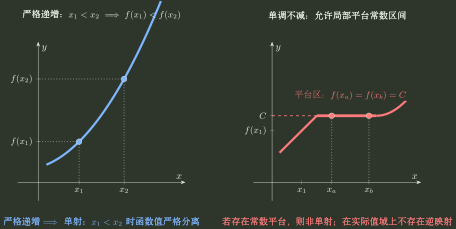

# 单调性

> 训练定位：单调不减/不增、严格单调、与单射/反函数/周期的结构联用，以及“什么时候需要切到导数判形”。  
> 模型归属：[《函数对象、表示与结构》](函数对象_表示与结构.tex)。本文件不拥有“用导数判单调”的机制；那属于专题04。

## 母题一：单调性描述输入顺序怎样传递到输出

在区间 $I$ 上，对任意 $x_1<x_2$：

- 若 $f(x_1)\le f(x_2)$，则单调不减；
- 若 $f(x_1)\ge f(x_2)$，则单调不增；
- 若始终为严格不等号，则分别严格递增、严格递减。

核心不在术语本身，而在这条顺序传递关系：

$$
\boxed{
\text{输入的序关系}
\longrightarrow
\text{输出的序关系}
}
$$

左图强调严格递增把严格输入次序传递为严格函数值次序：$x_1<x_2\Rightarrow f(x_1)<f(x_2)$，因此不可能出现 $x_1\ne x_2$ 而 $f(x_1)=f(x_2)$；右图的平台说明“单调不减”仍可能有 $x_1<x_2$ 却满足 $f(x_1)=f(x_2)$。因此**严格单调可以直接推出单射，非严格单调不能。**

### 局部规则：判断单调前先锁定讨论区间

**触发信号**：题目询问单调、严格单调、单射，或试图由某一分支的单调性推出全局结论。

**第一动作**：先写清当前讨论区间，并确认任意两点比较都限制在这个区间内；分段函数或不连通定义域要分别检查各分支与跨分支关系。

**检查与退出**：某一分支单调不能自动升级为整个定义域单调；只有区间范围与跨分支次序都已确认，才可继续使用“严格单调推出单射”等结构结论。若题目要求完整单调区间或极值分流，再切到专题04。

---

## 母题二：严格单调为什么能直接推出单射

严格单调函数在区间上一定单射，所以可以在其实际值域上建立反函数。

但必须区分：

$$
\text{严格单调}\Rightarrow\text{单射}
$$

不是定义等价。

### 重要边界

- 非严格单调可能有平台区间，因而不是单射；
- 常函数既单调不减也单调不增，但不能由输出恢复输入；
- 在非区间或离散定义域上，单射与单调更不能互相替代；
- 教材若把“单调”约定为严格单调，需要服从其术语；但若目标集合取实际值域 $f(I)$，反函数存在的直接条件仍是 $f$ 在 $I$ 上单射。

值域/有界性/单射训练见 [值域、有界性与单射](值域与单射.md)，反函数训练见 [反函数](反函数.md)。

---

## 母题三：导数与单调性的正反方向并不对称

本文件不拥有中值定理证明，但考试中必须能快速识别下面的接口：

$$
\boxed{
f'(x)>0\Rightarrow f\text{ 严格递增},
\qquad
f'(x)\ge0\Rightarrow f\text{ 单调不减}.
}
$$

若 $f$ 已知可导，反方向是：

$$
\boxed{
f\text{ 单调不减}\Rightarrow f'(x)\ge0,
}
$$

而即使 $f$ **严格递增**，也只能推出 $f'(x)\ge0$，不能推出处处 $f'(x)>0$。

### 最小反例：严格递增也允许导数暂时为零

$$
f(x)=x^3
$$

在 $\mathbb R$ 上严格递增，但

$$
f'(0)=0.
$$

所以“严格增 $\Rightarrow f'>0$”是错的。真正应该保留的直觉是：

> 严格递增禁止函数在一整段区间上停住，但允许个别点的切线恰好水平。

反过来，$f'\ge0$ 只保证不下降；若 $f'$ 在一段区间上恒为 $0$，就会产生平台。例如常函数满足 $f'\equiv0$，显然不是严格递增。

### 单调性本身也不要求可导

取整函数 $\lfloor x\rfloor$ 在 $\mathbb R$ 上单调不减，却在每个整数处不连续，更谈不上在那里可导。这个例子专门阻断“讨论单调性就必须先求导”的习惯。

完整证明与严格条件由专题04维护；本文件只保留判断方向和反例。

---

## 母题四：有些单调性可以直接由顺序比较得到，不必求导

当函数由已知严格单调原型直接组合，且顺序关系非常透明时，可以直接比较两个输入。

例如若 $x_1<x_2$，则

$$
x_1<x_2,
\qquad
e^{x_1}<e^{x_2},
$$

相加得到

$$
x_1+e^{x_1}<x_2+e^{x_2}.
$$

所以 $x+e^x$ 在 $\mathbb R$ 上严格递增。

这种证明尤其适合“只需要证明单射或反函数存在”的题目：若顺序关系已经透明，就没有必要为了习惯再引入导数。

### 局部规则：只需证明单射时先尝试直接比较

**触发信号**：题目只需要证明单射或反函数存在，而函数由明显同向单调的简单部分组成。

**第一动作**：取 $x_1<x_2$，直接比较各部分输出顺序。

**检查与退出**：若能对任意 $x_1<x_2$ 推出严格同向不等式，就可由此证明严格单调并进一步推出单射；若比较关系不透明、组合中存在相反趋势，或题目要求完整单调区间，则切到专题04。

---

## 母题五：非恒定周期与全局单调存在直接冲突

若函数在整个实轴上具有非零周期，同时又全局单调，则只能是常函数。

直觉：

- 单调要求输入持续向前时，输出不能回头重复；
- 周期要求走一个周期以后输出回到原值。

这两个结构除常函数外无法长期共存。

### 边界

- 若“单调”是非严格意义，常函数是合法边界；
- 只在一个有限区间单调，不与全局周期冲突；
- 题目若给的是某一分支单调，也不能据此否定整个函数的周期性。

周期训练见 [周期性](周期性.md)。

---

## 母题六：坐标变换怎样改变单调方向

对

$$
g(x)=A f(Bx+C)+D,
$$

如果只依靠结构判断单调方向，需要同时观察：

- $x\mapsto Bx+C$ 是否保持还是反转输入顺序；
- $f$ 在对应输入区间上是增还是减；
- 外部乘以 $A$ 是否再次反转输出顺序；
- $D$ 只做竖直平移，不改变顺序。

### 局部规则：坐标变换下逐层追踪序关系

**触发信号**：函数写成 $g(x)=A f(Bx+C)+D$，并要求判断已知单调结构经过平移、伸缩或翻转后的方向。

**第一动作**：按“内部线性变换是否反转输入顺序 → 母函数在对应区间的单调方向 → 外部系数 $A$ 是否再次反转输出顺序”逐层追踪；$D$ 只做竖直平移，不改变顺序。

**检查与退出**：若 $A=0$，函数退化为常函数；若母函数在变换后的实际输入区间上没有已知单调结构，停止结构推断并切到专题04。只有各层顺序方向都已确定后，才给出最终单调方向。

---

## 母题七：单调性与反函数结构迁移

若 $f:I\to f(I)$ 单射，从而存在反函数 $f^{-1}:f(I)\to I$，则：

- 若 $f$ 在 $I$ 上严格递增，$f^{-1}$ 在 $f(I)$ 上仍严格递增；
- 若 $f$ 在 $I$ 上严格递减，$f^{-1}$ 在 $f(I)$ 上仍严格递减。

原因是反函数只是交换输入输出角色，不会把原有严格顺序关系改成相反方向。

这在反函数图像题中可以直接用来预判走势。

---

## 独立检查

1. 单调性是在哪个区间上讨论？
2. 题目里的“单调”是非严格还是严格约定？
3. 我需要的只是单射证据，还是必须求完整单调区间？
4. 能否直接从顺序关系证明，而无需导数？
5. 坐标变换中，内部 $B$ 和外部 $A$ 各自翻转了几次顺序？
6. 是否把“某一分支单调”错误升级成“全局单调”？
7. 如果题目从严格单调反推导数，我有没有错误地把必要条件写成 $f'>0$？
8. 遇到周期 + 全局单调时，是否直接把 $x<x+T$ 与 $f(x+T)=f(x)$ 放在一起检查？

## 代表题与证据

优先补入：$x^3$ 的“严格增但驻点导数为零”、取整函数“单调但不可导”、直接比较证明严格单调、单调与单射边界、周期与单调冲突、坐标变换后的单调方向、反函数单调性迁移。