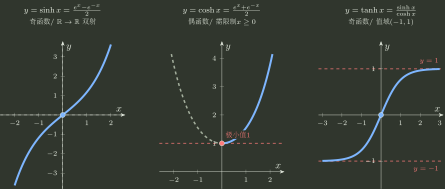
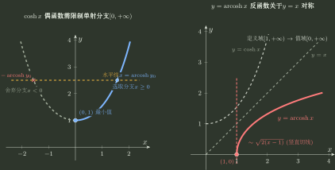

# 双曲函数与反双曲函数

> 训练定位：把双曲函数看成指数函数的奇偶分解，而不是另背一套“像三角函数”的公式；从指数表示生成定义域、值域、奇偶、单调、恒等式与反函数分支。  
> 模型归属：[函数对象、表示与结构](函数对象_表示与结构.tex) Own 函数对象、值域、单射与反函数分支；导数与有限 Taylor 转交 [Topic03](../03_一元局部模型_导数微分与Taylor/README.md)，相关原函数与根式积分转交 [Topic05](../05_一元累积_原函数定积分与反常积分/README.md)。

## 1. 母模型：双曲函数就是 $e^x$ 与 $e^{-x}$ 的偶部和奇部

定义

$$
\cosh x=\frac{e^x+e^{-x}}2,
\qquad
\sinh x=\frac{e^x-e^{-x}}2.
$$

反过来立刻得到

$$
\boxed{e^x=\cosh x+\sinh x,\qquad e^{-x}=\cosh x-\sinh x.}
$$

这两式比单独背一串恒等式更有生成力：

- 交换 $x\leftrightarrow -x$，和不变、差变号，所以 $\cosh$ 偶、$\sinh$ 奇；
- 两式相乘得到

$$
(\cosh x+\sinh x)(\cosh x-\sinh x)=1,
$$

即

$$
\boxed{\cosh^2x-\sinh^2x=1;}
$$

- $\tanh x=\sinh x/\cosh x$，于是它仍是奇函数；
- 后续求导、Taylor 与积分都可继续从指数母函数生成。

> [!idea] 不要把它记成“把三角函数里的加号改成减号”
> 三角函数最自然来自单位圆 $\cos^2x+\sin^2x=1$；双曲函数最自然来自指数的偶/奇分解，并落在双曲线 $u^2-v^2=1$ 上。二者有类比，但生成源不同。

## 2. 三个主函数的对象画像

| 函数 | 定义域与值域 | 结构 | 单射 / 反函数 |
|---|---|---|---|
| $\sinh x$ | $\mathbb R\to\mathbb R$ | 奇；严格递增；过原点 | 全局双射，可直接求反函数 |
| $\cosh x$ | $\mathbb R\to[1,+\infty)$ | 偶；在 $(-\infty,0]$ 递减，在 $[0,+\infty)$ 递增；最小值 $1$ | 全局非单射；标准反函数取 $[0,+\infty)$ 分支 |
| $\tanh x$ | $\mathbb R\to(-1,1)$ | 奇；严格递增；两端趋于 $\pm1$ | 全局双射到 $(-1,1)$ |

这些结论并不需要分别背图像。比如

$$
\sinh x=\frac{e^x-e^{-x}}2
$$

随 $x$ 增大严格增大；而 $\cosh$ 的偶性已经告诉我们它不可能在整个实轴单射。

### 局部规则：先从指数表示判结构，再决定是否需要反函数分支

**触发信号**：出现 $e^x\pm e^{-x}$、$\sinh x$、$\cosh x$、$\tanh x$，并问奇偶、单调、值域或反函数。

**第一动作**：把对象还原为 $e^x,e^{-x}$ 的和/差，先读奇偶与值域；若问反函数，再检查当前函数是否单射。

**检查与退出**：$\cosh$ 在全实轴不是单射，不能直接写全局反函数；必须先声明所选分支。若只需结构判断，不为“形式统一”额外引入双曲记号。

## 3. 反双曲正弦：从二次方程恢复输入

令

$$
y=\sinh x=\frac{e^x-e^{-x}}2.
$$

设 $t=e^x>0$，则

$$
2y=t-\frac1t
\quad\Longrightarrow\quad
t^2-2yt-1=0.
$$

所以

$$
t=y\pm\sqrt{1+y^2}.
$$

由于 $t>0$，而 $\sqrt{1+y^2}>\lvert y\rvert$，只能保留

$$
t=y+\sqrt{1+y^2}>0.
$$

因此

$$
\boxed{
\operatorname{arsinh}y
=\ln\left(y+\sqrt{1+y^2}\right),
\qquad y\in\mathbb R.
}
$$

这里 `arsinh` 与 `asinh` 都常见；本库统一写 $\operatorname{arsinh}$。不建议写 $\sinh^{-1}x$，因为它容易被误读为 $1/\sinh x$。

它是奇函数，不是因为“反函数一定保奇”，而是因为 $\sinh$ 本身是奇的全局双射；逆映射继承中心对称。

### 局部规则：看到 $\ln(x+\sqrt{1+x^2})$，先认回 $\operatorname{arsinh}x$

**触发信号**：极限、积分、奇偶或复合中出现 $\ln(x+\sqrt{1+x^2})$。

**第一动作**：识别为 $\operatorname{arsinh}x$，再调用其全局奇性、单调性或 Topic03 的局部模型，而不是把对数和根式每次从头展开。

**检查与退出**：识别特殊函数只是换表示；若题目真正依赖定义域、分支或余项阶数，必须把这些资格保留下来。

## 4. 反双曲余弦：分支选择比解方程更重要

$\cosh x$ 是偶函数，所以在 $\mathbb R$ 上没有反函数。标准做法是限制

$$
\cosh:[0,+\infty)\to[1,+\infty),
$$

它在这个分支上严格递增并成为双射。

令 $y=\cosh x$、$x\ge0$，同样设 $t=e^x>0$：

$$
2y=t+\frac1t
\quad\Longrightarrow\quad
t^2-2yt+1=0.
$$

于是

$$
t=y\pm\sqrt{y^2-1}.
$$

因为所选分支要求 $x\ge0$，故 $t=e^x\ge1$，应选较大的根：

$$
\boxed{
\operatorname{arcosh}y
=\ln\left(y+\sqrt{y^2-1}\right),
\qquad y\ge1.
}
$$

`arcosh` 与 `acosh` 都常见；本库统一写 $\operatorname{arcosh}$。

> [!warning] $\operatorname{arcosh}$ 在 $1$ 附近不是普通的一阶线性对象
> 由于 $\cosh x=1+x^2/2+O(x^4)$，反解得到
> $$
> \operatorname{arcosh}(1+h)\sim\sqrt{2h}\qquad(h\to0^+).
> $$
> 所以它在端点 $1$ 没有有限导数。这里正好检验“反函数存在”与“逆函数在该点可导”是两件事。

### 局部规则：反双曲余弦先锁定 $\cosh$ 的单射分支

**触发信号**：要求 $\cosh$ 的反函数、出现 $\ln(x+\sqrt{x^2-1})$，或根式条件 $x\ge1$。

**第一动作**：先写标准限制 $\cosh:[0,+\infty)\to[1,+\infty)$，再反解；根号正负由这个分支决定。

**检查与退出**：不能从 $\cosh x=y$ 直接写 $x=\pm\operatorname{arcosh}y$ 后又把它叫作“反函数”；$\pm$ 表示原方程的两个原像，而反函数必须返回所选分支中的唯一输入。

## 5. 反双曲正切：值域本身就是反函数定义域

由

$$
y=\tanh x=\frac{e^{2x}-1}{e^{2x}+1}
$$

解得

$$
e^{2x}=\frac{1+y}{1-y}.
$$

因为 $e^{2x}>0$，恰好要求 $-1<y<1$，于是

$$
\boxed{
\operatorname{artanh}y
=\frac12\ln\frac{1+y}{1-y},
\qquad \lvert y\rvert<1.
}
$$

这个例子把“值域成为反函数定义域”展示得非常直接。

## 6. 次级函数：知道怎样生成即可

若资料出现

$$
\operatorname{sech}x=\frac1{\cosh x},
\qquad
\operatorname{csch}x=\frac1{\sinh x},
\qquad
\coth x=\frac{\cosh x}{\sinh x},
$$

不需要建立新的记忆中心：它们分别是倒数或商。定义域也由分母是否为零生成，例如 $\operatorname{csch}x$ 与 $\coth x$ 都排除 $x=0$。

## 7. 与后续专题的接口

- **Topic03**：从指数定义重建
  $$(\sinh x)'=\cosh x,\qquad(\cosh x)'=\sinh x,$$
  再由商/反函数生成 $\tanh$ 与三个反双曲函数的导数；Taylor 也由 $e^{\pm x}$ 的奇偶分解直接生成。
- **Topic05**：$\operatorname{arsinh}$、$\operatorname{arcosh}$、$\operatorname{artanh}$ 是三类根式/有理积分的自然原函数表示，并对应 $x=a\sinh t$、$x=a\cosh t$ 等代换。
- **Topic11**：只有讨论无限 Taylor series 的收敛与恢复时，才从 Topic03 的有限展开继续升级。

## 8. 独立检查

1. 能否只从 $e^x,e^{-x}$ 重建 $\sinh,\cosh$ 的奇偶性与恒等式？
2. 为什么 $\sinh$ 可全局求逆，而 $\cosh$ 必须先限制分支？
3. 反解二次方程后，哪一个根由 $e^x>0$ 或 $e^x\ge1$ 筛掉？
4. 为什么 $\operatorname{arcosh}(1+h)$ 的首项是 $\sqrt{h}$ 而不是 $h$？
5. 看到 $\ln(x+\sqrt{1+x^2})$ 时，能否同时想到奇性、导数、积分和局部等价，而不是只看成复杂对数？
