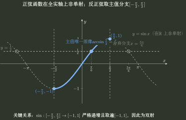
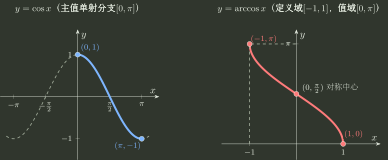
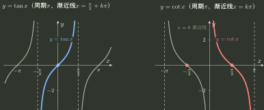
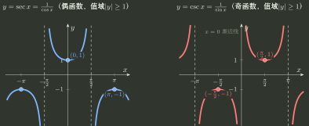
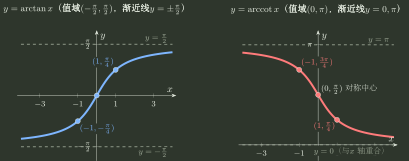
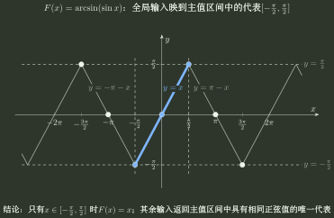

# 反三角主值与复合

> 训练定位：训练反三角函数的主值分支、三角与反三角复合、主值代表的全局分段表示、交叉复合符号判断，以及“函数值倒数”和“映射反函数”的符号边界。  
> 模型归属：[《函数对象、表示与结构》](函数对象_表示与结构.tex) 负责反函数、单射限制与输入输出交换的理论机制；本文只负责反三角主值问题族的具体表示、局部规则、分段公式与错误阻断。

## 母题一：反三角函数来自选定的主值双射限制

### 主值分支与核心对照

$\arcsin x$ 不是“全局正弦函数的反函数”。令

$$
I=\left[-\frac{\pi}{2},\frac{\pi}{2}\right],
\qquad
g:I\to[-1,1],\quad g(x)=\sin x.
$$

该限制映射严格递增且取遍 $[-1,1]$，因此为双射；$\arcsin$ 正是它的逆映射：

$$
\boxed{\arcsin=g^{-1}:[-1,1]\to\left[-\frac{\pi}{2},\frac{\pi}{2}\right].}
$$

因此反三角复合的判断核心不是“符号能不能约掉”，而是当前输入是否落在所选主值分支上。

### 局部规则：反三角复合先写主值区间

**触发信号**：出现 $\arcsin(\sin x)$、$\arccos(\cos x)$、$\arctan(\tan x)$ 等三角函数与其反函数复合，或题目要求化简反三角表达式。

**第一动作**：先写对应反三角函数的主值区间，再利用三角函数的周期性和对称性确定当前输入对应的主值代表。

**检查与退出**：只有内层三角函数的输入本来就在所选主值分支的定义域内时，才能直接得到原变量；否则应按周期分段写出主值代表。完成后回检结果必须落在反三角函数的值域内。

#### 1. 余弦与反余弦

#### 2. 正切与余切

#### 3. 正割与余割（函数值倒数，非反函数）

#### 4. 反正切与反余切

### 常用三角与反三角函数的基本数据

以下表中 $k\in\mathbb Z$。本文件约定 $\operatorname{arccot}$ 是 $\cot x$ 在 $(0,\pi)$ 上的反函数，因此其值域为 $(0,\pi)$。

#### 1. 三角与反三角主值对照表

| 函数 | 定义域 $D$ | 值域 $R$ | 渐近线 | 奇偶性 / 对称中心 | 单调 / 局部特征 |
| :--- | :--- | :--- | :--- | :--- | :--- |
| $y=\sin x$ | $\mathbb R$ | $[-1,1]$ | 无 | 奇函数 （原点对称） | 主值支 $[-\frac{\pi}{2},\frac{\pi}{2}]$ 严格递增 周期 $2\pi$ |
| $y=\arcsin x$ | $[-1,1]$ | $[-\frac{\pi}{2},\frac{\pi}{2}]$ | 无 | 奇函数 （原点对称） | 全定义域严格递增 |
| $y=\cos x$ | $\mathbb R$ | $[-1,1]$ | 无 | 偶函数 （$y$ 轴对称） | 主值支 $[0,\pi]$ 严格递减 周期 $2\pi$ |
| $y=\arccos x$ | $[-1,1]$ | $[0,\pi]$ | 无 | 非奇非偶 中心 $(0,\frac{\pi}{2})$ | 全定义域严格递减 |
| $y=\tan x$ | $x\ne \frac{\pi}{2}+k\pi$ | $\mathbb R$ | 垂直渐近线： $x=\frac{\pi}{2}+k\pi$ | 奇函数 （原点对称） | 各分支 $(-\frac{\pi}{2}+k\pi,\frac{\pi}{2}+k\pi)$ 严格递增 周期 $\pi$ |
| $y=\arctan x$ | $\mathbb R$ | $(-\frac{\pi}{2},\frac{\pi}{2})$ | 水平渐近线： $y=\pm\frac{\pi}{2}$ | 奇函数 （原点对称） | 全实轴严格递增 |
| $y=\cot x$ | $x\ne k\pi$ | $\mathbb R$ | 垂直渐近线： $x=k\pi$ | 奇函数 （原点对称） | 各分支 $(k\pi,(k+1)\pi)$ 严格递减 周期 $\pi$ |
| $y=\operatorname{arccot}x$ | $\mathbb R$ | $(0,\pi)$ | 水平渐近线： $y=0\ (x\to+\infty)$ $y=\pi\ (x\to-\infty)$ | 非奇非偶 中心 $(0,\frac{\pi}{2})$ | 全实轴严格递减 |

#### 2. 正割与余割（函数值倒数，非反函数）

| 函数 | 定义域 $D$ | 值域 $R$ | 渐近线 | 奇偶性 / 周期 | 局部极值与形状特征 |
| :--- | :--- | :--- | :--- | :--- | :--- |
| $y=\sec x=\frac{1}{\cos x}$ | $x\ne \frac{\pi}{2}+k\pi$ | $(-\infty,-1]\cup[1,+\infty)$ | 垂直渐近线： $x=\frac{\pi}{2}+k\pi$ | 偶函数 周期 $2\pi$ | 局部极小 $(2k\pi,1)$ 局部极大 $((2k+1)\pi,-1)$ |
| $y=\csc x=\frac{1}{\sin x}$ | $x\ne k\pi$ | $(-\infty,-1]\cup[1,+\infty)$ | 垂直渐近线： $x=k\pi$ | 奇函数 周期 $2\pi$ | 局部极小 $(2k\pi+\frac{\pi}{2},1)$ 局部极大 $(2k\pi-\frac{\pi}{2},-1)$ |

主值区间不是给反函数随意规定一个值域，而是从原来在全定义域上非单射的三角函数中选出一个标准的双射限制：

$$
\text{在原定义域上非单射的函数}
\to
\text{限制定义域并取该限制的实际值域}
\to
\text{双射限制}
\to
\text{求逆}.
$$

---

## 母题二：三类反三角复合必须分开判断

### 真正的逆复合

$$
\sin(\arcsin x)=x,\qquad x\in[-1,1].
$$

这里内层输出正好进入对应主值分支的逆映射，因此是真正的逆复合。

### 主值代表映射

$$
\arcsin(\sin x)
$$

这里先经过全局正弦；由于正弦不是单射，不同周期、不同分支中的输入可能得到同一个正弦值。外层 $\arcsin$ 随后返回主值区间中的唯一代表。只有当

$$
x\in\left[-\frac{\pi}{2},\frac{\pi}{2}\right]
$$

时才等于原来的 $x$。

同理：

$$
\arccos(\cos x)=x\iff x\in[0,\pi],
$$

对

$$
x\in\mathbb R\setminus\left\{\frac\pi2+k\pi:k\in\mathbb Z\right\},
$$

有

$$
\arctan(\tan x)=x\iff x\in\left(-\frac{\pi}{2},\frac{\pi}{2}\right).
$$

如果题目要求在整个允许输入范围内写出主值代表，可以利用周期性分段生成：

$$
\boxed{
\arcsin(\sin x)=(-1)^k(x-k\pi),
\quad
x\in\left[k\pi-\frac\pi2,k\pi+\frac\pi2\right],\ k\in\mathbb Z,
}
$$

$$
\boxed{
\arctan(\tan x)=x-k\pi,
\quad
x\in\left(k\pi-\frac\pi2,k\pi+\frac\pi2\right),\ k\in\mathbb Z,
}
$$

以及

$$
\arccos(\cos x)=
\begin{cases}
x-2k\pi,&x\in[2k\pi,(2k+1)\pi],\\
2k\pi-x,&x\in[(2k-1)\pi,2k\pi],
\end{cases}
\qquad k\in\mathbb Z.
$$

这些式子不必孤立记忆；它们都是“按周期分段，把每个输入映到指定主值区间中的唯一代表”的具体展开。

上图强调的是复合映射的值域限制：$\arcsin(\sin x)$ 的输出始终属于 $[-\pi/2,\pi/2]$。全局正弦把许多不同输入映到同一函数值，$\arcsin$ 再从该函数值选回主值区间中的唯一原像。

### 不同三角函数交叉复合

例如

$$
\cos(\arcsin x).
$$

令 $\theta=\arcsin x$，同时写

$$
\sin\theta=x,
\qquad
\theta\in\left[-\frac{\pi}{2},\frac{\pi}{2}\right].
$$

主值区间告诉我们 $\cos\theta\ge0$，因此

$$
\cos(\arcsin x)=\sqrt{1-x^2},\qquad x\in[-1,1].
$$

因此根号取正不是额外口诀，而是由主值角所在区间直接决定。

同一方法可生成

$$
\sin(\arccos x)=\sqrt{1-x^2},\qquad x\in[-1,1],
$$

$$
\sin(\arctan x)=\frac{x}{\sqrt{1+x^2}},
\qquad
\cos(\arctan x)=\frac1{\sqrt{1+x^2}},
\qquad x\in\mathbb R,
$$

$$
\tan(\arcsin x)=\frac{x}{\sqrt{1-x^2}},\qquad x\in(-1,1).
$$

---

## 母题三：互余、对称与主值分支必须一起读

$$
\arcsin x+\arccos x=\frac\pi2,\qquad x\in[-1,1],
$$

在本文件采用的反余切约定下

$$
\arctan x+\operatorname{arccot}x=\frac\pi2,\qquad x\in\mathbb R.
$$

以及

$$
\arcsin(-x)=-\arcsin x,
\qquad
\arctan(-x)=-\arctan x,
$$

$$
\arccos(-x)=\pi-\arccos x,
\qquad
\operatorname{arccot}(-x)=\pi-\operatorname{arccot}x.
$$

这些都应该从“主值分支结构”重建，而不是各自背成孤立公式。

---

## 母题四：同一个三角解析式选择不同双射限制会产生不同反函数

在 $[0,2\pi]$ 上，下面三个区间分别是严格单调区间，并覆盖整个 $[0,2\pi]$：

$$
\left[0,\frac\pi2\right],
\qquad
\left[\frac\pi2,\frac{3\pi}2\right],
\qquad
\left[\frac{3\pi}2,2\pi\right].
$$

选不同原定义域，会得到不同的反函数对象：

| 原分支 | 原值域 | 反函数表示 |
|---|---|---|
| $[0,\pi/2]$ | $[0,1]$ | $\arcsin y$ |
| $[\pi/2,3\pi/2]$ | $[-1,1]$ | $\pi-\arcsin y$ |
| $[3\pi/2,2\pi]$ | $[-1,0]$ | $2\pi+\arcsin y$ |

所以反函数公式并不只由“原解析式是 $\sin x$”决定，原函数选定的定义域同样决定反函数对象。

---

## 母题五：函数值倒数不是映射反函数

$$
\sec x=\frac1{\cos x},\qquad
\csc x=\frac1{\sin x},\qquad
\cot x=\frac{\cos x}{\sin x}
$$

是**三角函数与乘法逆元（倒数/商关系）**，不是映射的反函数（在二者共同定义域 $\{x\ne \frac{k\pi}{2}, k\in\mathbb Z\}$ 上，$\cot x=\frac1{\tan x}$；但在 $x=\frac\pi2+k\pi$ 时 $\cot x=0$ 有定义而 $\tan x$ 无定义）。为避免歧义，本手册不使用 $(\cos x)^{-1}$、$(\sin x)^{-1}$ 或 $(\tan x)^{-1}$ 表示倒数。

- $\sec x \ne \arccos x$
- $\csc x \ne \arcsin x$
- $\cot x \ne \arctan x$

某些资料写 $\sin^{-1}x$ 表示 $\arcsin x$，而负一次幂记号在别的语境又可能表示倒数。为避免歧义，本手册统一使用 $\arcsin,\arccos,\arctan,\operatorname{arccot}$ 表示反三角函数，并把倒数明确写成 $1/\sin x$、$1/\cos x$ 或在共同定义域上的 $1/\tan x$。

---

## 独立检查

1. 当前使用的反三角函数主值区间是什么？
2. 这是“真正的逆复合”，还是“先经过全局非单射的三角函数，再由反三角函数返回主值代表”？
3. 交叉复合出现根号时，符号是由哪个主值区间决定的？
4. 全局分段公式能否从周期和主值区间现场重建，而不是死背？
5. 当前资料对 $\operatorname{arccot}$ 采用哪一个值域约定，是否与本文件一致？
6. 有没有把 $\sec,\csc,\cot$ 这种函数值倒数误认为映射反函数？

## 代表题与证据

待从数学一真题、错题与陌生题压力测试中补索引。优先收集：$\arcsin(\sin x)$ 的主值代表分段、$\arccos(\cos x)$ 分段、交叉复合的根号符号、不同正弦单射分支产生不同反函数，以及倒数符号与反函数符号混淆。