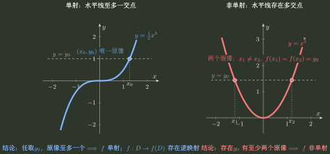
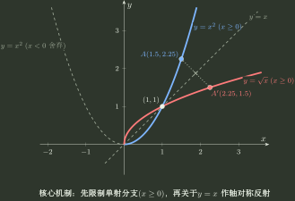
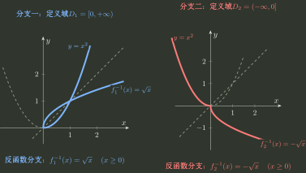
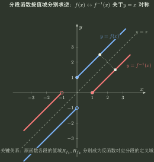
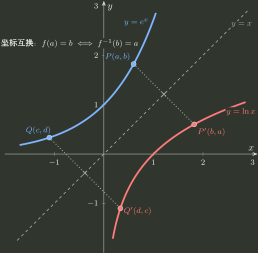
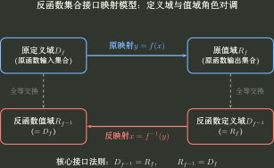

# 反函数

> 训练定位：单射/双射条件、原像数量、一般反解表示、分支筛选、分段反函数、输入输出交换与复合求逆；反三角主值问题已拆到独立训练入口。  
> 模型归属：[《函数对象、表示与结构》](函数对象_表示与结构.tex)。反函数的定义、存在性机制与结构证明以规范正文为准。

## 总控制链：先确认逆映射是否存在，再选择反解表示

给出具体函数要求反函数时，固定按

$$
\boxed{
\text{定义域}
\to
\text{单射/限制分支}
\to
\text{原值域}
\to
 y=f(x)
\to
\text{选择反解表示}
\to
\text{候选解}
\to
\text{恢复合法分支}
\to
\text{复合验证}
}
$$

执行。

整条流程始终保持同一个数学约束：一旦选定了单射分支，对每个 $y$ 属于该分支的值域，方程 $f(x)=y$ 在所选定义域中必须有且只有一个解。反解过程可以改变表达形式，但不能改变这个唯一解。

---

## 母题一：先回答“能不能逆”，再回答“怎样写逆”

### 问题表示

对输出 $y$ 考察合法原像集合

$$
P_y=\{x\in D:f(x)=y\}.
$$

若把函数视为 $f:D\to f(D)$，反函数存在的充要条件是 $f$ 在 $D$ 上单射，即每个 $y\in f(D)$ 恰有一个原像。若题目指定陪域 $B$ 并要求逆映射定义在整个 $B$ 上，则还必须有 $f(D)=B$，即 $f:D\to B$ 为双射。

这张图只表达一个核心判据：

$$
\boxed{f:D\to f(D)\text{ 存在逆映射}\iff f\text{ 在 }D\text{ 上单射}}
$$

图像上，这等价于任意水平线至多与图像相交一次。因此“求反函数”的第一动作不是代数反解，而是先检查当前定义域上的单射性。

### 变式轴

- 全局单射；
- 只在某区间单射；
- 偶函数、非恒定周期函数在相应定义域上通常存在不同输入取得同一函数值，因此不能全局单射；
- 给定陪域判断满射/双射；
- 参数改变后单射区间改变；
- 反函数存在，但无法写成熟悉的闭式公式。

### 局部规则：求反函数先检查单射与分支

**触发信号**：出现反函数、限制定义域求逆、反函数图像、偶函数/周期函数求逆。

**第一动作**：先确认当前定义域是否单射；若不是，先选择题目指定或自然的单射分支，再求该分支值域。

**检查与退出**：检查反函数定义域是否等于原函数实际值域、是否把“不会反解”误判成“反函数不存在”；若原函数显式写成 $f:D\to B$ 且题目要求整个 $B$ 上有逆，还要检查满射。只有存在性、分支和值域全部钉死以后，才退出结构审计并进入具体代数反解。

### 两个可以直接判定非单射的结构

- 偶函数的定义域若同时含某个 $x\ne0$ 与 $-x$，则 $f(x)=f(-x)$，因此不是单射；
- 非恒定周期函数在完整周期域上重复取值。

看到这两类结构时，不要先写 $f^{-1}$，先限制定义域，使原函数在所选区间上满足单射条件。

---

## 母题二：选择最容易恢复原输入的表示

写出

$$
y=f(x)
$$

以后，真正要选择的是：怎样改写，才能逐层把 $x$ 暴露出来，同时不丢定义域、符号和分支信息？

### 结构一：线性嵌套

按与正向操作相反的顺序逐层撤销。

例如 $y=3x-5$：先加 $5$，再除以 $3$。

### 结构二：分式

对

$$
y=\frac{ax+b}{cx+d}
$$

通常交叉相乘，再把含 $x$ 的项收集到一侧。解出以后还要恢复原值域中被排除的输出。

例如

$$
f(x)=\frac{2x+1}{x-3},\qquad x\ne3.
$$

由

$$
y(x-3)=2x+1
$$

得到

$$
x(y-2)=3y+1,
\qquad
x=\frac{3y+1}{y-2}.
$$

原函数不可能取得 $y=2$，而任意 $y\ne2$ 都可由上式得到唯一 $x\ne3$，所以

$$
\boxed{f^{-1}(x)=\frac{3x+1}{x-2}},\qquad x\ne2.
$$

### 结构三：偶次幂

从

$$
y=x^{2m}
$$

得到的 $\pm$ 只是候选。真正保留哪一支由原定义域决定。最小例子是 $f(x)=x^2$：若定义域取 $[0,+\infty)$，则 $f^{-1}(y)=\sqrt y$；若定义域取 $(-\infty,0]$，则 $f^{-1}(y)=-\sqrt y$，两者的反函数定义域都为 $[0,+\infty)$。

这一图不是专门为 $x^2$ 服务，而是整个“先限支，再求逆”模型的母图：

$$
\boxed{
\text{在原定义域上非单射}
\to
\text{限制为单射分支}
\to
\text{再定义反函数}
}
$$

后面的 $\sin x$、$\cos x$、反三角主值，本质上都在重复这个结构。

因此要始终区分两层：

> 代数方程负责生成候选分支；原函数的定义域和值域负责筛出真正的反函数分支。

这张对照图专门强调一个重要边界：**反函数不是由解析式单独决定的。** 同样是 $y=x^2$，选择 $x\ge0$ 与 $x\le0$ 会得到 $\sqrt y$ 与 $-\sqrt y$ 两个不同反函数对象。

### 结构四：单一指数嵌套

先孤立指数，再取对数；同时把指数正性转成反函数定义域条件。

例如

$$
f(x)=2e^{3x-1}+4.
$$

由 $y=2e^{3x-1}+4$ 得

$$
e^{3x-1}=\frac{y-4}{2}>0,
$$

所以原值域为 $(4,+\infty)$，并且

$$
3x-1=\ln\frac{y-4}{2}.
$$

因此

$$
\boxed{f^{-1}(x)=\frac{1+\ln\left(\frac{x-4}{2}\right)}3},\qquad x>4.
$$

### 结构五：$e^x$ 与 $e^{-x}$ 同时出现

令

$$
t=e^x>0,
$$

把 $e^{-x}$ 改成 $1/t$，从而降为代数方程。

这里最容易漏的是 $t>0$ 或更强的分支条件。

#### 对照一：$e^x-e^{-x}$

令

$$
y=e^x-e^{-x},\qquad t=e^x>0.
$$

则

$$
t^2-yt-1=0,
$$

所以

$$
t=\frac{y\pm\sqrt{y^2+4}}2.
$$

因为 $\sqrt{y^2+4}>\lvert y \rvert$，负号分支恒为负，不可能等于 $e^x$。于是

$$
\boxed{f^{-1}(x)=\ln\frac{x+\sqrt{x^2+4}}2},
\qquad x\in\mathbb R.
$$

这个反解同时说明原函数值域为整个 $\mathbb R$。

#### 对照二：$e^x+e^{-x}$

函数在全实轴上为偶函数，先天不单射。若限制 $x\ge0$，则 $t=e^x\ge1$。由

$$
y=t+\frac1t
$$

得到

$$
t=\frac{y\pm\sqrt{y^2-4}}2.
$$

两个根互为倒数；所选分支要求 $t\ge1$，因此保留较大根：

$$
\boxed{f^{-1}(x)=\ln\frac{x+\sqrt{x^2-4}}2},
\qquad x\ge2.
$$

这组对照说明：即使两个解析式适合使用同一个换元，它们在给定定义域上的单射性也可能完全不同。换元只是反解工具，不能替代前面的对象与单射检查。

### 结构六：根式与共轭

考虑

$$
f(x)=\ln\left(x+\sqrt{1+x^2}\right).
$$

因为 $\sqrt{1+x^2}>\lvert x \rvert$，对所有实数 $x$ 都有 $x+\sqrt{1+x^2}>0$。令

$$
y=\ln\left(x+\sqrt{1+x^2}\right),
$$

则

$$
e^y=x+\sqrt{1+x^2}.
$$

利用共轭乘积

$$
(\sqrt{1+x^2}+x)(\sqrt{1+x^2}-x)=1,
$$

立即得到

$$
e^{-y}=\sqrt{1+x^2}-x.
$$

两式相减：

$$
x=\frac{e^y-e^{-y}}2.
$$

于是

$$
\boxed{f^{-1}(x)=\frac{e^x-e^{-x}}2}.
$$

反过来，$(e^x-e^{-x})/2$ 的反函数就是 $\ln(x+\sqrt{1+x^2})$。若使用双曲函数记号，这就是 $\sinh$ 与 $\operatorname{arsinh}$ 的互逆关系；它只作为“指数换元 + 根式共轭”的扩展示例。

共轭有时比平方更能保存符号信息。

### 结构七：必须平方的根式分式

例如

$$
y=\frac{x}{\sqrt{1+x^2}}.
$$

平方得到

$$
x^2=\frac{y^2}{1-y^2},
$$

只能恢复 $\lvert x \rvert$。最后必须回到原关系，根据分母恒正得到

$$
\operatorname{sgn}x=\operatorname{sgn}y,
$$

因此

$$
\boxed{f^{-1}(x)=\frac{x}{\sqrt{1-x^2}}},
\qquad -1<x<1.
$$

固定检查句：

> 平方以前，我丢掉了什么符号或分支信息？

### 结构八：分段函数

逐段反解以后，反函数的分段条件来自**原各段值域**，不能照抄原函数的分段条件。

完整判断还要同时检查：

$$
\boxed{
\text{每段内部单射}
+\text{不同段值域互不重叠}
}
$$

只满足第一层还不能保证整个分段函数单射，也就不能保证存在反函数。

一个完整母例是

$$
f(x)=
\begin{cases}
1-2x^2,&x<-1,\\
x^3,&-1\le x\le2,\\
12x-16,&x>2.
\end{cases}
$$

三段值域分别为

$$
(-\infty,-1),\qquad[-1,8],\qquad(8,+\infty),
$$

互不重叠并拼成整个 $\mathbb R$。因此原函数全局双射，反函数按这些**原值域**分段：

$$
\boxed{
f^{-1}(x)=
\begin{cases}
-\sqrt{\dfrac{1-x}{2}},&x<-1,\\[1ex]
\sqrt[3]{x},&-1\le x\le8,\\[1ex]
\dfrac{x+16}{12},&x>8.
\end{cases}}
$$

这道母例把“段内单射 → 不同分段值域两两不交 → 按原分段值域逐段反解”完整跑了一遍。

图上的空档也有信息：原函数若没有覆盖某些输出，那些值就不能进入反函数定义域；求逆后的分段条件因此来自**输出侧**，不是把原来的输入分段条件原样搬过去。

---

## 母题三：反函数存在，与能否写出熟悉闭式是两回事

例如

$$
f(x)=x+e^x.
$$

它在 $\mathbb R$ 上严格递增，所以单射，反函数对象已经存在；但用初等变形不容易把 $x$ 显式孤立出来。

因此必须区分：

$$
\boxed{
\text{反函数存在}
\ne
\text{当前课程工具能写出熟悉闭式}
}
$$

### 训练信号

题目若只问“是否存在反函数”，证明单射并确认值域即可；不要为了求一个并不要求的闭式表达式浪费时间。

---

## 独立训练入口：反三角主值与复合

反三角函数的主值分支、主值代表的全局分段、交叉复合符号与倒数/反函数记号边界，已经形成独立检索意图与独立第一动作，现统一由 [反三角主值与复合](反三角主值与复合.md) 承接。

本文件只保留一般反函数的存在性、反解表示、输入输出交换与复合求逆；反三角训练不在这里重复维护。

---

## 母题四：输入输出交换以后，图像与结构怎样迁移

### 点对应

设 $f:D\to f(D)$ 单射。对任意 $a\in D$、$b\in f(D)$，

$$
f(a)=b\Longleftrightarrow f^{-1}(b)=a.
$$

所以原图像点 $(a,b)$ 变为反函数图像点 $(b,a)$，两图关于 $y=x$ 对称。

反函数图像不是“另画一条新曲线”，而是把原函数图像关于 $y=x$ 反射得到；这张图只负责几何层面的坐标互换 $(a,b) \leftrightarrow (b,a)$。

这张接口图把同一个事实改写成集合关系：

$$
D_{f^{-1}}=R_f,\qquad R_{f^{-1}}=D_f.
$$

坐标互换与定义域/值域交换不是两条独立口诀，而是同一次“输入角色与输出角色互换”；上式就是 $(a,b) \leftrightarrow (b,a)$ 的集合接口版本。

### 易混边界

- 对 $x\in D$、$y\in f(D)$，$x=f^{-1}(y)$ 与 $y=f(x)$ 描述同一组点关系；
- 把反函数重新写成 $y=f^{-1}(x)$ 时，坐标角色被交换，才得到关于 $y=x$ 的镜像图像。

### 单调性迁移

严格递增函数的反函数仍严格递增；严格递减函数的反函数仍严格递减。

例如 $f(x)=e^x:\mathbb R\to(0,+\infty)$ 严格递增，其反函数 $f^{-1}(x)=\ln x$ 在 $(0,+\infty)$ 上也严格递增。再如 $g(x)=-e^x:\mathbb R\to(-\infty,0)$ 严格递减，其反函数 $g^{-1}(y)=\ln(-y)$ 在 $(-\infty,0)$ 上仍严格递减。

### 奇性与中心对称迁移

若定义域关于原点对称，且 $f:D\to f(D)$ 单射并为奇函数，则 $f^{-1}:f(D)\to D$ 仍为奇函数。

更一般地，若原函数关于 $(a,b)$ 中心对称，则反函数关于 $(b,a)$ 中心对称。

例如

$$
f(x)=x^3+1
$$

满足 $f(-x)=2-f(x)$，所以图像关于 $(0,1)$ 中心对称。其反函数

$$
f^{-1}(y)=\sqrt[3]{y-1}
$$

满足

$$
f^{-1}(2-y)=-f^{-1}(y),
$$

因此图像关于交换后的中心 $(1,0)$ 对称。

### 对合函数（involution）

若 $f:D\to D$ 为双射，则

$$
f=f^{-1}
\iff
f(f(x))=x.
$$

例如 $a-x$、$1/x$（在其合法定义域上）。

重要边界：函数与反函数关于 $y=x$ 对称，并不意味着它们只能在 $y=x$ 上相交。对合函数满足 $f=f^{-1}$，两条图像甚至可以完全重合。若额外知道函数严格递增，公共点才只能落在 $y=x$ 上。

---

## 母题五：复合函数为什么必须倒序求逆

若

$$
g:A\to B,\qquad f:B\to C
$$

均为双射，则 $f\circ g:A\to C$ 也是双射，并且

$$
(f\circ g)^{-1}=g^{-1}\circ f^{-1}.
$$

原因是逆过程必须按正向操作的反顺序撤销。

对

$$
h(x)=A f(Bx+C)+D,
\qquad A\ne0,\ B\ne0,
$$

设 $f:I\to f(I)$ 为双射，并令

$$
J=\{x:Bx+C\in I\}.
$$

则 $h:J\to h(J)$ 为双射，且

$$
h^{-1}(y)
=
\frac{f^{-1}\left(\frac{y-D}{A}\right)-C}{B},\qquad y\in h(J).
$$

不要把这当新公式族；它只是“复合求逆倒序”的展开。

例如取 $f(u)=e^u$，令

$$
h(x)=2e^{3x-1}+4.
$$

正向依次做 $x\mapsto3x-1$、$u\mapsto e^u$、$v\mapsto2v+4$；逆向因此依次做

$$
y\mapsto\frac{y-4}{2}
\mapsto\ln\frac{y-4}{2}
\mapsto\frac{1+\ln\left(\frac{y-4}{2}\right)}3,
$$

从而再次得到

$$
h^{-1}(y)=\frac{1+\ln\left(\frac{y-4}{2}\right)}3,\qquad y>4.
$$

### 反函数符号不能随意分配

一般不能写

$$
(f+g)^{-1}=f^{-1}+g^{-1}.
$$

例如取 $f(x)=x$、$g(x)=2x$。则

$$
(f+g)(x)=3x,
\qquad
(f+g)^{-1}(x)=\frac{x}{3},
$$

而

$$
f^{-1}(x)+g^{-1}(x)=x+\frac{x}{2}=\frac{3x}{2}.
$$

两者显然不同。点态乘法也没有这种简单分配律；$^{-1}$ 在这里表示映射求逆，不是普通代数负指数。

---

## 常用双射原型与逆映射

- $x\mapsto ax+b:\mathbb R\to\mathbb R$（$a\ne0$）的逆映射为 $y\mapsto(y-b)/a$；
- $x\mapsto x^{2m+1}:\mathbb R\to\mathbb R$ 的逆映射为 $y\mapsto\sqrt[2m+1]{y}$；
- 偶次幂在 $\mathbb R$ 上非单射，必须先限制到 $[0,+\infty)$ 或 $(-\infty,0]$；
- $x\mapsto a^x:\mathbb R\to(0,+\infty)$（$a>0,a\ne1$）与 $y\mapsto\log_a y:(0,+\infty)\to\mathbb R$ 互为逆映射；
- $x\mapsto e^x:\mathbb R\to(0,+\infty)$ 与 $y\mapsto\ln y:(0,+\infty)\to\mathbb R$ 互为逆映射；
- $x\mapsto1/x:\mathbb R\setminus\{0\}\to\mathbb R\setminus\{0\}$ 是对合函数；
- 三角函数必须先选定一个到其实际值域的双射限制后才能建立反函数；标准主值限制与反三角复合的训练统一见 [反三角主值与复合](反三角主值与复合.md)；
- $\dfrac{e^x-e^{-x}}2$ 与 $\ln(x+\sqrt{1+x^2})$ 可作为“指数换元 + 根式共轭”的扩展示例，不要求把双曲函数符号本身升级为核心记忆负担。

---

## 独立验证

求完反函数以后至少检查：

1. $D_{f^{-1}}$ 是否等于原值域；
2. $R_{f^{-1}}$ 是否回到原定义域；
3. 代数反解产生的候选是否全部满足原符号/分支条件；
4. 至少检查一侧复合关系；
5. 分段反函数是否按原各段值域分段；
6. 若用了平方、开方或二次方程，是否把丢失的信息重新恢复。

## 代表题与证据

优先补入：限制定义域求逆、正负指数换元、根式共轭、平方筛支、分段反函数、反函数存在但难写闭式、对合函数与图像交点。反三角主值类代表题统一进入 [反三角主值与复合](反三角主值与复合.md)。