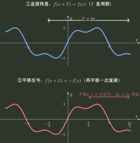
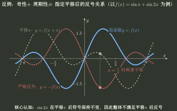
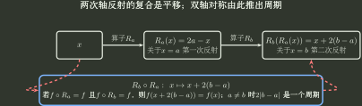
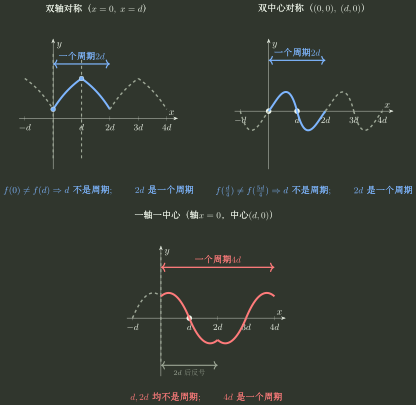

# 周期性

> 训练定位：以“固定平移下的函数值关系”为主线，区分周期关系、平移翻转关系与纵向漂移关系，再处理最小正周期、公共周期、复合周期、反射生成周期，以及周期与已知对称结构的联动。  
> 模型归属：[《函数对象、表示与结构》](函数对象_表示与结构.tex)。周期的定义与固定平移下的函数值关系以规范正文为准。

## 在四问母模型中的位置：第四问——固定平移下函数值满足什么关系？

本专题沿用主讲义的四问母模型。设 $f:D\to\mathbb R$。这里固定非零平移量 $L\ne0$，研究 $f(x+L)$ 与 $f(x)$ 之间的函数值关系。凡把这种关系作为全局平移性质使用时，都要求相应平移保持定义域，即 $D+L=D$，且等式对所有 $x\in D$ 成立。

面对固定平移 $x\mapsto x+L$，不要先给 $L$ 贴“周期”或“半周期”的标签。第一步应直接比较 $f(x+L)$ 与 $f(x)$：

$$
\boxed{
\text{输入平移 }L
\longrightarrow
\text{比较 }f(x+L)\text{ 与 }f(x)
}
$$

以下三类关系在本专题中最重要：

1. **直接恢复**：$f(x+L)=f(x)$。这时 $L$ 本身就是一个周期；
2. **翻转**：$f(x+L)=2b-f(x)$。一次平移没有恢复原值，但同样的平移再做一次就恢复，因此 $2L$ 是一个周期；
3. **纵向漂移**：$f(x+L)=f(x)+C$。重复平移会累积成 $f(x+nL)=f(x)+nC$，除非 $C=0$，否则不能由此得到周期。

所以这里不是另造一套“周期母模型”，而是在第四问下面细化一种输入变换：

$$
\boxed{
\text{第四问：输入怎样变？}
\;\xrightarrow{\text{这里取平移 }x\mapsto x+L}\;
f(x+L)\text{ 与 }f(x)\text{ 满足什么关系？}
}
$$

其中只有 $f(x+L)=f(x)$ 本身就是周期关系；$f(x+L)=2b-f(x)$ 是平移翻转关系，可进一步推出 $2L$ 是周期；$f(x+L)=f(x)+C$ 是纵向漂移关系。

---

## 母题一：先分清“一个周期”和“最小正周期”

若某个 $T\ne0$ 满足

$$
D+T=D,
\qquad
f(x+T)=f(x),\quad \forall x\in D,
$$

则 $T$ 是 $f$ 的一个周期。

周期的本质不是图像“像波浪”，而是存在非零 $T$ 使 $f(x+T)=f(x)$ 对所有合法 $x$ 成立。若一次平移得到的是翻转关系或漂移关系，就继续利用对应等式推导，而不要把该平移量提前称为周期。

### 重要边界

- 若 $T$ 是周期，则任意非零整数倍 $nT$（$n\in\mathbb Z\setminus\{0\}$）仍是周期；
- 知道 $T$ 是周期，不代表 $T$ 是最小正周期；
- 周期函数不一定存在最小正周期；
- 判断周期前要先检查平移后仍处于定义域；
- 局部区间上的重复关系不能未经说明升级为全局周期。

最经典的“没有最小正周期”反例是狄利克雷函数

$$
D(x)=\mathbf 1_{\mathbb Q}(x).
$$

每个非零有理数都是它的周期，而正有理数可以任意接近 $0$，所以不存在最小正周期。这个例子专门防止把三角函数经验误推广到所有周期函数。

### 局部规则：先检查平移是否合法，再验证输出是否恢复

**触发信号**：题目要求判断周期、最小正周期，或出现 $f(x+T)$ 与 $f(x)$ 的平移比较。

**第一动作**：明确候选平移量 $T$，检查 $x$ 与 $x+T$ 是否都合法，再比较函数值。

**检查与退出**：若只要求找一个周期，验证平移恒等式后即可退出；若要求最小正周期，还必须继续排除更小正平移量，不能把“找到一个周期”当成任务结束。

---

## 母题二：平移翻转是一种现象——一次翻转，两次复原

### 一般形式：围绕水平线翻转

若存在常数 $b$ 使

$$
f(x+L)=2b-f(x),
$$

那么平移 $L$ 后，函数值并没有回到原值，而是变成关于水平线 $y=b$ 的对称值。

把基准线移到零：

$$
g(x)=f(x)-b,
$$

则

$$
g(x+L)=-g(x).
$$

再做一次同样的平移：

$$
f(x+2L)=2b-f(x+L)=f(x).
$$

因此

$$
\boxed{f(x+L)=2b-f(x)\Longrightarrow 2L\text{ 是一个周期}.}
$$

这里的推理只是把同一个平移关系连续使用两次，从而得到 $f(x+2L)=f(x)$；它不是周期的另一条定义。

### 反号只是基准线 $b=0$ 的特殊情况

当 $b=0$ 时，关系退化为

$$
f(x+L)=-f(x).
$$

它表达的是“平移 $L$ 后输出反号”。同样只能先推出

$$
f(x+2L)=f(x),
$$

所以 $2L$ 是一个周期。

但反向不成立：

$$
2L\text{ 是周期}
\not\Rightarrow
f(x+L)=-f(x).
$$

这张图只承担一个责任：把“周期复制”和“平移反号”分成两种不同的平移关系。示意曲线故意避免使用纯正弦形状，防止把额外的奇偶或轴对称结构误当成该关系的必要条件。

### 为什么本册不再把 $L$ 直接叫“半周期”

由 $f(x+L)=-f(x)$ 只能知道 $2L$ 是**一个周期**，并不知道 $2L$ 是否为最小正周期，因此不能仅凭这条关系就把 $L$ 解释成“最小正周期的一半”。

例如 $f(x)=\sin x$ 的最小正周期是 $2\pi$，而

$$
\sin(x+\pi)=-\sin x,
\qquad
\sin(x+3\pi)=-\sin x.
$$

$\pi$ 确实是最小正周期的一半，但 $3\pi$ 同样产生反号，却显然不能称为“半个最小周期”。只有在进一步证明 $2L$ 恰好就是最小正周期时，才可以把 $L$ 解释为该最小正周期的一半。

### 局部规则：看到平移翻转关系先迭代一次

**触发信号**：出现 $f(x+L)=-f(x)$ 或更一般的 $f(x+L)=2b-f(x)$，并要求判断周期或继续推导结构。

**第一动作**：把同一等式再次用于 $x+L$，直接计算 $f(x+2L)$。

**检查与退出**：得到 $f(x+2L)=f(x)$ 只能说明 $2L$ 是一个周期；若题目问最小正周期，还必须继续排除更小正平移，不能把 $L$ 自动命名为“半个最小周期”。

---

## 母题三：相同的平移反号关系怎样组合

若

$$
f(x+L)=-f(x),\qquad g(x+L)=-g(x),
$$

则

$$
(f+g)(x+L)=-(f+g)(x),
$$

所以和仍满足同一个平移反号关系；而

$$
(fg)(x+L)=f(x)g(x),
$$

所以乘积反而以 $L$ 本身为周期。

这类题不要停在“负负得正”的口诀上。应直接把平移关系代入：两个因子都满足 $h(x+L)=-h(x)$ 时，乘积中的两个负号相消，因此乘积满足 $(fg)(x+L)=(fg)(x)$。

### 反向陷阱：奇性 + 周期性不推出“平移半个已知周期就反号”

例如

$$
f(x)=\sin x+\sin2x
$$

既是奇函数，又以 $2\pi$ 为周期，但

$$
f(x+\pi)=-\sin x+\sin2x\ne-f(x).
$$

因此即使已知 $2\pi$ 是周期，也不能机械推出

$$
\boxed{f(x+\pi)=-f(x).}
$$

更一般地，

$$
\boxed{\text{奇性}+\text{周期性}\not\Rightarrow f(x+L)=-f(x)\text{ 对指定 }L\text{ 成立}.}
$$

平移反号关系 $f(x+L)=-f(x)$ 是额外条件，必须直接验证，不能由“奇函数”“周期函数”两个性质机械推出。

---

## 母题四：坐标变换以后，周期长度怎样迁移

对

$$
g(x)=A f(Bx+C)+D,
$$

先设 $B\ne0$。若 $T$ 是 $f$ 的一个周期，则内部变量只要改变 $T$：

$$
B\Delta x=T.
$$

因此正周期长度按

$$
\frac{\lvert T\rvert}{\lvert B\rvert}
$$

缩放。

若 $T_0$ 是 $f$ 的最小正周期，且 $A\ne0$、$B\ne0$，则 $g$ 的最小正周期为

$$
\frac{T_0}{\lvert B\rvert}.
$$

若 $A=0$，则 $g$ 在自己的定义域 $D_g$ 上取常值 $D$，但周期性还取决于 $D_g$ 是否对某个非零平移保持不变，不能由 $f$ 的周期直接推出最小正周期。若 $B=0$ 且 $f(C)$ 有定义，则 $D_g=\mathbb R$ 且 $g$ 为常函数；此时每个非零实数都是周期，所以不存在最小正周期。

对应的坐标变换规则与对称轴、对称中心的迁移见 [对称性](对称性.md)。

---

## 母题五：多个周期函数组合时，先找共同平移

若同一个 $T$ 同时是 $f,g$ 的周期，则在定义域合法时

$$
f\pm g,\qquad fg
$$

仍以 $T$ 为周期；商还要保证分母不为零。

### 局部规则：多个周期函数组合先找共同平移

**触发信号**：多个周期函数做和、差、积或商，并要求判断组合后的周期性。

**第一动作**：不要先套“最小公倍数”，而是寻找一个非零平移量，使所有组成部分同时恢复原值。若已知两个正周期 $T_1,T_2$ 满足

$$
\frac{T_1}{T_2}\in\mathbb Q,
$$

就能找到正整数 $m,n$ 使

$$
mT_1=nT_2,
$$

从而得到一个公共周期。

**检查与退出**：商还必须检查分母平移前后都不为零；找到公共周期只证明“它是一个周期”，若题目要求最小正周期仍需继续排除更小周期。若已知周期之比为无理数，不能仅凭“没有公共整数倍”就断言组合一定非周期，应检查是否存在抵消或退化结构。

### 重要边界

若两个最小正周期之比为无理数，不能对完全一般的函数机械断言“它们的和一定非周期”。只能说不能直接由这两个周期构造公共整数倍周期；是否存在其他抵消结构还要看具体函数。

---

## 母题六：复合函数有周期，不代表内层本身有周期

对

$$
h(x)=f(g(x)),
$$

先写出内函数在平移下满足的等式。

### 内层周期直接传递

若 $P\ne0$、$D_h+P=D_h$，并且

$$
g(x+P)=g(x),\qquad \forall x\in D_h,
$$

则 $P$ 也是 $h$ 的周期。

### 外函数的周期性使内函数的整周期漂移在复合后消失

若 $T$ 是外函数 $f$ 的周期，$P\ne0$、$D_h+P=D_h$，并且

$$
g(x+P)=g(x)+kT,
\qquad k\in\mathbb Z,
\quad \forall x\in D_h,
$$

则

$$
h(x+P)=h(x).
$$

此时 $g$ 本身可以完全不是周期函数。

例如

$$
h(x)=\sin(x+\sin x)
$$

中，内层 $g(x)=x+\sin x$ 满足

$$
g(x+2\pi)=g(x)+2\pi,
$$

又因为 $\sin(u+2\pi)=\sin u$，所以 $h(x+2\pi)=h(x)$，从而 $2\pi$ 是复合函数的一个周期。

完整复合训练见 [复合函数](复合函数.md)。

---

## 母题七：两个反射条件怎样生成周期

这类题不要退化成“看到两个轴就写 $2d$”的距离口诀。真正的推理是：先把两次输入反射合成为平移，再检查输出经过两次对称以后是否恢复。

这张图只负责说明“反射复合**保证得到一个周期**”，不把 $2d$、$4d$ 冒充成所有函数的最小正周期。为了避免示意图偷带特殊情形，图中母段刻意选择为强非对称，并主动构造 $d$（以及一轴一中心情形下的 $2d$）**不是**该示意函数的周期；否则即使定理仍然成立，视觉上也会把更小周期误认成结构必然。

### 两条对称轴

若函数关于 $x=a$、$x=b$ 都轴对称，$a\ne b$，则

$$
2\lvert b-a\rvert
$$

是一个周期。

### 两个同高度中心

若中心为 $(a,c)$、$(b,c)$，且 $a\ne b$，则仍得到周期

$$
2\lvert b-a\rvert.
$$

### 一条轴 + 一个中心

若关于 $x=a$ 轴对称、关于 $(b,c)$ 中心对称，则先得到

$$
f(x+2(b-a))=2c-f(x),
$$

这给出平移翻转关系。把同一等式再使用一次可得 $f(x+4(b-a))=f(x)$，所以当 $a\ne b$ 时

$$
4\lvert b-a\rvert
$$

是一个周期。

### 两个不同高度中心

若函数分别关于 $(a,c_1)$、$(b,c_2)$ 中心对称，且 $a\ne b$、$c_1\ne c_2$，则

$$
f(x+2(b-a))=f(x)+2(c_2-c_1),
$$

这是横向平移伴随固定纵向漂移，不能写成周期。若 $a=b$ 而 $c_1\ne c_2$，两个中心条件会推出 $f(x)=f(x)+2(c_2-c_1)$，因此不存在满足这两个条件的函数。

对应的反射推理详见 [对称性](对称性.md)。

---

## 母题八：由周期和一个已知对称结构推出更多同类对称结构

若 $T$ 是周期，并且已经知道 $x=a$ 是对称轴，则

$$
x=a+\frac{kT}{2},\qquad k\in\mathbb Z
$$

也都是对称轴。

若已知 $(a,b)$ 是中心，则

$$
\left(a+\frac{kT}{2},b\right),\qquad k\in\mathbb Z
$$

也都是中心。

### 反向边界

只有周期，不能推出一定存在对称轴或中心。

反例：

$$
f(x)=\sin x+\sin2x
$$

有 $2\pi$ 周期，但不存在竖直对称轴。

因此：

$$
\boxed{
\text{周期}+\text{一条已知对称轴或一个已知对称中心}
\Rightarrow
\text{推出同类对称轴或中心的一族}
}
$$

不能删掉“已经存在一条对称轴或一个对称中心”这个前提。

---

## 母题九：非恒定周期与全局单调为什么冲突

非恒定周期函数会重复输出，而严格单调函数不能重复输出，因此在整个实轴上二者不能同时成立。

若题目使用非严格“单调不减/不增”，常函数是边界情形：它既可视为周期，也可视为单调。

完整单调训练见 [单调性](单调性.md)。

---

## 跨专题接口：周期结构进入微积分运算后统一转 H-B01

本文件只拥有“当前函数本身满足怎样的平移关系”。一旦题目开始追问周期结构经过**求导、无穷远极限、连续性、有界/最值复制、原函数或积分**以后怎样传播，就切换到 [H-B01｜函数结构在运算中的传播](../50_桥梁专题/H-B01_函数结构在运算中的传播/README.md)。

这里不再复制“导函数保持周期”“周期函数存在无穷远有限极限时的退化”“原函数产生固定漂移”等结论；Topic01 只负责把上游周期 $T$、平移翻转或纵向漂移关系准确交给 Bridge。

---

## 独立检查

1. 当前候选平移量是否保证定义域仍合法？
2. 题目要的是“一个周期”还是“最小正周期”？
3. 平移以后是直接恢复、围绕某条基准线翻转，还是产生固定纵向漂移？
4. 复合函数的周期来自 $g(x+P)=g(x)$，还是来自 $g(x+P)=g(x)+kT$ 与外函数的 $T$ 周期性共同作用？
5. 两个反射给出的只是平移，还是函数值也真正恢复？
6. 使用周期推出更多对称轴/中心时，是否已经有一条已知对称轴或一个已知对称中心？
7. 是否把“周期函数”默认成“一定有最小正周期”？狄利克雷函数能否立刻作为反例？
8. 是否把“$2L$ 是一个周期”错误反推成“平移 $L$ 必然反号”，或把发生反号的 $L$ 未经最小性证明就叫成“半周期”？

## 代表题与证据

优先补入：最小正周期、平移翻转关系如何推出周期、平移漂移与周期的边界、坐标缩放周期、组合函数共同周期、内函数整周期漂移与外函数周期性的复合、两轴/两中心生成周期、周期与已知对称轴/中心的联动、周期与单调冲突。