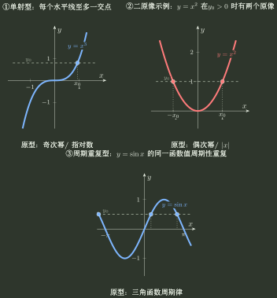

# 基本函数结构

> 训练定位：不把基本初等函数记成孤立图像表，而是记“定义域—值域—核心结构—原像唯一性”。  
> 模型归属：[《函数对象、表示与结构》](函数对象_表示与结构.tex)。本文件用于快速调用基本函数原型，不替代正文中的机制解释。

## 先用一张结构表建立基本原型

| 函数原型 | 定义域与值域 | 核心结构 | 单射性与反函数 |
|---|---|---|---|
| $x^{2m}$，$m\ge1$ | $\mathbb R\to[0,+\infty)$ | 偶；$f(x)=f(-x)$ | 在 $\mathbb R$ 上非单射；限制到 $[0,+\infty)$ 或 $(-\infty,0]$ 后单射 |
| $x^{2m+1}$，$m\ge0$ | $\mathbb R\to\mathbb R$ | 奇；严格递增 | 在 $\mathbb R$ 上双射，反函数为奇次根 |
| $a^x$，$a>0,a\ne1$ | $\mathbb R\to(0,+\infty)$ | 始终为正；单调方向由 $a$ 决定 | 从 $\mathbb R$ 到 $(0,+\infty)$ 为双射，反函数为 $\log_a x$ |
| $\log_a x$，$a>0,a\ne1$ | $(0,+\infty)\to\mathbb R$ | 定义域要求 $x>0$；单调方向由 $a$ 决定 | 从 $(0,+\infty)$ 到 $\mathbb R$ 为双射，反函数为 $a^x$ |
| $\sin x,\cos x$ | $\mathbb R\to[-1,1]$ | 有界、周期、重复取值 | 在 $\mathbb R$ 上非单射；需限制到单射分支后求逆 |
| $\tan x$ | $\mathbb R\setminus\{\pi/2+k\pi:k\in\mathbb Z\}$，每个连续分支的值域为 $\mathbb R$ | 每个连续分支严格递增；周期 $\pi$ | 每个连续分支到 $\mathbb R$ 为双射；标准主支的反函数为 $\arctan$ |
| $\lvert x \rvert$ | $\mathbb R\to[0,+\infty)$ | $f(x)=f(-x)$ | 在 $\mathbb R$ 上非单射；限制到任一半轴后可成为到 $[0,+\infty)$ 的双射 |

比起孤立记忆基本函数清单，更值得保留的是几类典型原像结构：单射型中每个 $y\in f(D)$ 恰有一个原像；偶次幂、绝对值等函数对许多输出有两个原像；非恒定周期函数则会重复取得同一函数值。后面的单射、反函数和主值分支都可归结为同一个判据：**对给定输出 $y$，原像集 $f^{-1}(\{y\})$ 是否至多含一个元素？**

## 特殊函数：用于检验一般命题的最小反例库

符号函数、取整函数和狄利克雷函数不应只记定义。它们更重要的作用，是用最小例子检验一些容易误用的自动推理：连续、单调、周期、有界、单射与反函数存在性之间，并不存在想当然的双向蕴含。

### 符号函数

$$
\operatorname{sgn}x=
\begin{cases}
-1,&x<0,\\
0,&x=0,\\
1,&x>0.
\end{cases}
$$

结构画像：

- 定义域 $\mathbb R$，值域 $\{-1,0,1\}$；
- 奇函数；
- 有界，且单调不减；
- 在 $0$ 处跳跃不连续；
- 不是单射。

它是打掉“**有间断点就无界**”的最小反例，也是“单调函数不必连续”的最小模型之一。

### 取整函数

记

$$
\lfloor x\rfloor=\max\{n\in\mathbb Z:n\le x\}.
$$

最重要不是阶梯图，而是四条结构：

$$
x-1<\lfloor x\rfloor\le x,
$$

$$
\lfloor x+n\rfloor=\lfloor x\rfloor+n,\qquad n\in\mathbb Z,
$$

$$
\lim_{x\to n^-}\lfloor x\rfloor=n-1,
\qquad
\lim_{x\to n^+}\lfloor x\rfloor=n=\lfloor n\rfloor,
$$

以及它在整个实轴上单调不减。

因为

$$
0\le x-\lfloor x\rfloor<1,
$$

所以取整函数与原变量只差一个统一有界量：

$$
\lfloor x\rfloor=x+O(1).
$$

这就是它经常和夹逼准则一起出现的原因。例如当 $\lvert x \rvert\to\infty$ 时，

$$
\frac{\lfloor x\rfloor}{x}\to1.
$$

一个必须记住的负数例子：

$$
\boxed{\lfloor-0.2\rfloor=-1,}
$$

因为“向下取整”不是“把小数截掉”。

它还有一个很好的结构边界：

$$
\lfloor x+1\rfloor=\lfloor x\rfloor+1
$$

是“平移 + 纵向漂移”，**不是周期**；但小数部分

$$
\{x\}=x-\lfloor x\rfloor
$$

满足 $\{x+1\}=\{x\}$，才是真正的 $1$ 周期函数。

### 狄利克雷函数

$$
D(x)=
\begin{cases}
1,&x\in\mathbb Q,\\
0,&x\notin\mathbb Q.
\end{cases}
$$

它的结构非常“反直觉”：

- 值域只有 $\{0,1\}$，所以有界；
- $D(-x)=D(x)$，所以是偶函数；
- 每个非零有理数 $T$ 都是周期，因为对任意 $x\in\mathbb R$，有 $x\in\mathbb Q\iff x+T\in\mathbb Q$，从而 $D(x+T)=D(x)$；
- 因为正有理周期可以任意小，它**没有最小正周期**；
- 任意邻域里同时有有理数和无理数，因此处处不连续。

所以它一次性阻断三种误推：

$$
\boxed{
\text{周期}\not\Rightarrow\text{存在最小正周期},\quad
\text{有界}\not\Rightarrow\text{连续},\quad
\text{偶函数}\not\Rightarrow\text{图像“光滑对称”}.
}
$$

连续性、黎曼可积性等后续性质由对应专题继续处理；H01 只把它作为函数结构反例库。

---

## 母题一：先判断典型输出的原像个数

### 单射型

奇次幂、指数、对数等典型原型中，不同输入通常保持不同输出。训练重点是：

- 定义域；
- 单调方向；
- 定义域和值域交换；
- 复合后是否仍保持单射。

### 多原像型

偶次幂、绝对值把成对输入压到同一输出。训练重点是：

- 是否存在 $x_1\ne x_2$ 使 $f(x_1)=f(x_2)$；
- 限制到什么定义域后可以获得单射；
- 开方或去绝对值时怎样恢复分支。

### 重复型

三角函数通过周期重复输出。训练重点是：

- 周期和平移结构；
- 主值分支；
- 为什么全局不能求反函数；
- 为什么反三角复合会返回主值区间中的代表，而不是恢复任意原输入。

---

## 母题二：复杂函数先还原成“母函数 + 坐标变换”

遇到

$$
g(x)=A f(Bx+C)+D
$$

先把 $f$ 认回熟悉原型，再拆内部和外部变换：

- $Bx+C$ 决定横向位置、尺度和定义域拉回；
- $A$ 决定纵向伸缩与翻转；
- $D$ 决定纵向基准线平移。

训练时不要停留在“左加右减”这类图像口诀。先问：母函数原有的定义域、值域、对称、周期或单调结构，哪一部分正在被搬运？

对应的对称、周期训练见 [对称性](对称性.md) 与 [周期性](周期性.md)。

---

## 母题三：基本函数的值域不是终点，而是后续接口

基本函数值域会直接决定：

- 复合函数是否合法；
- 外层根式、对数、反三角能否接收内层输出；
- 反函数的定义域；
- 分段函数不同分段的值域是否相交；
- 坐标变换以后新的值域。

因此，得到值域以后不要立即结束。继续问一句：这个输出范围接下来会成为哪个外层函数、反函数或分段结构的输入条件？

---

## 局部技巧

- $e^x$、$e^{-x}$ 同时出现时，优先想到 $t=e^x>0$，因为二者变成 $t$ 与 $1/t$；具体用于反解时见 [反函数](反函数.md)。
- 偶次幂或绝对值出现时，先检查 $x$ 与 $-x$ 是否取得同一函数值；若要求反函数，再决定是否限制到某个半轴。
- 三角函数出现反函数时，立刻把原来的全局周期函数与所选主值双射分支分开；主值代表的分段与复合见 [反三角主值与复合](反三角主值与复合.md)。
- 对数或根式作为外层时，先检查复合的定义域条件，再讨论图像或结构。

## 独立检查

1. 是否记住了定义域和值域，而不是只记图像形状？
2. 是否能说出哪些原型不是单射，并直接构造 $x_1\ne x_2$ 使 $f(x_1)=f(x_2)$？
3. 是否能从原型结构判断原函数在当前定义域上是否单射、是否需要限制分支后再求逆？
4. 坐标变换以后，是否知道哪些性质只移动位置、哪些性质可能退化？
5. 是否能用 $\operatorname{sgn}x$、$\lfloor x\rfloor$、狄利克雷函数分别反驳“间断必无界”“单调必可导”“周期必有最小正周期”？
6. 是否把“基本函数公式”当成了终点，而没有继续看它向复合、反函数、周期和对称提供什么接口？

## 代表题与证据

优先收集：同一母函数经平移伸缩后的结构识别、基本函数值域作为复合的定义域条件、多原像函数限制定义域后求逆，以及符号函数/取整函数/狄利克雷函数作为结构反例的调用。