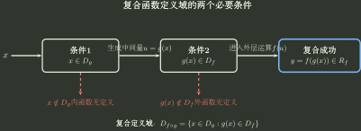

# 复合函数

> 训练定位：复合接口、定义域回拉，以及输入变换在内函数与外函数之间的传递规律。  
> 模型归属：[《函数对象、表示与结构》](函数对象_表示与结构.tex)。复合定义与机制证明以规范正文为准。

## 母题一：复合之前，先检查两个函数能不能真正接起来

### 问题表示

若

$$
x\xrightarrow{g}u\xrightarrow{f}y,
$$

则

$$
h(x)=f(g(x)),\qquad
D_h=\{x\in D_g:g(x)\in D_f\}.
$$

复合不只是“把一个式子代进另一个式子”。真正的接口条件是：内层先能接收原输入，并且它产生的输出还必须是外层允许接收的输入。

这张图把复合定义域写成两个同时必须满足的条件：**$x\in D_g$，并且 $g(x)\in D_f$。** 多层复合只是继续增加相应的定义域条件。

### 变式轴

- 外层定义域是一个区间；
- 外层含根式、对数、反正弦、反余弦；
- 内层是分段函数；
- 多层复合；
- 已知复合函数定义域反求参数；
- 内层值域只覆盖外层定义域的一部分。

### 为什么用中间变量回拉条件

先用中间变量 $u$ 写清外函数的定义域条件，再代入 $u=g(x)$，把条件拉回原变量 $x$。这样做的作用是先把外函数对中间变量的定义条件单独写清，再统一改写成关于原变量的条件；真正执行时统一调用下方局部规则。

### 局部规则：复合定义域同时满足内外两层条件

**触发信号**：出现 $f(g(x))$、多层嵌套或“求复合函数定义域”。

**第一动作**：写出

$$
x\in D_g,\qquad g(x)\in D_f.
$$

**检查与退出**：检查是否只处理了内层定义域，却忘记内层输出还必须属于外函数定义域；只有当全部条件都已改写成关于原变量的条件并化简后，才结束定义域分析。

---

## 母题二：判断复合结构，先写出内函数在目标输入变换下的关系

### 统一问题表示

对目标输入变换 $x\mapsto\phi(x)$，先求

$$
g(\phi(x))=\Psi(g(x)),
$$

再判断外函数 $f$ 在变换 $u\mapsto\Psi(u)$ 下满足怎样的函数值关系。

训练时固定问：

> 输入发生目标变换后，先确认变换后的输入仍属于复合定义域，再写出 $g(\phi(x))$ 与 $g(x)$ 的关系；最后把这个关系代入外函数，比较 $f(g(\phi(x)))$ 与 $f(g(x))$。

特别地，若要证明 $P$ 是 $f\circ g$ 的周期，还必须同时确认 $D_{f\circ g}+P=D_{f\circ g}$。

### 典型生成关系

#### 内层为偶

若

$$
g(-x)=g(x),
$$

只要复合有定义，就有

$$
f(g(-x))=f(g(x)),
$$

因此复合函数必为偶函数，外层不需要是偶函数。更一般地，若内函数关于 $x=a$ 轴对称，即 $g(a+t)=g(a-t)$，那么只要复合合法，$f\circ g$ 仍关于 $x=a$ 轴对称。

#### 内层为奇

若

$$
g(-x)=-g(x),
$$

则要继续检查外函数在 $u\mapsto-u$ 下满足什么关系：

- 若 $f(-u)=f(u)$，则复合为偶函数；
- 若 $f(-u)=-f(u)$，则复合为奇函数；
- 若没有可用的固定关系，则不能仅凭内函数为奇函数判断复合函数的奇偶性。

#### 内层有周期

若 $P\ne0$、复合定义域满足 $D_{f\circ g}+P=D_{f\circ g}$，并且对所有 $x\in D_{f\circ g}$ 有

$$
g(x+P)=g(x),
$$

则

$$
f(g(x+P))=f(g(x)),
$$

所以 $P$ 是复合函数的一个周期。

#### 外函数的周期性使内函数的整周期位移在复合后保持函数值不变

若 $T$ 是外函数 $f$ 的周期，$P\ne0$，复合定义域满足 $D_{f\circ g}+P=D_{f\circ g}$，并且

$$
g(x+P)=g(x)+kT,\qquad k\in\mathbb Z,
$$

则

$$
f(g(x+P))=f(g(x)).
$$

这里 $g$ 本身完全可以不是周期函数。

例如

$$
h(x)=\sin(x+\sin x).
$$

令 $g(x)=x+\sin x$，则

$$
g(x+2\pi)=g(x)+2\pi,
$$

而 $\sin(u+2\pi)=\sin u$，因此 $2\pi$ 是 $h$ 的周期。

#### 内函数反号而外函数为偶时，复合函数值保持不变

若

$$
g(-x)=-g(x),
$$

若外函数满足 $f(-u)=f(u)$，则内函数的反号在复合以后不再体现：

$$
f(g(-x))=f(-g(x))=f(g(x)),
$$

因此复合函数为偶函数。绝对值型外函数属于这一情形。

---

## 母题三：复合结果有某种结构，不代表内层也有同样结构

前面的规则大多只说明“怎样生成某种结构”，属于充分条件，并不是可以反向使用的等价条件。

### 典型反向陷阱

- $f(g(x))$ 是偶函数，不代表 $g$ 一定偶；可能只是 $g(-x)=-g(x)$，同时外函数满足 $f(-u)=f(u)$；
- $f(g(x))$ 有周期，不代表 $g$ 一定有周期；可能存在 $g(x+P)=g(x)+kT$，而外函数满足 $f(u+kT)=f(u)$；
- 内层周期能推出复合周期，但复合可能还有更小的周期；
- 多层复合可能在中间某一层就把差异消掉，不能只比较最内层和最终层。

### 局部规则：复合结构逆推前先检查外函数是否单射

**触发信号**：已知 $f(g(\phi(x)))=f(g(x))$ 或复合结果具有偶性、周期性等结构，并要求反推内函数 $g$ 的对应性质。

**第一动作**：先检查外函数 $f$ 在内函数实际值域上的单射性；等价地，检查是否可能存在 $u_1\ne u_2$ 却满足 $f(u_1)=f(u_2)$。

**检查与退出**：若外函数在相关中间值集合上不是单射，就不能一般地从 $f(u_1)=f(u_2)$ 推出 $u_1=u_2$；应检查是否存在不同中间值取得同一外函数值，或题目是否给出了额外单射条件。只有确认外函数在实际中间值集合上单射，才可由复合相等推出内层相等。

---

## 母题四：复合函数求逆为什么必须倒序

若

$$
g:A\to B,\qquad f:B\to C
$$

均为双射，则 $f\circ g:A\to C$ 为双射。正向是先 $g$ 后 $f$；逆向必须先应用 $f^{-1}$，再应用 $g^{-1}$，因此

$$
(f\circ g)^{-1}=g^{-1}\circ f^{-1}.
$$

这条训练与具体反解放在 [反函数](反函数.md)，这里保留它作为复合结构的方向感。

---

## 独立检查

1. 内层输出是否真的落在外层定义域？
2. 判断奇偶/周期时，我是否先写出了 $g(\phi(x))$ 与 $g(x)$ 的精确关系？
3. 外函数在对应变换下满足什么函数值关系，例如 $f(-u)=f(u)$ 或 $f(u+T)=f(u)$？
4. 我使用的是充分生成关系，还是错误地做了反向等价推理？
5. 多层复合时，在哪一层首次出现两个不同中间值被映到同一输出，或者某个变换在该层函数下保持函数值不变？

## 代表题与证据

优先补入：多层定义域回拉、内函数不周期但复合后周期、内函数为奇函数且外函数为偶函数、复合结构反向陷阱、复合函数求逆倒序。