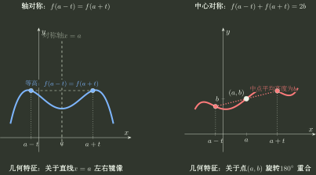

# 对称性

> 训练定位：奇偶、一般轴对称、一般中心对称、奇偶分解、坐标变换以及多反射结构。  
> 模型归属：[《函数对象、表示与结构》](函数对象_表示与结构.tex)。对称性的定义、前提与推导以规范正文为准。

## 母题一：先把“对称”还原成输入反射

关于 $x=a$ 的反射写成

$$
R_a(x)=2a-x.
$$

判断对称之前，先检查定义域在这次反射下是否封闭；只有反射后的输入仍然合法，比较函数值才有意义。

### 轴对称

若

$$
f(2a-x)=f(x),
$$

则图像关于 $x=a$ 轴对称。

等价的题面形式常写成

$$
f(a+t)=f(a-t).
$$

### 中心对称

若

$$
f(2a-x)=2b-f(x),
$$

则图像关于 $(a,b)$ 中心对称。

等价形式：

$$
f(a+t)+f(a-t)=2b.
$$

把中心平移到原点：

$$
g(t)=f(a+t)-b,
$$

则 $g$ 为奇函数。因此一般中心对称本质上是“平移后的奇结构”。

图中故意把对称轴和中心放在一般位置，因为奇偶性只是其中的特殊情形。做题时真正要追踪的是：输入经过 $x\mapsto2a-x$ 反射后，输出究竟保持不变，还是变成关于高度 $b$ 的对称值。

---

## 母题二：奇偶性只是一般对称的特殊位置

### 偶函数

$$
f(-x)=f(x)
$$

就是关于 $x=0$ 的轴对称。

### 奇函数

$$
f(-x)=-f(x)
$$

就是关于 $(0,0)$ 的中心对称。

若 $0$ 属于定义域，奇函数必满足

$$
f(0)=0.
$$

### 不靠外观猜奇偶，要会现场重建

常见奇函数当然包括

$$
\sin x,\quad \tan x,\quad \arcsin x,\quad \arctan x,
$$

但更值得训练的是下面这些“不像奇函数”的表达式：

$$
g_1(x)=\ln\frac{1-x}{1+x},\qquad x\in(-1,1),
$$

因为

$$
g_1(-x)=\ln\frac{1+x}{1-x}=-g_1(x).
$$

又如

$$
g_2(x)=\ln\left(x+\sqrt{1+x^2}\right),
$$

利用

$$
\left(\sqrt{1+x^2}+x\right)\left(\sqrt{1+x^2}-x\right)=1
$$

立即得到 $g_2(-x)=-g_2(x)$。再如

$$
g_3(x)=\frac{e^x-1}{e^x+1},
$$

直接代入 $-x$ 并同乘 $e^x$ 就得到 $g_3(-x)=-g_3(x)$。

这三类表达式虽然外观不同，训练的其实是同一个动作：

$$
\boxed{\text{不要凭外观猜奇偶；把 }x\mapsto -x\text{ 真正作用进去，再化到原式。}}
$$

常见偶函数如 $x^2,\lvert x\rvert,\cos x$；而 $f(x)+f(-x)$、$f(x)-f(-x)$ 则分别是主动制造偶/奇部分的通用模板。

### 重要边界

- 若 $f$ 关于 $x=a$ 轴对称，则函数值和零点会成镜像对出现：$f(x_0)=y_0\Rightarrow f(2a-x_0)=y_0$；
- 若 $f$ 关于 $(a,b)$ 中心对称，则 $f(x_0)=y_0\Rightarrow f(2a-x_0)=2b-y_0$；特别地，高度 $b$ 上的点会映回高度 $b$；
- 定义域不关于原点对称时，不谈通常意义下的奇偶；例如解析式 $f(x)=x$ 若只定义在 $[0,1]$，不能因为“公式长得像奇函数”就称它为奇函数；
- 零函数既是奇函数也是偶函数；
- “不是偶函数”不代表“没有其他竖直对称轴”；
- “不是奇函数”不代表“没有其他中心”；
- $f(0)=0$ 只是奇函数的必要条件，不是充分条件；$f(x)=x^2$ 就满足 $f(0)=0$ 却是偶函数；
- 奇函数也完全可以不连续，$\operatorname{sgn}x$ 是最小反例；
- 局部区间上的镜像等式不能自动升级成整个定义域上的全局对称。

### 局部规则：判断对称前先检查定义域封闭

**触发信号**：出现 $f(-x)$、$f(a+x)$、$f(a-x)$、$f(2a-x)$ 或题目直接问奇偶、轴、中心。

**第一动作**：先确定目标反射 $x\mapsto2a-x$ 是否把定义域映回自身。

**检查与退出**：再比较输出是“相等”还是“和为 $2b$”；得到稳定反射关系后才命名性质并退出，不要反过来先猜“奇、偶、轴、中心”再硬套公式。

---

## 母题三：没有现成奇偶性时，可以主动构造

若定义域关于原点对称，对任意 $f$：

$$
f_e(x)=\frac{f(x)+f(-x)}2,
$$

$$
f_o(x)=\frac{f(x)-f(-x)}2,
$$

并且

$$
f=f_e+f_o.
$$

这是唯一的奇偶分解。

### 常见训练形式

- $f(x)+f(-x)$ 必为偶；
- $f(x)-f(-x)$ 必为奇；
- $f(\lvert x\rvert)$ 只要有定义就为偶；
- 若 $f$ 本身为奇函数或偶函数，则 $\lvert f(x)\rvert$ 必为偶函数；
- 题目给一个任意函数，要求主动制造奇/偶部分。

### 奇偶性的符号代数

在定义域合法且相应分母不为零时：

- 偶 $\pm$ 偶 = 偶；
- 奇 $\pm$ 奇 = 奇；
- 偶 $\times$ 偶 = 偶；
- 奇 $\times$ 奇 = 偶；
- 奇 $\times$ 偶 = 奇；
- 奇 $\pm$ 偶一般既非奇也非偶，除非发生特殊抵消。

这些结论不必作为独立口诀死记。直接把 $x$ 替换为 $-x$，逐项计算函数值怎样变化，就能重新得到。

---

## 母题四：坐标变换以后，对称轴与对称中心怎样迁移

对

$$
g(x)=A f(Bx+C)+D,
$$

先讨论 $B\ne0$ 的情形，并令

$$
u=Bx+C.
$$

横向结构先在 $u$ 中定位，再解回 $x$；纵向结构再由 $y\mapsto Ay+D$ 变换。

### 对称轴迁移

若 $f$ 关于 $u=a$ 轴对称，则 $g$ 的对应轴为

$$
x=\frac{a-C}{B}.
$$

### 对称中心迁移

若 $f$ 关于 $(a,b)$ 中心对称，则 $g$ 关于

$$
\left(\frac{a-C}{B},Ab+D\right)
$$

中心对称。

### 局部规则：内部变量与外部变量分开处理

**触发信号**：函数写成 $g(x)=A f(Bx+C)+D$，并要求轴、中心、周期或图像结构迁移。

**第一动作**：先在内部变量中解 $Bx+C=a$，确定新的横坐标位置；若研究中心对称，再由外部变换把中心高度 $b$ 变为 $Ab+D$。

**检查与退出**：检查是否只移动了横坐标却忘记中心高度；若 $A=0$，函数值在新定义域上退化为常数，还要单独判断所讨论的对称性质是否因此增加。若 $B=0$，上述横坐标迁移公式不适用，应直接回到 $g(x)=Af(C)+D$ 及其定义域判断。

---

## 母题五：遇到两个反射条件，先合成输入变换

设

$$
R_a(x)=2a-x,\qquad R_b(x)=2b-x.
$$

则

$$
R_b(R_a(x))=x+2(b-a).
$$

所以“两次反射 = 一次平移”。

这张图只说明两次输入反射的净效果是平移。函数值经过两次对称以后究竟恢复、翻转还是产生纵向漂移，还要继续由具体输出关系判断；不能只看到“净平移”就直接宣布周期。

### 两条对称轴

若同一函数关于 $x=a,x=b$ 都轴对称，$a\ne b$，则两次反射后函数值恢复，因而

$$
2\lvert b-a\rvert
$$

是一个周期。

### 两个同高度中心

若函数分别关于 $(a,c)$、$(b,c)$ 中心对称，且 $a\ne b$，则每次中心对称都把函数值 $y$ 变为 $2c-y$；连续作用两次后函数值恢复，因此得到周期

$$
2\lvert b-a\rvert.
$$

### 一条轴 + 一个中心

若关于 $x=a$ 轴对称，同时关于 $(b,c)$ 中心对称，则

$$
f(x+2(b-a))=2c-f(x).
$$

先得到平移关系 $f(x+2(b-a))=2c-f(x)$；同样的平移再作用一次才恢复原值。因此当 $a\ne b$ 时

$$
4\lvert b-a\rvert
$$

是一个周期。

若 $a=b$，条件强迫函数恒等于 $c$，不能机械把 $0$ 当正周期。

### 轴对称与单调性的镜像联用

若函数关于 $x=a$ 轴对称，并且在 $[a,+\infty)$ 上单调不减，则由

$$
f(a-t)=f(a+t)
$$

可知它在 $(-\infty,a]$ 上单调不增；若右侧严格递增，则左侧严格递减。对称性经常允许只研究一侧，再把结构复制到另一侧；如果题目需要用导数真正求单调区间，则切换到专题04。

### 两个不同高度中心

若中心为 $(a,c_1)$ 与 $(b,c_2)$，则得到

$$
f(x+2(b-a))=f(x)+2(c_2-c_1).
$$

这只是“平移 + 纵向漂移”；只有 $c_1=c_2$ 才退化成周期。还要补两个退化边界：若 $a=b,c_1=c_2$，其实只是同一个中心，没有产生新平移；若 $a=b,c_1\ne c_2$，两个中心条件彼此矛盾，不存在满足条件的函数。

### 局部规则：两个反射先算净输入变换，再追踪输出

**触发信号**：题目同时给出两条对称轴、两个中心，或一条轴与一个中心，并要求周期、平移或其他联动结构。

**第一动作**：先合成两个输入反射得到平移量，再由两条对称等式计算对应函数值关系。

**检查与退出**：不要只看横坐标距离就直接写周期。若一次平移后已经得到 $f(x+T)=f(x)$，则 $T$ 是周期；若得到 $f(x+T)=2c-f(x)$，则继续作用一次可推出 $2T$ 是周期；若得到 $f(x+T)=f(x)+C$ 且 $C\ne0$，则这条关系本身不能推出周期。

---

## 母题六：已有周期怎样生成更多对称轴或对称中心

若 $T$ 是一个周期，且已知 $x=a$ 是对称轴，则

$$
x=a+\frac{kT}{2},\qquad k\in\mathbb Z
$$

也都是对称轴。

若已知 $(a,b)$ 是中心，则

$$
\left(a+\frac{kT}{2},b\right),\qquad k\in\mathbb Z
$$

也都是中心。

重要边界：

> 这条结论的前提是已经知道至少一条对称轴或一个对称中心。只有周期性本身，不能推出函数一定存在对称轴或对称中心。

例如

$$
f(x)=\sin x+\sin2x
$$

有 $2\pi$ 周期，但不存在竖直对称轴。这个反例专门阻断“周期函数必有对称轴”的逆推。

周期方面的完整训练见 [周期性](周期性.md)。

---

## 跨专题接口：结构经过运算后的传播统一转 H-B01

本文件只拥有“当前函数本身具有怎样的反射/奇偶结构”。一旦题目开始追问这种结构经过**求导、原函数、定积分、Taylor 或 Fourier 展开**以后怎样保持、翻转或筛掉系数，就切换到 [H-B01｜函数结构在运算中的传播](../50_桥梁专题/H-B01_函数结构在运算中的传播/README.md)。

这里不再复制“偶函数导数为奇函数”“原函数常数怎样影响奇偶”“对称性如何消掉 Taylor/Fourier 系数”等传播结论；Topic01 只负责提供上游结构标签和对称中心/对称轴位置。

---

## 独立检查

1. 定义域是否对所用反射封闭？
2. 我判断的是原点奇偶，还是一般轴/中心？
3. 两个反射联用时，净输入变换是什么？
4. 两次对称条件复合后，函数值满足 $f(x+T)=f(x)$、$f(x+T)=2c-f(x)$，还是 $f(x+T)=f(x)+C$？
5. 用周期推出更多对称轴/中心时，是否已经有一条已知对称轴或一个已知对称中心？
6. 坐标变换后的中心纵坐标是否也同步变换？

## 代表题与证据

优先补入：平移后奇偶、一般轴/中心识别、奇偶分解、两轴生成周期、轴加中心、不同高度中心、周期与已知对称轴/中心的联动。