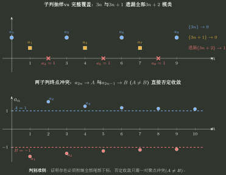
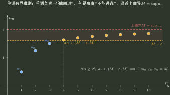

# 数列收敛性与逻辑判定

> 训练定位：训练数列概念题、选择题与证明题中“哪些条件真的能推出收敛、哪些只能传递已有极限、哪些只是局部观察”的问题族；重点处理子列、单调有界、差趋零、复合映射、有界/无穷/无穷小及充分必要关系。  
> 模型归属：[极限与连续：邻域、尺度与存在性](极限与连续_邻域尺度与存在性.tex) 负责数列极限唯一性、子列继承、有限覆盖反推、单调有界与极限运算的理论机制；本文只负责题面识别、第一动作、反例与逻辑资格审计。

## 1. 母题：概念题不是背结论，而是在审计“信息强度够不够”

遇到数列判断题，先别急着给“对/错”。把条件分成四层：

```text
已有极限
→ 可以安全做连续映射、四则运算、子列抽取

只知道有界 / 单调 / 差趋零 / 某个复合量收敛
→ 这些通常只是结构信息
→ 必须问它是否足以制造唯一终点

只观察若干子列
→ 这是尾部抽样
→ 先问是否覆盖全部下标

只知道乘积、和、复合结果收敛
→ 先问外层运算是否丢失信息
```

最重要的一句是：

> **能传递极限的信息，不一定能制造极限；能观察部分尾部的信息，不一定能控制整个尾部。**

---

## 2. 子列题：先问“抽样”还是“覆盖”

### 局部规则：原列收敛时，任意子列自动继承同一极限

**触发信号**：题目已知

$$
a_n\to A
$$

并询问 $a_{2n}$、$a_{3n+1}$、$a_{n_k}$ 等子列。

**第一动作**：直接调用子列继承：任何严格递增下标序列 $n_k$ 都满足

$$
a_{n_k}\to A.
$$

**检查与退出**：这是单向结论。不要把“某几个子列收敛”自动反推成原列收敛。

### 局部规则：由子列反推原列时，检查它们是否最终覆盖全部下标

**触发信号**：题目给若干子列都趋于同一 $A$，问能否推出 $a_n\to A$。

**第一动作**：先列出这些下标族是否把充分大的整数全部覆盖。

奇偶子列：

$$
\{2n:n\ge1\}\cup\{2n+1:n\ge0\}=\mathbb N,
$$

因此

$$
a_{2n}\to A,\qquad a_{2n+1}\to A
\Longrightarrow a_n\to A.
$$

但

$$
3n,\qquad 3n+1
$$

漏掉整个 $3n+2$ 类，所以即使这两列都趋于 $A$，原列仍可能不收敛。

一个最小反例：

$$
a_{3n}=0,\qquad a_{3n+1}=0,\qquad a_{3n+2}=1.
$$

前两类都趋于 $0$，原列却没有极限。

**检查与退出**：不要问“我已经检查了几条子列”，要问“有没有任何未被控制的尾部下标”。

---

## 3. 两条子列极限不同：这是最便宜的不收敛证据

### 局部规则：想否定收敛，优先制造冲突子列

**触发信号**：数列含 $(-1)^n$、周期相位、分段按模类定义、取整或奇偶振荡。

**第一动作**：优先找两条合法子列，使

$$
a_{n_k}\to A,\qquad a_{m_k}\to B,\qquad A\ne B.
$$

立即得到原数列不收敛。

**检查与退出**：两条子列同极限通常没有足够证明力；两条子列不同极限却足以结束。这是“证明存在要控制全部尾部，否定只需一次冲突”的离散版本。



---

## 4. 单调有界：两个条件分别承担不同责任

### 局部规则：单调负责“不能来回”，有界负责“不能逃走”

**触发信号**：题目给数列单调、有界，或给函数单调有界再作用在单调数列上。

**第一动作**：分开审计：

- 单调：是否真的有 $a_{n+1}\ge a_n$ 或 $a_{n+1}\le a_n$；
- 有界：是否存在统一上界或下界。

两者同时成立，才调用单调有界准则。

**检查与退出**：

- 只有单调：可能 $a_n=n\to+\infty$；
- 只有有界：可能 $a_n=(-1)^n$ 振荡。



### 复合场景：单调函数作用在单调数列上

若 $x_n$ 单调，且 $f$ 在包含全部 $x_n$ 的区间上单调，则 $f(x_n)$ 也单调；若此外 $f$ 在该区间上有界，则 $f(x_n)$ 单调有界，从而收敛。

**检查与退出**：必须确认 $f$ 的单调性是在 $x_n$ 实际取值区间上成立；“$f$ 在整个实轴某处单调”或只在一条分支单调，不够。

---

## 5. 差趋零：它传递终点，不制造终点

### 局部规则：$a_n-b_n\to0$ 时，先问谁已经有极限

**触发信号**：题目给

$$
a_n-b_n\to0.
$$

**第一动作**：做存在性账本：

- 若 $a_n\to A$，则
  $$
  b_n=a_n-(a_n-b_n)\to A;
  $$
- 若 $b_n\to B$，同理 $a_n\to B$；
- 若两列都已知收敛，则极限必相等。

**检查与退出**：如果两列都没有先验收敛性，差趋零本身不保证共同收敛。

最小反例：

$$
a_n=(-1)^n,\qquad b_n=(-1)^n+\frac1n.
$$

有 $a_n-b_n\to0$，但两列都不收敛。

一句压缩：

> **差趋零说明“彼此越来越近”，不说明“共同靠近某个固定点”。**

---

## 6. 双单调 + 差趋零：这时它们真的会合流

### 局部规则：相向单调时，先各自制造极限，再用差趋零合并

**触发信号**：

$$
a_n\downarrow,\qquad b_n\uparrow,\qquad a_n-b_n\to0,
$$

并且通常还能从题面得到 $b_n\le a_n$。

**第一动作**：

1. 由 $b_n\le a_n\le a_1$ 得 $b_n$ 有上界；
2. 由 $b_1\le b_n\le a_n$ 得 $a_n$ 有下界；
3. 因此两列分别单调有界，存在极限 $A,B$；
4. 再由
   $$
   a_n-b_n\to0
   $$
   得 $A-B=0$。

**检查与退出**：顺序不能反过来。差趋零只负责最后“合流”，单调有界才负责先把两个极限造出来。

---

## 7. 已知 $x_n$ 收敛，再看 $g(x_n)$：把未知极限变成零点候选

### 局部规则：先设已存在的极限，再用连续映射得到候选方程

**触发信号**：题设明确说 $x_n$ 收敛，并给

$$
g(x_n)\to0
$$

或某个连续表达式趋于给定常数，要求判断 $\lim x_n$。

**第一动作**：因为收敛性已经由题设提供，可设

$$
x_n\to A.
$$

若 $g$ 在 $A$ 附近连续，则

$$
g(A)=0.
$$

于是问题转成：候选零点有几个？题设其他信息能否筛出唯一的 $A$？

例如若 $x_n$ 收敛且

$$
x_n+x_n^2\to0,
$$

则

$$
A+A^2=0,
$$

所以只得到候选 $A\in\{0,-1\}$。如果题面没有额外信息，就不能擅自只选 $0$。

**检查与退出**：极限方程负责“筛候选”，不是“证明收敛”。这里只因为题设已经明确给了收敛，才可以直接设极限。

---

## 8. $f(x_n)$ 与 $x_n$：连续只保证正向，反向需要信息不丢失

### 连续映射的正向传递

若 $f$ 在 $A$ 连续，则

$$
x_n\to A\Longrightarrow f(x_n)\to f(A).
$$

### 局部规则：由 $f(x_n)$ 收敛反推 $x_n$，先审单射/逆连续

**触发信号**：题目已知 $f(x_n)$ 收敛，进一步询问 $x_n$ 是否收敛、极限是多少，或试图由外层结果恢复内层输入。

**第一动作**：先确定 $x_n$ 尾部实际落在哪个集合 $I$，再检查 $f|_I$ 是否单射，以及目标极限附近的反函数是否连续；若不能恢复输入，就优先寻找反例而不是强行逆推。

例如

$$
x_n=(-1)^n,\qquad f(x)=x^2,
$$

则

$$
f(x_n)\equiv1
$$

收敛，但 $x_n$ 不收敛。外层平方把正负信息压掉了。

**检查与退出**：只有在 $x_n$ 的尾部范围内 $f$ 单射，并且相应反函数在目标值附近连续，才可以安全反推。

---

## 9. 部分和有界与通项收敛：先区分“级数”和“数列”

设

$$
S_n=a_1+\cdots+a_n.
$$

若 $S_n$ 收敛，则

$$
a_n=S_n-S_{n-1}\to0.
$$

但只知道 $S_n$ 有界，不能推出 $S_n$ 收敛，因此也不能仅凭“部分和有界”在一般情形下宣布更多结论。

反过来，$a_n\to0$ 更远远不能推出 $S_n$ 有界或级数收敛；调和级数就是最小反例。

### 正项时结构会变强

若 $a_n>0$，则 $S_n$ 单调递增。此时

$$
\{S_n\}\text{有界}
\Longleftrightarrow
\{S_n\}\text{收敛}
\Longleftrightarrow
\sum a_n\text{收敛}.
$$

而一旦级数收敛，必有 $a_n\to0$。

**检查与退出**：这类充分必要关系之所以成立，关键不是“部分和”三个字，而是正项使 $S_n$ 自动单调；没有正项资格，不能照搬。

---

## 10. 有界、无界、无穷大量：先看量词强度

### 局部规则：无穷大量一定无界，无界不一定是无穷大量

**触发信号**：题目把“无界”“趋于 $+\infty$ / $-\infty$”“存在任意大子列”放在一起判断，或试图互相替换这些概念。

**第一动作**：直接写量词强度：趋于 $+\infty$ 要求任意阈值 $M$ 之后，所有足够靠后的项都大于 $M$；无界只要求不存在统一上界，允许尾部不断掉回小值。

$$
a_n\to+\infty
$$

意味着：任意 $M>0$，最终所有项都满足 $a_n>M$。这当然推出无界。

但无界只要求“能取到任意大的值”，不要求尾部所有项都大。例如

$$
a_n=\begin{cases}
n,&n\text{ 为偶数},\\0,&n\text{ 为奇数},\end{cases}
$$

无界，却不趋于 $+\infty$。

**检查与退出**：看到“无界”时问的是“有没有逃得很远”；看到“趋于 $+\infty$”时问的是“是否从某一刻起全部越过任意阈值”。后者量词更强。

---

## 11. 乘积趋零：不要机械拆因子

### 局部规则：$x_ny_n\to0$ 只描述乘积，不自动决定单个因子

**触发信号**：题目给

$$
x_ny_n\to0
$$

并判断 $x_n,y_n$ 的有界、无穷小或发散性质。

**第一动作**：先尝试把目标因子写成

$$
y_n=(x_ny_n)\frac1{x_n}
$$

或对称形式，检查第二个因子的极限是否真的已知。

几个稳定结论：

- 若 $\lvert x_n\rvert\to\infty$，则 $1/x_n\to0$，所以
  $$
  y_n=(x_ny_n)\frac1{x_n}\to0;
  $$
- 若 $x_n\to c\ne0$，则
  $$
  y_n=\frac{x_ny_n}{x_n}\to0.
  $$

但以下说法都不能无条件成立：

- $x_n$ 无界 $\Rightarrow y_n\to0$；
- $x_n$ 有界 $\Rightarrow y_n$ 必为无穷小；
- $x_n$ 发散 $\Rightarrow y_n$ 必发散。

例如可令

$$
x_{2n}=n,\quad x_{2n-1}=0,\qquad
y_{2n}=0,\quad y_{2n-1}=1,
$$

则 $x_n$ 无界、$y_n$ 不趋零，但始终 $x_ny_n=0$。

**检查与退出**：真正能逆推出单因子的，是“另一个因子有稳定非零极限”或“另一个因子的倒数趋零”等强信息，不是“有界/无界/发散”这些粗标签。

---

## 12. 真题母例：把抽象逻辑压回具体选择题

### 母例一：2015 子列题——同一道题反复检查“继承还是覆盖”

这道题四个选项的正确判断不是靠记忆：

- 原列 $x_n\to a$ 推 $x_{2n},x_{2n+1},x_{3n},x_{3n+1}\to a$：都是子列继承；
- $x_{2n},x_{2n+1}\to a$ 推原列：奇偶覆盖全部尾部，所以成立；
- $x_{3n},x_{3n+1}\to a$ 推原列：漏掉 $3n+2$，所以失败。

因此错误选项是 D。完整反例与逐项解答见 [数列极限成组题训练](数列极限成组题训练.md)。

这道题晋升为母例，因为它把整个子列模型压成一句：

> **整体到抽样看继承；抽样到整体看覆盖。**

### 母例二：2017 候选根题——“题设已给收敛”才允许直接设极限

题设先给 $x_n$ 收敛，所以可以设 $x_n\to A$，再把四个条件分别连续传递成候选方程。前三项分别留下多个候选：

$$
\sin A=0,
\qquad
A+\sqrt{\lvert A\rvert}=0,
\qquad
A+A^2=0.
$$

只有

$$
A+\sin A=0
$$

具有唯一实根 $A=0$，故答案为 D。

这道题晋升为母例，因为它能永久区分：

$$
\boxed{\text{收敛资格负责“可以设极限”}\quad\neq\quad
\text{极限方程负责“筛候选终点”}.}
$$

### 母例三：2008 单调函数题——单调可以传顺序，但不能替代连续

$f$ 在全实轴单调有界时：

- $x_n$ 收敛，并不能保证 $f(x_n)$ 收敛，因为单调函数可能有跳跃间断；
- $x_n$ 单调，则 $f(x_n)$ 也单调，而 $f$ 有界，所以 $f(x_n)$ 单调有界必收敛；
- 由 $f(x_n)$ 收敛或单调反推 $x_n$ 都不成立，常函数已经足够反例。

因此答案为 B。完整构造见 [数列极限成组题训练](数列极限成组题训练.md)。

这道题晋升为母例，是因为它把三个层次一次分开：**函数单调性、函数连续性、外层映射的信息损失。**

### 母例四：1998 乘积题——逆推要找可合法参与四则运算的强信息

只知道 $x_ny_n\to0$ 时，“$x_n$ 发散/无界/有界”都不足以唯一约束 $y_n$。但若

$$
\frac1{x_n}\to0,
$$

则

$$
y_n=(x_ny_n)\frac1{x_n}\to0.
$$

因此答案为 D。它被保留为母例，是因为它把“粗性质标签”和“可用于极限代数的稳定信息”明确分层。

---

## 13. 一页判断压缩

```text
数列概念题
→ 已知原列收敛：子列、连续映射、四则可以安全传递
→ 若干子列反推原列：先查是否覆盖全部尾部
→ 两条子列极限不同：立即判原列不收敛
→ 单调有界：单调阻止来回，有界阻止逃逸；两者缺一不可
→ a_n-b_n→0：只传递已有极限，不独立制造极限
→ 双单调 + 差趋零：先各自单调有界收敛，再合流
→ 已知 x_n 收敛 + g(x_n)→0：设 A 后解 g(A)=0，再用额外条件筛根
→ f(x_n) 反推 x_n：先审外层是否单射、是否丢信息
→ S_n=Σa_k：先区分一般部分和与正项单调部分和
→ 无界 ≠ 趋于无穷：检查“偶尔很大”还是“最终全部很大”
→ x_ny_n→0：先看另一因子是否有稳定非零极限或可控倒数
```

最终自检只有三问：

1. **这个条件是在制造极限，还是只在传递一个已经存在的极限？**
2. **我观察的是整个尾部，还是只抽到了其中几条路径？**
3. **当前运算有没有把原对象的信息压掉，以至于无法反推？**
