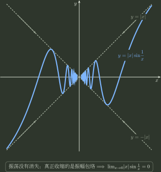

# 极限计算

> 训练定位：训练函数极限与数列极限中“先判断存在性、传递方向与信息缺口，再把对象放到可比较尺度”的问题族；重点处理极限/邻域次序传递、等价无穷小、根式/指数/对数变形、泰勒配阶、洛必达、中值定理与无穷远增长比较。  
> 模型归属：[极限与连续：邻域、尺度与存在性](极限与连续_邻域尺度与存在性.tex) 负责极限存在性、邻域/极限次序传递、主导尺度、未定式与信息精度的理论机制；有限泰勒调用 [专题03](../03_一元局部模型_导数微分与Taylor/README.md)，洛必达与中值定理调用 [专题04](../04_局部到整体_中值定理与函数形状/README.md)，黎曼和/变限积分调用 [专题05](../05_一元累积_原函数定积分与反常积分/README.md)。本文只负责题面识别、第一动作、局部技巧与退出边界。

## 1. 母题表示：极限计算是在找“刚好够用的信息”

复杂极限不要先问“九种方法里选哪一种”，先把题目压成五个问题：

1. **存在性**：左右、路径、振荡或定义域是否已经让极限失败？
2. **传递方向**：已知的是“极限值之间的关系”，还是“邻域内函数值之间的关系”？严格号能不能沿这个方向保留？
3. **当前表示**：主导尺度是否被根式、指数、对数、幂或无穷差藏住？
4. **信息精度**：只需要最低阶主部，还是首项相消后必须知道下一阶？
5. **停止条件**：当前信息是否已经唯一决定结果，继续展开还有没有收益？

旧讲义里的“等价、泰勒、洛必达、有理化、拉格朗日中值、基本极限、夹逼、单调有界、定积分定义”等方法，可以重排为三类：

| 方法角色 | 代表工具 | 真正解决的问题 |
|---|---|---|
| 表示重写 | 恒等变形、有理化、提公因子、指数差提取、取对数 | 把隐藏的尺度显露出来，原则上尽量少丢信息 |
| 局部尺度提取 | 等价无穷小、有限泰勒、洛必达、中值定理 | 回答“最低非零主部/相对变化率是什么” |
| 存在性与跨专题接口 | 夹逼、单调有界、斯托尔茨、黎曼和/变限积分 | 证明所有允许输入确实受控，或把问题交给更合适的机制 |

这比背“方法清单”更稳定：**先诊断缺什么信息，再调用能提供那一级信息的工具。**



这张图只负责一个判断：**振荡没有消失，真正趋于 $0$ 的是振幅包络。** 因此它支持夹逼结论，却绝不表示 $|x|\sin(1/x)\sim|x|$；二者之比仍是持续振荡的 $\sin(1/x)$。

---

## 2. 局部规则：未定式先标准化，再选工具

**触发信号**：直接代入出现 $0/0$、$\infty/\infty$、$0\cdot\infty$、$\infty-\infty$、$1^\infty$、$0^0$、$\infty^0$，或根式/幂型让主尺度不可见。

**第一动作**：先改写成可比较的共同尺度：

- $0\cdot\infty$：改成商；
- $\infty-\infty$：优先通分、有理化或提最大尺度；
- $1^\infty,0^0,\infty^0$：在底数最终为正时取对数；
- 有限点 $x\to a$：常令 $h=x-a\to0$；
- 无穷远：先提最高增长尺度，必要时令 $t=1/x$。

**检查与退出**：标准化后若已经可以直接代入、夹逼或用最低阶主部唯一决定结果，就停止升级工具；不要为了“用洛必达”而强行把所有题改成分式。

> **易错边界：** 未定式不是“必须用某个公式”的信号，只说明现有粗信息不足。

### 局部规则：先把非零稳定因子从竞争尺度里剥离

**触发信号**：乘积或商中同时出现一部分趋于有限非零常数，另一部分才真正趋零、趋无穷或构成未定式。

**第一动作**：先把趋于 $c\ne0$ 的部分视为稳定系数，只把注意力留给真正决定阶数的因子。例如

$$
A(x)B(x),\qquad A(x)\to c\ne0,
$$

若 $B(x)$ 的极限/阶数已经确定，则 $A$ 只负责把最终主部乘上常数 $c$，不需要为它额外展开高阶项。

**检查与退出**：这条规则只适合乘除型的“稳定系数”。若两个趋向同一非零中心的量发生加减，例如 $A(x)-B(x)$ 且 $A,B\to c$，常数主部恰好会抵消，必须比较它们各自离 $c$ 的第一阶偏移，不能把两边都冻结成 $c$。

---

## 3. 局部规则：四则拆限前先做“存在性账本”

**触发信号**：准备把 $\lim[f(x)\pm g(x)]$、$\lim[f(x)g(x)]$ 或 $\lim[f(x)/g(x)]$ 拆成各部分极限，或者题目已知某个组合极限而追问另一部分是否存在。

**第一动作**：先标出每个部件的极限是否已经存在。部件极限都存在时，才按规范正文调用和、差、积、商的封闭性；商还要检查分母极限非零。

**检查与退出**：加减具有可逆恒等式，例如若 $\lim f$ 与 $\lim(f+g)$ 都存在，则 $\lim g$ 必存在；因此“一个存在、一个不存在”时和/差不可能突然存在。乘积没有这个简单逆推：趋零因子可以压住不收敛的有界因子。

商结构还有两个常用反向动作：若 $\lim(f/g)=C$ 为有限值且 $g\to0$，则由 $f=(f/g)g$ 得 $f\to0$；若 $\lim(f/g)=C\ne0$ 且 $f\to0$，则由 $g=f/(f/g)$ 得 $g\to0$。使用前仍要保证商在相应去心邻域有定义。

> **易错边界：** 不要把“存在/不存在”当成可以像正负号一样机械运算的标签。尤其不要把一个整体极限强拆成两个本身并不收敛的极限。例如
>
> $$
> \frac1x-\frac1{e^x-1}\to\frac12\qquad(x\to0),
> $$
>
> 但两个被减项分别都没有有限极限；若先拆极限，就会把一个可算的整体错误改写成“$\infty-\infty$”。

---

## 4. 局部规则：极限次序与邻域次序先分清传递方向

**触发信号**：选择题或证明题同时出现 $\lim f$、$\lim g$ 与“充分靠近时 $f(x)\gtrless g(x)$”，尤其是要判断严格不等号能否传过去。

**第一动作**：不要先搬不等号，先在草稿上写清箭头方向：

$$
\text{极限值}\longrightarrow\text{邻域函数值}
\qquad\text{还是}\qquad
\text{邻域函数值}\longrightarrow\text{极限值}.
$$

然后依次过三道检查：

1. **存在性 / 共同定义域**：从邻域关系推极限关系时，先确认两个极限都存在；从极限关系推邻域关系时，先取两个函数都合法的共同去心邻域。
2. **方向**：从极限推邻域，必须寻找极限值之间的**严格正间隙**；从邻域推极限，只能使用极限的保序性。
3. **严格性**：邻域中的严格不等式在取极限后可能压成等号；只有额外保留一个统一正间隙时，严格号才不会消失。

把最常见的四种判断压成一张表：

| 已知 | 可以推出 | 不能据此推出 |
|---|---|---|
| $\lim f=A,\ \lim g=B,\ A>B$ | 充分靠近时 $f(x)>g(x)$ | — |
| $\lim f=\lim g$ | 不能确定邻域谁大谁小 | $f\ge g$ 或 $f\le g$ 最终成立 |
| 充分靠近时 $f(x)\ge g(x)$，且两极限存在 | $\lim f\ge\lim g$ | — |
| 充分靠近时 $f(x)>g(x)$，且两极限存在 | 仍只能保证 $\lim f\ge\lim g$ | $\lim f>\lim g$ |

### 对比一：邻域里始终严格大，极限仍然可以相等

$$
f(x)=x^2,\qquad g(x)=0,\qquad x\to0.
$$

任意 $x\ne0$ 都有 $f(x)>g(x)$，但

$$
\lim_{x\to0}f(x)=0=\lim_{x\to0}g(x).
$$

所以看到“邻域严格大于”时，训练动作不是把 $>$ 原样搬到极限，而是先降级成候选结论 $\ge$。

### 对比二：两个极限相等，邻域次序可以反复翻转

$$
f(x)=x,\qquad g(x)=0,\qquad x\to0.
$$

虽然

$$
\lim f=\lim g=0,
$$

但任意双侧去心邻域内同时存在 $x>0$ 与 $x<0$，因此既不能说最终 $f\ge g$，也不能说最终 $f\le g$。

**检查与退出**：

- 若只知道 $A\ge B$，但没有 $A>B$ 的严格间隙，停止从极限值反推邻域次序；
- 若只知道邻域 $f\ge g$ 或 $f>g$，但两个极限尚未证明存在，先退出次序传递，回到存在性问题；
- 若想从邻域严格次序推出极限严格次序，必须再找不会随 $x\to a$ 消失的统一间隙，例如最终有 $f(x)\ge g(x)+\eta$，其中 $\eta>0$ 固定。

> **一行心智模型：** **极限有固定正间隙 $\Rightarrow$ 邻域严格分开；邻域严格分开 $\Rightarrow$ 极限可能压到一起。**

理论证明与“为什么严格间隙能保号”的机制仍由规范正文拥有；这里把它压成判断题和证明题中可直接调用的局部控制。 

---

## 5. 等价无穷小：先看替换发生在乘除还是加减

### 5.1 常用尺度锚点

当 $x\to0$ 时：

$$
\sin x\sim\tan x\sim\arcsin x\sim\arctan x\sim e^x-1\sim\ln(1+x)\sim x,
$$

$$
\ln\!\left(x+\sqrt{1+x^2}\right)\sim x,
\qquad
1-\cos x\sim\frac{x^2}{2},
$$

$$
(1+x)^\alpha-1\sim \alpha x\quad(\alpha\ne0),
\qquad
a^x-1\sim x\ln a\quad(a>0,\ a\ne1),
$$

$$
1-(\cos x)^\alpha\sim\frac{\alpha}{2}x^2\quad(\alpha\ne0).
$$

更重要的是会“换中心”：

$$
\ln u\sim u-1\qquad(u\to1),
$$

而不是把“$\ln$ 后面看到一个量”就机械套成那个量本身。

### 局部规则：等价替换前检查相消

**触发信号**：分子或分母含多个同时趋零的项，准备逐项使用等价无穷小。

**第一动作**：先标出每一项的最低阶。纯乘除结构通常可以直接替换；出现加减时先问最低阶主部会不会相消。

**检查与退出**：如果替换后出现“$x-x=0$”或把整个分子抹掉，说明当前精度已经失效；恢复原式，改用恒等变形、中值定理或专题03的有限泰勒升阶。

经典边界：

$$
\sin x\sim x,
$$

却绝不能据此把

$$
x-\sin x
$$

直接替换成 $x-x=0$；真正的主部在三阶。

### 局部规则：商型先做阶数预算

**触发信号**：$A(h)/B(h)$ 为 $0/0$ 型，分子分母都能识别最低非零阶，或题目要求一个有限非零极限。

**第一动作**：先只比较最低非零阶。若

$$
A(h)\sim a h^p,
\qquad
B(h)\sim b h^q,
\qquad ab\ne0,
$$

其中 $p,q\in\mathbb N_0$ 是最低非零整数阶，则先读阶数而不是先算系数：

- $p>q$：商趋于 $0$；
- $p=q$：商趋于有限非零常数 $a/b$；
- $p<q$：商的绝对值趋于 $\infty$；若讨论双侧无穷极限，还要根据 $a/b$ 与 $h^{p-q}$ 的符号判断两侧是否同向。

**检查与退出**：所谓“同阶原则”不是要求一开始强行把上下都展开很多项，而是先找到各自**第一个非零主部**。某一边低阶系数因相消变成零，就继续升级那一边，直到最低非零阶真正确定。

### 局部规则：差式逐阶对账，第一处不相同就是主阶

**触发信号**：$A(h)-B(h)$ 两边都趋向同一个中心，或前几阶看起来高度相似。

**第一动作**：从低阶到高阶逐项比较系数：同阶系数相同就抵消；某一阶只有一边出现非零项，或两边系数第一次不同，这一阶立即成为差的主阶，不必继续向后展开。

例如

$$
A(h)=1+h+2h^2+O(h^3),
\qquad
B(h)=1+h+5h^2+O(h^3),
$$

则

$$
A(h)-B(h)=-3h^2+O(h^3).
$$

旧课里所谓“有人在家”的真正含义就是：**逐阶对账时，一旦某一阶没有被另一边完全抵消，它就留下来主导差值。**

**检查与退出**：发现第一处不相同后立即停止；继续展开只增加算术风险，不增加极限信息。

---

## 6. 五个高频表示动作：不是口诀，而是“把差尺度暴露出来”

### 6.1 根式差：先有理化

若出现

$$
\sqrt{A(x)}-\sqrt{B(x)},
$$

先考虑恒等式

$$
\sqrt{A}-\sqrt{B}
=\frac{A-B}{\sqrt{A}+\sqrt{B}}.
$$

无穷远处还要记住

$$
\sqrt{x^2}=\lvert x\rvert,
$$

所以 $x\to-\infty$ 时不能把 $\lvert x\rvert$ 偷换成 $x$。

### 6.2 指数差：先提共同指数

$$
e^{u}-e^{v}=e^v\bigl(e^{u-v}-1\bigr).
$$

如果 $u-v\to0$ 且 $v\to c\in\mathbb R$，则

$$
e^u-e^v\sim e^c(u-v).
$$

真正的小量是**指数之差**，不是把两个指数函数分别做最低阶替换后相减。

### 6.3 对数靠近非零中心：改写成“离 1 多远”

当 $u\to1$ 时，

$$
\ln u\sim u-1.
$$

若表达式是 $\ln A-\ln B$，先用

$$
\ln A-\ln B=\ln\frac AB
$$

把问题改成 $A/B$ 离 $1$ 多远。

### 6.4 $x\ln x$：把“零乘无穷”翻译成增长竞争

当 $x\to0^+$ 时，

$$
x\ln x\to0.
$$

可令 $t=1/x\to+\infty$，变成

$$
-\frac{\ln t}{t}\to0,
$$

本质是“对数增长远慢于一次幂”。

### 6.5 幂型：先取对数

当 $y=u(x)^{v(x)}$ 且底数最终为正时，先研究

$$
\ln y=v(x)\ln u(x).
$$

例如若 $\alpha(x)\to0$ 且 $\alpha(x)\beta(x)\to0$，并满足底数最终为正，则常可由

$$
\beta\ln(1+\alpha)\sim\alpha\beta
$$

得到

$$
[1+\alpha(x)]^{\beta(x)}-1\sim\alpha(x)\beta(x).
$$

**检查与退出**：取对数前先过正值资格；若对数后的乘积极限已经不是未定式，就不要再堆展开。

---

## 7. 泰勒配阶：先找展开中心，再找第一个幸存项

### 局部规则：展开中心必须对齐真实极限点

**触发信号**：准备使用 $e^u-1\sim u$、$\ln(1+u)\sim u$ 或泰勒展开，但内部量并不趋于公式要求的中心。

**第一动作**：先算内部量的极限，把表达式改写成“相对真实中心的增量”。

例如 $x\to0$ 时

$$
e^{1+x+\frac12x^2}-1\to e-1,
$$

所以不能写

$$
e^{1+x+\frac12x^2}-1\sim1+x+\frac12x^2.
$$

真正能做小量展开的是

$$
e^{1+x+\frac12x^2}-e
=e\left(e^{x+\frac12x^2}-1\right)
\sim e\left(x+\frac12x^2\right).
$$

**检查与退出**：每个局部公式都要问“谁趋向展开中心？”；中心错了，后面的阶数账本全部失效。

### 局部规则：展开到“相消后第一个幸存项”

**触发信号**：分子是 $A-B$、参数配阶，或最低阶等价后全部消掉。

**第一动作**：先估计分母需要的阶数，再比较 $A,B$ 的低阶系数；只有前面系数相同才继续升阶。

例如

$$
\tan x=x+\frac{x^3}{3}+o(x^3),
\qquad
\ln(1+x)=x-\frac{x^2}{2}+\frac{x^3}{3}+o(x^3),
$$

所以

$$
\tan x-\ln(1+x)
=\frac{x^2}{2}+o(x^2).
$$

若题目要求

$$
\tan x-\ln(1+x)\sim ax^b,
$$

则直接读出

$$
a=\frac12,\qquad b=2.
$$

**检查与退出**：一旦第一个非零幸存项出现，且余项严格高于目标阶数，就停止展开；不要把有限泰勒变成整页级数默写。

---

## 8. 洛必达：它是单向转移定理，不是“求导按钮”

### 局部规则：每一次使用都重新验型、验资格、验收益

**触发信号**：标准化后确实是 $0/0$ 或 $\infty/\infty$，分子分母在合法去心/单侧邻域可导，且求导有望降低复杂度。

**第一动作**：检查分母导数在所需邻域非零；只求导一次，把新商当成一个全新的极限问题。

**检查与退出**：再次洛必达前重新检查新商是否仍是合法未定式；若新商不再未定、求导后更复杂、或导数比没有可用极限，就停止这条路。

两个永久反例：

1. **原式不是未定式，不能用洛必达。**
   $$
   \lim_{x\to0}\frac{x+\cos x}{x}
   $$
   分子趋于 $1$、分母趋于 $0$，不是 $0/0$；即使
   $$
   \frac{1-\sin x}{1}\to1,
   $$
   也不能据此推出原极限为 $1$。
2. **导数比没有极限，不代表原商没有极限。**
   $$
   \frac{x+\sin x}{x}=1+\frac{\sin x}{x}\to1
   \qquad(x\to+\infty),
   $$
   但导数比
   $$
   1+\cos x
   $$
   没有极限。

> **易错边界：** 洛必达给的是“满足前提且导数比极限存在时，原商极限随之确定”的充分路径；它不是充要判据。

---

## 9. 拉格朗日中值：差值结构优先“一次运输”，不要两边各自展开

### 局部规则：外层相同、输入很近时，先看差商

**触发信号**：出现

$$
\Phi(u(x))-\Phi(v(x)),
$$

其中 $u,v$ 趋向同一点，且分母正好含 $u-v$ 或能化出 $u-v$。

**第一动作**：调用专题04的拉格朗日中值定理，在 $u,v$ 之间取 $\xi_x$：

$$
\Phi(u)-\Phi(v)=\Phi'(\xi_x)(u-v).
$$

若 $u,v\to a$，则 $\xi_x\to a$；若 $\Phi'$ 在 $a$ 连续，便得到

$$
\frac{\Phi(u)-\Phi(v)}{u-v}\to\Phi'(a).
$$

经典例子：

$$
\lim_{x\to0}\frac{e^{\sin x}-e^x}{\sin x-x}=1.
$$

因为中值定理直接给

$$
\frac{e^{\sin x}-e^x}{\sin x-x}=e^{\xi_x},
$$

且 $\xi_x\to0$。

另一个包络例子：

$$
\sin\sqrt{x+1}-\sin\sqrt{x}
$$

可写成某个 $\cos\xi_x$ 乘

$$
\sqrt{x+1}-\sqrt{x}
=\frac1{\sqrt{x+1}+\sqrt{x}},
$$

从而在 $x\to+\infty$ 时直接被压到 $0$。

**检查与退出**：中值定理只负责把外层差“运输”为导数系数乘输入差；导数连续性、区间资格与输入差的剩余极限仍要分别核对。

---

## 10. 三角差与根式差：优先把“减法”变成“乘法”

### 三角差

例如

$$
\cos2x-\cos x
=-2\sin\frac{3x}{2}\sin\frac{x}{2},
$$

所以

$$
\lim_{x\to0}\frac{\cos2x-\cos x}{x^2}
=-\frac32.
$$

这类题的关键不是记结果，而是先把两个会相消的量改成乘积，小角尺度随后自然暴露。

### 根式差

若根式差与三角小量同时出现，先有理化制造普通差，再决定是否使用小角等价；顺序反过来往往会丢掉关键相消信息。

---

## 11. 无穷远：先比较增长阶，不要一上来反复洛必达

当 $x\to+\infty$，固定 $m,n>0$、$a>1$ 时：

$$
(\ln x)^m\ll x^n\ll a^x.
$$

数列题还常用更长的增长阶梯。对固定 $m,p>0$、$a>1$：

$$
(\ln n)^m\ll n^p\ll a^n\ll n!\ll n^n.
$$

它只比较主导增长速度，不自动处理正负抵消、振荡、缺项或参数临界。特别是看到 $n!$ 时，通常先用相邻项比值；看到 $n^n$ 时，先取对数或比较 $n\ln n$，不要把整条阶梯当成无需资格的口诀。

对多项式比值

$$
\frac{a_nx^n+\cdots+a_0}{b_mx^m+\cdots+b_0},
$$

先提最高次幂：

- $n<m$：极限为 $0$；
- $n=m$：极限为 $a_n/b_m$；
- $n>m$：先判断符号与趋近方向，再决定是 $+\infty$、$-\infty$ 还是双侧不统一。

对数、幂、指数混合时先用增长阶压缩；只有主部抵消或参数使粗比较失效，才升级工具。

---

## 12. 数列比值：累计结构才考虑斯托尔茨

### 局部规则：先验证分母尾部资格

**触发信号**：目标是 $a_n/b_n$，分子分母都像累计量，而相邻增量明显比原式简单。

**第一动作**：先验证 $b_n$ 严格递增且 $b_n\to+\infty$，再研究

$$
\frac{a_{n+1}-a_n}{b_{n+1}-b_n}.
$$

**检查与退出**：分母振荡、有界或差分没有降复杂度时退出；斯托尔茨不是“数列版洛必达”的无条件口诀。

---

## 13. 黎曼和、变限积分与导数定义：认出以后就转交归属专题

| 题面结构 | 第一识别 | 转交 |
|---|---|---|
| $\frac1n\sum f(k/n)$ 或网格宽度 $\times$ 采样值 | 先核对固定区间、网格宽度总和与积分资格 | 专题05的黎曼和 |
| 收缩区间上的积分 | 比较区间宽度与局部高度 | 专题05 / H-B03 |
| $[f(a+h)-f(a)]/h$ | 固定基点的一阶变化率 | 专题03的导数定义 |

**检查与退出**：认出跨专题结构后，不在极限训练里重复证明对应机制；只保留当前极限所需的尺度接口。

若题目直接给 $f(0),f'(0),f''(0)$ 等局部系数，并要求 $f(x)/x^k$、$\sin x+x f(x)$ 一类高阶极限，当前主要信息已经不是专题02的“找极限方法”，而是专题03的有限局部模型；应尽早转交，避免在专题02里硬做洛必达。

### 转交示例：已知局部导数数据时直接读取泰勒系数

若

$$
f(0)=-1,\qquad f'(0)=0,\qquad f''(0)=\frac43,
$$

则专题03给出的二阶局部模型为

$$
f(x)=-1+\frac23x^2+o(x^2).
$$

于是

$$
\sin x+x f(x)
=\left(x-\frac{x^3}{6}+o(x^3)\right)
+\left(-x+\frac23x^3+o(x^3)\right)
=\frac12x^3+o(x^3),
$$

从而

$$
\lim_{x\to0}\frac{\sin x+x f(x)}{x^3}=\frac12.
$$

这道题在专题02只负责识别“目标是三阶极限、低阶会相消”；真正生成 $f$ 的局部系数的是专题03。这样能避免把“已知导数数据”误当成继续洛必达的信号。

### 一个“两个幂型都趋于 $e$”的配阶例子

$$
\lim_{x\to0}
\frac{(1+x)^{1/x}-(1+2x)^{1/(2x)}}{\sin x}.
$$

两项都趋于 $e$，所以直接套“基本极限”只得到 $e-e=0$，信息不足。比较它们相对共同中心 $e$ 的一阶偏移：

$$
\frac{\ln(1+x)}x=1-\frac x2+O(x^2),
\qquad
\frac{\ln(1+2x)}{2x}=1-x+O(x^2),
$$

于是

$$
(1+x)^{1/x}=e\left(1-\frac x2+O(x^2)\right),
$$

$$
(1+2x)^{1/(2x)}=e\left(1-x+O(x^2)\right).
$$

两者之差为

$$
\frac e2x+O(x^2),
$$

故原极限为

$$
\boxed{\frac e2}.
$$

这个例子真正训练的是：**两个对象趋向同一非零中心时，求它们的差必须比较“各自离中心的第一阶偏移”，不能只记共同极限值。**

---

## 14. 一页调用压缩

```text
先问极限是否有资格存在
→ 若涉及大小关系：先判“极限→邻域”还是“邻域→极限”；严格号只在有固定正间隙时向邻域保留
→ 把根式/指数/对数/幂型改写到共同尺度
→ 只需最低阶：等价
→ 首项相消：恒等变形 / 中值定理 / 泰勒升阶
→ 合法商型且求导降复杂度：洛必达
→ 振荡但有衰减包络：夹逼
→ 累计结构：斯托尔茨 / 黎曼和 / 变限积分接口
→ 一旦结果被当前信息唯一决定，立即停止
```

最重要的三个自检问题：

1. **我现在是在从极限推邻域，还是从邻域推极限？严格号在这个方向上能保留吗？**
2. **我现在使用的近似，展开中心对不对？**
3. **我删掉的信息，会不会恰好在加减相消后变成主角？**
