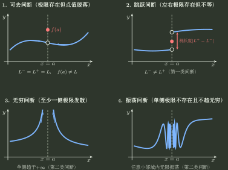

# 连续与间断

> 训练定位：训练分段点、端点、复合函数与参数连续性问题中“先分邻域趋势，再检查点值接缝”的问题族；重点处理左右极限、可去/跳跃/无穷/振荡间断，以及外层运算隐藏原间断的边界。  
> 模型归属：[极限与连续：邻域、尺度与存在性](极限与连续_邻域尺度与存在性.tex) 负责连续、单侧连续、间断分类与复合连续性的理论机制；本文只负责题面识别、局部规则、反例与检查动作。

## 1. 母题表示：连续性只有三份信息

在点 $a$ 讨论连续，先把所有复杂题面压成三格：

$$
L^-:=\lim_{x\to a^-}f(x),
\qquad
L^+:=\lim_{x\to a^+}f(x),
\qquad
f(a).
$$

内部点连续的完整要求是

$$
L^-=L^+=f(a).
$$

所以连续题真正有三种故障层：

1. 左右路径根本不一致；
2. 邻域已经有共同极限，但点值没接上；
3. 至少一侧根本没有有限极限。

端点题只检查定义域允许的一侧，不制造不存在的另一侧。

---

## 2. 局部规则：先识别“必须拆左右”的信号

**触发信号**：分段函数、绝对值、取整函数，或出现 $\arctan(1/x)$、$e^{1/x}$ 等当 $x\to0$ 时左右输入会被送往不同远端状态的复合结构。

**第一动作**：不要先写双侧极限。分别追踪 $x\to a^-$ 与 $x\to a^+$ 时内层量去哪儿，再判断两侧输出是否一致。例如

$$
\arctan\frac1x
$$

在 $x\to0^-$ 与 $x\to0^+$ 时分别读取 $-\infty$ 与 $+\infty$ 端的反正切极限；而

$$
\frac{\lvert x\rvert}{x}
$$

则直接由左右符号给出两个不同常数。

**检查与退出**：左右极限一旦不同，双侧极限立即不存在；不要继续做平均、洛必达或点值修补。

### 五类高频信号其实是同一个机制

旧题型里常把“分段、反正切无穷、指数无穷、绝对值、取整”列成五种题。更稳定的理解是：**它们都可能让 $x\to a^-$ 与 $x\to a^+$ 被送进不同的内部状态。** 先追踪状态，再读输出。

| 结构                         | $x\to0^-$ 或整数点左侧                 | $x\to0^+$ 或整数点右侧                  | 结论            |
|---|---|---|---|
| $\arctan(1/x)$             | $1/x\to-\infty\Rightarrow-\pi/2$ | $1/x\to+\infty\Rightarrow\pi/2$   | 双侧极限不存在       |
| $e^{1/x}$                  | $1/x\to-\infty\Rightarrow0$      | $1/x\to+\infty\Rightarrow+\infty$ | 第二类间断         |
| $\lvert x\rvert/x$         | $-1$                             | $1$                               | 跳跃            |
| $\lfloor x\rfloor$ 在整数 $m$ | $m-1$                            | $m$                               | 跳跃，且 $f(m)=m$ |
| 一般分段函数                     | 读取左分支                            | 读取右分支                             | 再比较两侧极限       |

这里尤其要区分“内层去往 $\pm\infty$”和“外层函数值也去往 $\pm\infty$”。例如 $\arctan(1/x)$ 的内层发散，但外层把它压成有限的 $\pm\pi/2$；$e^{1/x}$ 则在右侧真的冲向 $+\infty$。因此不能只看到一个“$\infty$”符号就跳过复合路径。

---

## 3. 局部规则：分段点固定列“左—右—点值”

**触发信号**：分段函数、绝对值规则切换点、取整点、补定义点，或题目要求参数使函数连续。

**第一动作**：直接写三格

$$
L^-\quad L^+\quad f(a),
$$

先算两侧极限，再看点值；参数题先用 $L^-=L^+$ 锁邻域，再用共同极限 $=f(a)$ 完成接缝。

**检查与退出**：只要左右极限不同，就已经不连续，不必继续通过修改 $f(a)$“补救”；若共同极限存在而只差点值，这是可去间断，改单点才有效。

---

## 4. 间断分类：先判断左右极限，再命名

| 情形 | 判断 | 单点修改能否修复 |
|---|---|---|
| $L^-=L^+=L$，但 $f(a)$ 不存在或 $f(a)\ne L$ | 可去间断 | 可以，令 $f(a)=L$ |
| $L^-,L^+$ 都有限但不相等 | 跳跃间断 | 不可以 |
| 至少一侧趋于 $\pm\infty$ | 无穷间断 | 不可以 |
| 至少一侧持续振荡，无极限 | 振荡间断 | 不可以 |

> **易错边界：** “第一类间断”要求左右极限都是有限值；不要只看点值是否定义。



读图时不要先背名称，先找故障层：**共同极限已经存在但点值没接上，是可去；左右有限极限冲突，是跳跃；至少一侧无界或持续振荡，则极限本身已经失败。**

---

## 5. 局部规则：复合连续性先追踪内层真实输出

**触发信号**：出现 $\varphi(f(x))$，原函数在 $a$ 附近分段、左右极限不同，或外层有平方、绝对值、周期函数等信息压缩操作。

**第一动作**：先求内层左右极限

$$
f(x)\to A\quad(x\to a^-),
\qquad
f(x)\to B\quad(x\to a^+),
$$

再分别送入外层：

$$
\varphi(f(x))\to\varphi(A),
\qquad
\varphi(f(x))\to\varphi(B),
$$

前提是外层在对应输入路径上有合法极限。

**检查与退出**：$A\ne B$ 不自动推出复合后仍跳跃；如果 $\varphi(A)=\varphi(B)$，外层可能把原差异压掉。反过来，复合后连续也不能推出原函数连续。

典型理解：平方、绝对值会丢符号信息，所以可能隐藏原函数的左右差异。

> **候选配图｜连续与间断_外层压缩左右差异**：若文字复盘仍容易把“内层跳跃”误判成“复合后必跳跃”，再用 $-1$ 与 $1$ 两条输入路径经 $u\mapsto u^2$ 汇合到同一输出 $1$ 的最小映射图，专门表达“外层可以丢失区分信息”，不扩展成完整复合函数理论图。

---

## 6. 局部规则：连续运算只正向调用，不做无资格逆推

**触发信号**：题目由 $f,g$ 的连续性判断 $f\pm g,fg,f/g,\varphi\circ f$，或者反过来从组合函数连续推某个分量连续。

**第一动作**：正向使用时逐项检查资格：

- 和、差、积：两者在点连续即可；
- 商：还需分母点值非零；
- 复合：内层趋向的值必须落在外层连续/相应单侧极限可控的位置。

**检查与退出**：这些是充分条件，不是普遍可逆条件。两个不连续函数可能相加抵消成连续函数；趋零因子可能压掉有界振荡。

---

## 7. 参数连续题：条件强度要分层

看到“连续、可导、导函数连续、二阶可导”时，不要把它们当同义标签。连续题只使用本文件的接缝条件；若题目给更强正则性，可以用强条件保证连续，但不能把连续结论反推成可导。

一个常见层级是：

$$
\text{二阶可导}\Rightarrow\text{可导}\Rightarrow\text{连续},
$$

逆向一般不成立。更细的“导数点值与导函数极限”归专题03训练。

---

## 8. 最小反例组：用来阻断三种错误逆推

### 8.1 极限存在不等于连续

$$
f(x)=
\begin{cases}
0,&x\ne0,\\
1,&x=0.
\end{cases}
$$

有

$$
\lim_{x\to0}f(x)=0,
$$

但 $f(0)=1$，所以在 $0$ 不连续。

### 8.2 连续不等于可导

$$
f(x)=\lvert x\rvert
$$

在 $0$ 连续，但左右差商不同，不可导。

### 8.3 复合连续不等于内层连续

如果内层左右极限为 $1$ 与 $-1$，外层取平方，则两侧都可被压到 $1$。外层输出连续不代表内层原跳跃消失。

---

## 9. 一页调用压缩

```text
连续/间断题
→ 先确认目标点与合法左右方向
→ 列 L^- / L^+ / f(a)
→ 左右不等：跳跃；至少一侧无有限极限：第二类
→ 左右相等：再看点值是否接上
→ 复合题额外追踪内层真实输出是否被外层压缩
→ 不把连续性继续越级推成可导或导函数连续
```

最重要的自检问题只有一句：

> **我现在看的，是点上的值，还是去心邻域里的共同趋势？**
