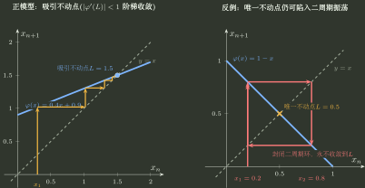

# 递推数列

> 训练定位：训练一阶递推、递增/递减迭代、双数列均值递推与误差压缩问题中“先证明轨道合法并收敛，再用不动点筛终点”的问题族。  
> 模型归属：[极限与连续：邻域、尺度与存在性](极限与连续_邻域尺度与存在性.tex) 负责递推轨道、收敛存在性与不动点接口的理论机制；本文只负责题面识别、第一动作、局部技巧与失效边界。

## 1. 母题表示：不动点只是候选终点，轨道才是真对象

对

$$
x_{n+1}=\varphi(x_n),
$$

如果已经知道 $x_n\to L$，并且 $\varphi$ 在 $L$ 附近满足相应连续性，才可以把极限传入递推式得到

$$
L=\varphi(L).
$$

所以方程 $L=\varphi(L)$ 回答的是：

> **如果轨道真的收敛，它可能停在哪里？**

而不是：

> **这条轨道一定会收敛到哪里？**

递推题因此固定分成四层：

```text
轨道是否合法
→ 轨道是否被困在可控区域
→ 用什么发动机证明收敛
→ 收敛后用不动点方程筛终点
```

---

## 2. 局部规则：先锁不变区间，再使用区间内性质

**触发信号**：根式递推、分式递推、含参数迭代，或者后续准备使用单调性、导数界、压缩估计。

**第一动作**：寻找区间 $I$，验证

$$
x_1\in I,
\qquad
\varphi(I)\subseteq I.
$$

这一步同时承担两件事：保证每一步根式、分母等都合法；保证后面使用的单调性、界或导数估计一直有效。

**检查与退出**：只证明“$\varphi$ 在某区间有好性质”不够，还必须证明轨道真的进入并留在该区间。若轨道离开，所有局部结论立即失去资格。

---

## 3. 局部规则：轨道单调看 $\varphi(x)-x$，不是只看 $\varphi$ 单调

**触发信号**：题目要求证明 $\{x_n\}$ 单调，已知或容易判断 $\varphi$ 的单调性。

**第一动作**：直接研究

$$
x_{n+1}-x_n=\varphi(x_n)-x_n.
$$

也就是在轨道所在区间分析

$$
h(x):=\varphi(x)-x
$$

的符号。

**检查与退出**：$\varphi$ 递增只说明一次迭代会保持输入次序，并不自动说明 $x_{n+1}\ge x_n$；真正决定相邻项增减的是 $h(x_n)$。

---

## 4. 递增迭代：一次方向确定后可以传播

若 $\varphi$ 在不变区间内递增，并且

$$
x_2\ge x_1,
$$

则

$$
x_3=\varphi(x_2)\ge\varphi(x_1)=x_2,
$$

继而可以归纳传播同一方向。$x_2\le x_1$ 同理。

这里要分清两件事：

- “$\varphi$ 递增”提供**次序传播能力**；
- “$x_2-x_1$ 的符号”决定轨道最初向哪边走。

只有两者合起来，才得到轨道单调性。

---

## 5. 局部规则：递减迭代先看二步映射与奇偶子列

**触发信号**：$\varphi$ 在合法轨道上递减，导致相邻项次序反复翻转。

**第一动作**：构造

$$
g:=\varphi\circ\varphi,
$$

并分别研究

$$
x_{2n+1},
\qquad
x_{2n}.
$$

因为单调不增函数复合两次后变为单调不减（严格递减时复合两次严格递增），奇偶子列往往比原数列更容易建立单调性和有界性。

**检查与退出**：即使奇偶子列分别收敛为 $A,B$，也不能直接宣布原数列收敛。必须继续利用递推关系得到

$$
B=\varphi(A),
\qquad
A=\varphi(B),
$$

并排除 $A\ne B$ 的二周期。

最小反例：

$$
x_{n+1}=1-x_n.
$$

它只有一个不动点 $1/2$，但若 $x_1\ne1/2$，轨道会在两个值之间来回跳动。**唯一不动点仍然不等于轨道收敛。**



这张图专门攻击一个错误直觉：**方程只有一个不动点，不等于轨道会收敛到它。** 对 $x_1\ne1/2$，这里实际满足 $x_{n+2}=x_n$，轨道在两个值之间往返。

---

## 6. 单调有界：先把“单调”和“有界”分别证出来

### 局部规则：不要把结论标签当证明

**触发信号**：准备使用“单调有界数列必收敛”。

**第一动作**：明确写出两份独立证据：

1. 哪个不等式保证 $x_{n+1}\ge x_n$ 或 $x_{n+1}\le x_n$；
2. 哪个不变区间、比较量或下/上界保证轨道不会逃逸。

**检查与退出**：只证明单调不能排除趋于无穷；只证明有界不能排除振荡。两项都成立后，才调用单调有界准则。

---

## 7. 局部规则：误差压缩能直接证明“真的被吸过去”

**触发信号**：已经从不动点方程得到候选 $L$，整体单调性难证，但可以估计 $\varphi(x)-L$。

**第一动作**：尝试建立

$$
\lvert\varphi(x)-L\rvert\le q\lvert x-L\rvert,
\qquad 0<q<1,
$$

并确认该估计在整个轨道所在区域成立。于是

$$
\lvert x_{n+1}-L\rvert
\le q\lvert x_n-L\rvert
\le q^n\lvert x_1-L\rvert\to0.
$$

**检查与退出**：若 $q<1$ 只在 $L$ 很小的局部邻域成立，还要先证明轨道最终进入该邻域；不能拿局部吸引性替代全局轨道控制。

---

## 8. 母例：牛顿递推逼近 $\sqrt2$

设 $x_1>0$，

$$
x_{n+1}=\frac12\left(x_n+\frac2{x_n}\right).
$$

第一步不是立刻令 $L=\frac12(L+2/L)$，而是先看轨道。

由算术—几何平均不等式，

$$
x_{n+1}\ge\sqrt2,
$$

所以从 $x_2$ 开始有统一下界。若 $x_n\ge\sqrt2$，则

$$
x_{n+1}-x_n
=\frac{2-x_n^2}{2x_n}\le0.
$$

因此从 $x_2$ 起单调递减且有下界，极限存在。此时才可以设 $x_n\to L>0$ 并代入：

$$
L=\frac12\left(L+\frac2L\right)
\Longrightarrow L^2=2
\Longrightarrow L=\sqrt2.
$$

更强地，误差满足

$$
x_{n+1}-\sqrt2
=\frac{(x_n-\sqrt2)^2}{2x_n},
$$

这说明接近终点后误差会非常快地缩小。

---

## 9. 局部规则：双数列均值递推先找夹链

**触发信号**：两列互相通过算术平均、几何平均、调和平均等方式更新，并要求证明共同极限。

**第一动作**：先排序并寻找类似

$$
b_n\le b_{n+1}\le a_{n+1}\le a_n
$$

的夹链。若成立，立即得到：

- $\{a_n\}$ 递减且有下界；
- $\{b_n\}$ 递增且有上界；
- 两列分别存在极限。

**检查与退出**：只有在两列各自收敛以后，才把递推关系传入极限；不要先写两个极限方程来“证明”收敛。

典型算术—几何平均：

$$
a_{n+1}=\frac{a_n+b_n}{2},
\qquad
b_{n+1}=\sqrt{a_nb_n},
\qquad
0<b_1\le a_1.
$$

由均值不等式可得夹链，从而

$$
a_n\to A,
\qquad
b_n\to B.
$$

最后再由

$$
A=\frac{A+B}{2}
$$

得到 $A=B$。

---

## 10. 不动点有多个时：用轨道范围筛根

如果

$$
L=\varphi(L)
$$

得到多个候选根，不要凭“看起来合理”选一个。回到已经证明的不变区间、符号、单调方向和初值位置，排除轨道永远不可能到达的分支。

**终点方程负责产生候选；轨道信息负责筛选候选。**

---

## 11. 一页调用压缩

```text
递推题
→ 先确认初值和定义域
→ 找不变区间，保证整条轨道合法
→ 看 φ(x)-x 决定相邻项方向
→ φ 递增：传播方向；φ 递减：看 φ∘φ 与奇偶子列
→ 用单调有界 / 夹链 / 误差压缩证明收敛
→ 最后才写 L=φ(L)
→ 多根用轨道范围筛；奇偶极限还要排二周期
```

最关键的自检问题：

> **我现在得到的是“候选终点”，还是已经证明这条轨道真的会到那里？**
