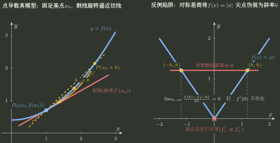
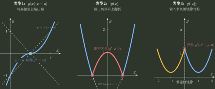

# 导数定义与分段点

> 训练定位：训练在新定义、分段函数、绝对值、仅给连续性或无法直接套求导法则的场景中，识别何时必须回到差商定义，并正确处理左右导数与拼接点。  
> 模型归属：[一元局部模型：导数、微分与 Taylor](一元局部模型_导数微分与Taylor.tex) 负责导数、左右导数与局部线性化的理论机制；本文只负责题目识别、第一动作和边界检查。

## 1. 什么时候“会求导”反而不是第一动作

常规区间内部，求导法则是定义的高效封装；但遇到以下信号时，公式层的信息可能不够：

- 题目直接出现 $f'(x_0)$ 的极限定义变形；
- 只知道连续，不知道邻域可导；
- 要证明某点可导/不可导；
- 分段点、绝对值折点、孤立定义值；
- 新定义运算或其他章节构造出的函数；
- 左右两边解析式不同。

这时第一动作应该从“求导公式”退回

$$
\boxed{\frac{f(x_0+h)-f(x_0)}{h}}.
$$

---

## 2. 局部规则：题目问点导数存在性时先写差商

**触发信号**：问 $x_0$ 处可导、左右导数、分段点导数，或题设只保证连续。

**第一动作**：直接写

$$
D(h)=\frac{f(x_0+h)-f(x_0)}{h},
$$

然后根据 $h\to0^+$、$h\to0^-$ 分流。

**检查与退出**：若左右差商都存在且相等，才得到双侧导数；仅有函数左右极限相等只能得到连续，不够得到可导。

### 最小边界

$$
f'_-(x_0)=f'_+(x_0)
$$

的前提是两个单侧导数都存在。不能把“不存在”当成一个可比较的数值。



---

## 3. 分段函数：区间内部和拼接点是两类问题

对

$$
f(x)=
\begin{cases}
f_1(x),&x<x_0,\\
f_0,&x=x_0,\\
f_2(x),&x>x_0,
\end{cases}
$$

稳定顺序是：

1. 开区间内部直接求 $f_1',f_2'$；
2. 拼接点先查连续；
3. 连续不通过，立即判不可导；
4. 连续通过，再分别算左右差商；
5. 左右导数相等才写 $f'(x_0)$。

### 局部规则：分段点先连续筛选，再做左右差商

**触发信号**：分段函数要求可导、导函数表达式或参数取值。

**第一动作**：先写

$$
\lim_{x\to x_0^-}f(x),\qquad f(x_0),\qquad \lim_{x\to x_0^+}f(x).
$$

**检查与退出**：三者不相等时直接退出导数计算；连续只是可导必要条件，连续通过后仍需查左右斜率。

---

## 4. “某一段包含端点”只给单侧信息

旧笔记中有一种常见省步：如果某段写成 $x\ge x_0$，就把该段求导公式直接代 $x_0$。

这个动作只有在**那一侧函数在端点附近可导且导数能连续/合法延伸到端点**时，才可用来快速得到右导数；它不能自动给双侧导数。

例如

$$
f(x)=
\begin{cases}
-x,&x<0,\\
x,&x\ge0,
\end{cases}
$$

右段导数在 0 为 1，但左导数为 $-1$，所以 $f'(0)$ 不存在。

> **易错边界：** “端点属于右段”不等于“点导数由右段单方面拥有”。

---

## 5. 点导数与导函数极限不是同一个对象

必须长期区分：

$$
f'(x_0)
$$

是固定基点后的差商极限；

$$
\lim_{x\to x_0}f'(x)
$$

研究的是邻域内其他点的导数值怎样靠近。

### 可以从邻域导数极限回到点导数的典型条件

若：

- $f$ 在 $x_0$ 连续；
- 在去心邻域可导；
- $\lim_{x\to x_0}f'(x)=A$ 存在；

则可借中值定理得到

$$
f'(x_0)=A.
$$

但反向一般不成立：点可导并不要求导函数在邻域有极限。

### 局部规则：看到“导函数的极限”先检查桥接资格

**触发信号**：题目给 $\lim f'(x)$，却问 $f'(x_0)$ 或点处可导性。

**第一动作**：先检查 $f$ 在点处连续、去心邻域可导，而不是直接把两个符号当同一对象。

**检查与退出**：缺少点连续时，导函数邻域极限不能单独制造点导数。

---

## 6. 绝对值分段：先分清三种不同结构

遇到绝对值，先辨对象：

1. $g(x)\lvert x-a\rvert$：折点来自外乘绝对值；
2. $\lvert g(x)\rvert$：折点来自 $g(x)=0$ 的原像；
3. $g(\lvert x\rvert)$：折点来自输入折叠。

这三类不能统一写成“绝对值点分左右”后机械处理。

### 局部规则：先找真正产生分支的变量

**触发信号**：含绝对值并问可导/参数。

**第一动作**：定位绝对值内部为零的位置或输入折叠点，把原函数先写成真正的分段对象。

**检查与退出**：若绝对值内部本身又是复合函数，必须先求合法零点；定义域外的“零点”不能制造分支。



---

## 7. 反函数求导：先有逆，再谈导数倒数

公式

$$
(f^{-1})'(y_0)=\frac1{f'(x_0)},\qquad y_0=f(x_0)
$$

不是单纯的代数倒数。训练时必须先确认：

- 当前定义域上已经选择了单射分支；
- $f'(x_0)\ne0$；
- $y_0$ 属于相应值域；
- 使用的是同一对对应点 $(x_0,y_0)$。

### 局部规则：反函数导数先锁对应点

**触发信号**：给 $f$ 的信息，要求 $f^{-1}$ 在某个 $y_0$ 处的导数。

**第一动作**：先解

$$
f(x_0)=y_0
$$

得到原函数对应输入，再算 $f'(x_0)$。

**检查与退出**：若 $f'(x_0)=0$ 或逆函数在该点无局部可导资格，不能机械取倒数。

---

## 8. 乘积零因子与隐式/参数求导的资格门

### 局部规则：乘积在目标点先清点零因子与零点阶数

**触发信号**：要求乘积函数在某点的导数/高阶导，且一个或多个因子在目标点为零。

**第一动作**：先记录每个因子在目标点的最低非零阶，优先用局部阶数判断乘积的首个可能非零项；只需要点值时，不先展开整套通式。

**检查与退出**：只有在已确认所需阶数后才展开 Leibniz；若零因子已经把目标阶以下全部压掉，立即停止多余求导。

### 局部规则：反函数、隐式与参数求导先过分母/分支门

**触发信号**：出现反函数导数、隐式关系求导或参数曲线求斜率，并准备写倒数或商。

**第一动作**：先锁定当前分支与对应点；隐式式先写总微分，参数式先分别求 $dx/dt,dy/dt$，再确认待除分母非零。

**检查与退出**：$f'(x_0)=0$、$F_y=0$ 或 $dx/dt=0$ 时不能机械写倒数/商；此时回到局部可解条件、垂直切线或原参数关系重新分类。资格闭合后才做代数化简。

## 9. 一页调用链

```text
点导数 / 分段点
→ 当前能直接使用邻域求导法则吗？
→ 不能：回到差商
→ 先查连续必要条件
→ 左右差商分别算
→ 两侧都存在且相等
→ 才得到点导数
```

最重要的对象边界：

$$
\boxed{\text{点导数}\ne\text{导函数在邻域的极限}\ne\text{区间求导公式}.}
$$
