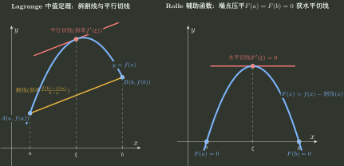

# 中值点与辅助函数构造

> 训练定位：训练“证明存在某个中值点/导数点”问题中，先审区间资格，再从目标式反推辅助函数、端点等值或零点结构。  
> 模型归属：[局部到整体_中值定理与函数形状.tex](局部到整体_中值定理与函数形状.tex)；中值定理、Rolle 链与区间存在性机制仍由该 Canonical 正文拥有，本文只维护题面路由与局部执行动作。

## 决策链

```text
目标存在式
→ 定理资格
→ 反推导数结构
→ 制造端点等值 / 零点
→ Rolle / Lagrange / Cauchy 链
→ 核对见证点区间与阶数
```

### 局部规则：中值定理先过资格门

**触发信号**：题目要求“存在 $\xi$”，或出现介值、Rolle、Lagrange、Cauchy、高阶导数零点。

**第一动作**：逐项列出闭区间连续、开区间可导、端点/零点条件、分母非零和中值点所在开区间；缺一项就暂停套定理。

**检查与退出**：端点连续不替代内部可导；Cauchy 比值式要额外核对分母。资格闭合后只调用最短定理链，不重复抄定理。

### 局部规则：存在点先回译成导数结构

**触发信号**：目标形如 $\Phi(\xi)=0$、$f'(\xi)=K$、两个函数导数的乘积/商或高阶导数等式。

**第一动作**：反推辅助函数 $F$，让 $F^{(k)}=m\Phi$ 且 $m$ 在目标区间不为零；同时设计可验证的端点等值或零点。

**检查与退出**：只找到原函数但没有制造等值点，不算闭环。目标已经由非零因子回推出时停止增加辅助函数复杂度。

### 局部规则：常数导数优先减割线

**触发信号**：要证存在 $\xi$ 使 $f'(\xi)=K$，且端点给出平均变化率。

**第一动作**：令 $K=(f(b)-f(a))/(b-a)$，构造 $F(x)=f(x)-f(a)-K(x-a)$，把目标改写为 Rolle 条件。

**检查与退出**：$K$ 必须来自端点割线，中值点只保证落在 $(a,b)$。若目标含两个函数或非线性分母，转入 Cauchy/商结构。



### 局部规则：Cauchy 中值定理先保留交叉式

**触发信号**：同时出现 $f,g$ 的端点差与导数比，或目标含 $A'B-AB'$。

**第一动作**：先写
$$
[f(b)-f(a)]g'(\xi)=[g(b)-g(a)]f'(\xi),
$$
只有分母非零资格明确后再改写成比值。

**检查与退出**：交叉式已直接命中目标时停止相除；不要为形式简洁额外制造分母条件。

### 局部规则：多个中值点先分割区间

**触发信号**：要求两个或多个不同的中值点，或要求明确先后顺序。

**第一动作**：先反推插点 $c$ 的函数值条件，用介值/零点定理证明 $c$ 存在，再在互不重叠的子区间分别调用中值定理。

**检查与退出**：同一区间重复使用定理不能保证见证点不同。若涉及中值点参数渐近或插值余项，转到 H-B02 的训练入口。

### 局部规则：高阶目标用零点与重零点计数

**触发信号**：要证 $F^{(n)}(\xi)=0$、统计导数根数，或给出多个等值/重根条件。

**第一动作**：按不同零点与导数消失条件计数，逐层记录 Rolle 产生的相邻开区间。

**检查与退出**：零点计数通常只给下界；重零点要有相应导数消失条件。达到目标阶数或根数下界即停；误差界与插值余项转 H-B02。

### 局部规则：一阶线性目标先试积分因子，把目标压成一个乘积导数

**触发信号**：目标含

$$
f'(\xi)+g(\xi)f(\xi)=0
$$

或乘一个非零因子后能化成这种形状。

**第一动作**：在当前合法区间取

$$
\mu(x)=\exp\left(\int g(x)\,dx\right),
$$

则

$$
[\mu(x)f(x)]'=\mu(x)[f'(x)+g(x)f(x)].
$$

于是问题从“猜辅助函数”变成“怎样让 $\mu f$ 在两个点取相同值”。例如要证存在 $\eta$ 使

$$
\eta f'(\eta)+2f(\eta)=0,\qquad \eta>0,
$$

先除以 $\eta$ 得 $f'+\frac2x f=0$，积分因子为 $x^2$，故辅助函数自然是

$$
F(x)=x^2f(x).
$$

**检查与退出**：积分因子只解决“导数结构”，不自动提供 Rolle 的两个等值点；端点值、零点或介值结构仍需独立建立。若除法会制造 $x=0$ 等非法点，先缩小到合法子区间或保持未除式。

### 局部规则：目标能看成一阶 ODE 时，可从“通解常数”反推辅助函数

**触发信号**：目标式把 $\xi$ 改写为变量 $x$ 后，是一个可解的一阶微分方程，而直接观察辅助函数困难。

**第一动作**：暂把目标等式当作对未知函数 $y$ 的微分方程，解出通解并把任意常数 $C$ 写成

$$
C=F(x,y(x)).
$$

这个“沿满足目标微分方程的轨道保持不变的量”就是候选辅助函数；随后把真实的 $f$ 代回，寻找两个等值点。

例如要证在 $a>0$ 时存在 $\xi\in(a,b)$ 满足

$$
f(\xi)=\frac{b-\xi}{a}f'(\xi),
$$

先把目标写成

$$
f'(x)=\frac{a}{b-x}f(x).
$$

分离变量得到

$$
f(x)(b-x)^a=C.
$$

于是取

$$
F(x)=f(x)(b-x)^a.
$$

若 $f(a)=0$ 且 $f$ 在 $[a,b]$ 连续，则 $F(a)=F(b)=0$，Rolle 直接给出目标点。

**检查与退出**：这不是“所有中值题都先解 ODE”。只有当目标本身形成简单一阶方程且反解出的常数明显简化边界设计时才采用；若通解比原目标更复杂，退回观察法/积分因子法。

### 局部规则：端点只有极限值时，先补连续延拓再用 Rolle

**触发信号**：函数只在 $(a,b)$ 可导，但给出

$$
\lim_{x\to a^+}f(x)=\lim_{x\to b^-}f(x)=A.
$$

**第一动作**：定义延拓

$$
F(a)=F(b)=A,\qquad F(x)=f(x)\ (a<x<b).
$$

两端有限极限保证 $F$ 在 $[a,b]$ 连续，于是 Rolle 给出某个 $\xi\in(a,b)$ 使 $f'(\xi)=0$。

**检查与退出**：必须是有限且相同的两端极限；若只有一端极限、两端极限不同或趋于无穷，不能用“补定义”伪造 Rolle 条件。

### 局部规则：无限区间的 Rolle 型问题先制造一个有限截断区间

**触发信号**：$f$ 在 $[a,+\infty)$ 连续、$(a,+\infty)$ 可导，并且

$$
\lim_{x\to+\infty}f(x)=f(a).
$$

**第一动作**：若 $f$ 恒等于 $f(a)$，结论显然；否则取一点 $x_0$ 使 $f(x_0)\ne f(a)$。利用无穷远极限，选足够大的 $R>x_0$，使 $f(R)$ 比 $f(x_0)$ 更靠近 $f(a)$。于是 $f$ 在有限区间 $[a,R]$ 上必有一个非端点的最大值或最小值点，Fermat 定理给出 $f'(\xi)=0$。

**检查与退出**：无限远不是一个可直接代入 Rolle 的“端点”。证明责任是先把无穷远信息转成某个有限 $R$ 上的内点极值。

一个典型变式是先构造差函数。若

$$
0\le f(x)\le \frac{x}{1+x^2},\qquad x\ge0,
$$

则 $f(0)=0$ 且 $f(x)\to0$。若希望得到

$$
f'(\xi)=\frac{1-\xi^2}{(1+\xi^2)^2},
$$

取

$$
G(x)=f(x)-\frac{x}{1+x^2};
$$

它满足 $G(0)=0$、$G(x)\to0$，再对 $G$ 使用上述无限区间 Rolle 型机制。

---

### 局部规则：直接积分不能替代边界设计

**触发信号**：想用 $F(x)=\int\Phi$ 证明存在 $\Phi(\xi)=0$，但尚未找到两个等值点或多个零点。

**第一动作**：把积分构造只当作候选辅助函数，同时独立设计边界等值/零点来源。

**检查与退出**：$F'=\Phi$ 不自动推出存在 Rolle 条件；若边界无法建立，退回割线、乘积、商或插值多项式结构。
