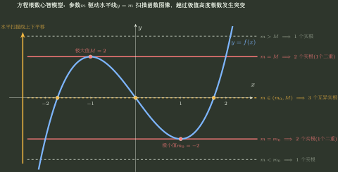

# 方程根与零点个数

> 训练定位：训练“方程有几个实根 / 至少有一个根 / 恰有若干根”问题，把方程先改写成函数零点，再用端点趋势、单调/极值、Rolle 与次数上限完成存在性、唯一性和计数。  
> 模型归属：[局部到整体_中值定理与函数形状.tex](局部到整体_中值定理与函数形状.tex) 负责介值、零点、Rolle 与函数形状机制；本文只维护零点计数题的题面路由与代表训练。

## 1. 根数题不是“解方程”，而是在研究一张函数形状图

统一入口：

$$
\text{方程 }A(x)=B(x)
\quad\Longrightarrow\quad
F(x)=A(x)-B(x),\qquad F(x)=0.
$$

随后把任务拆成三件不同的事：

1. **存在**：某区间两端异号或函数跨过 0；
2. **唯一**：该区间内 $F$ 严格单调，或导数只有足够少的零点；
3. **精确计数**：把定义域按奇点、临界点、参数事件分段，每段独立计数。

> **易错边界：** 零点定理只给“至少一个”；单调性才常用于把“至少一个”收紧成“恰好一个”。



---

## 2. 局部规则：先按定义域断点和临界点切区间

**触发信号**：函数含对数、分式、参数，或明显有多个单调区间。

**第一动作**：先列出：

- 定义域端点/奇点；
- $F'(x)=0$ 的临界点；
- 参数使临界点合并、端点值变号或极值恰好碰到 0 的事件。

这些点把实轴切成若干形状稳定的区间，再逐段判断。

**检查与退出**：不能跨过奇点使用介值定理；也不能在导数变号后继续声称全区间单调。

### 例：凹函数的“两根”结构

考虑

$$
\ln x=\frac{x}{e}-2\sqrt2,
\qquad x>0.
$$

令

$$
F(x)=\ln x-\frac{x}{e}+2\sqrt2.
$$

则

$$
F'(x)=\frac1x-\frac1e,
$$

所以 $F$ 在 $(0,e)$ 增、$(e,+\infty)$ 减；且

$$
\lim_{x\to0^+}F(x)=-\infty,\qquad
F(e)=2\sqrt2>0,\qquad
\lim_{x\to+\infty}F(x)=-\infty.
$$

因此左右两段各有且仅有一个零点，总共两个。

这个模型可以吸收“端点都在 0 下方、唯一极大值在 0 上方”的大量根数题。

---

## 3. 参数根数：参数真正控制的是“水平线与函数值域怎样相交”

### 局部规则：尽量把参数孤立成常数水平线

**触发信号**：方程中有参数 $a$，问不同 $a$ 时实根个数。

**第一动作**：若可行，改写成

$$
\Phi(x)=c(a),
$$

先研究 $\Phi$ 的值域、极值与单调分支，再让水平线 $y=c(a)$ 扫过图像。

例如

$$
a^x=x,\qquad a>0,\ x>0
$$

取对数得到

$$
\ln a=\frac{\ln x}{x}=\Phi(x).
$$

而

$$
\Phi'(x)=\frac{1-\ln x}{x^2},
$$

故 $\Phi$ 在 $(0,e)$ 增，在 $(e,+\infty)$ 减，最大值为 $1/e$。于是：

- $0<a<1$：$\ln a<0$，在 $(0,1)$ 恰有一根；
- $a=1$：恰有一根 $x=1$；
- $1<a<e^{1/e}$：水平线位于 $(0,1/e)$，有两根；
- $a=e^{1/e}$：在 $x=e$ 相切，恰有一根；
- $a>e^{1/e}$：无根。

所以“至少有交点”的充要条件为

$$
0<a\le e^{1/e}.
$$

**检查与退出**：参数阈值通常来自“极值刚好等于参数水平线”的相切事件，不应只代几个参数猜分类。

---

## 4. 奇点分隔出的每个区间：常用“端点无穷 + 单调”锁定一根

考虑

$$
F(x)=\sum_{k=1}^{100}\frac1{x-k}.
$$

在每个区间 $(j,j+1)$，$j=1,\dots,99$，有

$$
F'(x)=-\sum_{k=1}^{100}\frac1{(x-k)^2}<0,
$$

且

$$
\lim_{x\to j^+}F(x)=+\infty,\qquad
\lim_{x\to (j+1)^-}F(x)=-\infty.
$$

因此每个 $(j,j+1)$ 恰有一根，总共 $99$ 个实根。

### 局部规则：分式根数先让极点切开实轴

**触发信号**：若干简单极点之间求零点数量。

**第一动作**：每个极点都视为区间边界；在每个连续区间分别看单调性与两端无穷方向。

**检查与退出**：绝不能跨极点应用介值定理；计数后还要检查最左、最右两个无界区间是否可能另有根。

---

## 5. 系数条件看起来不像函数值：先积分/构造，让条件变成端点等值

### 局部规则：目标是多项式零点时，尝试把它当某个辅助函数的导数

**触发信号**：给出类似

$$
a_0+\frac{a_1}{2}+\cdots+\frac{a_n}{n+1}=0
$$

的系数条件，却要求证明

$$
p(x)=a_0+a_1x+\cdots+a_nx^n
$$

在 $(0,1)$ 有根。

**第一动作**：构造

$$
F(x)=a_0x+\frac{a_1}{2}x^2+\cdots+\frac{a_n}{n+1}x^{n+1}.
$$

则

$$
F'(x)=p(x),\qquad F(0)=0,\qquad F(1)=0.
$$

Rolle 定理立即给出某个 $\xi\in(0,1)$ 使 $p(\xi)=0$。

**检查与退出**：构造原函数的目的不是“看到多项式就积分”，而是把题干的系数条件翻译成可验证的端点等值。

---

## 6. 用 Rolle 计数：零点越多，导数零点至少越多

若 $F$ 有 $m$ 个互异实零点，则 $F'$ 至少有 $m-1$ 个互异实零点。反过来常用于根数上界：

- 若能证明 $F'$ 至多有 $r$ 个零点；
- 则 $F$ 至多有 $r+1$ 个互异零点。

对多项式，还可继续使用次数上限：$n$ 次非零多项式至多有 $n$ 个实根（计重数时总复根数为 $n$）。

### 局部规则：证明“恰有一个根”可以拆成“至少一个 + 不可能两个”

**触发信号**：直接证明全局单调困难，但 $F'$ 的零点结构容易控制。

**第一动作**：

1. 用介值/端点趋势先证明至少一根；
2. 假设有两根，则 Rolle 强迫 $F'$ 在中间有根；
3. 若这与 $F'$ 的符号或已知零点数量冲突，即得唯一性。

**检查与退出**：Rolle 反证唯一性时，需要两个不同根之间整个闭区间连续、开区间可导。

---

## 7. 一页调用压缩

```text
方程根数
→ 改成 F(x)=0
→ 先按定义域奇点 / F' 临界点 / 参数事件切区间
→ 每段：端点趋势给存在，严格单调给唯一
→ 参数题：尽量改成 Φ(x)=常数，研究水平线与值域
→ 分式多极点：每个极点单独切区间
→ 系数条件不像端点值：构造原函数，把条件变成 Rolle 边界
→ 精确根数不足：用 Rolle 把“F 的多根”运输成“F' 的更多根”，再结合次数/符号上限
```

最终检查不是“我找到了几个候选”，而是：**每个根的存在有证据，每个区间的唯一性有证据，没有漏掉定义域剩余区间。**
