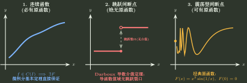

# 代数化反导与凑微分

> 训练定位：训练不定积分中先通过裂项、倒代换、消根、隐式参数化或“对复杂子表达式求导”把被积函数改写成有理/复合导数结构，再进入标准反导。  
> 模型归属：[一元累积：原函数、定积分与反常积分](一元累积_原函数定积分与反常积分.tex) 负责换元、原函数与有理积分机制；本文只维护“怎样把原式改写到可积表示”的训练路线。分部积分的降阶与自消另见 [分部积分的降阶与自消](分部积分的降阶与自消.md)，纯三角有理函数另见 [三角有理函数的降维](三角有理函数的降维.md)。

## 1. 决策地图：不是“看到复杂就换元”，而是先问能否降低代数层级

```text
不定积分
→ 真分式：部分分式 / 围绕分母改造分子
→ 分母次数远高于分子：比较直接裂项与 x=1/t
→ 反复出现同一根式：令整个根式或其最小生成量为新变量
→ 分子像某个复杂子式的导数：先把那个子式单独记为 u
→ 分母平方 / 复合商：反向检查一个简单商的导数
→ x,y 由隐式关系耦合：先用关系消掉一个变量或参数化，再积分
```

目标始终是同一个：

$$
\boxed{\text{把被积函数送进一个标准、封闭、可验证的反导空间}.}
$$



---

## 2. 有理函数：先做“多项式除法 → 因式分解 → 部分分式”

### 局部规则：部分分式之前先保证是真分式

**触发信号**：

$$
\int \frac{P(x)}{Q(x)}\,dx
$$

其中 $P,Q$ 为多项式。

**第一动作**：若 $\deg P\ge\deg Q$，先长除；再把 $Q$ 在实数范围分解成一次因子与不可约二次因子，按重数写部分分式模板。

例如

$$
\frac{30x^2+40x-50}{(x-2)^2(x^2+2x+2)}
$$

先写成

$$
\frac{A}{x-2}+\frac{B}{(x-2)^2}+\frac{Cx+D}{x^2+2x+2},
$$

再由代入特殊点或比较系数求 $A,B,C,D$。最后一项把分子拆成“分母导数 + 常数”，分别生成对数与反正切型原函数。

**检查与退出**：模板必须尊重因子重数；不可约二次因子的分子应为一次式。若分母已经具有明显的成对结构，机械展开全部待定系数未必成本最低，进入下一节。

---

## 3. 围绕分母改造分子：先找“导数方向”和“互补方向”

### 局部规则：分母有结构时，不必把所有系数都展开

**触发信号**：分母是 $1+x^{2m}$、$(1+x^m)^2$、$x^r(1+x^s)$ 等，分子与分母导数或低阶互补多项式有明显关系。

**第一动作**：尝试把分子写成

$$
A(x)Q'(x)+B(x),
$$

其中 $B$ 能与 $Q$ 因式分解后的对称结构配对。

**检查与退出**：若改造分子后仍需要比标准部分分式更多的未知系数或更高次展开，就退回长除/因式分解/部分分式；结构化裂项的收益必须体现在减少未知量或直接生成标准原函数。

### 代表结构：$1+x^4$ 家族

先因式分解

$$
1+x^4=(x^2+\sqrt2x+1)(x^2-\sqrt2x+1).
$$

而

$$
\frac{1+x^2}{1+x^4}
=\frac12\left(
\frac1{x^2+\sqrt2x+1}
+
\frac1{x^2-\sqrt2x+1}
\right).
$$

这样两个二次分母都只需配方后做反正切型积分。另一方面，

$$
\frac1{1+x^4}
=\frac12\left[
\frac{1+x^2}{1+x^4}
+
\frac{1-x^2}{1+x^4}
\right],
$$

第二项可通过对两个二次因子的对数导数做线性组合处理。

这里真正需要记住的不是一个 $1/(1+x^4)$ 闭式，而是：**对称四次分母往往先拆成两个配方二次式；分子 $1\pm x^2$ 是为这两个方向服务的。**

---

## 4. 倒代换：当高次主要堆在分母时，把“无穷远幂次”翻回来

### 局部规则：先预测 $x=1/t$ 后幂次是否真正下降

**触发信号**：分母次数明显高于分子，且同时出现 $x$ 与 $1+x^2$、$1+x^m$ 一类结构。

**第一动作**：令

$$
t=\frac1x,\qquad dx=-\frac{dt}{t^2},
$$

先只做幂次账本，看最高/最低幂是否变得更接近，再决定是否完整执行。

例如

$$
\int\frac{dx}{x^6(1+x^2)}
$$

在 $t=1/x$ 后变成

$$
-\int \frac{t^6}{t^2+1}\,dt,
$$

此时多项式除法立刻可用。

**检查与退出**：若倒代换后只是把一个高次有理式换成同样复杂的高次有理式，就退出。倒代换的价值是降层级，不是形式变化本身。

---

## 5. 根式：令“最小生成量”成为变量，而不是机械背代换表

### 局部规则：同一个根式反复出现时优先令整个根式为 $t$

**触发信号**：出现

$$
\sqrt{ax+b},\quad
\sqrt{\frac{ax+b}{cx+d}},\quad
\sqrt{ae^x+b},\quad
\sqrt{\frac{ae^x+b}{ce^x+d}}
$$

并在多个位置重复出现。

**第一动作**：令整个根式等于 $t$，反解出 $x$ 或 $e^x$，检查其余部分能否全部变成有理函数。

例如若

$$
t=\sqrt{\frac{1+x}{x}},
$$

则

$$
t^2=1+\frac1x,\qquad x=\frac1{t^2-1}.
$$

此后若原积分还有 $\ln(1+t)$ 一类非代数因子，不要执着于把 $dx$ 展开后硬积；可能应转到分部积分路线。

**检查与退出**：换元成功标准仍是旧变量被完整消除。若反解产生多分支，必须使用原积分定义域锁定 $t$ 的合法范围。

---

## 6. “对复杂部分求导”：其实是在反向寻找链式法则

### 局部规则：分子陌生时，先试着对分母内部或最复杂子式求导

**触发信号**：分母/根号内出现一个复杂组合 $u(x)$，分子看似杂乱却与 $u'(x)$ 接近。

**第一动作**：把 $u(x)$ 单独写出来并求导，再看是否只差一个可修正的简单因子。

### 例 1：复杂根号其实是反双曲/反三角母型

对

$$
\int \frac{\ln x}{\sqrt{1+[x(\ln x-1)]^2}}\,dx,
$$

令

$$
u=x(\ln x-1).
$$

则

$$
u'=\ln x,
$$

所以原积分直接变成

$$
\int\frac{du}{\sqrt{1+u^2}},
$$

无需对整式做任何展开。

### 例 2：分母平方时反向猜“一个商的导数”

对

$$
\int\frac{1-\ln x}{(x-\ln x)^2}\,dx,
$$

若只盯着 $u=x-\ln x$，会发现 $u'=1-1/x$ 与分子不匹配。此时检查简单商

$$
\frac{x}{x-\ln x}.
$$

直接求导：

$$
\left(\frac{x}{x-\ln x}\right)'
=
\frac{x-\ln x-x(1-1/x)}{(x-\ln x)^2}
=
\frac{1-\ln x}{(x-\ln x)^2}.
$$

因此

$$
\int\frac{1-\ln x}{(x-\ln x)^2}\,dx
=
\frac{x}{x-\ln x}+C.
$$

**检查与退出**：不要把“对复杂部分求导”变成无方向试错。优先试：分母内部、指数内部、根号内部、分母的一次幂商；若都不降低复杂度，再回到裂项/分部。

---

## 7. 复合模板不是背答案，而是识别一个新变量

若出现

$$
\frac{1+x f'(x)}{x(1+x e^{f(x)})},
$$

注意

$$
u=x e^{f(x)},\qquad
u'=e^{f(x)}[1+x f'(x)].
$$

于是乘分子分母以 $e^{f(x)}$ 后，积分变成

$$
\int\frac{u'}{u(1+u)}\,dx
=
\int\frac{du}{u(1+u)}.
$$

最后得到

$$
\ln\left\lvert\frac{u}{1+u}\right\rvert+C
=
\ln\left\lvert\frac{x e^{f(x)}}{1+x e^{f(x)}}\right\rvert+C.
$$

这里可迁移的是“**先寻找一个其导数恰好覆盖分子的复合对象**”，不是记住某个含 $e^{f(x)}$ 的出题模板。

---

## 8. 隐函数积分：先用隐式关系降维，再谈反导

### 局部规则：$x,y$ 同时出现且由一条代数关系约束时，先选一个参数统一表示

**触发信号**：积分写成 $\int R(x,y)\,dx$，同时题目给 $F(x,y)=0$，但没有显式 $y(x)$。

**第一动作**：寻找一个天然组合 $z=z(x,y)$，使隐式方程能把 $x,y$ 都表示为 $z$ 的有理函数。

例如

$$
x(y-x)^2=y.
$$

令

$$
z=y-x.
$$

则 $y=x+z$，代入得

$$
xz^2=x+z,
$$

所以

$$
x=\frac{z}{z^2-1},\qquad y=\frac{z^3}{z^2-1}.
$$

因此

$$
\int\frac{1}{y-x}\,dx
=
\int\frac1z\,d\!\left(\frac{z}{z^2-1}\right),
$$

已经降成纯有理积分；后续只需普通部分分式。

**检查与退出**：参数化必须限定在隐式曲线的合法分支上；若 $z^2=1$ 等点使表达式失效，要回到原关系判断这些点是否属于当前分支。不要把“隐函数积分”误认为必须先显式解出 $y(x)$。

---

## 9. 一页调用压缩

```text
不定积分难以直接识别
→ 有理式：长除 → 因式分解 → 部分分式
→ 分母有对称结构：围绕 Q' 与互补分子改造
→ 分母幂次过高：先预测 x=1/t 是否降阶
→ 重复根式：令最小生成根式为变量
→ 分子像复杂子式导数：反向找链式法则
→ 分母平方：检查一个简单商的导数
→ 隐式 x,y：先用约束参数化到单变量
→ 每次变换后检查旧变量是否完全消失、分支是否仍合法
```
