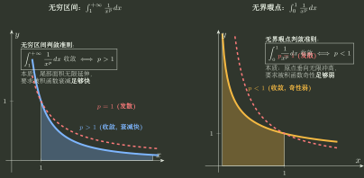

# 反常积分拆点与判敛

> 训练定位：训练面对无穷区间或无界被积函数时，先定位所有异常端点并拆成独立截断极限，再选择比较尺度判断每一段是否收敛。  
> 模型归属：[一元累积：原函数、定积分与反常积分](一元累积_原函数定积分与反常积分.tex) 负责反常积分定义、截断与判敛机制；本文只负责题面识别、第一动作、比较对象选择和错误阻断。

## 1. 反常积分的本体不是“特殊积分公式”，而是极限

看到

$$
\int_a^{+\infty}f(x)\,dx
$$

第一步不是直接写原函数在 $+\infty$ 的值，而是还原成

$$
\lim_{R\to+\infty}\int_a^R f(x)\,dx.
$$

若区间内部有瑕点 $c$，必须拆成两段独立极限：

$$
\int_a^b f(x)\,dx
=
\int_a^c f(x)\,dx+
\int_c^b f(x)\,dx,
$$

并要求两边分别收敛。

> **易错边界：** 左右两边的发散不能靠“正负抵消”伪装成普通反常积分收敛；那会进入主值等另一种对象。

---

## 2. 局部规则：第一动作永远是找全异常点

**触发信号**：积分区间无穷、分母可能为 0、对数/根式端点导致函数无界，或题目直接问反常积分。

**第一动作**：列出：

- 无穷端点；
- 区间端点瑕点；
- 区间内部瑕点。

按这些点把积分切开，每段只保留一个异常端。

**检查与退出**：只要有一段发散，原反常积分立即发散；不要继续计算其他段试图“补回来”。

---

## 3. 两个最基本的幂尺度必须分清端点方向

### 无穷远

$$
\int_A^{+\infty}\frac{dx}{x^p}
$$

收敛当且仅当

$$
p>1.
$$

### 有限瑕点

$$
\int_0^A\frac{dx}{x^p}
$$

收敛当且仅当

$$
p<1.
$$

它们的阈值方向相反，不是两个公式偶然不同，而是“尾部长度无限”和“局部奇性强度”在竞争不同尺度。



---

## 4. 局部规则：复杂正函数先比较主导奇性/尾部

**触发信号**：被积函数非负或最终非负，无法轻易直接积分，但在异常端可以看出主导项。

**第一动作**：找一个已知基准 $g(x)>0$，计算

$$
\lim\frac{f(x)}{g(x)}.
$$

若极限为正有限常数，则两者同敛散；若为 0 或 $+\infty$，按大小方向结合已知基准使用比较。

**检查与退出**：比较必须在异常端的某个邻域最终成立；有限区间中远离瑕点的部分通常只是普通积分，不参与敛散决定。

---

## 5. 对数修正：先认出真正临界层

典型无穷远模型

$$
\int_A^{+\infty}\frac{dx}{x(\ln x)^p},\qquad A>1
$$

收敛当且仅当 $p>1$。

训练时不要把它孤立背诵；令

$$
t=\ln x,\qquad dt=\frac{dx}{x},
$$

它直接变成

$$
\int_{\ln A}^{+\infty}\frac{dt}{t^p}.
$$

所以这是普通 $p$ 型尾积分经过对数坐标重表达。

---

## 6. 局部规则：奇偶性只能在积分已经存在以后使用

**触发信号**：区间为 $(-\infty,+\infty)$ 或两侧都有瑕点，同时被积函数是奇函数/偶函数。

**第一动作**：先分别检查左右半轴反常积分是否收敛。

**检查与退出**：只有普通反常积分存在时，才能利用奇偶性简化。不能因为形式上奇函数就直接写积分为 0。

例如

$$
\int_{-\infty}^{+\infty}\frac1x\,dx
$$

不能按“奇函数积分为 0”处理为普通收敛积分。

---

## 7. 局部规则：能算出原函数不等于反常积分收敛

**触发信号**：原函数闭式很容易得到。

**第一动作**：仍然保留截断参数 $R$ 或 $\varepsilon$，最后计算相应极限。

**检查与退出**：若极限不存在或无穷，即使不定积分公式完全正确，也必须判发散。

反过来，某些反常积分没有初等原函数，也可以通过比较直接判敛。

$$
\boxed{\text{可积出闭式}\ne\text{反常积分收敛}.}
$$

---

## 8. 无界函数不等于必发散

局部奇性强弱才是关键。例如在 $0$ 附近：

$$
\frac1{\sqrt x}
$$

无界，但

$$
\int_0^1\frac{dx}{\sqrt x}<\infty.
$$

而

$$
\frac1x
$$

则发散。

所以看到“函数无界”只能触发**反常积分对象识别**，不能直接给出敛散答案。

---

## 9. 多个异常端给参数条件：分别判，再取条件交集

### 局部规则：参数反常积分不能只盯一个“最危险端点”

**触发信号**：同一积分同时有有限瑕点与无穷端点，参数出现在幂次/对数中。

**第一动作**：给每个异常端单独建立局部等价尺度，写出各自收敛条件，最后取交集。

例如

$$
I=\int_0^{+\infty}\frac{dx}{x^a(1+x)^b}.
$$

在 $x\to0^+$ 时，

$$
\frac1{x^a(1+x)^b}\sim\frac1{x^a},
$$

故 0 端要求

$$
a<1.
$$

在 $x\to+\infty$ 时，

$$
\frac1{x^a(1+x)^b}\sim\frac1{x^{a+b}},
$$

故无穷远要求

$$
a+b>1.
$$

所以原积分收敛当且仅当

$$
\boxed{a<1,\qquad a+b>1.}
$$

这里并不要求 $b>1$；$b$ 单独多大不是无穷远的真实尺度，真正控制尾部的是总幂次 $a+b$。

**检查与退出**：每个端点得到的是独立必要条件。不能把 0 端的 $p<1$ 与无穷远的 $p>1$ 混成同一个公式，也不能只验证一个端点后就宣布整体收敛。

---

## 10. 反常积分与级数的接口

正项反常积分与正项级数共享同一类尾部比较直觉：

$$
\boxed{\text{截断对象}\to\text{尾部尺度}\to\text{比较基准}\to\text{敛散}.}
$$

但不要混用结论条件。连续对象的积分判别需要最终正、连续、单调等相应资格；具体接口由 H-B04 负责。

---

## 11. 一页调用链

```text
反常积分
→ 找全无穷端/瑕点
→ 每段只留一个异常端
→ 写截断极限
→ 能直接算就算极限
→ 不能直接算：找 p 型/对数型等主导尺度比较
→ 每段分别判
→ 一段发散则整体发散
```

核心条件反射：

$$
\boxed{\text{先把“无限”还原成合法极限，再讨论积分计算}.}
$$
