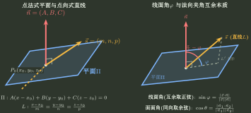

# 空间几何表示与关系判定

> 训练定位：训练空间题的对象识别、表示选择、方向/位置分层、角度距离与几何回代；规则迁移自旧 Subject Rules，尚待陌生题验证。
>
> 模型归属：[空间对象与方向表示.tex](空间对象与方向表示.tex)；空间对象、表示与几何关系的理论机制仍由该 Canonical 正文拥有，本文只维护局部训练动作。

## 决策地图

```text
对象身份 -> 表示选择 -> 几何载体 -> 方向关系 -> 位置关系 -> 不变量回代
```

### 局部规则：先辨认对象，再读方程

**触发信号**：题目给出点、参数式、一般式、隐式曲面或多个方程，并要求关系、交点、角度、距离或构造。

**第一动作**：标出对象是点、线、面、曲线、曲面还是区域，再判断方程是在生成点还是施加约束。

**检查与退出**：等式曲面与不等式区域不能混用。对象与目标锁定后再选表示；仍不清楚时先代入测试点/参数。

### 局部规则：表示按当前操作分流

**触发信号**：同一对象同时可写成参数式、一般式、隐式式或两平面联立式。

**第一动作**：生成动点/求交优先参数式；判断归属/提取法向优先一般式或隐式式；为积分准备时优先保留参数化。

**检查与退出**：换表示不能丢参数范围、分支与覆盖次数。某种表示已直接完成当前操作时停止改写。

### 局部规则：先找几何载体，再翻译关系

**触发信号**：出现平行、垂直、夹角、距离、共面、共同法向或构造未知线/面。

**第一动作**：分别标出位移向量、直线方向向量与平面法向量；必要时用叉积生成共同法向。

**检查与退出**：方向向量和法向量角色不同；非零倍数代表同一方向类。载体足够后只保留最短向量约束。

### 局部规则：方向关系与位置关系分两层

**触发信号**：问两直线垂直/相交、线面平行/包含或对象是否重合。

**第一动作**：先用点积/叉积判断方向，再通过代入或联立检查公共点与包含关系。

**检查与退出**：方向正交不等于相交；线方向平行于平面还需判断线上的点是否在平面。两层都通过后才能写几何结论。

### 局部规则：角度先定位方向载体

**触发信号**：求两线、两面或线面夹角。

**第一动作**：两线取方向，两面取法向，线面用方向与法向的互余关系；按题意用绝对值取得锐角。

**检查与退出**：结果要落在规定角度范围。点积已给目标角时，不为角度题额外求交点。



### 局部规则：距离从垂直分量生成

**触发信号**：求点线面、平行对象或异面直线距离。

**第一动作**：点面用法向投影，点线用叉积面积除底，异面线用混合积体积除底面积。

**检查与退出**：距离非负，方向/法向不得为零；异面线先排除平行和共面。平行对象优先降成点到对象距离。

### 局部规则：标准曲面按“对称—截面—轴向变化”重建

**触发信号**：给出二次曲面方程，要求识别图形、投影或积分区域。

**第一动作**：先看缺项与对称性，再固定一个坐标看二维截面，最后判断截面随参数的变化。若是带交叉项的中心二次曲面，再考虑调用线性代数中的正交对角化；不要把一般可逆换元误说成保持欧氏形状。

**检查与退出**：缺少一个变量常表示沿该轴柱面延伸；等式与实体不等式必须区分。典型截面和存在范围已确定即可停止画图。

### 局部规则：空间投影先分清“投影柱面”和“投影曲线”

**触发信号**：空间曲线/直线投影到坐标平面或一般平面，题目要求投影方程。

**第一动作**：先写投影方向。投到 $xOy$ 时从原曲线方程中消去 $z$，得到只含 $x,y$ 的影子条件；若投到一般平面，则用原对象与投影方向构造辅助面，再与目标平面求交。

**检查与退出**：只含 $x,y$ 的方程在三维空间中表示平行于 $z$ 轴的投影柱面；真正位于 $xOy$ 的投影曲线还必须附加 $z=0$。目标平面约束已补齐且任一点都能追溯到原对象后停止。

### 局部规则：旋转曲面先写轴向坐标与到轴距离不变量

**触发信号**：平面曲线、空间直线或参数曲线绕坐标轴旋转，要求旋转曲面方程。

**第一动作**：引入原对象对应点 $P_0$。绕 $z$ 轴时先写 $z=z_0$ 与 $x^2+y^2=x_0^2+y_0^2$，再联立原对象方程消去 $P_0$ 的坐标。

**检查与退出**：旋转前后必须处在同一轴向截面，且到旋转轴距离相等；最后固定轴向坐标看截面应为圆。两条不变量和原对象约束已经闭合后，不再背额外旋转公式。

### 局部规则：完成后做几何回代

**触发信号**：已经求出直线、平面、交点、参数曲线或旋转曲面。

**第一动作**：至少执行一次代回对象方程、点积/叉积复核、参数范围或截面形状检查。

**检查与退出**：验证几何对象、方向类与不变量，而不是比较字面形式。独立验证通过后停止代数化简；失败则回到对象识别或表示选择。
