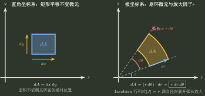

# 二重积分区域、坐标与换序

> 训练定位：面对二重积分时，训练从真实区域出发选择扫描方向、坐标系、对称化与换序路线，避免把“交换积分次序”误成机械交换 `dx,dy`。  
> 模型归属：[高维累积：区域、坐标与 Jacobian](高维累积_区域坐标与Jacobian.tex) 负责区域编码、换序、坐标变换与 Jacobian 的理论机制；本文只负责题目识别、第一动作、局部技巧与检查。

## 1. 问题表示：先解决“区域怎么被编码”，再解决“积分怎么算”

二重积分题真正同时给了两个对象：

$$
\boxed{\text{区域 }D + \text{局部贡献 }f(x,y)}.
$$

计算困难通常来自三种来源：

1. 区域用当前扫描方向不好写；
2. 被积函数在当前变量顺序下难积；
3. 区域和被积函数存在可以消掉计算量的对称/坐标结构，但尚未被暴露。

所以拿到题先不要问“先积 $x$ 还是 $y$”，而问：

```text
区域长什么样？
→ 哪种表示最省边界？
→ 哪个变量放内层最容易消掉？
→ 有无对称/平移/旋转结构可以先降维？
```

> **待补图｜二重积分_同一区域两种扫描**：用一个必须分段的非矩形区域同时画竖直扫描与水平扫描，明确“换序保持几何区域不变，只改变入口/出口函数”；图中不得选上下左右完全对称区域，避免误以为换序只对对称域方便。

---

## 2. 局部规则：任何二重积分先恢复区域

**触发信号**：题面直接给累次积分、积分上下限相互含变量，或要求换序/改变积分次序。

**第一动作**：先检查内层积分限是否始终按“较小边界 $\to$ 较大边界”排列；若存在反向区间，先用一元定积分的方向性提出负号。完成有向归一化后，再把积分限翻译成不等式，求边界交点并画出 $D$；标出当前扫描线的入口和出口。

**检查与退出**：若两条边界在外层区间内发生交换，必须先在交点处分段；带符号的累次积分不能直接等同于一个无向几何区域。若区域已经是简单矩形且当前内层积分直接可算，不为了“画图完整”强行换序；若换扫描方向后入口/出口函数需要分段，必须按真实几何分段，不能只交换积分符号。

### 反向积分限：先恢复方向，再恢复区域

若在某个外层区间上 $\phi_1(x)\le\phi_2(x)$，则

$$
\int_{\phi_2(x)}^{\phi_1(x)}f(x,y)\,dy
=-\int_{\phi_1(x)}^{\phi_2(x)}f(x,y)\,dy.
$$

这里负号来自一元定积分的方向，不表示“几何区域有负面积”。若 $\phi_1,\phi_2$ 在区间内相交，先按交点切开外层区间，再分别归一化各段；否则直接把上下限翻译成区域会把符号和几何对象混在一起。

### 最小检查

原式若为

$$
\int_a^b\int_{\phi_1(x)}^{\phi_2(x)}f(x,y)\,dy\,dx,
$$

至少先读成

$$
D=\{(x,y):a\le x\le b,\ \phi_1(x)\le y\le\phi_2(x)\}.
$$

换序后真正要做的是重新描述同一个集合：

$$
D=\{(x,y):c\le y\le d,\ \psi_1(y)\le x\le\psi_2(y)\}.
$$

---

## 3. 局部规则：内层难积时先攻击扫描方向

**触发信号**：内层出现没有初等原函数、积分后明显变复杂，或外层变量本来可以把某个表达式视为常数。

**第一动作**：回到区域图，尝试换成另一方向扫描，让“难变量”从内层移到外层，或让内层只剩多项式/常数长度。

**检查与退出**：换序后若边界被拆成更多段且总计算反而更长，立即比较原路线与换序路线的复杂度，不把“换序”当必胜技巧。

### 关键直觉

换序的收益不是来自

$$
dx\,dy\leftrightarrow dy\,dx,
$$

而是来自：

$$
\boxed{\text{改变哪一个变量承担“积分动作”，哪一个变量暂时只承担“参数”身份}.}
$$

---

## 4. 局部规则：对称性必须同时审计区域与被积函数

**触发信号**：区域关于坐标轴、原点、直线 $y=x$、圆心或平移后的中心对称；被积函数含奇偶结构、$x/y$ 轮换结构。

**第一动作**：先写“哪个变换保持区域不变”，再看被积函数在该变换下保持、变号还是互换：

$$
S(D)=D,
\qquad
f\circ S=\pm f\ \text{或变成另一个可配对项}.
$$

**检查与退出**：区域对称但被积函数不按对应变换响应，不能套奇零偶倍；函数奇偶但区域不对称，同样不能套。轮换对称必须检查 $D$ 在 $(x,y)\leftrightarrow(y,x)$ 下真的保持不变。

### 常见压缩

若 $D$ 关于 $y$ 轴对称，且

$$
f(-x,y)=-f(x,y),
$$

则积分为零。

若 $D$ 在交换 $x,y$ 后不变，则

$$
\iint_D f(x,y)\,dA
=
\iint_D f(y,x)\,dA.
$$

因此遇到

$$
f(x,y)+f(y,x)
$$

常可成对处理。

---

## 5. 局部规则：坐标系选择看“区域 + 被积函数”的共同结构

**触发信号**：圆、扇形、圆环、$x^2+y^2$、$\sqrt{x^2+y^2}$、角度限制，或平移后出现这些结构。

**第一动作**：同时比较两件事：

1. 新坐标能否显著简化区域；
2. 新坐标能否显著简化被积函数。

只有一边变简单而另一边急剧变复杂时，不自动换坐标。

**检查与退出**：极坐标必须写

$$
dA=r\,dr\,d\theta.
$$



若圆心不在原点，先判断平移

$$
u=x-a,\qquad v=y-b
$$

能否把区域搬回中心；平移后被积函数也必须同步改写。

### 极坐标不是“看到圆才换”

圆、圆环、$x^2+y^2$、$y/x$ 是强信号，但不是必要条件。更稳的判断是：

$$
\boxed{\text{新坐标线是否同时贴合边界族，并简化 }f\cdot dA.}
$$

例如三角域、比例边界或非圆形区域，只要极坐标把边界变成简单的 $r$ / $\theta$ 约束，同时让被积函数明显降复杂度，就值得使用。反过来，即便看见圆，若角度范围或函数变得更复杂，也不必强换。

#### 局部规则：先识别“边界家族”，再决定坐标

**触发信号**：边界成对出现为 $\phi(x,y)=c_1,c_2$ 和 $\psi(x,y)=d_1,d_2$。

**第一动作**：优先考虑

$$
u=\phi(x,y),\qquad v=\psi(x,y),
$$

看能否把区域拉成近似矩形。

**检查与退出**：继续检查 Jacobian、逆像分支、覆盖次数和 $f\cdot dA$ 的复杂度；只有区域变简单但函数爆炸时，不应机械采用。

---

## 6. 局部规则：先检查能否降维，再开始重积分计算

**触发信号**：被积函数只依赖一个变量、区域截面长度容易写、积分中出现与某方向无关的常数，或对称性可以先消去一部分。

**第一动作**：尝试把二重积分解释为“截面长度 × 局部值”的一维积分：

$$
\iint_D g(x)\,dA
=
\int g(x)\cdot\bigl[\text{固定 }x\text{ 时的 }y\text{ 截面长度}\bigr]\,dx.
$$

**检查与退出**：截面长度若必须多次分段，先比较另一方向；若最终仍需完整二重积分，停止继续寻找“神奇降维”。

### 一元外积分里嵌变限积分：必要时把它恢复成二维区域

**触发信号**：目标写成一元外积分，但 integrand 本身含随外变量变化的积分，例如

$$
I=\int_a^b\left[\int_{\alpha(x)}^{\beta(x)}F(x,t)\,dt\right]dx.
$$

**第一动作**：把它识别为区域

$$
D=\{(x,t):a\le x\le b,\ \alpha(x)\le t\le\beta(x)\}
$$

上的二重积分，再比较换序后是否能消掉困难的变上限或不可积结构。变限积分本身的求导与正则性机制仍由 Topic05 / H-B03 拥有；这里只负责把“嵌套累积”恢复成二维区域并选择扫描方向。

**检查与退出**：只有当换序确实减少分段或降低内层复杂度时才抬成二重积分；如果原一元结构已经可直接处理，就不要为了升维而升维。恢复二维区域后仍要执行同一套入口/出口与覆盖检查。

---

## 7. 分段密度与参数边界：先找“表达式切换线”

### 7.1 绝对值、$\min$、$\max$ 先解切换方程

**触发信号**：被积函数含 $\lvert g(x,y)\rvert$、$\min\{f,g\}$、$\max\{f,g\}$、取整函数。

**第一动作**：先求内部切换界面

$$
g(x,y)=0,\qquad f(x,y)=g(x,y),
$$

再看这些界面如何切割原区域。

**检查与退出**：若切换界面与区域对称结构吻合，先用对称配对减少分区；不能只按原区域外边界积分，因为同一子域内公式可能已经改变。

### 7.2 参数方程给边界，不等于参数天然是二维坐标

**触发信号**：区域边界由 $x=x(t),y=y(t)$ 给出。

**第一动作**：先确定扫描方向，把边界暂时看成入口/出口；只有在真正做一维换元时再把 $x,y$ 改写成参数 $t$ 并同步换限。

**检查与退出**：若想把参数直接提升为二维变量变换的一部分，必须补另一个独立坐标并检查 Jacobian 与一一覆盖。

---

## 8. 区域本身可选时：先看被积函数在哪里贡献为正

### 局部规则：区域可自由选取时，把“选域”转成点态贡献判断

**触发信号**：题目定义 $I(D)=\iint_D f(x,y)\,dA$，允许在某个母区域内选择积分区域 $D$，要求最大值/最小值；或者 Green 公式后得到这类“区域选择”问题。

**第一动作**：先找 $f=0$ 的分界，标出正值区 $D_+$ 与负值区 $D_-$。若题目没有额外面积/形状约束，且 $D_+$ 本身满足可行性要求，则最大化优先取全部正值区，最小化优先取全部负值区。

**检查与退出**：这条规则依赖“局部小块可以自由加入或删除”。若题目要求固定面积、必须属于某个参数族、连通/单连通且正值区不满足、或只能从有限个候选域中选，立即退出点态选域法，回到真正的约束优化。$f=0$ 的边界加入与否不改变积分值。

### 为什么成立

若某个小块上 $f>0$，把它加入积分域会增加积分；若某个小块上 $f<0$，把它删掉会增加积分。因此最优区域由局部贡献的符号生成，而不是靠猜几何形状。

---

## 9. 双重求和极限：先恢复二维小网格

**触发信号**：出现 $1/n^2$、$i/n$、$j/n$、双重求和，或索引满足 $j\le i$、$j\le 2i$ 一类区域约束。

**第一动作**：把

$$
x=\frac{i}{n},\qquad y=\frac{j}{n}
$$

作为采样坐标，确认每项能否写成

$$
f(x_i,y_j)\,\Delta A.
$$

然后把索引不等式翻译成极限区域 $D$。

**检查与退出**：三角形索引域不能机械补成矩形；若网格步长不是同一个 $1/n$，要单独恢复 $\Delta x\Delta y$。

---

## 10. 用二重积分证明一维积分不等式：先把乘积放进同一个正方形

**触发信号**：目标含 $\int f\cdot\int g$ 与 $\int fg$ 的比较，且题目给出单调性。

**第一动作**：重写

$$
\left(\int_a^b f(x)\,dx\right)
\left(\int_a^b g(y)\,dy\right)
=
\iint_{[a,b]^2}f(x)g(y)\,dx\,dy.
$$

再利用 $(x,y)\leftrightarrow(y,x)$ 对称，把差值整理成

$$
(f(x)-f(y))(g(x)-g(y)).
$$

**检查与退出**：单调方向决定乘积差的符号；若两函数反向单调，不等号方向也会反转。证明目标不是“硬算二重积分”，而是制造一个点态定号的被积函数。

---

## 11. 旧笔记中保留下来的局部技巧

这些技巧只在当前问题族附近使用，不晋升学科级规则。

### 10.1 平移坐标中心

若区域围绕 $(a,b)$ 呈现圆/椭圆/中心对称结构，先试

$$
u=x-a,\qquad v=y-b.
$$

平移的 Jacobian 为 1。真正收益是把隐藏的奇偶/径向结构移回原点。

### 10.2 一元积分方法可以向内层迁移

换序、换坐标仍不能简化时，内层积分可以继续调用一元积分的：

- 换元；
- 分部积分；
- 对称；
- 几何意义。

但迁移顺序应是：**先把区域编码选好，再对内层做一元技巧**。否则可能在错误表示上优化局部计算。

### 10.3 极坐标中的 $r$ 是局部面积尺度，不是附加口诀

不要只记“极坐标最后乘 $r$”。它来自坐标网格局部面积变化。若以后换成一般变量变换，应该自然升级为

$$
\left\lvert\frac{\partial(x,y)}{\partial(u,v)}\right\rvert.
$$

---

## 12. 易错边界

| 表面动作 | 错误原因 | 正确检查 |
|---|---|---|
| 直接交换 $dx,dy$ | 没有重写同一区域 | 重新画域并读入口/出口 |
| 区域对称就把奇函数积分写 0 | 函数与区域没有共同变换 | 同时检查 $S(D)=D$ 与 $f\circ S=-f$ |
| 看见圆就极坐标 | 被积函数或角度范围可能更复杂 | 比较区域和函数的共同简化收益 |
| 极坐标漏 $r$ | 面积微元没有搬运 | 每次换坐标单独写 Jacobian |
| 平移区域却不改函数 | 只搬了边界，没有搬整个积分对象 | 区域、函数、微元同步变换 |
| Jacobian 非零就认为可全局换元 | 只得到局部可逆信息 | 继续检查分支与覆盖次数 |
| 先做一大串积分再发现可对称 | 顺序反了 | 先结构降维，后计算 |

---

## 13. 一页调用链

```text
二重积分
→ 恢复真实区域 D
→ 看区域 × 被积函数的共同结构
→ 比较：原扫描 / 换序 / 对称 / 平移 / 极坐标 / 一般换元
→ 写新边界 + 微元
→ 先降维再积分
→ 检查覆盖、Jacobian、符号、数量级
```

真正要形成的条件反射不是“二重积分先积分”，而是：

$$
\boxed{\text{先选一个不丢区域信息、又让计算最简单的表示}.}
$$
