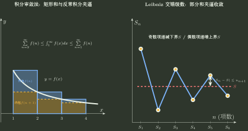

# 级数判敛路线

> 训练定位：训练面对具体或抽象数项级数时，先识别项的符号与主导尺度，再按最低成本选择判敛工具，并在判别法失效时知道如何换路。  
> 模型归属：[数项级数：尾部与敛散](数项级数_尾部与敛散.tex) 负责部分和、尾部、正项尺度、绝对/条件收敛与判别法的理论机制；本文只负责题目识别、局部路线与错误阻断。

## 1. 问题表示：判敛不是“背判别法”，而是寻找尾部机制

面对

$$
\sum_{n=1}^{\infty}u_n,
$$

先问的不是“能不能比值”，而是：

1. $u_n$ 最终有没有可能趋于 $0$；
2. 项最终同号，还是存在抵消；
3. 绝对值的主导尺度像哪个基准级数；
4. 当前方法若给出临界值，下一条信息从哪里来。

压缩为：

```text
必要条件筛选
→ 符号/抵消分流
→ 主导尺度识别
→ 选择判别器
→ 临界/失效时换路
→ 尾部或余项复核
```

---

## 2. 局部规则：第一眼先查通项，而不是先做复杂变形

**触发信号**：任何要求判断数项级数敛散性的题。

**第一动作**：先算或判断

$$
\lim_{n\to\infty}u_n.
$$

若极限不存在或不为 $0$，立即判发散并停止。

**检查与退出**：若 $u_n\to0$，只说明通过必要条件，绝不能写“所以收敛”；立即进入正项/一般项分流。

> **易错边界：** “通项趋零”是必要筛选器，不是收敛生成器。调和级数是最小反例。

---

## 3. 局部规则：正项级数先找可比较的尺度

**触发信号**：$u_n\ge0$ 最终成立，或取绝对值后进入正项级数。

**第一动作**：识别组成 $u_n$ 的主要增长对象：

- 幂 $n^p$；
- 对数 $(\ln n)^q$；
- 指数 $a^n$；
- 阶乘 $n!$；
- $n^n$；
- 含 $\sin(1/n)$、$\ln(1+1/n)$ 等趋零初等结构。

把复杂项压到熟悉基准：

$$
\frac1{n^p},\qquad
\frac1{n(\ln n)^q},\qquad
q^n,
$$

或已知可判级数。

**检查与退出**：如果直接比较不容易，但比值趋向一个正有限常数，转极限比较；若含阶乘/指数竞争，优先比值；整体带 $n$ 次幂时优先根值。判别结果为临界值 $1$ 时立即退出该方法，不继续“多算几步比值”祈祷它改变结论。

### 工具选择不是口诀，而是结构匹配

| 题面结构 | 优先考虑 | 为什么 |
|---|---|---|
| 与 $1/n^p$、$1/[n(\ln n)^q]$ 同量级 | 比较 / 极限比较 | 直接读取尾部尺度 |
| 阶乘、指数连续相邻项关系明显 | 比值判别 | $u_{n+1}/u_n$ 大幅消去 |
| 整体为 $n$ 次幂 | 根值判别 | $\sqrt[n]{u_n}$ 直接剥掉幂 |
| $u_n=f(n)$ 且 $f$ 正、连续、最终递减 | 积分判别 | 连续尾面积与离散尾部可比较 |
| 初等函数作用在 $1/n$ 等小量上 | 等价/展开后比较 | 先找主导项，再判已知级数 |



---

## 4. 局部规则：一般项先问“绝对值是否已经解决问题”

**触发信号**：$u_n$ 有正有负、复合振荡，或不是最终正项。

**第一动作**：先看

$$
\sum \lvert u_n\rvert.
$$

若绝对收敛，则原级数收敛，立即停止继续寻找交错或更高级判别。

**检查与退出**：若绝对值级数发散，只能得到“不是绝对收敛”，不能直接得到原级数发散；继续寻找抵消机制。

### 抵消机制的三个常见入口

1. **交错结构**：$(-1)^n a_n$，检查 $a_n\downarrow0$；
2. **有界部分和 × 单调趋零**：Dirichlet 型结构；
3. **一个收敛级数乘单调有界因子**：Abel 型结构。

> **易错边界：** 绝对值发散是“绝对路线失败”，不是“原级数死亡证明”。

---

## 5. 局部规则：等价无穷小只能在真的趋零位置使用

**触发信号**：项中出现

$$
\sin\frac1n,\quad
\ln\left(1+\frac1n\right),\quad
1-\cos\frac1n,
$$

等小量结构。

**第一动作**：先确认内部变量确实趋于 $0$，再替换主导尺度。例如

$$
\sin\frac1n\sim\frac1n.
$$

**检查与退出**：看到 $\sin n$、$\ln n$ 等并不趋于相应展开点的对象，禁止机械写等价无穷小。若不同首项发生抵消，必须升级到更高阶展开。

---

## 6. 局部规则：临界值出现时，立即换信息来源

**触发信号**：比值/根值极限等于 $1$，或极限比较得到 $0/\infty$ 却方向不足以决定敛散。

**第一动作**：回到项本身，问还剩什么没有被当前判别器看见：

- 多项式次幂；
- 对数修正；
- 交错抵消；
- 二阶渐近项；
- 单调性。

**检查与退出**：若方法的定理明确说“临界值不作判断”，就把它标记为**方法失效**，而不是题目“算不出来”。换路是正确动作。

### 典型例子

$$
\sum\frac1n,
\qquad
\sum\frac1{n^2}
$$

比值极限都等于 $1$，但一发散一收敛。说明比值判别在这里把真正决定性的多项式阶数压丢了。

---

## 7. 对数修正级数：先锁 $n$ 的幂，再看对数

对常见

$$
\sum\frac1{n^q(\ln n)^p},
$$

不要把 $p,q$ 对称看待。第一层由 $q$ 决定：

- $q>1$：多项式衰减已经足够强，对数通常只是低阶修正；
- $q<1$：多项式衰减不足，对数幂不能挽救；
- $q=1$：进入真正临界层，再由 $p>1$ 或 $p\le1$ 分流。

这是“先主尺度、后慢变修正”的典型母题。

---

## 8. 局部规则：分组、拆项之前先查是否会改变收敛逻辑

**触发信号**：把一个级数拆成两个级数、给项加括号、重排或分别计算。

**第一动作**：先确认每个被拆出的级数是否各自有意义；若依赖条件收敛产生抵消，不能把两个发散部分强行分开。

**检查与退出**：

- 有限项增删不影响敛散；
- 收敛级数按原顺序加括号仍收敛；
- 条件收敛下重排可能改变和甚至改变收敛行为，不能当普通有限和处理。

---

## 9. 旧笔记中的几条永久错误阻断

| 旧直觉 | 为什么错 | 正确替代 |
|---|---|---|
| $u_n\to0$ 所以级数收敛 | 必要条件冒充充分条件 | 继续判尾部累积 |
| $u_n\to0$ 所以 $u_n^2<u_n$ | $u_n$ 可为负 | 最终有 $u_n^2\le \lvert u_n\rvert$ |
| 偶数项子级数总小于原级数 | 一般项会抵消 | 只有非负项等资格下才可比较 |
| 比值某次 $<1$ 就收敛 | 判别看尾部极限/统一控制 | 计算极限或最终上界 |
| 比值极限 $=1$ 再继续用比值法 | 定理已失效 | 换比较、积分、展开、抵消 |
| 绝对值级数发散所以原级数发散 | 条件收敛被漏掉 | 检查交错/Dirichlet/Abel |

---

## 10. 一页调用链

```text
Σu_n
→ u_n 是否趋 0？否：发散，停
→ 最终正项吗？
   ├─ 是：找主导尺度 → 比较 / 比值 / 根值 / 积分
   └─ 否：先查 Σ|u_n|
            ├─ 收敛：绝对收敛，停
            └─ 发散：检查抵消机制
→ 当前判别器临界？立即换路
→ 最后核对条件、尾部与余项
```

真正的目标不是记住“有多少判别法”，而是做到：

$$
\boxed{\text{看见尾部结构，就知道哪一个判别器保留了真正决定敛散的信息}.}
$$
