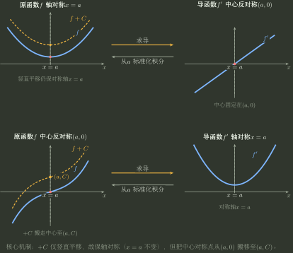
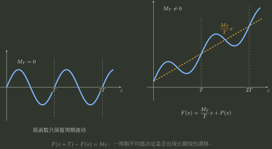

# 结构传播的资格审计

> 训练定位：训练把奇偶、周期、对称等函数结构带入极限、求导、积分或展开前，先判断结构能否合法传播以及传播后发生保持、翻转、迁移还是失效。  
> 模型归属：[函数结构在运算中的传播.tex](函数结构在运算中的传播.tex)；结构传播机制仍由该 Canonical Bridge 拥有，本文只维护局部训练动作。

### 局部规则：结构传播先过资格审计

**触发信号**：题目把奇偶、周期、对称等结构带入极限、求导、积分或展开。

**第一动作**：先写原结构的定义域与中心，再核对运算后的定义域、正则性、积分常数或展开中心。

**检查与退出**：明确结论究竟是保持、翻转、迁移还是失效；积分原函数要固定常数，周期/对称平移要同步迁移中心。资格闭合后才调用 Bridge 的传播机制；形式看起来对称不能替代定义域检查。

