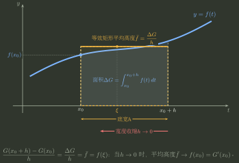
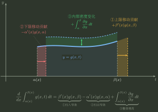

# 微分与累积对象分层

> 训练定位：训练在原函数、定积分数值、变上限累积函数与参数积分之间切换时，先辨认对象层级，再选择相应正则性与微积分基本定理接口。  
> 模型归属：[微分与累积_基本定理及正则性边界.tex](微分与累积_基本定理及正则性边界.tex)；微分与累积互译及其正则性边界仍由该 Canonical Bridge 拥有，本文只维护局部训练动作。

### 局部规则：微分与累积先标对象，再选资格

**触发信号**：题目在原函数、定积分、变上限积分或参数积分之间切换。

**第一动作**：先标注当前对象是定积分数值、累积函数还是逐点原函数关系，再决定需要可积性、局部平均值极限、连续性、Darboux 性质或 Leibniz 参数求导资格中的哪一项。

**检查与退出**：变上限差商读的是局部平均值；参数积分若 integrand 也含参数，不能漏掉积分内部的偏导项；“有原函数”和“Riemann 可积”不能互推。对象与资格闭合后才调用 Bridge，不为形式相似越级使用 FTC。

