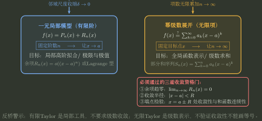

# 有限 Taylor 与无限表示分流

> 训练定位：训练同时出现 Taylor 近似、展开区间、端点或逐项运算时，先区分“有限误差模型”和“无限函数表示”两种不同交付目标。  
> 模型归属：[有限Taylor模型与无限Taylor表示.tex](有限Taylor模型与无限Taylor表示.tex)；有限局部模型与无限表示之间的资格边界仍由该 Canonical Bridge 拥有，本文只维护局部训练动作。

### 局部规则：先判有限近似还是无限表示

**触发信号**：题目同时出现 Taylor 近似、展开区间、端点、余项或逐项微积分。

**第一动作**：先写目标是“达到某个误差精度的有限展开”还是“证明原函数等于一个无限级数”。

**检查与退出**：无限表示必须同时交代余项趋零、收敛半径、端点判定与和函数身份；近似题则只需余项已满足精度。达到对应交付标准后立即停止，不把有限多项式当成无限恒等式，也不为近似题额外做端点审计。

