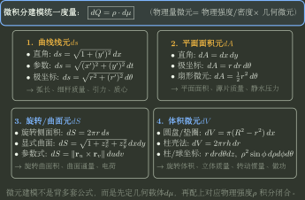
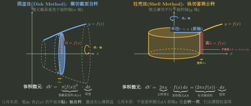
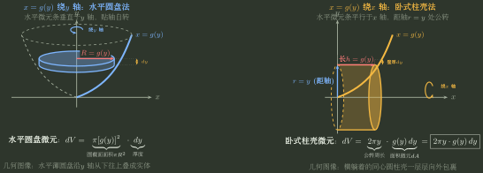
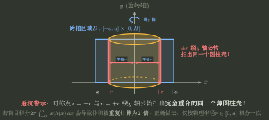
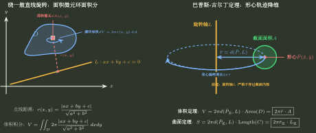
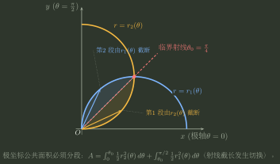
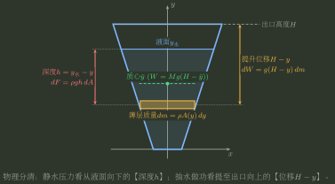

# 微积分建模的微元与单位

> 训练定位：掌握平面面积、旋转体体积与曲面、质量与形心、做功、压力及相关变化率等微积分物理/几何应用，建立“切微元 $\to$ 找几何关系 $\to$ 核验单位与覆盖 $\to$ 积分累积”的清晰心智模型。
> 模型归属：[微积分建模_从局部微元到整体量.tex](微积分建模_从局部微元到整体量.tex)；本文档提供直观透彻、接地气的实战训练与避坑准则。

---

## 🎯 微元建模三步决策法

解决任何微积分应用题，杜绝盲目套公式，严格执行三步走：

```text
第 1 步：怎么切（选择微元方向）
  └─ 切片垂直于旋转轴（圆盘法）还是平行于旋转轴（柱壳法）？
  └─ 沿变化方向（如水深 y、位移 x）切出均匀厚度的薄层。

第 2 步：算什么（写出局部微元 dQ）
  └─ 明确微元长、宽、高与物理量乘积（如 dV = 截面积 × dx，dW = 重力微元 × 提升高度）。
  └─ 核验量纲与单位阶次（长度 m、面积 m²、体积 m³、功 J）。

第 3 步：查什么（边界与覆盖审查）
  └─ 旋转轴有没有穿过区域？（穿过会产生重复覆盖，必须分段/去重）。
  └─ 曲线交点处谁是上边界、谁是下边界？（用测试点确认，不能想当然）。
```



---

## 💡 核心场景与实战规则

### 1. 旋转体体积：圆盘法 vs 柱壳法（切片方向决策）

**触发信号**：平面区域绕直线旋转求体积。

#### 形象心智模型与几何对比
- **圆盘法（切片自转）**：像“切黄瓜片”，截面垂直于旋转轴。微元条贴着旋转轴自转，扫出一个**薄实心圆盘**。
- **柱壳法（套筒公转）**：像“俄罗斯套娃”或“卷心菜一层层包裹”，截面平行于旋转轴。微元条距离旋转轴 $r=x$ 处绕轴公转一圈，扫出一个**薄壁圆柱壳**；剪开铺平后就是长方形薄板（长 $2\pi x$、宽 $f(x)$、厚 $dx$）。

| 切片方法 | 微元条与旋转轴关系 | 运动学过程与微元几何体 | 微元体积 $dV$ 公式 | 黄金选法原则（怎么省力怎么选） |
| :--- | :--- | :--- | :--- | :--- |
| **圆盘法 (Disk Method)** | **垂直**于旋转轴（横切截面） | 微元条贴轴**自转**，扫出**薄实心圆盘** | $dV = \pi R^2\, dx = \boxed{\pi [f(x)]^2\, dx}$ | 区域易写成 $y=f(x)$，且**绕 $x$ 轴（垂直轴）旋转** |
| **柱壳法 (Shell Method)** | **平行**于旋转轴（纵切套筒） | 微元条距轴 $r=x$ 处**公转**，扫出**薄圆柱壳**（展开为矩形板） | $dV = 2\pi r \cdot h\, dx = \boxed{2\pi x \cdot f(x)\, dx}$ | 区域难以反解 $x=g(y)$（如 $y=x e^{-x^2}$），但需**绕 $y$ 轴（平行轴）旋转** |



#### 关键辨析：平面面积微元 $dA$ 与立体体积微元 $dV$ 的关系
- **平面上的面积微元**：取宽为 $dx$、高为 $f(x)$ 的竖直长条，其面积为 $\mathbf{dA = f(x)\,dx}$。
- **圆盘法的体积微元**：竖直条贴着底边 $x$ 轴**自转**，生成厚度为 $dx$、底面积为 $\pi R^2 = \pi [f(x)]^2$ 的薄实心圆盘：
  $$dV = \underbrace{\pi [f(x)]^2}_{\text{圆截面面积 } A(x)} \cdot \underbrace{dx}_{\text{厚度}}$$
- **柱壳法的体积微元**：竖直条距离 $y$ 轴 $r=x$，绕 $y$ 轴**公转一整圈**（走过圆周长 $2\pi x$），扫出一个薄壁圆柱套筒：
  $$dV = \underbrace{2\pi x}_{\text{公转圆周长}} \cdot \underbrace{f(x)\,dx}_{\text{平面面积微元 } dA} = \underbrace{(2\pi x f(x))}_{\text{柱壳侧面积}} \cdot \underbrace{dx}_{\text{壁厚}}$$
  由此可见，柱壳法的微元体积本质就是**“把平面面积微元 $dA$ 绕轴拉伸一圈走过的空间体积”**！

#### 高频考点：以 $x=g(y)$ 为主角时，积分怎么算？转出来是什么图像？

当边界曲线直接由 $x=g(y)$（$c \le y \le d$）给出，或者我们主动反解出 $x=g(y)$ 时，微元条是**水平长条**（长 $g(y)$，厚 $dy$），其面积微元为 $dA = g(y)\,dy$。根据旋转轴的不同，同样有两种完全不同的几何生成机制：

1. **$x=g(y)$ 绕 $y$ 轴旋转 $\implies$ 水平圆盘法（自转）**
   - **微元运动**：水平微元条底端贴着 $y$ 轴**自转**一周；
   - **转出来的图像**：一个个**水平薄实心圆盘**（半径 $R=g(y)$，厚度 $dy$），沿 $y$ 轴从下往上像“叠盘子”一样叠成整个实体；
   - **体积微元**：$$dV = \pi R^2\, dy = \boxed{\pi [g(y)]^2\, dy}$$
2. **$x=g(y)$ 绕 $x$ 轴旋转 $\implies$ 卧式柱壳法（公转）**
   - **微元运动**：水平微元条距离 $x$ 轴距离为 $r=y$，绕 $x$ 轴**公转**一周（走过圆周长 $2\pi y$）；
   - **转出来的图像**：一个个**横躺着的同心薄圆柱套筒**（半径 $r=y$，筒长 $h=g(y)$，壁厚 $dy$），从内往外一层层包裹；
   - **体积微元**：$$dV = \underbrace{2\pi y}_{\text{公转周长}} \cdot \underbrace{g(y)\,dy}_{\text{面积微元 } dA} = \boxed{2\pi y \cdot g(y)\, dy}$$



#### 🌟 旋转体建模全景对称决策矩阵（$2 \times 2$ 极简终极口诀）

| 积分自变量与微元条方向 | 绕 $x$ 轴旋转（底/侧边关系） | 绕 $y$ 轴旋转（底/侧边关系） |
| :--- | :--- | :--- |
| **以 $x$ 积分：$y=f(x)$**<br>（取**竖直微元条**：高 $f(x)$，宽 $dx$） | **【立式圆盘法 (自转)】**<br>微元条贴 $x$ 轴自转 $\implies$ 竖直实心圆盘<br>$$\mathbf{dV = \pi [f(x)]^2\, dx}$$ | **【立式柱壳法 (公转)】**<br>微元条距 $y$ 轴 $x$ 处公转 $\implies$ 立式同心套筒<br>$$\mathbf{dV = 2\pi x \cdot f(x)\, dx}$$ |
| **以 $y$ 积分：$x=g(y)$**<br>（取**水平微元条**：长 $g(y)$，厚 $dy$） | **【卧式柱壳法 (公转)】**<br>微元条距 $x$ 轴 $y$ 处公转 $\implies$ 卧式同心套筒<br>$$\mathbf{dV = 2\pi y \cdot g(y)\, dy}$$ | **【水平圆盘法 (自转)】**<br>微元条贴 $y$ 轴自转 $\implies$ 水平实心圆盘<br>$$\mathbf{dV = \pi [g(y)]^2\, dy}$$ |

> 🎯 **记忆极简铁律**：
> 1. **切片垂直于旋转轴** $\implies$ **自转形成圆盘**（用 $\pi R^2$ 乘厚度）；
> 2. **切片平行于旋转轴** $\implies$ **公转形成柱壳**（用 $2\pi r$ 乘截长与壁厚，即 $2\pi r \cdot dA$）。

**避坑审查：区域跨轴重复覆盖陷阱**：
若旋转区域跨过了旋转轴（如 $[-1, 1] \times [0, 1]$ 绕 $y$ 轴），两侧相同半径的微元旋转后重合为同一个圆柱壳，直接全区间积分会导致体积算重一倍！必须按半径 $r \ge 0$ 取并集高度 $H(r)$ 后再积分。



---

### 2. 绕一般直线旋转与巴普斯-古尔丁定理（形心降维）

**触发信号**：
1. 平面区域 $D$ 或曲线 $C$ 绕平面内**任意倾斜直线** $L: ax+by+c=0$ 旋转；
2. 旋转图形具有高度对称性（如圆盘、椭圆、三角形、半圆），形心 $(\bar{x}, \bar{y})$ 已知或极易求出。

#### 直观物理图像
求旋转体体积，本质是把区域 $D$ 内的所有面积微元 $dA$ 绕轴旋转一周的体积累加。点 $(x, y)$ 走过的圆周长为 $2\pi r(x, y)$。根据质心/形心定义，所有点走过的**平均圆周长**，恰好就是**图形形心走过的圆周长 $2\pi \bar{r}$**！

```text
               【绕一般直线 L: ax+by+c=0 旋转】
                               │
               ┌───────────────┴───────────────┐
               ▼ (微元二重积分)                 ▼ (巴普斯-古尔丁定理)
    每个面积微元 dA 扫出薄圆环         旋转轴 L 不穿过区域内部时
    r(x,y) = |ax+by+c| / √(a²+b²)      整体形心 P̄ 到轴距离为 r̄
               │                               │
               ▼                               ▼
    V = ∬_D 2π r(x,y) dxdy           V = 2π r̄ · Area(D)
                                     （截面面积 × 形心周长）
```

#### 定理公式速查
- **古尔丁第二定理（体积定理）**：
  $$\boxed{V = 2\pi \cdot d(\bar{P}_{\text{面}}, L) \cdot \text{Area}(D) = 2\pi \bar{r} \cdot A}$$
  **口诀**：**旋转体体积 = 截面面积 $\times$ 截面形心旋转一周走过的圆周长**。
- **古尔丁第一定理（曲面面积定理）**：
  $$\boxed{S = 2\pi \cdot d(\bar{P}_{\text{弧}}, L) \cdot \text{Length}(C) = 2\pi \bar{r}_{\text{弧}} \cdot L_{\text{弧}}}$$
  **口诀**：**旋转曲面面积 = 曲线弧长 $\times$ 曲线形心旋转一周走过的圆周长**。



#### 考研经典秒杀标本
1. **圆环体 (Torus)**：半径为 $r$ 的圆盘绕相距 $R$（$R \ge r$）的轴旋转：
   - 截面面积 $A = \pi r^2$，圆心到轴距离 $\bar{r} = R \implies V = (2\pi R) \cdot (\pi r^2) = \mathbf{2\pi^2 R r^2}$；
   - 圆周长 $L = 2\pi r \implies S = (2\pi R) \cdot (2\pi r) = \mathbf{4\pi^2 R r}$。
2. **反求半圆形心**：上半圆 $x^2+y^2 \le R^2 (y \ge 0)$ 绕 $x$ 轴旋转生成球体（体积 $\frac{4}{3}\pi R^3$）：
   $$V = 2\pi \bar{y} \cdot \left(\frac{1}{2}\pi R^2\right) = \frac{4}{3}\pi R^3 \implies \bar{y} = \mathbf{\frac{4R}{3\pi}}.$$

---

### 3. 平面图形面积：先确定“分段点与上下界”，再写积分

**触发信号**：多条曲线围成封闭区域，在不同区间上由不同曲线充当上下边界。

**解题动作**：
1. 联立解出所有交点 $x_0$，划分积分区间；
2. 在每个子区间内，任取一个测试点代入各曲线方程，确认到底**谁在上方、谁在下方**；
3. 面积微元始终保持为非负的“$(y_{\text{上}} - y_{\text{下}})\,dx$”或“$(x_{\text{右}} - x_{\text{左}})\,dy$”；在极坐标系下沿射线确认内外径分段点。



---

### 4. 物理应用：做功、压力与引力（分清微元乘积因子）

#### A. 抽水做功（薄水片模型）
- **心智模型**：把水池中的水沿竖直方向切成许多水平“薄水片”。
- **微元构建**：
  $$dW = \text{薄水片重力} \times \text{提升高度} = (\rho g \cdot A(y)\,dy) \times (H - y)$$
  其中 $A(y)$ 为高度 $y$ 处的水平截面积，$H-y$ 为该层水被抽到池顶所需的垂直位移。

#### B. 液体侧压力（水平细条模型）
- **心智模型**：把浸入水中的闸门/容器壁沿深度切成水平细长条。
- **微元构建**：
  $$dF = \text{该深度的压强} \times \text{细条面积} = (\rho g h) \times (b(h)\,dh)$$
  其中 $h$ 是从水面算起的垂直深度，$b(h)$ 是深度 $h$ 处的水平宽度。



#### C. 万有引力与电场力（向量微元与对称性）
- **心智模型**：质点受连续分布物体的引力，必须逐点写出受力微元 $d\vec{F}$，不能把物体等效为集中在几何中心！
- **解题动作**：
  1. 写出质量微元 $dm = \rho\,dA$（或 $\rho\,ds$）；
  2. 写出距离平方反比引力大小 $dF = G \frac{m_0 dm}{r^2}$；
  3. 利用图形对称性抵消垂直分量，仅对轴向分量积分（如 $dF_x = dF \cos\theta$）。

---

### 5. 相关变化率：先建立全量等式求导，绝不在求导前代入瞬时值

**触发信号**：给定某个几何系统在某时刻的尺寸与某一变化率（如 $\frac{dr}{dt}$、$\frac{dh}{dt}$），求另一物理量的瞬时变化率（如 $\frac{dV}{dt}$）。

**操作铁律**：
1. **先列恒等式**：写出两个或多个变量在任意时刻 $t$ 满足的几何方程 $F(x(t), y(t), V(t)) = 0$；
2. **两边对时间 $t$ 隐函数求导**：利用链式法则求出导数关系式；
3. **最后代入该时刻瞬时值**：解出目标未知变化率。
4. ⚠️ **禁忌**：如果在求导前就把“某时刻 $r=5$”代入公式，导数项会被直接变成 $0$，导致逻辑彻底崩塌！
