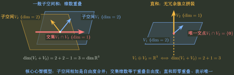

# 子空间求和、求交与维数

> 训练层级：**Core-first Training**。核心判断只依赖子空间、span、维数与表示相等；文中出现的 rank/kernel 是 Topic03 已学后的 Integration Shortcut，用来压缩计算，不作为 Topic01 的前置定义。先判断题面给的是“生成式”还是“方程式”，再选择信息损失最少的表示。  
> 模型归属：[向量空间：生成、基与坐标](向量空间_生成基与坐标.tex) 负责子空间、和、交与维数公式的理论机制；本文只负责题面路由、第一动作、停止条件和独立校验。

## 1. 先分清题目在求哪一个对象

给定同一环境空间中的子空间 $U,W$，题目通常在问四类对象：

1. $U+W$：两边所有方向合在一起能生成什么；
2. $U\cap W$：两边共同拥有哪些方向；
3. $\dim(U+W)$ 或 $\dim(U\cap W)$；
4. 是否为直和 $U\oplus W$，也就是分解是否唯一。

它们由同一条维数账本连接：

$$
\boxed{
\dim(U+W)=\dim U+\dim W-\dim(U\cap W).
}
$$

这里的减法不是技巧，而是在扣掉被两边重复计算的公共方向。



---

## 2. 子空间判定：先问是否对任意线性组合封闭

一个非空集合 $U$ 是线性子空间，当且仅当对任意 $u,v\in U$ 与标量 $\alpha,\beta$ 都有

$$
\alpha u+\beta v\in U.
$$

在计算题中，最便宜的必要筛选通常是：

$$
0\in U\ ?
$$

若原点都不在集合里，它立即不是子空间。

### 局部规则：齐次线性约束天然给子空间，非齐次平移通常不是

**触发信号**：题目给一个由方程、参数式或若干条件定义的向量集合，问是否为子空间。

**第一动作**：先检查零向量，再检查条件是否在线性组合下保持。

- 若

$$
U=\{x:Ax=0\}=\ker A,
$$

则由线性性自动有

$$
A(\alpha x+\beta y)=0,
$$

所以 $U$ 是子空间；
- 若

$$
S=\{x:Ax=b\},\qquad b\ne0,
$$

则 $0\notin S$，所以它不是子空间，而是有解时的仿射平移 $x_0+\ker A$。

**检查与退出**：不要只验证“加法封闭”或只举几个样本；要么用线性组合判据完成全称证明，要么找到一个必要条件失败的反例立即停止。

### 最小反例

$$
S=\{(x_1,x_2)^T:x_1+x_2=1\}
$$

是一条直线，但不经过原点，因此不是线性子空间。几何上“是一条直线”并不等于代数上“是一个一维子空间”。

---

## 3. 生成式求和：把两组方向放到同一个列空间里

设

$$
U=\operatorname{span}\{\alpha_1,\ldots,\alpha_s\},
\qquad
W=\operatorname{span}\{\beta_1,\ldots,\beta_t\}.
$$

则

$$
U+W
=
\operatorname{span}\{\alpha_1,\ldots,\alpha_s,\beta_1,\ldots,\beta_t\}.
$$

### 局部规则：求 $U+W$ 的基先拼列，再从原生成向量中取主元列

**触发信号**：两边都以 span / 生成向量给出，要求和空间的基或维数。

**第一动作**：构造

$$
M=(\alpha_1\ \cdots\ \alpha_s\ \beta_1\ \cdots\ \beta_t),
$$

对 $M$ 行化简，利用主元位置识别极大线性无关组。

**检查与退出**：

- $\dim(U+W)=r(M)$；
- 若要求一组基，应取 $M$ 的**原列**中对应的主元列，而不是把行化简后的列直接当成原空间中的基；
- 若只问维数，到 rank 即可停止。

---

## 4. 生成式求交：同一个公共向量必须有两种表示

要找 $v\in U\cap W$，必须同时存在系数 $c,d$ 使

$$
v=\sum_{i=1}^s c_i\alpha_i
=
\sum_{j=1}^t d_j\beta_j.
$$

移项得到

$$
(\alpha_1\ \cdots\ \alpha_s\ -\beta_1\ \cdots\ -\beta_t)
\begin{pmatrix}c\\d\end{pmatrix}=0.
$$

### 局部规则：先解“表示相等”，再回代成真正的公共向量

**触发信号**：两边都给生成向量，要求 $U\cap W$ 的基或维数。

**第一动作**：令

$$
Ac=Bd
$$

并解

$$
(A\ -B)
\begin{pmatrix}c\\d\end{pmatrix}=0.
$$

**检查与退出**：系数解不是最终答案。必须把每个独立系数方向回代到

$$
v=Ac=Bd
$$

得到实际公共向量，再去掉零向量与冗余向量。

> **错误阻断：** 如果 $A$ 或 $B$ 的生成列本身相关，$(c,d)\neq0$ 仍可能对应 $v=0$。因此“系数方程有几个自由变量”不能直接当成 $\dim(U\cap W)$。

---

## 5. 方程式求交：公共对象就是同时满足两组约束

若

$$
U=\{x:Cx=0\},
\qquad
W=\{x:Dx=0\},
$$

那么

$$
U\cap W
=
\left\{x:
\begin{pmatrix}C\\D\end{pmatrix}x=0
\right\}.
$$

### 局部规则：两边都以齐次约束给出时直接纵向拼接

**触发信号**：子空间由若干线性方程、法向量或 kernel 给出。

**第一动作**：把全部约束堆叠成一个齐次系统。

**检查与退出**：环境空间维数为 $n$ 时，

$$
\dim(U\cap W)
=
 n-r\begin{pmatrix}C\\D\end{pmatrix}.
$$

若只问维数，不必进一步参数化全部公共向量。

---

## 6. 表示选择：生成式适合求和，方程式适合求交

这不是绝对规定，而是信息流方向决定的优先级：

- 生成式天然描述“有哪些方向可以组合”，所以 $U+W$ 直接拼生成向量；
- 方程式天然描述“必须同时满足哪些约束”，所以 $U\cap W$ 直接叠加约束；
- 若题面给的表示与目标不匹配，再转换表示，而不是一开始就把所有信息改写成同一种形式。

### 局部规则：先在题目给出的最高信息量表示上工作

**触发信号**：一边给基，另一边给方程，或题目同时给 span、kernel、法向量等不同表示。

**第一动作**：问当前目标是“合并方向”还是“叠加约束”，只转换必要的一侧。

**检查与退出**：若转换后的表示比原题更复杂，说明可能走错层级；退回比较维数、rank 或直接代入。

---

## 7. 维数题：优先用一条账本互相反推

若已知任意三项

$$
\dim U,
\quad
\dim W,
\quad
\dim(U+W),
\quad
\dim(U\cap W),
$$

即可由

$$
\dim(U+W)=\dim U+\dim W-\dim(U\cap W)
$$

求第四项。

### 局部规则：维数已经足够时不要额外求基

**触发信号**：题目只问交/和空间维数，且已知多个维数或组合矩阵 rank。

**第一动作**：先看维数公式是否已经闭合；若 $U,W$ 由生成列给出，也可以直接读

$$
\dim(U+W)=r(A\ B).
$$

**检查与退出**：结果必须满足

$$
0\le \dim(U\cap W)\le \min\{\dim U,\dim W\},
$$

$$
\max\{\dim U,\dim W\}
\le
\dim(U+W)
\le n.
$$

这些范围是独立于原计算路线的快速校验。

---

## 8. 直和：真正要求的是“公共方向只有零向量”

定义

$$
U+W=U\oplus W
$$

当且仅当

$$
U\cap W=\{0\}.
$$

这等价于每个 $v\in U+W$ 的分解

$$
v=u+w
$$

是唯一的。

### 局部规则：判直和先判交空间，而不是只看维数相加

**触发信号**：出现“直和”“唯一分解”“$U\oplus W$”。

**第一动作**：证明

$$
U\cap W=\{0\}.
$$

有限维时也可用

$$
\dim(U+W)=\dim U+\dim W
$$

作为等价判据。

**检查与退出**：只有 $\dim U+\dim W=n$ 还不够推出 $U\oplus W=\mathbb R^n$；还必须确认 $U+W$ 确实达到整个环境空间，等价地交空间为零。

---

## 9. 完整母例：生成式同时跑一遍和、交、直和

在 $\mathbb R^3$ 中令

$$
U=\operatorname{span}\{e_1,e_2\},
\qquad
W=\operatorname{span}\{e_2,e_3\}.
$$

### 求和

把生成向量拼起来：

$$
(e_1\ e_2\ e_2\ e_3).
$$

其中 $e_2$ 重复，不增加新方向，所以

$$
U+W=\mathbb R^3,
\qquad
\dim(U+W)=3.
$$

### 求交

令

$$
a e_1+b e_2=c e_2+d e_3.
$$

比较坐标得到

$$
a=0,
\qquad
d=0,
\qquad b=c.
$$

因此

$$
U\cap W=\operatorname{span}\{e_2\},
\qquad
\dim(U\cap W)=1.
$$

### 维数校验

$$
2+2-1=3=\dim(U+W).
$$

因为交空间非零，所以这里不是直和。

---

## 10. 一页调用链

```text
两个子空间 U,W
→ 目标是和 / 交 / 维数 / 直和？
→ 两边给生成向量：
   和 → 拼列取极大无关组
   交 → Ac=Bd → 回代真实公共向量
→ 两边给方程：
   交 → 纵向拼接约束
→ 只问维数：优先 rank + 维数公式
→ 问直和：检查 U∩W={0}
→ 最后做维数上下界校验
```

核心：

$$
\boxed{
\text{和空间是在合并方向；交空间是在寻找能被两套表示或两套约束同时接受的对象。}
}
$$
