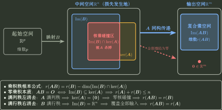

# 秩的结构判断与乘积边界

> 训练定位：训练不完全消元也能利用列/行关系、乘积像空间、秩一结构和参数跳变判断 rank，并阻断“秩就是非零元素个数/非零特征值个数”等错误联想。  
> 模型归属：[秩、基本子空间与等价](秩_基本子空间与等价.tex) 负责 kernel、image、rank-nullity 与乘积秩的理论机制；本文只负责结构识别和局部判断。

## 1. rank 计的是独立方向，不是非零数量

看到矩阵时先问：

$$
\boxed{\text{哪些列/行真正增加了新的 span 方向？}}
$$

大量非零元素可以只贡献一个方向；元素很稀疏也可能满秩。

---

## 2. 局部规则：明显列倍数/线性组合先读方向数

**触发信号**：多列互为倍数，某列明显是其他列的和，或矩阵可写成外积。

**第一动作**：先删掉显然不增加 span 的列/行，估计 rank 上界；再找一个非零子式或独立列给下界。

**检查与退出**：只有“至多 $r$”时不能直接写 rank=$r$，必须再证明至少存在 $r$ 个独立方向。

---

## 3. 秩一不等于“一个非零特征值”

秩只数 image 维数；特征值属于同空间算子在自身方向上的缩放结构。两者不能直接一一对应。

最小反例：

$$
A=\begin{pmatrix}0&1\\0&0\end{pmatrix},
\qquad r(A)=1,
$$

但特征多项式为 $\lambda^2$，没有非零特征值。

> **易错边界：** rank=$r$ 不代表恰有 $r$ 个非零特征值；后者在可对角化等额外结构下才可能与 rank 对齐。

---

## 4. 乘积秩：先看中间空间有多少方向被第二个映射送进第一个 kernel

$$
AB:x\xmapsto{B}Bx\xmapsto{A}ABx.
$$

因此损失发生在

$$
\operatorname{Im}B\cap\ker A.
$$



### 局部规则：看到 $AB=C$ 先同时读列空间与行空间

由矩阵乘法的列解释，$AB$ 的每一列都是 $A$ 的列向量的线性组合，因此

$$
\boxed{\operatorname{Col}(AB)\subseteq\operatorname{Col}(A).}
$$

从行解释看，$AB$ 的每一行都是 $B$ 的行向量的线性组合，因此

$$
\boxed{\operatorname{Row}(AB)\subseteq\operatorname{Row}(B).}
$$

所以若 $AB=C$，则

$$
\operatorname{Col}(C)\subseteq\operatorname{Col}(A),
\qquad
\operatorname{Row}(C)\subseteq\operatorname{Row}(B),
$$

并且

$$
\boxed{r(C)=r(AB)\le \min\{r(A),r(B)\}.}
$$

**触发信号**：给出 $AB=C$，问列/行的表示关系或 rank 上界。

**第一动作**：问列就回到 $A$ 的列空间；问行就回到 $B$ 的行空间。若要具体求 $B$ 的列，计算动作由 Topic02 的“按列读矩阵乘法”接管。

**检查与退出**：确认包含关系 $\operatorname{Col}(C)\subseteq\operatorname{Col}(A)$ 与 $\operatorname{Row}(C)\subseteq\operatorname{Row}(B)$ 满足题面诉求后退出，不外推等号。

### 局部规则：看到 $AB=0$ 先翻译为 image 落进 kernel

**触发信号**：$AB=0$，问秩关系、解空间或维数。

**第一动作**：写

$$
\operatorname{Im}B\subseteq\ker A.
$$

于是

$$
r(B)\le n-r(A)
$$

（中间空间维数为 $n$），即

$$
r(A)+r(B)\le n.
$$

**检查与退出**：矩阵尺寸必须匹配；这里的 $n$ 是中间空间维数，不是机械取某个矩阵的行数。

#### 母题：$A(A-\operatorname{adj}A)=0$ 怎样连续触发三条模型

设 $A$ 为四阶矩阵，满足

$$
A(A-\operatorname{adj}A)=0,
\qquad
A\ne\operatorname{adj}A.
$$

由母恒等式

$$
A\operatorname{adj}A=(\det A)I
$$

得到

$$
A^2=(\det A)I.
$$

若 $r(A)=4$，则 $A$ 可逆，原式可左消去 $A$，会推出 $A=\operatorname{adj}A$，与题设矛盾，所以 $r(A)\le3$。于是 $\det A=0$，从而

$$
A^2=0.
$$

再由零乘积 rank 约束

$$
r(A)+r(A)\le4,
$$

得到 $r(A)\le2$。又 $r(A)=0$ 会使 $A=0$ 且 $\operatorname{adj}A=0$，仍与题设矛盾，所以

$$
\boxed{r(A)=1\text{ 或 }2.}
$$

这道母题具体把“可逆消去边界 → adjugate 母恒等式 → $A^2=0$ → 零乘积 rank”串成一条综合链。

---

## 5. 满列秩与满行秩：把“乘积秩不损失”翻译成可消去性

设

$$
A\in\mathbb R^{m\times n},
\qquad
B\in\mathbb R^{n\times p}.
$$

乘积秩的统一机制仍是

$$
\operatorname{Im}B\cap\ker A
$$

中有多少方向被 $A$ 杀掉。满列秩、满行秩不是额外要背的技巧，而是这个机制的两个极端情形。

### 局部规则：左边矩阵满列秩时，左乘不损失 rank

若

$$
r(A)=n,
$$

则 $A$ 满列秩，等价于

$$
\ker A=\{0\}.
$$

因此 $B$ 的像空间与 $\ker A$ 没有非零碰撞，得到

$$
\boxed{r(AB)=r(B).}
$$

更强地，对任意向量 $x$，

$$
ABx=0
\Longleftrightarrow
Bx=0,
$$

所以

$$
\boxed{\ker(AB)=\ker B.}
$$

**触发信号**：题目给“$A$ 列满秩”“$A^TA$ 可逆”“$Ax=0$ 只有零解”，并出现 $AB$ 或 $AC=AD$。

**第一动作**：先翻译成 $\ker A=\{0\}$，再判断 $A$ 会不会把 $B$ 输出的某个非零方向压成零。

于是若

$$
AC=AD,
$$

则

$$
A(C-D)=0.
$$

逐列看，每一列都落在 $\ker A=\{0\}$ 中，因此

$$
\boxed{C=D.}
$$

这就是**左消去**；它不要求 $A$ 是方阵或可逆矩阵，只要求 $A$ 满列秩。

**检查与退出**：消去前确认左侧矩阵确为满列秩；若只有行满秩则不能左消去。

### 局部规则：右边矩阵满行秩时，右乘不损失 rank

若

$$
r(B)=n,
$$

则 $B$ 满行秩。作为映射，$B:\mathbb R^p\to\mathbb R^n$ 是满射，因此

$$
\operatorname{Im}B=\mathbb R^n.
$$

于是

$$
\operatorname{Im}(AB)
=A(\operatorname{Im}B)
=A(\mathbb R^n)
=\operatorname{Im}A,
$$

从而

$$
\boxed{r(AB)=r(A).}
$$

**触发信号**：题目给“$B$ 行满秩”，并出现 $AB$ 或 $CB=DB$。

**第一动作**：先翻译成“$B$ 可以覆盖整个中间空间”，因此 $A$ 的每个输出方向都能由某个 $Bx$ 触发。

若

$$
CB=DB,
$$

则对任意中间空间向量 $y$，都存在 $x$ 使 $Bx=y$，所以

$$
Cy=CBx=DBx=Dy.
$$

故

$$
\boxed{C=D.}
$$

这就是**右消去**；同样不要求 $B$ 是方阵或可逆矩阵，只要求 $B$ 满行秩。

**检查与退出**：消去前确认右侧矩阵确为满行秩；若只有列满秩则不能右消去。

### 局部规则：$AB=E$ 先从 rank 看出谁满行、谁满列

若

$$
A\in\mathbb R^{m\times n},
\qquad
B\in\mathbb R^{n\times m},
\qquad
AB=I_m,
$$

则

$$
m=r(I_m)=r(AB)\le r(A)\le m,
$$

因此

$$
\boxed{r(A)=m},
$$

即 $A$ 满行秩；同理

$$
\boxed{r(B)=m},
$$

即 $B$ 满列秩。又因 rank 不超过较小维数，必有

$$
\boxed{m\le n.}
$$

因此 $AB=I_m$ 表示：$A$ 有一个右逆 $B$，而 $B$ 有一个左逆 $A$。当 $m=n$ 时才自动回到通常的方阵互逆；矩形情形不要把 $AB=I$ 误写成必有 $BA=I$。

**独立检查**：任何推出的 rank 都必须同时满足矩阵行数、列数上界；任何“消去”都应能回译为 injective（满列）或 surjective（满行），而不是机械模仿可逆方阵。

---

## 6. 局部规则：参数矩阵先找“秩可能变化的临界参数”

**触发信号**：矩阵含参数 $a$，要求 rank 分类。

**第一动作**：做不需要除以参数表达式的安全消元；找到可能成为 0 的主元/关键子式，列出临界参数。

**检查与退出**：一般参数分支和临界参数分开处理。禁止在尚未分类前除以 $a-c$，否则会丢掉最重要的跳变分支。

---

## 7. 同 rank 只说明维数相同，不说明子空间相同

例如两个秩 1 矩阵的像空间都一维，但可以沿完全不同方向。

因此：

- 同 rank 不推出矩阵相同；
- 同 rank 不推出相似；
- 同 rank 不推出齐次方程组同解；
- 对**同型矩阵**，同 rank 才保证它们在矩阵等价关系下属于同一一般映射分类；不同尺寸只谈 rank 相同，不能直接称矩阵等价。

这个边界应和专题04的“同解”问题配合使用。

---

## 8. 和、转置与子式：短结论也要回到独立方向

### 局部规则：$r(A+B)$ 先用 image 包含给上界

**触发信号**：同型矩阵 $A,B$，要求估计 $r(A+B)$ 或由其中两个 rank 推第三个。

**第一动作**：因为

$$
\operatorname{Im}(A+B)
\subseteq
\operatorname{Im}A+\operatorname{Im}B,
$$

先写

$$
\boxed{r(A+B)\le r(A)+r(B)}.
$$

再由

$$
A=(A+B)-B,
\qquad
B=(A+B)-A
$$

得到

$$
\boxed{\lvert r(A)-r(B)\rvert\le r(A+B)}.
$$

**检查与退出**：这些是边界，不保证取等；若题面给具体 image 重叠/抵消结构，还要继续利用方向信息。

#### 母题：幂等矩阵的 rank 等式来自上下界夹逼

若 $A^2=A$，证明

$$
r(A)+r(A-I)=n.
$$

由

$$
A(A-I)=0
$$

先得

$$
r(A)+r(A-I)\le n.
$$

另一方面

$$
I=A+(I-A),
$$

所以由和的 rank 上界反向使用：

$$
n=r(I)\le r(A)+r(I-A)=r(A)+r(A-I).
$$

两边夹逼得到

$$
\boxed{r(A)+r(A-I)=n.}
$$

这里留下的是一个可复用证明模式：**乘积为零给上界，和恢复单位阵给下界**。

### 局部规则：转置不改变 rank，但交换 row/column 视角

**触发信号**：$r(A^T)$、行秩/列秩、转置后的 rank 表达式。

**第一动作**：直接用

$$
\boxed{r(A^T)=r(A)}.
$$

**检查与退出**：相等的是独立方向的数量；row space 与 column space 一般位于不同环境空间，不能因为 rank 相等就把两个集合写成相同。

### 局部规则：非零 k 阶子式给下界，全部更高阶子式为零给上界

**触发信号**：题目给特殊子式、要求由子式判断 rank，或消元代价较高但局部非零块明显。

**第一动作**：

- 找到一个非零 $k$ 阶子式，可立即得到 $r(A)\ge k$；
- 若还能证明所有 $(k+1)$ 阶子式都为零，则得到 $r(A)\le k$，从而 $r(A)=k$。

**检查与退出**：只找到一个 $k$ 阶子式为零不能推出 rank $<k$；rank 由**最大非零子式阶数**决定，而不是由某一个特定子式决定。

---

## 9. 乘积与分块 rank 的结构路线

### 局部规则：乘积 rank 先看中间空间

**触发信号**：出现 $AB,ABC,AB=0$ 或要求估计乘积 rank。

**第一动作**：若题面给 image/kernel 结构，先写 $\operatorname{Im}B\xrightarrow{A}\operatorname{Im}(AB)$ 并检查 $\operatorname{Im}B\cap\ker A$；若只给 rank 数值，再串 Sylvester/Frobenius 上下界。

**检查与退出**：最终必须满足 $r(AB)\le r(A),r(B)$；$AB=0$ 要能回译为 $\operatorname{Im}B\subseteq\ker A$。纯数值题不为几何解释额外求交空间，结构题也不只剩机械不等式。

### 局部规则：分块 rank 看到可逆块先在块层面消元

**触发信号**：大分块矩阵含 $I$、可逆主块、明显零块或可直接利用的块关系。

**第一动作**：把块当作合法矩阵单元，用可逆块行/列变换把非对角块消掉；例如可逆主块存在时优先形成块三角/块对角，再读取 rank。

**检查与退出**：每步必须能解释为左/右乘可逆块矩阵，乘法顺序不能交换；主块不可逆时不能凭空写逆。块结构没有减少未知块或运算量时，退回普通 rank 方法。

#### 母题：广义初等变换只是在块层面做同一件事

若 $A,B,C$ 为同阶方阵且 $ABC=0$，考虑

$$
R_1=\begin{pmatrix}0&A\\BC&I\end{pmatrix},
\qquad
R_2=\begin{pmatrix}AB&C\\0&I\end{pmatrix}.
$$

对 $R_1$ 做块行变换

$$
\text{第一块行}\leftarrow\text{第一块行}-A\cdot\text{第二块行},
$$

得到

$$
\begin{pmatrix}-ABC&0\\BC&I\end{pmatrix}
=\begin{pmatrix}0&0\\BC&I\end{pmatrix},
$$

所以

$$
r(R_1)=n.
$$

对 $R_2$ 做

$$
\text{第一块行}\leftarrow\text{第一块行}-C\cdot\text{第二块行},
$$

得到

$$
\begin{pmatrix}AB&0\\0&I\end{pmatrix},
$$

故

$$
r(R_2)=n+r(AB).
$$

母机制不是“广义初等矩阵的新公式”，而是普通可逆行变换在块层面的同构升级；只要每一步真的是左乘可逆块矩阵，rank 就保持。

## 10. 一页调用链

```text
求 rank
→ 先看显然线性关系 / 块 / 外积
→ 给上界
→ 找独立列或非零子式给下界
→ 含参数：先找临界值再分支

看到 AB
→ 先看 Im(B) 与 ker(A) 的碰撞

A 满列秩
→ ker(A)=0
→ r(AB)=r(B)
→ AC=AD 可左消去 A

B 满行秩
→ Im(B)=整个中间空间
→ r(AB)=r(A)
→ CB=DB 可右消去 B

AB=I
→ 先由 r(AB)=满秩反推 A 满行、B 满列
→ 再检查矩阵尺寸
```

核心：

$$
\boxed{\text{rank 是自由度账本；它告诉你多少方向留下，但不告诉你这些方向具体朝哪里}.}
$$
