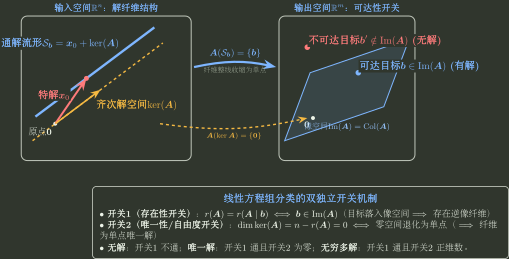

# 参数方程组与通解结构

> 训练定位：训练普通与含参数线性方程组的相容性、无解/唯一/无穷多分类、基础解系、非齐次通解与给定多个解的结构反推。把所有分支统一到“可达性 + kernel 自由度”，而不是背三套方程组口诀。  
> 模型归属：[线性方程组：可达性与解空间](线性方程组_可达性与解空间.tex) 负责 $Ax=b$ 的逆像、特解 + kernel、参数跳变等理论机制；本文只负责题面路由、第一动作、完整交付和独立校验。

## 1. 一条母模型统一全部方程组

对

$$
A\in\mathbb R^{m\times n},
\qquad
Ax=b,
$$

先问目标 $b$ 是否可达：

$$
Ax=b\text{ 有解}
\iff
b\in\operatorname{Im}A
\iff
r(A)=r(A\mid b).
$$

一旦有解，取任一特解 $x_0$：

$$
\boxed{
\mathcal S_b=x_0+\ker A.
}
$$

所以分类只由两个开关控制：

1. **可达性**：$r(A)$ 与 $r(A\mid b)$ 是否相等；
2. **自由度**：$\dim\ker A=n-r(A)$ 是否为零。



---

## 2. 无解、唯一解、无穷多解：不要背成三条孤立结论

### 无解

$$
r(A)<r(A\mid b).
$$

说明右端目标不在 image 中。

### 唯一解

$$
r(A)=r(A\mid b)=n.
$$

说明目标可达且

$$
\ker A=\{0\}.
$$

### 无穷多解

$$
r(A)=r(A\mid b)<n.
$$

说明目标可达，但仍有

$$
n-r(A)>0
$$

个自由方向。

### 局部规则：分类题第一动作就是比较两个 rank

**触发信号**：问“何时无解/唯一/无穷多”“解的个数”“参数取何值时有解”。

**第一动作**：行化简增广矩阵

$$
[A\mid b],
$$

同时追踪 $r(A)$ 与 $r(A\mid b)$。

**检查与退出**：只问解的类型时，到 rank 分类即可停止，不必把通解全部求出。

---

## 3. 求通解：必须交付“一个特解 + kernel 的一组基”

若系统相容且

$$
r(A)=r<n,
$$

则 kernel 维数为

$$
k=n-r.
$$

取基础解系

$$
\xi_1,\ldots,\xi_k
$$

与任一特解 $x_0$，全部解为

$$
\boxed{
x=x_0+c_1\xi_1+\cdots+c_k\xi_k.
}
$$

### 局部规则：非齐次通解至少做两类独立回代

**触发信号**：要求“通解”“全部解”“一般解”。

**第一动作**：先从增广消元中取一个方便的特解，再令自由变量逐个单位变化提取 kernel 方向。

**检查与退出**：分别检查

$$
Ax_0=b,
$$

以及对每个 $i$：

$$
A\xi_i=0.
$$

同时检查方向向量数量为 $n-r(A)$。这三项闭合后才算完整交付。

---

## 4. 齐次系统：基础解系是 kernel 的基，不是“随便找几组解”

对

$$
Ax=0,
$$

全部解就是

$$
\ker A.
$$

若

$$
r(A)=r,
$$

基础解系必须恰有

$$
n-r
$$

个线性无关向量。

### 局部规则：给定若干齐次解，先验三件事再称“基础解系”

**触发信号**：题目给若干候选向量，问是否构成基础解系，或要求补全基础解系。

**第一动作**：依次验证：

1. 每个向量都满足 $A\xi_i=0$；
2. 候选向量线性无关；
3. 数量等于 $n-r(A)$。

**检查与退出**：只满足前两项时，它们只是 kernel 中一组无关向量；数量不足不能声称生成整个 kernel。

---

## 5. 含参数系统：先找结构跳变点，再进入分支

参数题最危险的动作，是在尚未分类前除以一个可能为零的参数表达式。

### 局部规则：安全消元直到出现关键因子

**触发信号**：系数矩阵或右端含参数 $a,c,\lambda$ 等。

**第一动作**：优先做不需要除以参数因子的行变换，把潜在主元整理成

$$
f(a),\quad g(a,c),\ldots
$$

然后列出使这些关键量为零的临界参数。

**检查与退出**：

- 一般分支：关键因子非零，可继续除；
- 临界分支：回到未除该因子的矩阵重新判断；
- 不能把一般分支的化简结果直接代入临界值。

---

## 6. 母题：双参数分支先判系数结构，再判右端是否兼容

考虑

$$
\begin{pmatrix}
1&1\\
1&a
\end{pmatrix}
\begin{pmatrix}x_1\\x_2\end{pmatrix}
=
\begin{pmatrix}1\\c\end{pmatrix}.
$$

### 第一步：找系数矩阵结构跳变

$$
\det A=a-1.
$$

因此：

- $a\ne1$：$A$ 可逆，任意 $c$ 都唯一解；
- $a=1$：系数 rank 降到 1，需要继续看右端。

### 第二步：在临界分支审计增广列

$a=1$ 时系统变为

$$
x_1+x_2=1,
$$

$$
x_1+x_2=c.
$$

所以：

- $c=1$：两条约束重复，$r(A)=r(A\mid b)=1<2$，无穷多解；
- $c\ne1$：同一左端要求两个不同值，$r(A\mid b)=2>r(A)=1$，无解。

> **核心顺序：** 先找“独立约束是否改变”，再问“目标是否还能落在新的 image 中”。参数题不是未知数有三种新算法，而是 rank 与可达性发生分支。

---

## 7. 参数题要求通解时：分类不能停在“无穷多”

继续上例 $a=c=1$：

$$
x_1+x_2=1.
$$

令 $x_2=t$：

$$
x_1=1-t.
$$

于是

$$
x=
\begin{pmatrix}1\\0\end{pmatrix}
+t
\begin{pmatrix}-1\\1\end{pmatrix}.
$$

这里：

$$
x_0=
\begin{pmatrix}1\\0\end{pmatrix}
$$

负责命中目标，

$$
\xi=
\begin{pmatrix}-1\\1\end{pmatrix}
$$

是 kernel 方向。

### 局部规则：交付深度由题目目标决定

**触发信号**：参数题不仅问解的类型，还要求“求解”“写通解”“求基础解系”。

**第一动作**：完成参数分类后，只在有解分支继续求所需结构。

**检查与退出**：不要为无解分支求未知量，也不要在只问分类时展开所有通解。

---

## 8. 参数到底落在 A 还是 b：它决定第一动作

参数方程组不能只按“含参数”归为一类。参数出现的位置决定哪些结构可能改变。

### 情形 A：$A$ 固定，只有 $b=b(t)$ 变化

此时

$$
\operatorname{Im}A,
\qquad
\ker A,
\qquad
r(A)
$$

全部固定。变化的只有：目标 $b(t)$ 是否仍落在同一个 image 中，以及可达时 fiber 的基点落在哪里。

因此一旦某个 $t$ 可达，解集维数立刻固定为

$$
n-r(A).
$$

这类题最值得调用左零空间。若

$$
y_1,\ldots,y_s
$$

是一组 $\ker A^T$ 的基，则相容性等价于

$$
\boxed{
y_i^Tb(t)=0
\qquad(i=1,\ldots,s).
}
$$

也就是：**左端方程之间所有线性依赖，右端也必须完全遵守。**

#### 母题：用左零空间直接读参数相容性

考虑

$$
\begin{pmatrix}
1&1\\
2&2
\end{pmatrix}
\begin{pmatrix}x_1\\x_2\end{pmatrix}
=
\begin{pmatrix}1\\t\end{pmatrix}.
$$

左端第二行是第一行的 $2$ 倍，因此取

$$
y=\begin{pmatrix}-2\\1\end{pmatrix},
\qquad
y^TA=0.
$$

相容必须满足

$$
y^Tb=-2+t=0,
$$

所以只有

$$
\boxed{t=2}
$$

时有解。此时 $r(A)=1$，故解集自由度为 $2-1=1$；若题目只问参数条件，到 $t=2$ 即可停止，不必先求 $x_1,x_2$。

独立校验也很直接：既然第二个左端永远是第一个左端的两倍，右端也必须满足“第二个 = 第一个的两倍”。

### 情形 B：$A=A(t)$ 变化，$b$ 固定

这时 image 与 kernel 都可能改变，所以先找

$$
r(A(t))
$$

的跳变点，再在临界分支判断固定 $b$ 是否仍可达。

### 情形 C：$A(t)$ 与 $b(t)$ 同时变化

先分系数结构，再审计右端兼容性：

```text
A(t) 的 rank / 主元跳变
→ 一般分支
→ 临界分支重新检查 b(t) 是否满足新的方程依赖
→ 有解后再读 nullity 与通解
```

这个分流比“所有参数题都直接做大增广消元”更稳定，因为它先区分了**结构是否在变**，再决定是否需要计算。

---

## 9. 给定多个非齐次解：先相减制造齐次方向

若

$$
Ax_1=b,
\qquad
Ax_2=b,
$$

则

$$
A(x_1-x_2)=0.
$$

所以

$$
x_1-x_2\in\ker A.
$$

### 局部规则：多个已知解先选一个基点，再做差

**触发信号**：已知 $Ax=b$ 有若干具体解，要求 rank、通解、基础解系或参数。

**第一动作**：固定一个解 $x_0$，构造

$$
x_i-x_0.
$$

这些差向量自动落在 kernel。

**检查与退出**：要把它们称为基础解系，还必须证明：

- 差向量线性无关；
- 数量等于 $n-r(A)$。

已知解太少时，只能得到 kernel 的部分方向。

---

## 10. 非齐次解的仿射组合：系数和必须为 1

若

$$
Ax_i=b
\qquad(i=1,\ldots,k),
$$

则对系数 $c_i$：

$$
A\left(\sum_i c_ix_i\right)
=
\left(\sum_i c_i\right)b.
$$

因此：

$$
\boxed{
\sum_i c_i=1
\Longrightarrow
\sum_i c_ix_i\text{ 仍是 }Ax=b\text{ 的解}.
}
$$

### 局部规则：看到多个非齐次解的线性组合先算系数和

**触发信号**：题目问 $c_1x_1+\cdots+c_kx_k$ 是否仍为同一非齐次系统的解。

**第一动作**：计算

$$
s=c_1+\cdots+c_k.
$$

**检查与退出**：

- $s=1$：仍命中 $b$；
- $s=0$：落入齐次 kernel；
- 一般 $s$：命中 $sb$。

这正是非齐次解集是仿射集合而非线性子空间的可计算表现。

---

## 11. 局部可达与全局可逆必须分开

### 给定这个 b 有解

只需要

$$
b\in\operatorname{Im}A.
$$

### 任意 b 都有解

需要满射：

$$
r(A)=m.
$$

### 每个可达 b 至多一个解

需要单射：

$$
\ker A=\{0\}
\iff
r(A)=n.
$$

### 任意 b 都唯一有解

需要

$$
m=n=r(A),
$$

也就是方阵可逆。

> **错误阻断：** $A$ 奇异只表示它不是双射，不表示每一个具体 $Ax=b$ 都无解。奇异矩阵仍可能对某些 $b$ 有无穷多解。

---

## 12. 几何交付：点、直线、平面由 nullity 决定

只要系统有解：

$$
\mathcal S_b=x_0+\ker A.
$$

因此解集的仿射维数是

$$
\boxed{n-r(A).}
$$

在 $\mathbb R^3$ 中：

- nullity $=0$：一个点；
- nullity $=1$：一条仿射直线；
- nullity $=2$：一个仿射平面；
- nullity $=3$：只有 $A=0,b=0$ 时整个 $\mathbb R^3$。

### 局部规则：问几何形状先判可达，再读 nullity

**触发信号**：问解集是点/直线/平面、维数、是否经过原点。

**第一动作**：先确认系统有解，再计算 $n-r(A)$。

**检查与退出**：非齐次解集经过原点当且仅当 $b=0$；“无穷多解”不自动等于平面，具体维数由 nullity 决定。

---

## 13. 消元做到哪里才该停：RREF 不是默认终点

原始题目经常把“化成行最简”写成固定动作，但真正的停止位置由交付目标决定。

| 交付目标 | 最小充分表示 | 到哪里可以停 |
|---|---|---|
| 只判无解/唯一/无穷多 | 行阶梯形通常足够 | 主元位置、矛盾行和 rank 已可读 |
| 只求 nullity / 基础解系个数 | 行阶梯形足够 | 得到 $r(A)$ 后用 $n-r(A)$ |
| 求一个齐次基础解系 | 行阶梯形 + 回代通常足够 | 主变量能由自由变量表示 |
| 多个自由变量且要快速读通解 | RREF 往往更省认知负担 | 主变量已显式写成自由变量组合 |
| 参数题 | 安全阶梯形优先 | 关键参数因子已经暴露，尚未非法除法 |

所以“继续消元”必须回答一个问题：**下一步会不会产生新的交付信息？** 如果不会，就应该停止。

### 基础解系的“1001 赋值”到底是什么

若自由变量为 $x_{j_1},\ldots,x_{j_k}$，依次令它们取标准坐标

$$
(1,0,\ldots,0),\ (0,1,\ldots,0),\ \ldots,
$$

再回代主变量，就得到 $k=n-r(A)$ 个 kernel 方向。

这不是新的定理，而只是给自由变量空间选了一组最方便的坐标基。真正必须保持的是：

$$
A\xi_i=0,
\qquad
\xi_1,\ldots,\xi_k\text{ 线性无关},
\qquad
k=n-r(A).
$$

---

## 14. 命题判断：先审计“存在性”有没有被偷偷省略

方程组判断题经常把“单射”“满射”“当前 $b$ 可达”混在一句话里。稳定做法不是背真假，而是先问缺了哪个量词。

### 命题 A：$Ax=0$ 只有零解，所以 $Ax=b$ 有唯一解

一般 **不成立**。$Ax=0$ 只有零解只说明

$$
\ker A=\{0\},
$$

即每个**可达**目标至多一个逆像；它没有保证当前 $b$ 可达。

最小反例取

$$
A=\begin{pmatrix}1\\0\end{pmatrix},
\qquad
b=\begin{pmatrix}0\\1\end{pmatrix}.
$$

齐次方程只有零解，但 $b\notin\operatorname{Im}A$，所以非齐次方程无解。

### 命题 B：$Ax=0$ 有非零解，所以 $Ax=b$ 有无穷多解

也一般 **不成立**。非零 kernel 只说明：**一旦存在一个特解**，就能沿 kernel 产生无穷多解；它仍没有提供可达性。

### 命题 C：$A$ 行满秩，所以对任意 $b\in\mathbb R^m$，$Ax=b$ 都有解

成立，因为

$$
r(A)=m
\Longrightarrow
\operatorname{Im}A=\mathbb R^m.
$$

### 命题 D：$A$ 列满秩，所以对任意 $b$，$Ax=b$ 都有唯一解

一般不成立。列满秩只给

$$
\ker A=\{0\};
$$

它保证“若有解则唯一”，不保证满射。只有再加上 $m=n$，才得到对任意 $b$ 唯一可解。

### 局部规则：把命题拆成两个开关

**触发信号**：方程组解的存在性与唯一性定性判断题。

**第一动作**：将命题拆解为两个独立开关：
1. 它是否已经保证 $b\in\operatorname{Im}A$（存在性开关）？
2. 它是否已经保证 $\ker A=\{0\}$（唯一性/零自由度开关）？

**检查与退出**：一个控制存在，一个控制自由度；任何只回答其中一个开关的条件都不能替代另一个，核验两开关均闭合后退出。

---

## 15. 跨专题高信号结构：不要把所有题都硬消元

原题可能以“方程组”提问，却把真正的信息藏在矩阵乘积、伴随、正交或 Gram 型结构里。这时应先调用对应 Owner，再回到 Topic04 交付解集。

| 题面结构 | 第一翻译 | 转交 |
|---|---|---|
| $AB=0$ | $\operatorname{Im}B\subseteq\ker A$；$B$ 的列都是 $Ax=0$ 的候选解 | Topic03：乘积 rank / image-kernel |
| $A^2=0$ | $\operatorname{Im}A\subseteq\ker A$，从而 $r(A)\le n-r(A)$ | Topic03：自由度账本 |
| $A^TA$ 或 $AA^T$ | 实数域先比较 kernel，例如 $\ker(A^TA)=\ker A$ | Topic03：基本子空间 |
| $\operatorname{adj}(A)$ | 先写 $A\operatorname{adj}(A)=(\det A)I$ | Topic02 恒等式；rank 再转 Topic03 |
| 向量与 $A$ 的所有行都正交 | 直接翻译成 $Ax=0$ | Topic01 正交语言 → Topic04 kernel |

**退出原则**：跨专题结构只负责提供 rank、kernel 方向或候选解；一旦交付目标重新变成“是否可达、通解、同解”，立即回到 Topic04 的 fiber 模型，不在 Bridge 上继续扩张。

---

## 16. First Divergence：错题不要只记“算错了”

对一次方程组训练，把第一次偏离正确链的位置标成下面某一个节点：

| 节点 | 正确问题 | 典型可观察症状 |
|---|---|---|
| F0 目标 | 题目到底要分类、通解、rank 还是同解？ | 做了大量题目没要求的计算 |
| F1 表示 | 当前最高信息量表示是什么？ | 已给基础解系却又回到原方程硬消元 |
| F2 可达性 | 当前 $b$ 是否在 image？ | 一看到 kernel 非零就直接写“无穷多解” |
| F3 自由度 | 相容后 nullity 是多少？ | 把“有解”直接写成“唯一解” |
| F4 参数分支 | 哪个主元因子可能为零？ | 在临界值之前除以参数表达式 |
| F5 解集构造 | 特解和 kernel 方向是否分工清楚？ | 通解漏特解、方向数少于 $n-r(A)$ |
| F6 验证 | 有无独立检查？ | 只把原消元过程重新抄一遍 |

只有同一节点在真实作答中反复出现，才值得把它晋升成个人训练规则；不要在没有作答证据时预设“高频错因”。

---

## 17. 一页调用链

```text
先读交付目标
→ 选择最高信息量表示
→ Ax=b：先判 b 是否可达
   → r(A)≠r(A|b)：无解，停止
   → r(A)=r(A|b)：进入 fiber
→ 看 nullity=n-r(A)
   → 0：一个点 / 唯一解
   → >0：正维仿射集 / 无穷多解
→ 若要求通解：x0 + kernel 基
→ 含参数：先找 rank / 主元跳变点，再分支
→ 特殊结构：AB=0、A^TA、adj(A) 等先转对应 Owner
→ 最后独立验 Ax0=b、Aξi=0、方向数=n-r(A)
```

这里的箭头表示做题控制顺序，不是数学蕴含。

核心：

$$
\boxed{
\text{方程组没有三套世界：先判断 fiber 是否存在，再用 kernel 描述它的全部自由方向。}
}
$$
