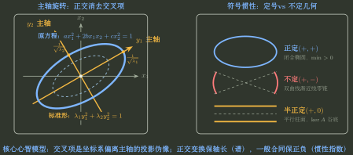

# 二次型标准化与正定判定

> 训练定位：训练二次型题中先判断目标是“只要合同分类”还是“需要正交主轴/具体谱”，再选择配方法、正交对角化、惯性或 Sylvester 判据，避免混用相似与合同。  
> 模型归属：[二次型：合同、惯性与正定](二次型_合同惯性与正定.tex) 负责二次型、合同、惯性与正定的理论机制；本文只负责题面路由、局部技巧和错误阻断。

## 1. 第一个问题不是“怎么化标准形”，而是“题目要求保留什么信息”

同一个实对称矩阵 $A$ 可以被两种不同目的驱动：

### 只研究二次型合同结构

允许

$$
A\mapsto P^TAP,\qquad P\text{ 可逆},
$$

核心不变量是正、负、零惯性指数。

### 要求正交主轴/具体特征值

限制

$$
A\mapsto Q^TAQ,\qquad Q^TQ=I,
$$

此时同时也是相似变换，必须保留具体谱。

$$
\boxed{\text{先读交付目标，再决定允许的变换}.}
$$



---

## 2. 非对称矩阵进入 $x^TAx$ 时先取对称部分

对任意实矩阵 $A$：

$$
x^TAx
=x^T\frac{A+A^T}{2}x.
$$

反对称部分不贡献二次型值。

### 局部规则：题面给非对称系数矩阵先对称化

**触发信号**：题目用一个非对称矩阵写 $x^TAx$，或交叉项系数与矩阵两侧位置不一致。

**第一动作**：替换为

$$
A_s=\frac{A+A^T}{2}.
$$

**检查与退出**：这是二次型对象的等价表示，不意味着原矩阵作为线性算子也可以随意替换成 $A_s$。

---

## 3. 配方法：只要合同标准形时通常更直接

配方法的目标是通过可逆变量替换消掉交叉项：

$$
f(x)=x^TAx
\xrightarrow{x=Py}
 y^T(P^TAP)y.
$$

### 局部规则：配一个变量后，把它从剩余部分彻底消掉

**触发信号**：交叉项结构适合连续完成平方，题目只要求标准形/惯性或可逆变换。

**第一动作**：选一个平方项系数非零的变量，把所有含它的项收集后完成平方；剩余部分不再含该变量，再继续下一轮。

**检查与退出**：最后的新变量必须与原变量构成可逆线性变换。若只得到少于 $n$ 个新变量表达式，必须补齐独立变量，不能丢维度。

### 没有平方项怎么办

出现

$$
2x_1x_2
$$

而没有 $x_1^2,x_2^2$ 时，可先用

$$
x_1=u+v,\qquad x_2=u-v
$$

制造平方差，再继续配方。关键是这一步变换可逆。

---

## 4. 正交对角化：题目要求 $Q$、主轴或具体谱时使用

实对称矩阵存在正交矩阵 $Q$：

$$
Q^TAQ=\Lambda.
$$

### 局部规则：正交法必须保持“特征值—特征向量列”一一对应

**触发信号**：要求正交变换、正交矩阵 $Q$、主轴方向，或标准形系数必须是原特征值。

**第一动作**：求特征值；对每个特征值求对应特征子空间，重根组内部正交化并全部单位化；按列构造 $Q$。

**检查与退出**：最后同时验

$$
Q^TQ=I,\qquad Q^TAQ=\Lambda.
$$

若只要求惯性而矩阵阶数较高，不一定值得完整求 $Q$。

---

## 5. 配方法系数一般不是特征值

配方法使用一般可逆合同：

$$
P^TAP=D.
$$

合同只保持惯性，不保持具体特征值。因此 $D$ 的非零对角系数可以与 $A$ 的特征值数值完全不同，只要正负个数一致。

> **易错边界：** 只有正交变换 $Q^TAQ$ 同时也是相似，才保持具体谱。

---

## 6. 正定：先选择最便宜的等价判据

对实对称 $A$，以下经典条件等价：

- $x^TAx>0$ 对所有 $x\ne0$；
- 所有特征值 $>0$；
- 正惯性指数为 $n$；
- 与 $I$ 合同；
- 所有顺序主子式 $>0$；
- 存在可逆 $D$ 使 $A=D^TD$。

### 局部规则：正定判断按题面信息选最短接口

**触发信号**：判断正定或参数范围。

**第一动作**：

- 已知谱 → 看特征值；
- 矩阵元素简单 → Sylvester 顺序主子式；
- 已有标准形/惯性 → 看正惯性；
- 已知合同关系 → 直接沿合同传递。

**检查与退出**：得到充分必要结论后停止，不为了“验证更放心”把所有判据都算一遍。

---

## 7. 永久错误阻断：对角元全正不推出正定

正定确实推出

$$
a_{ii}>0,
$$

因为取 $x=e_i$ 得 $e_i^TAe_i=a_{ii}>0$。

但反向错误。例如

$$
A=\begin{pmatrix}1&2\\2&1\end{pmatrix}
$$

对角元都正，但特征值为 $3,-1$，所以不正定。

$$
\boxed{\text{对角元正只是必要筛选，不是正定生成器}.}
$$

---

## 8. 相似、合同、等价绝不能排成无条件强弱链

旧笔记曾用“相似 → 合同 → 等价”作为普遍口诀，这会混淆对象。

- 相似研究同一算子换基；
- 合同研究二次型变量代换；
- 等价研究一般映射两端独立换基。

某些实对称矩阵、正交变换等特殊场景中公式可以交汇，但不能把不同对象的关系无条件串成一条逻辑强弱链。

### 局部规则：每次看到变换公式先问对象

**触发信号**：题目同时出现特征值、正定、标准形、可逆矩阵 $P$。

**第一动作**：先写目标关系是

$$
P^{-1}AP,\qquad P^TAP,\qquad PAQ
$$

中的哪一种，再选择对应不变量。

**检查与退出**：若目标只要求惯性，不拿 trace/det 数值当合同不变量；若目标要求相似，不只比较惯性。

---

## 9. 相似、合同、等价的反例压力测试：两条都能落到等价，但彼此不能乱推

对同阶方阵，若

$$
B=P^{-1}AP,
$$

则当然也可写成“左、右分别乘可逆矩阵”的形式，所以

$$
\boxed{\text{相似}\Longrightarrow\text{等价}.}
$$

同理，若

$$
B=P^TAP,
$$

则 $P^T,P$ 都可逆，因此

$$
\boxed{\text{合同}\Longrightarrow\text{等价}.}
$$

但这并不形成“相似 $\to$ 合同 $\to$ 等价”的无条件链。一般矩阵中，相似与合同彼此都不能推出。

### 局部规则：判断三种关系先用各自完整不变量，不只比一个摘要

**触发信号**：题目给两个方阵，问等价/相似/合同之间能否互推。

**第一动作**：

- 等价：同型矩阵只看 rank；
- 相似：先比特征多项式/谱等必要不变量，再看是否有足够结构完成相似分类；
- 实对称合同：看惯性。

**检查与退出**：

- 同 rank 只够等价，不够相似或合同；
- 同特征多项式只给相似的必要条件；
- 同 determinant 更弱；
- 实对称矩阵是特殊加强：若二者相似，则都可正交对角化到同一谱对角阵，从而实际上正交相似并合同。

### 三个最小校准

1. $I_2$ 与 $\begin{pmatrix}1&1\\0&1\end{pmatrix}$ 都满秩，所以等价，但不相似；后者也不可能与 $I_2$ 合同，因为 $P^TIP=P^TP$ 必对称。
2. $I_2$ 与 $\operatorname{diag}(1,4)$ 都正定，因此合同；但特征值不同，所以不相似。
3. 两个实对称矩阵若同谱，则由实对称谱定理可升级为正交相似；这个反向加强只属于实对称场景。

---

## 10. 正定矩阵做运算：先检查结果是否还属于“实对称矩阵”这个对象类

### 局部规则：和保持正定，差不保持

**触发信号**：$A,B\succ0$，问 $A\pm B$ 是否正定。

**第一动作**：对任意 $x\ne0$：

$$
x^T(A+B)x=x^TAx+x^TBx>0,
$$

所以

$$
\boxed{A+B\succ0.}
$$

而差没有同号保证；例如 $A=I,B=2I$ 时 $A-B=-I$。

**检查与退出**：这里的正定闭包来自二次型值直接相加，不是 determinant 或对角元。

### 局部规则：两个正定矩阵的普通乘积未必仍是“正定矩阵”

**触发信号**：$A,B\succ0$，问 $AB$ 是否正定。

**第一动作**：先检查

$$
(AB)^T=BA.
$$

普通乘积只有在 $AB=BA$ 时才仍对称；若不对称，按本册“实对称正定矩阵”的定义，甚至还没有进入正定判据。

若 $A,B$ 可交换，则实对称矩阵可同时正交对角化，乘积特征值为正数乘正数，因此 $AB\succ0$。

**检查与退出**：不要只看到 $\det(AB)>0$ 就判正定。determinant 只是全部特征值乘积的摘要。

### 必要条件仍不能反推

正定必有

$$
\det A>0,\qquad a_{ii}>0,
$$

但两条单独甚至同时都不足以推出正定。真正的全方向要求仍是

$$
x^TAx>0\qquad\forall x\ne0.
$$

---

## 11. $A$ 与 $-A$ 合同：determinant 给奇偶必要条件，惯性负责真正分类

### 局部规则：可逆 $A$ 与 $-A$ 合同时先取 determinant

**触发信号**：存在可逆 $P$ 使

$$
-A=P^TAP.
$$

**第一动作**：取 determinant：

$$
(-1)^n\det A=(\det P)^2\det A.
$$

若 $A$ 可逆，可约去 $\det A$，得到

$$
(-1)^n=(\det P)^2>0,
$$

所以 $n$ 必为偶数。

**检查与退出**：偶数阶只是必要条件，不是充分条件。对实对称矩阵，真正的合同分类由惯性决定；例如偶数阶 $I_n$ 与 $-I_n$ 的正负惯性完全相反，所以并不合同。

---

## 12. 零集、球面极值与半定结构

### 局部规则：配方法没有平方主元时先把交叉项变成一正一负

**触发信号**：当前二次型所有平方项为零，但存在非零交叉项 $2a_{ij}x_ix_j$。

**第一动作**：令 $u=x_i+x_j,\ v=x_i-x_j$，把交叉项改写成 $\frac{a_{ij}}2(u^2-v^2)$，制造可继续配方的正、负平方项。

**检查与退出**：变量替换必须可逆；替换后要同步重写所有含 $x_i,x_j$ 的项。若已有更简单的非零平方主元，不为使用该技巧额外换元。

### 局部规则：求 $x^TAx=0$ 先判惯性

**触发信号**：实对称二次型方程 $x^TAx=0$，要求非零解、零点集合或存在性。

**第一动作**：先判定二次型为正/负定、半定还是不定：定号型只有零解；半定型的零点等于 $\ker A$；不定型存在正负项抵消产生的非零解。

**检查与退出**：若已化规范形，直接数正、负、零平方项；不要从原矩阵系数正负猜结论。题目若要求完整参数化，再在规范坐标中继续解。

### 局部规则：单位球面二次型最值与绝对值最值分开

**触发信号**：实对称 $A$，约束 $\lVert x\rVert=1$，求 $x^TAx$ 或 $\lvert x^TAx\rvert$ 的极值。

**第一动作**：普通最大/最小分别读取 $\lambda_{\max},\lambda_{\min}$；目标有绝对值时比较全部特征值的绝对值。

**检查与退出**：取等方向必须来自对应特征子空间；非对称矩阵先取二次型对应的对称部分。目标极值已经由谱端点确定后停止完整构造所有特征向量。

### 局部规则：全称向量不等式先特殊化，再回半定结构

**触发信号**：含参数矩阵的不等式要求对任意向量都成立，例如 $x^TAx$ 或 $(x^TAy)^2$ 型全称条件。

**第一动作**：先代标准基、坐标轴方向或简单组合抽取必要参数条件；随后回到实对称二次型的正/负半定结构证明充分性。

**检查与退出**：几个特殊向量只能给必要条件，不能代替全称证明；若右端可能为负而左端为平方，立即检查二次型是否不定。题目只针对给定几个向量时，不把它升级成半定性问题。

> **易错边界：** 半正定不能只检查“所有顺序主子式非负”。顺序主子式判据是正定的 Sylvester 判据；若走主子式语言判半正定，需要检查全部主子式，考试主线上优先使用谱或规范形。

---

## 13. 源资料母题：同一对象用不同交付目标反复调用

### 母题 A｜正交标准形与球面最值其实共用同一套谱（源第六章专题30、32）

设

$$
f=x_1^2+5x_2^2+5x_3^2+2x_1x_2-4x_1x_3,
$$

对应

$$
A=\begin{pmatrix}1&1&-2\\1&5&0\\-2&0&5\end{pmatrix}.
$$

其特征值为

$$
0,5,6,
$$

可分别取互相正交的特征方向

$$
(5,-1,2)^T,\qquad(0,2,1)^T,\qquad(-1,-1,2)^T.
$$

单位化组成 $Q$ 后，

$$
Q^TAQ=\operatorname{diag}(0,5,6),
$$

所以正交标准形为

$$
5y_2^2+6y_3^2
$$

（对角项顺序随列顺序改变）。同一题若再加约束 $x^Tx=2$，无需重新计算：正交变换保持长度，故

$$
\boxed{\max f=2\lambda_{\max}=12}.
$$

**模型锚点**：正交标准化、主轴、球面最值不是三套算法，而是同一谱结构的三种交付。

### 母题 B｜没有合适平方主元时，交叉项先制造一正一负方向（源第六章专题31）

对

$$
f=2x_2^2+2x_1x_3,
$$

令

$$
x_1=y_1+y_3,\qquad x_2=y_2,\qquad x_3=y_1-y_3,
$$

则

$$
f=2y_1^2+2y_2^2-2y_3^2.
$$

继续缩放即可得到规范形

$$
\boxed{z_1^2+z_2^2-z_3^2}.
$$

**停止条件**：若只问惯性，此时已经得到 $(p,q,r_0)=(2,1,0)$，无需求特征值。

### 母题 C｜求 $f(x)=0$ 时先把“零集”还原成符号结构（源第六章专题32）

设

$$
f=(1-a)x_1^2+(1-a)x_2^2+2x_3^2+2(1+a)x_1x_2,
$$

且二次型秩为 $2$。由对应矩阵 determinant 为零得到

$$
\boxed{a=0}.
$$

此时

$$
f=(x_1+x_2)^2+2x_3^2.
$$

因此 $f=0$ 不是靠“猜抵消”，而是两个非负平方必须同时为零：

$$
\boxed{x=k(1,-1,0)^T}.
$$

这正是半正定零集等于 kernel 的具体版本。

### 母题 D｜正定参数题优先用顺序主子式逐层收紧（源第六章专题35）

二次型

$$
x_1^2+4x_2^2+4x_3^2+2t x_1x_2-2x_1x_3+4x_2x_3
$$

对应

$$
A=\begin{pmatrix}1&t&-1\\t&4&2\\-1&2&4\end{pmatrix}.
$$

Sylvester 判据给

$$
\Delta_1=1>0,
$$

$$
\Delta_2=4-t^2>0,
$$

$$
\Delta_3=-4t^2+4t+8>0.
$$

合并区间得到

$$
\boxed{-2<t<1}.
$$

**验算**：边界 $t=-2,1$ 都使 determinant 为零，因此不能误收进正定区间。

### 母题 E｜正定证明题把二次型改写成范数（源第六章专题35）

若 $A\in\mathbb R^{m\times n}$ 且 $r(A)=n$，则对任意 $x\ne0$，满列秩保证 $Ax\ne0$。于是

$$
x^TA^TAx=(Ax)^T(Ax)=\lVert Ax\rVert^2>0.
$$

故

$$
\boxed{A^TA\succ0}.
$$

这道母题训练的不是“背结论”，而是把正定定义中的全称量 $x^TMx$ 直接改写成平方范数。

---

## 14. 一页调用链

```text
二次型
→ 先确认对称矩阵表示
→ 目标只要合同分类？配方 / 惯性
→ 目标要正交主轴/具体谱？正交对角化
→ 正定？按已知信息选谱 / Sylvester / 惯性
→ 同时出现等价/相似/合同？先锁对象，再选 rank / 谱 / 惯性
→ 正定矩阵做加减乘？先检查结果是否仍对称，再看全方向符号
→ A 与 -A 合同？det 先给阶数奇偶必要条件，惯性做最终分类
→ 最后检查变换可逆或正交
```

核心：

$$
\boxed{\text{标准化不是把矩阵“变漂亮”，而是在允许的变换下只保留当前问题真正需要的不变量}.}
$$
