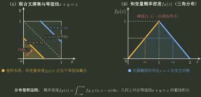

# 和的分布与卷积

> 训练定位：训练 $X+Y$、一般线性组合与常见可加分布族题，先从联合支撑的截面生成积分范围，再在独立性与参数兼容时调用卷积或闭包。  
> 模型归属：[联合分布_条件分布与变换.tex](联合分布_条件分布与变换.tex)；和的分布、卷积与联合支撑机制仍由该 Canonical 正文拥有，本文只维护局部训练动作。

### 局部规则：和/线性组合的分布先画支撑截面

**触发信号**：要求 $X+Y$、$aX+bY$ 的分布，或给联合密度后求线性组合。

**第一动作**：先写联合支撑 $D$；固定目标值 $z$，求直线 $ax+by=z$ 与 $D$ 的可行截面和分段范围，再沿截面积分联合密度。

**检查与退出**：只有独立性已证实时才把联合密度替成边缘乘积；若用 $(x,z)$ 参数化，要保留相应 Jacobian。目标支撑、分段积分限和归一化全部闭合后停止。

### 局部规则：离散变量加连续变量先写“平移密度混合”

**触发信号**：$X$ 离散、$Y$ 连续，要求 $Z=X+Y$ 的密度。

**第一动作**：按 $X=x_i$ 分层：一般情形
$$
f_Z(z)=\sum_iP(X=x_i)f_{Y\mid X}(z-x_i\mid x_i),
$$
若已知独立，则直接变成 $\sum_i p_i f_Y(z-x_i)$。

**检查与退出**：每个平移层都要同步平移支撑；若条件密度随 $i$ 改变，不得偷换成同一个边缘密度。加权和积分为 1 后即可停止，不必为了求密度先写完整 CDF。

### 局部规则：可加族只在参数兼容且独立资格成立后调用

**触发信号**：和的分布涉及正态、Poisson、Gamma、二项等常见可加族。

**第一动作**：先核对独立性、参数化与支撑，再调用闭包；Gamma 尤其确认使用率参数还是尺度参数。

**检查与退出**：一般联合分布仍可沿截面求和，但不能把边缘密度直接相乘。闭包条件已满足时，不再重复做卷积积分。
