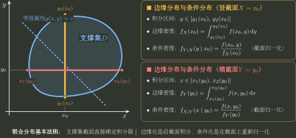

# 联合、边缘、条件与极值分布

> 训练定位：训练二维分布题中先锁联合支撑，再根据目标选择边缘化、条件化、独立判定、变量变换或最大最小值出口。  
> 模型归属：[联合分布、条件分布与变换](联合分布_条件分布与变换.tex) 负责联合/边缘/条件分布、独立性和变量变换的理论机制；本文只负责题面路由、第一动作与边界检查。

## 1. 二维题的第一张图不是公式表，而是支撑集

联合密度

$$
f_{X,Y}(x,y)
$$

不仅告诉你“多大”，还必须和题目给出的**合法取值区域 / 有效支撑区域**一起读。常见考研分段密度题可以把密度可能非零的区域记为

$$
D=\{(x,y):\text{该点属于联合密度的合法分段区域}\}.
$$

严格概率论中的 support 通常还涉及闭包，不能机械定义成 $\{f_{X,Y}>0\}$；这里画 $D$ 的目的，是准确读取积分截面、条件可行区间和变量变换覆盖关系。

后续边缘积分限、条件分布可行区间、独立性、变量变换分支都由这份区域信息约束。



---

## 2. 局部规则：求边缘先固定目标变量切支撑

**触发信号**：已知联合密度/联合 PMF，求 $X$ 或 $Y$ 的边缘。

**第一动作**：固定要保留的变量，读取另一个变量在支撑中的允许范围，再积分/求和。

例如

$$
f_X(x)=\int_{\{y:(x,y)\in D\}}f_{X,Y}(x,y)\,dy.
$$

**检查与退出**：上下限不是机械的 $(-\infty,+\infty)$；写全实线只是把支撑外零密度隐含进去了。复杂区域应先分段。

---

## 3. 联合到边缘是有损操作，不能一般反推

边缘化把另一个变量信息求和/积分掉，所以会丢失依赖结构。

$$
\boxed{\text{联合}\to\text{边缘可算；边缘}\not\to\text{联合唯一恢复}.}
$$

即使两个边缘都已知，也有大量不同联合分布共享同样边缘。

只有额外知道独立时，才可以用

$$
f_{X,Y}=f_Xf_Y
$$

恢复联合。

---

## 4. 局部规则：条件密度先算分母边缘，再缩支撑

**触发信号**：求 $f_{X\mid Y}(x\mid y)$。

**第一动作**：先求

$$
f_Y(y),
$$

并锁定 $f_Y(y)>0$ 的合法 $y$；再写

$$
f_{X\mid Y}(x\mid y)=\frac{f_{X,Y}(x,y)}{f_Y(y)}.
$$

**检查与退出**：条件后的 $x$ 支撑可能依赖给定 $y$，必须从联合支撑截面重新读取，不能沿用原边缘支撑。

### 局部规则：双向条件密度已知时先尝试相除消元

**触发信号**：同时给 $f_{X\mid Y}(x\mid y)$ 与 $f_{Y\mid X}(y\mid x)$，要求边缘或联合密度。

**第一动作**：在共同正支撑上写
$$
\frac{f_{X\mid Y}(x\mid y)}{f_{Y\mid X}(y\mid x)}
=\frac{f_X(x)}{f_Y(y)}.
$$
若左边可分成 $a(x)/b(y)$，分别归一化得到边缘，再乘回任一条件密度恢复联合。

**检查与退出**：两组条件密度必须相容；最终联合密度须同时复原两组条件密度且总积分为 $1$。比例不能分离时不要强猜边缘分布族。

### 局部规则：联合交换对称时先交换变量角色

**触发信号**：题面给 $f(x,y)=f(y,x)$，或明确说明联合分布关于 $x=y$ 对称，并给出一侧条件密度。

**第一动作**：先由联合交换对称推出 $f_X=f_Y$；因此反向条件密度满足
$$
f_{Y\mid X}(y\mid x)=f_{X\mid Y}(y\mid x).
$$
也就是把原条件密度中的变量角色交换，而不是重新做一次未知联合积分。

**检查与退出**：仅有“边缘相同”不够，必须是联合对象本身交换对称；得到反向条件密度后仍要检查支撑与归一化。

---

## 5. 独立性必须同时看“支撑能否分离”和“密度能否分解”

### 局部规则：二维连续独立先做快速支撑攻击

**触发信号**：问 $X,Y$ 是否独立，联合支撑不是显然矩形。

**第一动作**：比较联合支撑 $D$ 与边缘支撑笛卡尔积

$$
D_X\times D_Y.
$$

若边缘乘积密度在某些区域为正，而联合密度因支撑限制为 0，就可立即否定独立。

**检查与退出**：支撑呈矩形只是独立的必要几何信号，不足以证明独立；还要检查概率/密度乘积分解。

---

## 6. 边缘正态不推出联合正态

旧笔记容易把“$X,Y$ 都正态”升级为“任意线性组合正态”。这是错误的。

只有在 $(X,Y)$ **联合正态**，或例如 $X,Y$ 独立正态等足以推出联合正态的结构下，才保证

$$
aX+bY
$$

仍正态。

对联合正态，才有经典特例：

$$
\rho=0\iff X,Y\text{ 独立}.
$$

一般分布中零相关不能推出独立。

---

## 7. 最大值/最小值：先翻译事件，再利用独立

设独立随机变量 $X_1,\ldots,X_n$。

最大值

$$
M=\max_iX_i
$$

满足

$$
\{M\le x\}=\bigcap_i\{X_i\le x\},
$$

故

$$
F_M(x)=\prod_iF_i(x).
$$

最小值

$$
m=\min_iX_i
$$

更方便走补事件：

$$
\{m>x\}=\bigcap_i\{X_i>x\},
$$

所以

$$
F_m(x)=1-\prod_i[1-F_i(x)].
$$

### 局部规则：极值分布不要先求密度

**触发信号**：最大值、最小值、顺序统计量的简单端点。

**第一动作**：先写 CDF 事件；利用“全部满足”与独立乘法。

**检查与退出**：非同分布时保留各自 $F_i$；不独立时不能乘。

### 局部规则：独立指数时钟先用“总速率 + 速率占比”

**触发信号**：多个独立指数等待时间，问最早发生时间或哪一个先发生。

**第一动作**：若 $X_i\sim\operatorname{Exp}(\lambda_i)$ 独立，则
$$
\min_iX_i\sim\operatorname{Exp}\!\left(\sum_i\lambda_i\right),
\qquad
P\{X_j=\min_iX_i\}=\frac{\lambda_j}{\sum_i\lambda_i}.
$$
两变量时尤其有 $P(X<Y)=\lambda_X/(\lambda_X+\lambda_Y)$。若二者同率 $\lambda$，无记忆性还立即给出
$$
\lvert X-Y\rvert\sim\operatorname{Exp}(\lambda).
$$

**检查与退出**：连续指数变量并列的概率为 0；“速率占比”和同率间隔结论都依赖指数分布恒定风险率。不同速率时 $\lvert X-Y\rvert$ 一般是按谁先发生分层后的指数混合，不是单一指数；一般寿命分布更不能迁移这些结论。

---

## 8. 二维 CDF 合法性多一个“矩形增量非负”

除了边缘极限、右连续等条件，二维分布函数还必须满足任意矩形概率非负：

$$
F(b,d)-F(a,d)-F(b,c)+F(a,c)\ge0.
$$

这是两个分别单调的一维条件无法替代的联合一致性要求。

---

## 9. 分层生成与独立性审计

### 局部规则：条件分布先分层，再混合输出

**触发信号**：题面给“在 $X=i$ 条件下 $Y$ 服从某分布”、分层抽样或先选类别再生成结果。

**第一动作**：逐层写条件分布与支撑，再按层权重用全概率合成边缘；若目标只问均值/方差，则把已验收的条件结构交给 Topic05 的全期望/全方差接口。

**检查与退出**：层必须互斥穷尽、权重和为 $1$，混合输出总质量为 $1$；边缘相同不能推出独立。目标边缘已闭合时停止；问依赖时继续保留联合生成层。

### 局部规则：离散选择层先写联合对象，再判断独立

**触发信号**：离散变量 $G$ 决定 $Y=X_1$、$Y=X_2$ 或某段输出，各层可能有相同边缘分布。

**第一动作**：按 $G$ 的每个取值写联合 CDF/PMF/PDF 分支，再按权重求和；复制层与独立层必须分别保留其不同联合结构。

**检查与退出**：先闭合联合对象，再边缘化；比较联合分布与边缘乘积或计算交叉矩后才判独立。只问 $Y$ 边缘时可在混合闭合后停止。

### 局部规则：函数依赖先于协方差独立性检验

**触发信号**：$Y=g(X)$，同时问独立、不相关或协方差。

**第一动作**：先识别信息依赖；若 $g(X)$ 非退化，$Y$ 完全由 $X$ 决定，独立性应先从联合结构否定，再单独计算协方差回答“不相关”问题。

**检查与退出**：边缘对称、边缘相同或零协方差都不等于独立；若 $g$ 退化为常数，回到平凡常数变量情形重新判定。

### 局部规则：独立离散表先反解边缘，再逐格回填

**触发信号**：二维离散表只给少量联合格点、边际和独立性。

**第一动作**：先用已知格点与正边际反解另一边际，再由行列归一闭合，最后按 $p_{ij}=p_iq_j$ 回填所有格点。

**检查与退出**：不要凭相邻题或记忆增加不存在的取值；行列边际都必须归一为 $1$，已知与回填格点全部满足乘积结构。矩阵视角下，独立联合表应为外积 $P=\boldsymbol p\boldsymbol q^{\mathsf T}$，即秩一，任意 $2\times2$ 子式为零；可作为快速复核。表已闭合时停止。

---

## 10. 一页调用链

```text
二维分布
→ 先写联合支撑
→ 目标是什么？
   边缘：截面求和/积分
   条件：边缘作分母 + 新支撑
   独立：支撑 × 分解
   变换：找原像/Jacobian
   最大最小：先写 CDF 事件
→ 最后归一化/总质量检查
```

核心：

$$
\boxed{\text{二维概率计算不是多做一个积分，而是每一步都要明确“当前保留了哪些信息”.}}
$$
