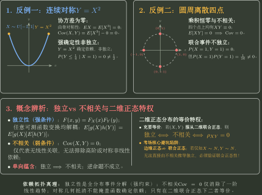
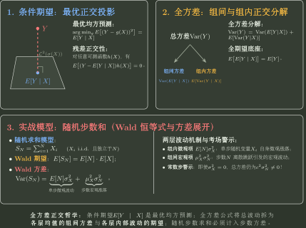

# 期望、方差与协方差的计算边界

> 训练定位：训练数字特征题中先判断目标只需要哪一种分布摘要，再选择线性期望、二阶矩、条件分解或独立性接口，并阻断“零协方差就是独立”等越级推理。  
> 模型归属：[数字特征与依赖摘要](数字特征与依赖摘要.tex) 负责期望、方差、协方差、相关系数与条件分解的理论机制；本文只负责题目路由、第一动作和边界检查。
>
> **术语约定**：本文说“LOTUS 路线”时，专指不先求 $Y=g(X)$ 的完整分布，而直接按 $X$ 的分布计算 $E[g(X)]$；离散型写成 $\sum_x g(x)P(X=x)$，有密度时写成 $\int g(x)f_X(x)\,\mathrm{d}x$。

## 1. 数字特征是对完整分布的有损压缩

$$
E(X),\quad D(X),\quad \operatorname{Cov}(X,Y)
$$

分别保留位置、波动尺度和线性共同变化的一部分信息。

因此题目只问数字特征时，不应默认构造完整分布；反过来，仅凭这些摘要也通常不能恢复联合分布或独立性。

---

## 2. 局部规则：期望先利用线性，不先求和的完整分布

**触发信号**：目标是

$$
E(aX+bY+c)
$$

或计数变量之和的期望。

**第一动作**：直接用

$$
E(aX+bY+c)=aEX+bEY+c.
$$

**检查与退出**：线性期望不要求独立；若只问期望，完成后停止，不为了“形式完整”额外求联合分布。

---

## 3. 方差题先决定走定义还是拆协方差

常用接口：

$$
D(X)=E(X^2)-[EX]^2,
$$

$$
D(aX+bY)=a^2D(X)+b^2D(Y)+2ab\operatorname{Cov}(X,Y).
$$

### 局部规则：线性组合方差先写完整协方差项

**触发信号**：$aX+bY$、样本差、多个相关变量之和。

**第一动作**：先写完整方差展开，再根据独立/不相关等已知条件删项。

**检查与退出**：不能因为两个变量“来自两组数据”就自动写独立；配对数据尤其要保留协方差。

---

## 4. 独立能推出不相关，但零协方差一般不能反推独立

若相关期望存在且 $X,Y$ 独立，则

$$
E(XY)=EX\,EY,
$$

所以

$$
\operatorname{Cov}(X,Y)=0.
$$

反向一般错误。

### 局部规则：问独立性时不要停在协方差

**触发信号**：算出 $\operatorname{Cov}(X,Y)=0$，题目继续问独立。

**第一动作**：回到联合分布/支撑，检查

$$
F_{X,Y}=F_XF_Y
$$

或密度/PMF 分解。

**检查与退出**：只有联合正态等特殊结构下，零相关才可升级为独立。



---

## 5. 方差为零：是“几乎处处常数”，不是逐点恒等

$$
D(X)=0
\iff
P\{X=EX\}=1.
$$

概率模型允许在零概率集合上出现例外。

> **易错边界：** 不能从 $D(X)=0$ 无条件写成随机变量作为函数在每个 $\omega$ 上都严格相等；正确层级是几乎必然相等。

---

## 6. 相关系数退化前先查方差

$$
\rho_{XY}
=
\frac{\operatorname{Cov}(X,Y)}{\sqrt{D(X)D(Y)}}
$$

要求

$$
D(X)>0,\qquad D(Y)>0.
$$

如果某个方差为 0，协方差仍可定义，但相关系数分母失效。

### $\lvert\rho\rvert=1$ 的真正含义

在非退化条件下：

$$
\lvert\rho\rvert=1
\iff
Y=aX+b\quad\text{几乎必然},
$$

其中 $a$ 的正负决定相关系数符号。

---

## 7. 条件结构明显时优先全期望/全方差

若题目按层生成：先抽 $X$，再根据 $X$ 生成 $Y$，则：

$$
EY=E[E(Y\mid X)],
$$

$$
D(Y)=E[D(Y\mid X)]+D(E[Y\mid X]).
$$



### 局部规则：分层模型不要急着先求边缘密度

**触发信号**：题目直接给 $Y\mid X$ 的分布或条件均值/方差，只问 $EY,DY$。

**第一动作**：先走全期望/全方差，把“层内噪声 + 层间均值变化”分开。

**检查与退出**：若后面继续问完整密度或独立性，再转联合/边缘专题；数字特征已闭合时停止。

---

## 8. 常见分布的均值方差表是校验器，不是生成器

知道

$$
X\sim\operatorname{Bin}(n,p)
$$

可以读出

$$
EX=np,\qquad D(X)=np(1-p).
$$

但训练时仍应能解释：二项是独立 Bernoulli 指示变量之和，因此期望由线性相加，方差由独立相加。

这样分布表即使忘记，也能重新生成。

---

## 9. 只求摘要时优先绕过完整分布

### 局部规则：函数变换只问数字特征时先走 LOTUS

**触发信号**：$Y=g(X)$ 或 $g(X_1,\ldots,X_n)$，目标只问期望、方差或协方差。

**第一动作**：优先从原变量直接计算 $E[g(X)]$、二阶矩或协方差，不先求 $Y$ 的完整 CDF/PDF。

**检查与退出**：确认所需矩存在，方差展开不能静默删除依赖项；若目标还要分位点、密度或条件分布，再转回 Topic03/04。

### 局部规则：最大最小只问期望时先做代数降维

**触发信号**：只要求 $E\max(X,Y)$、$E\min(X,Y)$、两者乘积或差，而不是完整极值分布。

**第一动作**：先调用逐点恒等式
$$
\max+\min=X+Y,\qquad \max-\min=\lvert X-Y\rvert,\qquad \max\min=XY.
$$
于是极值期望常可降成 $EX,EY,E\lvert X-Y\rvert$；乘积期望则降成 $E(XY)$，只有进一步拆成 $EX\,EY$ 时才需要独立性。

**检查与退出**：代数恒等式本身不需要独立；若题目要求极值的 CDF/PDF，转 Topic03/04 的事件路线，不能用几个数字特征替代完整分布。

### 局部规则：高阶矩先归一化并区分原点矩/中心矩

**触发信号**：级数型 PMF/PDF、高阶原点矩、绝对矩或二阶矩。

**第一动作**：先确认总质量为 $1$ 与矩存在性；能识别标准分布时调用其矩结构，否则用 LOTUS 逐项求和/积分。

**检查与退出**：$E(X^2)=D(X)+[EX]^2$，不能把方差当原点二阶矩；求和起点、参数尺度和绝对可积性都要核对。目标矩已得到时不额外构造 CDF。

### 局部规则：绝对偏差先锁定中心再按支撑分层

**触发信号**：$E\lvert X-c\rvert$、平均绝对偏差或绝对误差。

**第一动作**：先确认 $c$ 是常数、总体均值还是随机估计量；固定中心时按 $X<c,X=c,X>c$ 分段求和/积分。

**检查与退出**：不能用 $\sqrt{D(X)}$ 代替平均绝对偏差；若中心本身随机，先判断是否需要联合/条件期望。分层计算闭合后停止构造 $\lvert X-c\rvert$ 的完整分布。

## 10. 计数、界与尾积分

### 局部规则：计数期望先用示性变量，方差再处理依赖

**触发信号**：问“满足条件的个数”或命中数的期望。

**第一动作**：写 $N=\sum_i I_{A_i}$，直接使用 $EN=\sum_iP(A_i)$。

**检查与退出**：期望线性不需要独立；只有问方差/分布时才展开 $P(A_i\cap A_j)$。目标只是期望时立即停止。

### 局部规则：概率上界按已知矩信息分流

**触发信号**：不给完整分布，只给非负性、均值、方差或单侧方向，要求概率界。

**第一动作**：非负量先比较 Markov，双侧偏差用 Chebyshev；若课程/题面允许单侧矩界，再考虑相应单侧版本。

**检查与退出**：阈值为正、所需矩存在，输出必须写成“上界”而非精确概率；若完整分布足以精确计算，优先精确值。

### 局部规则：非负等待时间的期望先试尾积分/尾和

**触发信号**：寿命、等待时间、停止时刻或非负极值的期望。

**第一动作**：连续非负量试 $EX=\int_0^\infty P(X>t)\,dt$；非负整数变量使用尾和。

**检查与退出**：先确认非负性与尾部可积；若尾表达比直接 LOTUS 更复杂，立即换路。尾积分发散时标记期望不存在，不继续套有限期望公式。

## 11. 混合与分层摘要

### 局部规则：看到分布函数/密度的凸组合，先按混合层读数字特征

**触发信号**：题面直接给
$$
F(x)=\sum_jw_jF_j(x)
\quad\text{或}\quad
f(x)=\sum_jw_jf_j(x),
\qquad w_j\ge0,\ \sum_jw_j=1,
$$
并只问期望、方差或二阶矩。

**第一动作**：把 $w_j$ 解释为选择第 $j$ 个总体的概率，直接写
$$
EX=\sum_jw_j\mu_j,
$$
二阶矩同理按权重相加；方差优先用“层内方差加权 + 层间均值方差”，不要为了期望先对 CDF 求导再积分。

**检查与退出**：各分量必须真的是合法分布且权重非负、和为 $1$；方差不能只做 $\sum w_j\sigma_j^2$，还要检查层间均值差异。只问数字特征时在加权摘要闭合处停止。

### 局部规则：多类别计数先用固定总数约束降维

**触发信号**：$N_1,\ldots,N_r$ 是固定 $n$ 次试验中各类别出现次数，目标估计量/统计量是这些计数的线性组合，并要求方差或协方差。

**第一动作**：先写确定约束
$$
N_1+\cdots+N_r=n.
$$
若目标只涉及若干计数的和，优先用该约束消去一个或多个变量。例如 $N_2+N_3=n-N_1$，则
$$
D(N_2+N_3)=D(N_1),
$$
无需先分别求 $D(N_2),D(N_3),\operatorname{Cov}(N_2,N_3)$。

**检查与退出**：总数约束只在“每次恰落入一个类别且总试验次数固定”时成立；若计数来自可重叠事件或随机停止时刻，不能套。降维后若目标方差已由单个二项计数闭合，就停止展开完整多项分布。

### 局部规则：混合与平均先用全方差，不比较表面分布

**触发信号**：随机选择某一变量/组形成混合，并与平均或加权和比较方差、协方差。

**第一动作**：引入选择指标 $G$，先算条件均值与条件方差，再用全期望/全方差保留层内波动和层间均值差异。

**检查与退出**：混合方差不能漏掉 $D(E[Y\mid G])$；随机选择与算术平均不是同一操作；边缘同分布或边缘正态不推出独立。只问数字特征时在分解闭合后停止。

### 局部规则：条件数字特征先保留“信号 + 层内噪声”

**触发信号**：给 $Y\mid X$ 的分布或条件均值/方差，要求 $EY,DY,\operatorname{Cov}(X,Y)$。

**第一动作**：令 $m(X)=E(Y\mid X)$；期望走 $E[m(X)]$，方差保留 $E[D(Y\mid X)]+D(m(X))$，协方差可先化成 $\operatorname{Cov}(X,m(X))$。

**检查与退出**：条件均值与条件方差承担不同信息，不能互相替代；若目标只是这些摘要，不为得到完整边缘密度继续积分。

---

## 12. 一页调用链

```text
数字特征题
→ 只问期望？先线性
→ 方差？先完整展开协方差
→ 有条件生成层？全期望 / 全方差
→ 问独立？协方差不够，回联合分布
→ 相关系数？先查两个方差非零
```

核心：

$$
\boxed{\text{只计算目标需要的摘要，但绝不把低维摘要越级解释成完整分布结构}.}
$$
