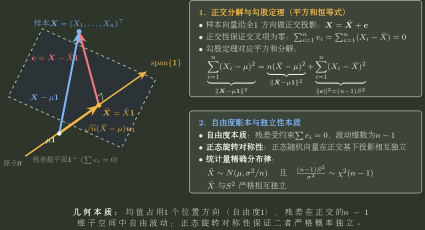

# 抽样分布与标准化

> 训练定位：训练正态样本与一般样本的统计量题中先辨统计量身份、自由度与有限样本资格，再选择正态、$\chi^2$、$t$、$F$ 或渐近分布。  
> 模型归属：[总体、样本与抽样分布](总体样本与抽样分布.tex) 负责样本统计量、自由度与精确抽样分布的理论机制；本文只负责题面路由、标准化和错误阻断。

## 1. 统计量题先问“这个量是由哪些随机方向组成的”

同一个样本可以构造：

$$
\bar X,\qquad S^2,\qquad \sum(X_i-\bar X)^2,
$$

它们保留的信息不同，抽样分布也不同。

正态总体的特殊性在于均值方向与残差方向正交且独立，从而产生精确的 $t,\chi^2,F$ 结构。

### 局部规则：抽样分布题先记“生成链账本”

**触发信号**：出现 $Z,t,\chi^2,F$ 或自由度选择。

**第一动作**：写四项：总体/抽样机制、统计量、真实方差尺度、独立随机方向数；再匹配精确分布。

**检查与退出**：均值未知并用 $\bar X$ 中心化会消耗一个方向；配对样本先转差值样本；Welch 自由度属于近似而非有限样本精确量。账本闭合后才查分位点。

---

## 2. 局部规则：样本均值标准化分母是 $\sigma/\sqrt n$

**触发信号**：$X_i\sim N(\mu,\sigma^2)$ 独立，出现 $\bar X$。

**第一动作**：写

$$
E\bar X=\mu,
\qquad
D(\bar X)=\frac{\sigma^2}{n},
$$

所以

$$
\frac{\bar X-\mu}{\sigma/\sqrt n}
=
\frac{\sqrt n(\bar X-\mu)}{\sigma}
\sim N(0,1).
$$

**检查与退出**：旧笔记曾误写成除以 $\sigma\sqrt n$，会把尺度缩小 $n$ 倍；永久阻断。

### 局部规则：给定样本均值落区间概率时，把样本量藏进标准化阈值

**触发信号**：已知总体均值、方差，要求 $P\{a<\bar X<b\}$ 达到某个水平并反求最小样本容量 $n$。

**第一动作**：先写 $\bar X$ 的精确或渐近标尺，再标准化。若区间恰以 $\mu$ 为中心、半宽为 $d$，则正态总体下
$$
P\{\lvert \bar X-\mu\rvert<d\}
=P\left\{\lvert Z\rvert<\frac{d\sqrt n}{\sigma}\right\}.
$$
要求覆盖至少 $1-\alpha$ 时，直接转成
$$
\frac{d\sqrt n}{\sigma}\ge z_{\alpha/2}
$$
（按本项目上尾分位点约定），再解 $n$。

**检查与退出**：$n$ 必须向上取整；非对称区间不能硬拆成相等两尾，应保留两个标准化端点。若总体非正态且仅靠 CLT，则结论是近似样本量而非有限样本精确保证。

---

## 3. 方差未知时的 $t$ 分布依赖正态总体

若正态样本且

$$
S^2=\frac1{n-1}\sum(X_i-\bar X)^2,
$$

则

$$
T=\frac{\bar X-\mu}{S/\sqrt n}
\sim t(n-1).
$$

### 局部规则：看到 $S$ 替代 $\sigma$ 先检查是否正态样本

**触发信号**：样本均值标准化中用样本标准差 $S$。

**第一动作**：确认总体正态与自由度定义，再套精确 $t$。

**检查与退出**：一般总体大样本可有渐近 Student 化，但不能把它写成有限样本精确 $t$。

---

## 4. $\chi^2$：先标准化每个独立正态方向，再数自由度

若 $Z_i$ 独立标准正态，则

$$
\sum_{i=1}^k Z_i^2\sim\chi^2(k).
$$

### 局部规则：平方和题先核对每一项的方差尺度

**触发信号**：正态变量平方和、残差平方和。

**第一动作**：把每一项写成

$$
\left(\frac{W_i}{\sqrt{D(W_i)}}\right)^2.
$$

再数独立方向。

**检查与退出**：$W^2$ 只有在 $W\sim N(0,1)$ 时才直接是 $\chi^2(1)$；方差不是 1 时必须除尺度。

---

## 5. 自由度不是公式下标，而是独立随机方向数

减去样本均值后有确定约束

$$
\sum_{i=1}^n(X_i-\bar X)=0,
$$

所以残差只剩 $n-1$ 个独立方向。

这解释了

$$
\frac{(n-1)S^2}{\sigma^2}\sim\chi^2(n-1).
$$



---

## 6. 两样本先分“独立”还是“配对”

独立两样本均值差：

$$
D(\bar X-\bar Y)
=
\frac{\sigma_X^2}{n_X}+\frac{\sigma_Y^2}{n_Y}.
$$

配对样本应先定义

$$
D_i=X_i-Y_i,
$$

转成单样本问题；协方差不能无条件删掉。

### 局部规则：看到“两组数据”不要自动套独立两样本

**触发信号**：前后测量、同一对象成对观测、题面明确配对。

**第一动作**：先构造差值样本 $D_i$。

**检查与退出**：只有明确独立抽样时才走独立两样本方差相加。

---

## 7. 一页调用链

```text
统计量分布
→ 先辨总体是否正态
→ 统计量是哪一个方向/平方和？
→ 均值：σ/√n
→ 残差平方和：标准化后 χ²，数自由度
→ σ未知且正态：t
→ 两个独立 χ² 比：F
→ 两组数据先判独立/配对
```

核心：

$$
\boxed{\text{先还原统计量的生成方向，再记分布名字；自由度就是仍然独立的方向数}.}
$$
