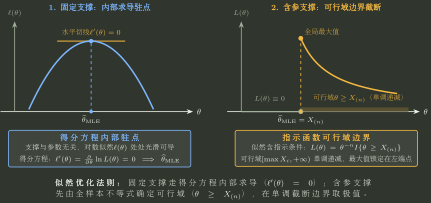

# 参数估计与似然边界

> 训练定位：训练矩估计和极大似然题中先数参数、写参数域与样本可行域，再决定矩方程、求导或边界最大化路线，并区分估计量与观测后的估计值。  
> 模型归属：[参数估计与假设检验](参数估计与假设检验.tex) 负责估计量、矩估计、似然、无偏/相合与检验的理论机制；本文只负责题面路由、第一动作和边界检查。
>
> **术语约定**：MLE 指最大似然估计，即在参数可行域内使似然达到全局最大值的估计方法；MSE 指均方误差，$\operatorname{MSE}(\widehat\theta):=E[(\widehat\theta-\theta)^2]$。两者分别是“怎样构造估计”和“怎样评价平方误差”，不能混成同一目标。

## 1. 估计不是“把参数算出来”，而是用随机样本构造参数信息

估计前：

$$
\hat\theta=T(X_1,\ldots,X_n)
$$

是随机变量，叫估计量。

观察到数据 $x_1,\ldots,x_n$ 后：

$$
\hat\theta=T(x_1,\ldots,x_n)
$$

才得到一个数值估计。

这个大小写边界能避免把抽样分布和某次样本结果混在一起。

---

## 2. 局部规则：矩估计先数未知参数，再选足够的矩

**触发信号**：要求矩估计，分布含一个或多个未知参数。

**第一动作**：先数参数维数。一个参数通常从

$$
E_\theta X=\bar X
$$

开始；多个参数再逐步加入二阶矩等：

$$
E_\theta X^2=\frac1n\sum X_i^2.
$$

**检查与退出**：矩方程必须真的含目标参数且彼此提供独立信息；一阶矩不含参数时应换用二阶或其他可用矩，而不是机械坚持“前 $k$ 阶”。若题面已经声明 $f(x;\theta)$ 是一族合法密度，$\int f(x;\theta)dx=1$ 通常只是模型合法性的恒等式，不是来自样本的估计方程；只有未归一化常数尚未闭合时才先用归一化确定模型。解出的参数必须落在原参数域；若矩方程多解，还要检查可识别性和合法支撑。

### 局部规则：先数自由参数，不按题面字母个数机械数维数

**触发信号**：密度/分布律中同时出现多个未知符号，但题面还给“这是概率密度/分布律”等合法性条件，或参数之间存在确定约束。

**第一动作**：先用归一化、参数域或题面结构关系写出参数空间约束。例如由
$$
\int f(x;a,b)\,dx=1
$$
若得到 $b=h(a)$，则后续只剩一个自由参数；把 $b=h(a)$ 先代回模型，再做矩估计或似然。

**检查与退出**：这一步只是确定模型的自由度，不是利用样本估计参数；不能把“归一化约束 + 一个样本矩”误记成“两条样本信息”。自由参数维数确认后再决定需要多少独立矩方程或优化变量。

---

## 3. 似然的第一动作是写“参数可行域”，不是求导

给样本 $x_1,\ldots,x_n$：

$$
L(\theta)=\prod_{i=1}^n f_\theta(x_i).
$$

若支撑依赖参数，似然不仅由密度公式决定，还带着“哪些参数能让当前样本发生”的指示条件。

### 局部规则：参数进入支撑时先看样本极值

**触发信号**：均匀分布未知端点、截断分布、支撑形如 $0<x<\theta$ 或 $x>\theta$。

**第一动作**：先由所有样本同时合法得到参数约束，例如

$$
\theta\ge X_{(n)}.
$$

再在这个可行域上最大化似然。

**检查与退出**：最大值常在边界，不能默认“取对数 → 求导 → 令零”。



---

## 4. 对数似然只改变计算形式，不改变可行域

当 $L(\theta)>0$ 时，$\log$ 单调，所以最大化

$$
\ell(\theta)=\log L(\theta)
$$

与最大化 $L$ 等价。

### 局部规则：先保留支撑指示，再取对数简化乘积

**触发信号**：乘积似然含指数、幂次。

**第一动作**：先写参数域/样本可行域；在可行区域内部取对数，把乘积变和。

**检查与退出**：对数不会替你处理边界和不可行参数；不能把密度为 0 的区域直接取对数后“忘掉”。

---

## 5. 求导得到的是内部驻点候选，不保证全局最大

若

$$
\ell'(\theta)=0,
$$

只得到内部候选。

还要检查：

- 参数域边界；
- 二阶导/单调性；
- 多个驻点；
- 支撑跳变处。

$$
\boxed{\text{MLE 是全局优化问题，求导只是其中一种候选生成器}.}
$$

---

## 6. 顺序统计量常直接进入边界型 MLE

对于 $U(0,\theta)$ 等模型，样本合法要求

$$
X_{(n)}=\max_iX_i\le\theta.
$$

似然在可行域内部可能随 $\theta$ 单调，因此 MLE 就落在最小合法边界：

$$
\hat\theta=X_{(n)}.
$$

这不是“最大值分布的巧合”，而是支撑本身携带了参数信息。

---

## 7. 无偏、相合、方差小是不同评价维度

- 无偏：$E\hat\theta=\theta$；
- 相合：$\hat\theta\to\theta$（指定收敛方式）；
- MSE：同时看偏差与方差。

### 局部规则：题目问什么性质就用对应定义

**触发信号**：比较估计量优劣、求系数使无偏/最小 MSE。

**第一动作**：先写题目指定评价目标；无偏问题取期望，MSE 问题展开

$$
\operatorname{MSE}=D(\hat\theta)+\operatorname{Bias}^2.
$$

**检查与退出**：无偏不自动推出方差最小，相合也不自动推出有限样本无偏；$E\hat\theta=\theta$ 也一般不能推出 $E[g(\hat\theta)]=g(\theta)$，非线性变换后的无偏性必须重新取期望验证。

---

## 8. 一页调用链

```text
参数估计
→ 先写参数域 + 样本可行域
→ 矩估计：数参数 → 配矩 → 解方程 → 回参数域
→ MLE：写完整似然 → 支撑是否含参数？
   ├─ 是：先边界
   └─ 否：再取 log / 求导
→ 检查全局最大
→ 区分估计量与观测估计值
→ 按题目指定性质评价
```

核心：

$$
\boxed{\text{似然不仅看样本“有多可能”，还必须先看这个参数是否允许样本存在}.}
$$
