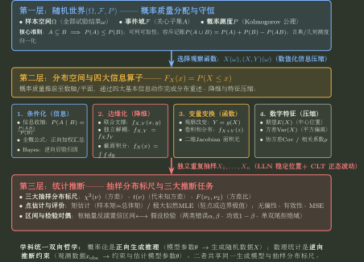

# 概率论与数理统计统一总图

> 类型：Atlas
> 状态：待人工确认；README 是 Canonical Subject Atlas 候选。八个 Topic 已完成旧九章原子级 Source Diff、跨册 Owner/术语/参数化复审，并与现有数学一真题全量分类底账交叉核验；当前可读取真题的 P01--P08 路由与代表题计算证据已闭合。尚未升级为“已采用”的原因只剩使用者确认与陌生题表现证据；1994 原卷缺失、2022 末段题源损坏等来源缺口继续按 Evidence 边界保留。单一问题族的考试动作优先进入各 Topic 同目录训练 Markdown；跨多个训练专题稳定复用并经证据验证的控制另见[概率统计做题规则](../90_学科做题规则/概率统计.md)。
>
> 工作标题：《概率论与数理统计：从随机世界到统计推断——随机对象、信息条件与分布变换的统一心智模型》
>
> 训练入口：[概率统计训练手册](概率统计训练手册.md) —— 将 P01--P08 Canonical/Practice 与源稿题族组织成对象识别、第一动作、边界攻击、独立验算与错误回写的训练闭环；不重复拥有理论。

## 先定义再使用：全册关系记号约定

概率论里最危险的不是公式长，而是**同一个符号被误读成不同关系**。本学科从这里开始固定记号；后文第一次调用时仍应用文字点名关系，不允许只丢一个符号让读者猜。

| 关系 | 本仓库记号 | 正式含义 | 明确不表示 |
|---|---|---|---|
| 事件独立 | $A\perp\!\!\!\perp B$ | $P(A\cap B)=P(A)P(B)$ | 不表示几何“垂直”，也不表示互斥 |
| 随机变量独立 | $X\perp\!\!\!\perp Y$ | 对任意 $x,y$，$F_{X,Y}(x,y)=F_X(x)F_Y(y)$；等价地说，由 $X,Y$ 产生的信息相互独立 | 不表示协方差为零，也不表示向量正交 |
| 几何正交 | $u\perp v$ | 在当前内积下 $\langle u,v\rangle=0$ | 一般不能推出概率独立 |
| 事件互斥 | $A\cap B=\varnothing$ | 两事件不能同时发生 | 不表示独立；正概率互斥事件反而不独立 |
| 独立同分布 | $X_1,\ldots,X_n\ \text{i.i.d.}$ | 相互独立，且具有同一分布 | 不只表示“边缘分布相同” |
| 同分布 | $X\overset{d}{=}Y$ | $X,Y$ 的分布相同 | 不表示 $X=Y$ 几乎处处，也不表示二者独立 |
| 依概率收敛 | $X_n\xrightarrow{P}X$ | 对任意 $\varepsilon>0$，$P(\lvert X_n-X\rvert>\varepsilon)\to0$ | 不等于有限 $n$ 时已经相等 |
| 依分布收敛 | $X_n\xrightarrow{d}X$ | 分布函数在极限分布的连续点处收敛 | 一般不表示样本点逐点接近 |
| 几乎必然 / 几乎处处 | $X=Y\ \text{a.s.}$ | $P(X=Y)=1$；允许在一个零概率集合上不相等 | 不表示逐个样本点都严格相等 |
| 不相关 | $\operatorname{Cov}(X,Y)=0$ | 在二阶矩存在时，线性交叠为零 | 一般不能推出独立 |
| 两两独立 | 任意两个事件/变量独立 | 只检查二元子族 | 不等于整个事件族相互独立 |
| 相互独立 | 任意有限非空子族的联合概率都按乘积结构分解 | 控制所有阶联合关系 | 不能只靠两两独立代替 |

> **术语禁区：不要说“事件垂直”。** 单个 `$\perp$` 在本仓库只保留给内积意义下的几何正交；概率独立统一写成双竖独立记号 `$\perp\!\!\!\perp$`，并在首次出现处回到定义。这样 B09/B10 中的“正交”和 P02/P04/P05/P07 中的“独立”从符号层就不会混为一谈。

## 定位

本 Atlas 回答三个问题：

1. 概率论与数理统计共同研究什么；
2. 事件、随机变量、分布、样本与统计量分别站在哪一层；
3. 各 Topic 怎样由同一组对象和操作生成。

概率论研究：随机机制已知时，数据会怎样生成；数理统计研究：随机机制未知而只看到有限样本时，数据能提供什么关于机制的信息。

$$
\boxed{\text{Probability}:\ \text{Model}\longrightarrow\text{Random Data}}
$$

$$
\boxed{\text{Statistics}:\ \text{Observed Data}\longrightarrow\text{Information about Model}}
$$

统计不是教材后半段突然出现的另一门课。它和概率论使用同一个生成模型，只是提问方向相反。

## 本册结论与心智模型验收标准

本 Atlas 的地图结论不以“公式出现过”作为完成标志。进入 Topic 正文的主干结论，至少要能按五项复原：前提/对象、正式定义或生成机制、关键计算/定理映射、结论、适用边界。若这些环节之间存在数学蕴含，正文应使用等式或 $\Rightarrow$ 明确写出；这里只列证据字段。

对概率论，最低检查具体化为：

| 内容 | 学生应能复原的最小链 | 必须同时说清 |
|---|---|---|
| 条件概率、全概率、Bayes | 条件化的有效世界；完备分割；观察证据后的概率反演 | 分母非零、分割完备、先验/似然/后验各自是什么 |
| CDF、PMF、PDF | 事件集合；分布表示；点概率或区间概率的计算 | PDF 不是点概率；原子、连续部分和混合分布的边界 |
| 联合、边缘、条件与变换 | 联合支撑；求和/积分或取原像；归一化或 Jacobian | 支撑集先于积分；非单调变换要分支；条件密度分母合法 |
| 期望、方差、协方差与概率界 | 定义/示性变量；线性或平方展开；条件分解/不等式 | 存在条件、方差非负、界是上界而非精确值 |
| LLN、CLT 与渐近结论 | 标准化对象；波动尺度；明确版本的收敛/极限定理 | 精确分布与近似分布不能混写；每个版本必须写清假设 |
| 抽样分布与参数推断 | 总体模型；样本统计量；抽样分布/枢轴；区间或检验 | 统计量身份、自由度、参数域、尾部方向和结论范围 |

概念理解不能停在术语解释。每个一级概念至少要明确五项：对象、表示、允许的信息操作、操作后保持/丢失的信息、题面信号与第一动作。它们是分析字段，不是一条数学蕴含链。

例如“联合分布到边缘分布”不是把二维公式换成一维公式，而是**主动忘掉另一个变量**；因此依赖结构丢失，不能再从边缘分布单独恢复独立性。学生必须能用一个具体支撑集走完一次，并指出若把边缘误当联合会在哪一步产生错误。证明链负责确认公式，模型链负责决定什么时候使用公式；二者缺一不可。

## Stop Boundary

本文只提供随机世界的地图，不展开：

- 组合计数、二重积分和变量代换的计算训练；
- 每一种常见分布的公式表；
- 每一类矩估计、最大似然估计、区间估计和检验的题型步骤；
- 考场时间分配、路径选择和得分表达。

这些内容不在 Atlas 展开：机制、公式与抽样分布真相归对应 Topic；单一问题族的题型步骤归同目录训练 Markdown；只有跨多个训练专题稳定复用并经证据验证的路径控制才晋升学科做题规则，时间、退出、返回与风险控制归考试控制层。考试大纲每年的范围变化是外部约束，不参与定义本学科的母模型。

---

## 一、母模型不是单线阶梯，而是一张对象关系图

把全书按“随机试验、样本空间、事件、随机变量、分布、联合分布、数字特征”的顺序列出来有导航价值，但不能把它当成严格的“对象升级链”。联合分布不是普通分布的更高版本，数字特征也不要求先经过联合分布。更准确的结构是：

$$
\boxed{(\Omega,\mathcal F,P)}
\xrightarrow{\text{选择观察函数}}
\boxed{X,\ (X,Y),\ T(X_1,\ldots,X_n)}
\xrightarrow{\text{诱导}}
\boxed{\text{Distribution}}
$$

分布建立以后，问题向不同方向分叉：

$$
\begin{aligned}
\text{Distribution}
&\xrightarrow{\text{Condition: 加入信息}}
\text{Conditional Distribution},\\
\text{Joint Distribution}
&\xrightarrow{\text{Marginalize: 忽略变量}}
\text{Marginal Distribution},\\
\text{Distribution of }X
&\xrightarrow{\text{Transform: 改变观察}}
\text{Distribution of }g(X),\\
\text{Distribution}
&\xrightarrow{\text{Summarize: 压缩}}
\text{Expectation / Variance / Other Features}.
\end{aligned}
$$

重复抽样又建立第二条轴：

$$
\text{Population Model}
\longrightarrow
(X_1,\ldots,X_n)
\longrightarrow
T(X_1,\ldots,X_n)
\longrightarrow
\text{Sampling Distribution}
\longrightarrow
\text{Inference}.
$$

因此，全书真正需要维护的是三层对象和两种方向：

| 层 | 核心对象 | 核心问题 |
|---|---|---|
| 随机世界 | $(\Omega,\mathcal F,P)$ | 哪些结果可能发生，哪些事件可讨论，概率怎样分配？ |
| 观察与分布 | $X,(X,Y),g(X,Y)$ 及其分布 | 我们观察什么，概率质量怎样被映射到取值空间？ |
| 样本与推断 | $X_1,\ldots,X_n,T,\theta$ | 有限随机样本能提供多少关于未知模型的信息？ |

正向是“模型生成数据”，反向是“数据约束模型”。

---

## 二、随机世界：先分清结果、事件与概率

### 1. 随机试验产生基本结果

样本空间 $\Omega$ 收集一次试验所有可能的基本结果。掷一次骰子时：

$$
\Omega=\{1,2,3,4,5,6\}.
$$

$\omega=3$ 是一次具体结果，不是事件的概率，也不是随机变量本身。

### 2. 事件是结果的集合

若关心“点数为偶数”，则

$$
A=\{2,4,6\}\subseteq\Omega.
$$

严格地说，可讨论的事件组成事件族 $\mathcal F$。数学一通常不要求从公理构造 $\sigma$-代数，但必须保留对象边界：

$$
\boxed{\omega\in\Omega,\qquad A\in\mathcal F,\qquad \omega\neq A.}
$$

### 3. 概率是定义在事件上的规则

概率测度 $P$ 把事件映射到 $[0,1]$：

$$
P:\mathcal F\to[0,1].
$$

所以 $P(A)$ 的问题是“事件 $A$ 发生的可能程度”，而不是“结果 $A$ 的数值是多少”。

这三类对象构成概率论的地基：

$$
\boxed{\text{Outcome}\neq\text{Event}\neq\text{Probability}.}
$$

---

## 三、随机变量：选择怎样观察随机世界

随机变量不只是“取值随机的变量”。正式地，实随机变量是可测函数

$$
\boxed{X:(\Omega,\mathcal F)\to(\mathbb R,\mathcal B(\mathbb R))},
$$

即对任意 Borel 集 $B\in\mathcal B(\mathbb R)$，都有 $X^{-1}(B)\in\mathcal F$。数学一通常不要求证明可测性，但这个定义保证“$X$ 落入某个数值集合”对应一个可以赋概率的事件。定义明确以后，可以把 $X$ 直观理解成对随机世界选择的一种数值观察方式。

掷两枚硬币时：

$$
\Omega=\{HH,HT,TH,TT\},
$$

定义 $X$ 为正面个数，则

$$
HH\mapsto2,\qquad HT\mapsto1,\qquad TH\mapsto1,\qquad TT\mapsto0.
$$

随机性原本存在于未知的试验结果 $\omega$。$X$ 没有制造新的随机性，而是完成一次有目的的信息压缩：

$$
\boxed{\text{复杂随机结果}\xrightarrow{X}\text{当前问题关心的数值}.}
$$

同一个随机世界可以选择不同观察函数。例如同一次抛硬币序列可以观察：

- 第一次是否成功；
- 成功总数；
- 第一次成功出现的位置；
- 最长连续成功段长度。

题目改变随机变量，通常不是改变底层试验，而是改变“我们保留什么信息”。

### 随机向量不是另一种随机世界

二维随机变量 $(X,Y)$ 是在同一个 $\omega$ 上同时进行两种观察；正式地，它是可测映射

$$
(X,Y):(\Omega,\mathcal F)\to(\mathbb R^2,\mathcal B(\mathbb R^2)).
$$

二维真正新增的不是“多了一个字母”，而是两个观察量之间的依赖结构：知道 $Y$ 后，对 $X$ 的不确定性是否改变？

---

## 四、分布：观察函数把概率结构推到取值空间

给定随机变量 $X$，它的分布是概率测度 $P$ 在 $X$ 下的推前测度：

$$
P_X:=P\circ X^{-1}.
$$

因此对任意 Borel 集 $B$，

$$
P_X(B)=P(X\in B)=P\bigl(\{\omega:X(\omega)\in B\}\bigr).
$$

定义之后再作直观解释：原来定义在 $\Omega$ 上的概率结构，被 $X$ 搬到取值空间上。它回答：

> 概率质量怎样落在 $X$ 的取值空间上？

分布函数

$$
F_X(x)=P(X\le x)
$$

是通用表示；离散型可进一步用概率质量函数，具有密度的连续型可用概率密度函数。三者不是三个并列的新对象，而是描述分布的不同表示。

必须保留两个边界：

1. 不是每个分布都有密度，但每个实随机变量都有分布函数；
2. 连续型随机变量的密度值 $f_X(x)$ 是概率强度，不是点概率，通常 $P(X=x)=0$。

因此：

$$
\boxed{\text{Random Variable}\neq\text{its realization}\neq\text{its distribution}.}
$$

$X$ 是抽样前的随机对象，$x$ 是一次观察值，$P_X$ 或 $F_X$ 描述 $X$ 的概率规律。

---

## 五、分布计算的三种基本操作

Condition、Marginalize 和 Transform 不是全书全部计算动作，却是处理“分布与信息”的三种基本动作。求和、取极值、构造统计量等通常都可以看成 Transform；求期望和方差则属于从分布提取 Summary。

### 1. Condition：加入信息，重述当前世界

从 $P(A)$ 变为 $P(A\mid B)$，不是给公式多放一个分母，而是已知 $B$ 发生后，只在与 $B$ 相容的世界中重新归一化概率：

$$
P(A\mid B)=\frac{P(A\cap B)}{P(B)},\qquad P(B)>0.
$$

直观上：

$$
\boxed{\Omega\xrightarrow{\text{know }B}B\text{ becomes the effective world}.}
$$

全概率公式沿“原因的完备划分”正向汇总结果；Bayes 公式则在观察到结果后，重新分配对不同原因的相对相信程度：

$$
\boxed{\text{Prior}\xrightarrow{\text{Evidence}}\text{Posterior}.}
$$

边界提醒：对连续型变量写 $X\mid Y=y$ 时，事件 $\{Y=y\}$ 往往概率为零，不能直接套事件条件概率分式。数学一范围内通常通过联合密度与边缘密度定义条件密度；直觉仍是“加入信息后重新描述分布”。

### 2. Marginalize：忘掉不再区分的信息

已知 $(X,Y)$ 的联合分布，只关心 $X$ 时，把所有与同一个 $X$ 相容的 $Y$ 情况加总：

$$
f_X(x)=\int_{-\infty}^{\infty}f_{X,Y}(x,y)\,dy.
$$

离散情形则是求和。其含义是：

$$
\boxed{\text{Joint World}\xrightarrow{\text{forget }Y}\text{Marginal World of }X.}
$$

积分上下限不是永远机械地写 $(-\infty,\infty)$。真正的计算对象是联合支撑集在固定 $x$ 截面上的允许 $y$ 范围。

### 3. Transform：改变观察函数

若 $Y=g(X)$，没有产生新的底层随机性，只是把观察函数从 $X$ 改成 $g\circ X$：

$$
\Omega\xrightarrow{X}\mathbb R\xrightarrow{g}\mathbb R.
$$

核心问题是概率质量怎样经过 $g$ 被搬运、合并或拉伸。对于 $Y=X^2$，$x$ 与 $-x$ 会落到同一个 $y$；若忽略多对一映射，机械的一元求导公式就会漏掉概率来源。

变量变换的具体计算必须处理支撑集、像空间、单射/多对一分支、原像枚举以及 CDF/Jacobian 路线选择；这些执行细节由 Topic04 与同目录训练 Markdown Own，Atlas 只保留“Transform 改变观察函数并搬运概率质量”这一接口语义。

### 三种操作之间不能随意交换

先条件化再边缘化、先变换再条件化，可能得到不同对象。尤其是：

- 独立变量在给定它们的和后通常不再独立；
- 忽略一个共同原因，可能掩盖或改变可见依赖；
- 非单射变换会丢失原变量的符号等信息。

所以操作前必须同时写清“当前对象”和“保留的信息”。

---

## 六、多维世界的母模型：Joint、Marginal、Conditional 与 Dependence

联合分布回答“多个观察量一起怎样变化”；边缘分布回答“忽略其他量后，单独一个量怎样变化”；条件分布回答“知道一部分观察以后，剩余量怎样变化”。

依赖性则比较：信息加入前后，分布是否改变。

随机变量 $X,Y$ 独立的正式定义是：对任意 Borel 集 $A,B$，

$$
P(X\in A,\,Y\in B)
=
P(X\in A)P(Y\in B).
$$

若联合密度存在，则独立等价于

$$
f_{X,Y}(x,y)=f_X(x)f_Y(y)
$$

几乎处处成立；在条件密度有定义且 $f_Y(y)>0$ 的位置，进一步有

$$
f_{X\mid Y}(x\mid y)=f_X(x).
$$

定义和判据明确之后，才可以用直觉解释：知道 $Y$ 的取值不会给 $X$ 的分布带来新的概率信息。

必须区分：

| 边界 | 真正区别 |
|---|---|
| 独立 vs 互斥 | 独立是不提供概率信息；互斥是不能同时发生。非零概率的互斥事件不独立。 |
| 独立 vs 不相关 | 独立是联合分布解耦；不相关只表示协方差为零，没有线性共同变化。 |
| 边缘 vs 条件 | 边缘是忘掉另一变量；条件是知道另一变量的信息后重述分布。 |

---

## 七、数字特征：有损压缩完整分布

完整分布可能很复杂，数字特征用少量数值压缩某些重要性质：

$$
\boxed{\text{Full Distribution}\longrightarrow\text{A few summaries}.}
$$

| 数字特征 | 回答的问题 | 不能回答什么 |
|---|---|---|
| $E[X]$ | 概率质量的加权中心在哪里？ | 不能单独描述波动和尾部 |
| $\operatorname{Var}(X)$ | 相对均值的平方偏离平均有多大？ | 不能唯一确定分布 |
| $\operatorname{Cov}(X,Y)$ | 两变量是否有线性共同变化趋势？ | 为零不能一般推出独立 |
| $\rho_{X,Y}$ | 无量纲的线性关联强弱与方向如何？ | 不能概括全部非线性依赖 |

“压缩”意味着信息会丢失。均值和方差相同的随机变量可以有完全不同的分布和尾部风险。

若只问 $E[g(X)]$，可以直接基于 $X$ 的分布求

$$
E[g(X)],
$$

并不必然先求 $Y=g(X)$ 的完整分布。这个机制事实由 Topic05 的 Canonical 正文拥有；只问数字特征时何时优先走这条路径，由 Topic05 同目录训练 Markdown 承担。只有同一控制动作跨多个训练专题反复成立并经证据验证，才晋升学科做题规则。

---

## 八、大量重复：稳定位置与剩余波动

从单个随机变量进入 $X_1,\ldots,X_n$ 后，问题不再只是“一个量怎样随机”，而是大量随机性叠加后是否出现稳定结构。

### 大数定律：稳定到哪里

Atlas 只固定一个最常用的经典版本作为坐标：若 $X_1,X_2,\ldots$ 独立同分布，且 $E[X_1]=\mu$、$\operatorname{Var}(X_1)<\infty$，则弱大数定律给出

$$
\bar X_n\xrightarrow{P}\mu.
$$

这里 $\xrightarrow{P}$ 明确表示依概率收敛。定义和条件确定以后，可以直观地说：样本平均的随机波动随重复抽样被压缩，稳定位置由 $\mu$ 决定。

### 中心极限定理：怎样围绕那里波动

同样取经典 iid 版本：若

$$
E[X_1]=\mu,
\qquad
0<\operatorname{Var}(X_1)=\sigma^2<\infty,
$$

则

$$
\frac{\sqrt n(\bar X_n-\mu)}{\sigma}
\xrightarrow{d}
N(0,1).
$$

这里 $\xrightarrow{d}$ 表示依分布收敛。它描述的是把均值误差按 $1/\sqrt n$ 的波动尺度标准化以后，剩余随机形状趋近正态。

因此在这组经典条件下，可以把两者压成：LLN 给稳定位置，CLT 给标准化后的剩余波动尺度与极限形状。

边界提醒：“大量重复”本身不是充分条件。这里给的是方便建立坐标的经典充分条件；其他版本可以放宽独立同分布或矩条件，具体定理版本及证明由 Topic06 Own，不能把本段条件机械当成所有 LLN/CLT 的必要条件。

---

## 九、从概率到统计：同一生成模型的逆向提问

设参数化模型族为 $\{P_\theta:\theta\in\Theta\}$。给定参数 $\theta$ 后，样本的联合分布由模型 $P_\theta$ 决定；这是一条**生成依赖关系**，不是普通函数求逆。

概率论固定模型，研究随机样本会怎样变化；统计学观察

$$
X_1=x_1,\ldots,X_n=x_n
$$

以后，反问哪些 $\theta$ 与这些数据相容，以及数据支持它们到什么程度。

“统计是逆向概率推理”是有效导航，但不是说存在一个普通反函数。不同参数可能生成相似数据，有限样本也不可能唯一恢复真实机制。统计推断必须依靠模型假设、抽样分布和错误风险来校准结论。

### 统计对象分层

$$
\boxed{
\theta
\longrightarrow
(X_1,\ldots,X_n)
\longrightarrow
T(X_1,\ldots,X_n)
\longrightarrow
T(x_1,\ldots,x_n)
}
$$

| 对象 | 抽样前的身份 |
|---|---|
| 参数 $\theta$ | 在经典统计模型中固定但未知 |
| 随机样本 $X_1,\ldots,X_n$ | 来自总体模型的随机变量 |
| 统计量 $T(X_1,\ldots,X_n)$ | 不含未知参数的样本函数，抽样前仍随机 |
| 估计量 $\hat\theta$ | 专门用于估计 $\theta$ 的统计量 |
| 估计值 $\hat\theta(x_1,\ldots,x_n)$ | 代入已观察样本后的具体数值 |

因此：

$$
\boxed{\text{Parameter}\neq\text{Statistic},\qquad
\text{Estimator}\neq\text{Estimate}.}
$$

### 抽样分布是推断的标尺

统计量由随机样本构成，所以抽样前也有分布。正态总体下，$\bar X$、$S^2$、标准化均值和方差比自然产生 Normal、$\chi^2$、$t$、$F$ 等抽样分布。

这些分布不是突然出现的公式清单，而是回答：

> 如果重复抽样，同一个统计量会怎样波动？

只有知道这种波动，才能评价估计误差、构造置信区间或判断一个观察值是否过于极端。

### 三类统计任务

| 任务 | 母问题 |
|---|---|
| 构造点估计 | 用样本的哪个函数代表未知参数？ |
| 评价与区间估计 | 这个估计怎样波动，误差有多大？ |
| 假设检验 | 若 $H_0$ 成立，当前统计量是否极端到应拒绝它？ |

置信区间和检验都依赖抽样分布，但回答不同问题。在经典频率学派表述中，参数固定而未知，区间端点在抽样前是随机的；置信水平校准的是构造方法在重复抽样中的覆盖率，不是观测后参数再次随机落入该固定区间的概率。

检验不是“证明 $H_0$ 错”，而是在预先控制错误风险的规则下作决策。

---

## 十、两个长期母例

### 1. Bernoulli 序列：从事件走到统计推断

设一次试验成功概率为 $p$，令

$$
X_i=\begin{cases}
1,&\text{成功},\\
0,&\text{失败}.
\end{cases}
$$

则

$$
X_i\sim\operatorname{Bernoulli}(p),\qquad
S_n=\sum_{i=1}^nX_i\sim\operatorname{Binomial}(n,p),
$$

$$
E[S_n]=np,\qquad \operatorname{Var}(S_n)=np(1-p),
$$

$$
\bar X=\frac{S_n}{n}
$$

既是样本均值，也是成功比例。大数定律解释 $\bar X$ 为什么靠近 $p$，中心极限定理描述它围绕 $p$ 的近似波动；观察数据后，$\bar x$ 又可以用来估计 $p$。

该母例可以在同一个 Bernoulli 对象上连续观察：事件怎样编码成随机变量；随机变量怎样诱导 Bernoulli 分布；独立重复后怎样形成二项和；和与样本均值怎样给出数字摘要；LLN/CLT 怎样描述重复抽样；观察到具体样本后又怎样进入参数推断。这里是同一母例跨 Topic 的导航，不是一条逻辑蕴含链。

### 2. 正态总体：从统计量走到推断标尺

设

$$
X_1,\ldots,X_n\overset{\mathrm{iid}}{\sim}N(\mu,\sigma^2).
$$

该母例串联：

$$
\bar X,\quad S^2,\quad N,\quad\chi^2,\quad t,\quad F,
$$

以及 $\mu,\sigma^2$ 的点估计、区间估计和假设检验。

两个母例分工不同：Bernoulli 强调离散事件、重复试验和极限；Normal 强调连续分布、线性组合、抽样分布和推断。它们是导航例，不替代反例和其他分布。

---

## 十一、Topic 地图与当前 Ownership

| Part / Topic | 唯一母问题 | 工作态 Owner |
|---|---|---|
| 0 随机世界 | 随机结果、事件与概率分别是什么对象？ | [随机世界：事件与概率](01_随机世界_事件与概率/README.md) |
| I 信息改变概率 | 新信息怎样改变有效随机世界与概率分配？ | [条件概率、独立性与 Bayes](02_条件概率_独立性与Bayes/README.md) |
| II 数值化随机性 | 观察函数怎样诱导分布？ | [随机变量与一维分布](03_随机变量与一维分布/README.md) |
| III 多维与变换 | 联合、边缘、条件与变量变换怎样重组信息？ | [联合分布、条件分布与变换](04_联合分布_条件分布与变换/README.md) |
| IV 分布压缩 | 数字特征保留了什么，又丢失了什么？ | [数字特征与依赖摘要](05_数字特征与依赖摘要/README.md) |
| V 大量重复 | 大量随机量为何出现稳定位置与近似波动形状？ | [大数定律与中心极限定理](06_大数定律与中心极限定理/README.md) |
| VI 样本随机性 | 统计量为何随机，其抽样分布怎样产生？ | [总体、样本与抽样分布](07_总体样本与抽样分布/README.md) |
| VII 从样本反推总体 | 怎样构造、校准并使用统计推断？ | [参数估计与假设检验](08_参数估计与假设检验/README.md) |

八册 Canonical 已完成 Source Diff、跨册核销、真题路由交叉验证与 Published View 同步；当前仍保持“待人工确认”，只表示尚未由使用者正式接受为“已采用”资产，不再表示存在未完成的旧稿迁移。

## 十二、一页压缩：复原全书的七问

面对任一概率统计机制，先问：

1. 底层随机世界和概率模型是什么？
2. 当前观察对象是事件、随机变量、随机向量、样本还是统计量？
3. 它的分布由什么模型诱导？
4. 题目加入了什么信息，又忽略了什么信息？
5. 当前是在条件化、边缘化、变换、摘要，还是重复抽样？
6. 方向是模型生成数据，还是数据反推模型？
7. 结论依赖哪些条件，在哪个边界下会失效？

五句最小主干：

$$
\begin{gathered}
\boxed{\text{事件是结果集合；随机变量是观察随机世界的数值函数。}}\\
\boxed{\text{分布是底层概率经观察函数诱导到取值空间的规律。}}\\
\boxed{\text{条件化加入信息，边缘化忽略信息，变量变换改变观察。}}\\
\boxed{\text{LLN 说明稳定位置，CLT 描述标准化后的剩余波动。}}\\
\boxed{\text{概率从模型推出数据；统计从数据提取关于模型的信息。}}
\end{gathered}
$$

## 十三、全科级概念边界与结果终检

旧版总图的跨 Topic 边界继续保留，但不在 Atlas 复制完整控制表。这里仅记三条总原则：互斥不等于独立、边缘/摘要信息不能越级恢复联合结构、统计推断必须区分参数与统计量以及“拒绝/不拒绝”的证据语言。完整的概念边界表与八项结果终检由[概率统计做题规则](../90_学科做题规则/概率统计.md)统一维护；各局部公式、反例和第一动作仍由对应 Topic Practice 拥有。

## 本轮编辑决定与待人确认项

使用者已授权依据本 Atlas 和旧笔记建立八个 Topic，因此本轮已完成 Topic 切分、跨册核销与发布同步；这不等于下面的长期表达已经被采用：

1. 是否正式采用“随机世界 / 观察函数 / 信息操作”作为全书一级术语；
2. 是否保留“统计是逆向概率推理”，并始终附带“不是普通反函数”的边界；
3. 是否固定 Bernoulli 与 Normal 为两个长期母例；
4. 八个 Topic 的边界是否适合长期保持，还是需要在人工审查后合并或拆分。

人工确认前，Atlas 与 Topic 均保持“待人工确认”，而不是“已采用”。本轮已完成旧九章、旧版总图与现有真题底账的内容核销；后续若再改动，应来自新的真题/陌生题证据或使用者反馈，而不是重复迁移已经核销的旧材料。
