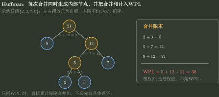
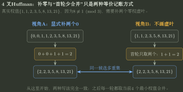
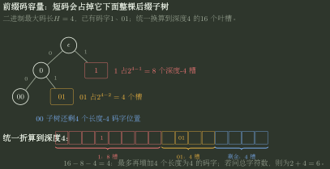

# Huffman 编码与前缀码

> 训练定位：解决二叉/多叉 Huffman 构造、WPL 计算、节点数、补零虚叶、前缀码合法性、最大码长下还能放多少码字，以及“只是前缀码 / 能形成完整码树 / 是否对给定权值最优”三层判断。  
> 模型归属：[DS04｜树与二叉树](DS04_树与二叉树_方法论手册.tex)。Huffman 贪心机制、$m$ 叉叶数关系、WPL 与前缀码容量由 Canonical 正文解释；本文件只整理做题时怎么列合并过程、怎么判断码字、怎么检查结果。

## 一、先分清题目是在构造 Huffman、检查具体码字，还是计算还能放多少码字

Huffman 题常把三件事混在一起：

1. **给权值，构造最优树**；
2. **给码字，判断是否前缀无冲突**；
3. **给码长上限，问还能放多少码字**。

它们虽然都能画成 trie/tree，但第一动作完全不同。

| 题目信号 | 第一动作 |
|---|---|
| 给频率/权值，求 WPL、码长、编码 | 维护当前权值列表（允许重复） |
| 给若干具体码字，问是否合法 | 插入 trie 检查前缀冲突 |
| 给最大码长、已有短码，问还能编码多少 | 把所有码字折算到共同最深层做槽位预算 |
| 明确是 $m$ 叉 Huffman | 先检查叶数同余，必要时补 0，再每轮取 $m$ 个最小 |

> [!idea] 先把三类问题分开
> 给权值时，目标是让 **带权路径长度 WPL 最小**；给具体码字时，先检查 **一个码字是否成为另一个码字的前缀**；给最大码长时，则计算 **已有短码占掉了多少后缀位置**。三类题都能画成树，但第一步完全不同。

---

## 二、二叉 Huffman：每轮只做“取两小、合并、放回、累计”

给叶权：

$$
w_1,w_2,\ldots,w_k.
$$

每一轮：

```text
取当前两个最小权值 a,b
-> 生成内部节点 a+b
-> 把 a+b 放回候选多重集
-> WPL 累计 += a+b
```

直到只剩一个根。

因为每次合并都会让被合并的那批叶子深度整体增加 1，所以所有合并权之和恰好等于最终：

$$
\boxed{\mathrm{WPL}=\sum_{leaf}w_i d_i=\sum_{merge}(a+b)}.
$$

### 代表母题

权值：

$$
\{2,3,7,9\}.
$$

合并账本：

```text
2+3 = 5      WPL += 5
5+7 = 12     WPL += 12
9+12 = 21    WPL += 21
```



所以：

$$
\boxed{\mathrm{WPL}=5+12+21=38}.
$$

最终根权 $21$ 只是所有叶权之和，不是 WPL。

### 局部规则：只问 WPL 时先不要画完整树

**触发信号**：只要求最小 WPL 或总编码代价。

**第一动作**：维护排序后的候选权值，逐轮写合并和；每个合并和立即累计。

**检查与退出**：$k$ 个叶必须恰好做 $k-1$ 次二叉合并；若合并次数不对，账本一定漏轮或重复。

---

## 三、二叉 Huffman 节点数：不是再数一遍，而是数“合并次数”

二叉 Huffman 每次合并两个节点产生一个内部节点。$k$ 个叶最终变成一个根，需要：

$$
k-1
$$

次合并，所以：

- 内部节点：$k-1$；
- 叶节点：$k$；
- 总节点：

$$
\boxed{2k-1}.
$$

这也是“严格二叉树”关系：每个内部节点度都为 2，不存在度 1 内部节点。

---

## 四、$m$ 叉 Huffman：先决定第一轮该合并几个，再进入固定的 $m$ 路合并

若每个内部节点恰有 $m$ 个孩子，设叶节点数为 $L$、内部节点数为 $I$。

边数一方面为：

$$
mI,
$$

另一方面为：

$$
L+I-1.
$$

所以：

$$
\boxed{L=(m-1)I+1},
$$

$$
\boxed{I=\frac{L-1}{m-1}}.
$$

因此一个完整 $m$ 叉 Huffman 树的叶数必须满足：

$$
\boxed{L\equiv1\pmod{m-1}}.
$$

### 若真实字符数不满足怎么办

设真实字符数为 $k$。补最少个权值为 0 的虚叶 $z$，使：

$$
\boxed{k+z\equiv1\pmod{m-1}}.
$$

然后才开始：

```text
每轮取当前 m 个最小权值
-> 求和 s
-> 把 s 放回
-> WPL += s
```

若题目只给**真实字符数** $k$，不要求你先写虚叶个数，内部节点数可直接压成：

$$
\boxed{I=\left\lceil\frac{k-1}{m-1}\right\rceil}.
$$

若题目给的是已经补齐后的总叶数 $L'$，则用：

$$
I=\frac{L'-1}{m-1}.
$$

二叉 $m=2$ 时模数 $m-1=1$，任何 $k$ 都自动满足，所以平时看不到“补零”这一步。

### 不画虚叶也可以：第一次少合并几个真实权值

若补了 $z$ 个零权虚叶，则也可以不把它们画出来，而让第一次只合并：

$$
\boxed{r=m-z}
$$

个真实最小权值（$z=0$ 时仍取 $r=m$），使第一次之后的候选数满足后续每轮都能做 $m$ 路合并。之后每轮继续取 $m$ 个最小值。

例如 $m=4,k=8$ 时需要补 $z=2$ 个零，所以也可以直接先合并两个最小真实权值，再开始每轮四路合并。**补零版适合证明，首轮少合并版适合读某些题图；真实字符的最优 WPL 不变。**



图中真正要看的是两条路线的**汇合点**：第一轮结束后，两边都得到同一个候选多重集 $\{2,2,3,5,8,13,21\}$，所以之后的四路 Huffman 合并完全相同。

### 代表母题：4 叉 Huffman

权值：

$$
\{1,1,2,3,5,8,13,21\}.
$$

真实叶数 $k=8$，而 4 叉要求：

$$
L\equiv1\pmod3.
$$

因为：

$$
8\equiv2\pmod3,
$$

所以补两个 0：

$$
L'=10\equiv1\pmod3.
$$

候选集：

$$
\{0,0,1,1,2,3,5,8,13,21\}.
$$

逐轮合并：

```text
0+0+1+1 = 2      WPL += 2
2+2+3+5 = 12     WPL += 12
8+12+13+21 = 54  WPL += 54
```

所以：

$$
\boxed{\mathrm{WPL}=2+12+54=68}.
$$

内部节点数也可直接验算：

$$
I=\frac{10-1}{4-1}=3,
$$

正好对应 3 轮合并。

### 局部规则：$m$ 叉 Huffman 先确定第一轮合并几个

**触发信号**：题面明确“$m$ 叉 Huffman”“每个内部节点有 $m$ 个孩子”。

**第一动作**：先看真实字符数 $k$ 是否满足 $k\equiv1\pmod{m-1}$。不满足时，可以补最少的零权虚叶；也可以不画虚叶，直接把第一轮改成只合并 $r=m-z$ 个最小真实权值。第一轮之后，每轮都固定合并 $m$ 个最小值。

**检查与退出**：最终内部节点数应为 $\lceil(k-1)/(m-1)\rceil$；若显式补零，则还应等于 $(L'-1)/(m-1)$。合并轮数与内部节点数不一致时，说明首轮元数或补零数量有错。

---

## 五、前缀码是否合法：用 trie，不要只看“码字都不同”

前缀码要求：

> 任一码字都不是另一码字的前缀。

逐个把码字插入 trie：

1. 沿每个码元向下走；
2. 插入途中若经过一个已经作为完整码字结束的叶节点，旧码字是新码字前缀；
3. 新码字插入结束时，若当前节点已有孩子，新码字是旧码字前缀；
4. 两种情况任一出现，均不是前缀码。

合法的码字都对应 trie 中互不为祖先的叶节点。

### 判断“能不能成为 Huffman 码”要过三关

| 已通过哪一关 | 说明了什么 | 还不能推出什么 |
|---|---|---|
| 前缀码 | 无码字是另一码字前缀，可以即时译码 | 不保证结构来自 Huffman 贪心 |
| 完整码树叶集合 | 内部节点满足相应满分支约束 | 不保证对给定权值最优 |
| Huffman 最优码 | 对给定权值 WPL 最小 | 具体码字仍可能因并列权和边标签不同而不唯一 |

所以“码字之间没有前缀冲突”只通过了第一关。若题目进一步说这些码字就是一棵**二叉 Huffman 树全部真实叶子的编码**，还可以快速检查：

$$
\boxed{\sum_i2^{-\ell_i}=1}.
$$

常规 $k\ge2$ 的二叉 Huffman 不需要补虚叶，完整叶集合必把二叉码空间恰好填满。$m$ 叉情形若构造时补了零权虚叶，则把虚叶也算入完整叶集合后才要求 Kraft 取等号；只看真实字符时可以小于 1。只有一个字符时，码长取 0 还是强制取 1 属于编码约定，单独处理。

### 局部规则：给具体码字就先建 trie

**触发信号**：题目列出若干 0/1 串或 $m$ 进制码串，问是否前缀码、能否即时译码、是否可能成为 Huffman 叶集合。

**第一动作**：先查祖先冲突；通过后再看是否满足完整分支/给定权值的 Huffman 约束。

**检查与退出**：只要某个完整码字节点下面还有别的码字，立即判前缀冲突，不必继续算 WPL。

---

## 六、最大码长下还能放多少码字：把短码统一换算到最深一层

手算时不必先背 Kraft 不等式，可以先把所有已有码字都换算成“它在最深一层占了多少位置”。

设 $m$ 进制前缀码最大允许长度为 $H$。在完整 $m$ 叉 trie 的深度 $H$，一共有：

$$
\boxed{m^H}
$$

个最深叶槽。

一个长度为 $\ell$ 的已有码字一旦在深度 $\ell$ 停止，其整个后缀子树都不能再放别的码字。因此它在深度 $H$ 上占用：

$$
\boxed{m^{H-\ell}}
$$

个槽。

已有码长 $\ell_1,\ldots,\ell_k$ 时，总占用：

$$
\sum_i m^{H-\ell_i}.
$$

剩余最深槽位：

$$
\boxed{
R=m^H-\sum_i m^{H-\ell_i}
}.
$$

如果目标只是“最多**再增加**多少个码字”，把剩余槽位全部作为长度恰好 $H$ 的叶子即可，所以最多再增加 $R$ 个。



图中的条格只表示**还能使用哪些码字位置**：长度 1 的码字 `1` 会占掉深度 4 下以 `1` 开头的 8 个位置，长度 2 的 `01` 再占掉 4 个；只剩 `00` 下面的 4 个长度 4 码字可用。图中左右位置与字符频率、权重大小无关。

除以 $m^H$ 就得到 Kraft：

$$
\boxed{\sum_i m^{-\ell_i}\le1}.
$$

### 代表母题：已有 `1` 和 `01`，最大码长 4

二进制，$H=4$。

`1` 长度 1，占：

$$
2^{4-1}=8
$$

个最深槽。

`01` 长度 2，占：

$$
2^{4-2}=4
$$

个槽。

总容量 $2^4=16$，剩余：

$$
16-8-4=4.
$$

所以最多**还能新增**：

$$
\boxed{4}
$$

个长度 4 的码字；若题目问最终**总共**可编码多少字符，则是已有 2 个再加 4 个，共 6 个。

> [!warning] “总共多少”和“还可增加多少”是不同问题
> 看到选项对不上时，先核题面究竟问 total 还是 additional，不要为了匹配选项改坏容量模型。

### 局部规则：码长上限题统一换算到最深一层

**触发信号**：题目给最大码长、已有若干短码，问最多还能编码多少字符。

**第一动作**：把最大码长记为 $H$。每个长度为 $\ell$ 的已有码字会占掉 $m^{H-\ell}$ 个最深层位置；用总位置数 $m^H$ 减去这些占用，就是最多还能增加的长度 $H$ 码字数。

**检查与退出**：已有具体码字若本身存在前缀冲突，先判非法，不能继续做容量预算。

---

## 七、树深不一定等于最终二进制码长

$m$ 叉树上的“深度”默认数的是**经过了多少条边**。若每条边直接对应一个 $m$ 进制码元，那么深度就是码长。

但题目可能另规定每条 $m$ 叉边用固定长度二进制串表示。例如 4 叉树四条边分别编码为：

```text
00, 01, 10, 11
```

此时每走一层增加 2 bit。叶节点树深为 $d$ 时：

$$
\boxed{\ell_{bit}=2d}.
$$

更一般地，每条分支标签固定为 $b$ bit 时：

$$
\boxed{\ell_{bit}=bd},
\qquad
\boxed{\mathrm{WPL}_{bit}=b\,\mathrm{WPL}_{edge}}.
$$

> [!warning] 先确认题目中的“长度”单位
> “路径长度”可能按树边数计，“编码长度”可能按最终 bit 数计。只有每条边标签等长时，二者才只差一个固定倍数；若边标签变长，必须逐个码字统计。

### 局部规则：多叉 Huffman 遇到 bit 串边标签先换单位

**触发信号**：题面说 4 叉/8 叉 Huffman，同时又把每条分支标成 `00/01/10/11` 或其他固定长度二进制串，并询问“编码长度/WPL”。

**第一动作**：先算树上的边深度，再乘每条边的 bit 数；不要直接把“树深 3”写成“码长 3 bit”。

**检查与退出**：若题目明确 WPL 按树边数计算，就停在“按树边计的 WPL”；只有问实际二进制编码总代价时，才再换算成按 bit 计的总代价。

---

## 八、为什么具体 Huffman 码可能不同，但最小 WPL 不变

以下都可能改变具体码字：

- 左边标 0 还是 1；
- 并列最小权值时先取哪一组；
- 并列子树左右摆放；
- $m$ 叉时多个等权孩子的边标签顺序。

因此：

$$
\boxed{\text{最优 WPL 可以固定，而最优码字集合不必唯一。}}
$$

### 局部规则：问“唯一吗”先确认对象

**触发信号**：题目问“编码是否唯一”“Huffman 树是否唯一”“最小 WPL 是否变化”。

**第一动作**：把对象分成“树形/码字”与“目标值 WPL”。

**检查与退出**：没有额外 tie-break、左右/码元约定时，不把“WPL 相同”写成“码字唯一”。

---

## 九、陌生 Huffman/前缀码题的固定落笔协议

```text
1. 先判断：给的是权值、具体码字，还是最大码长？
2. 二叉 Huffman 每轮取 2 个最小值；$m$ 叉先决定是否补零、第一轮该合并几个，之后每轮取 $m$ 个最小值。
3. 每次合并的权值和立即累加到“按树边计的 WPL”。
4. 节点数用 $mI=L+I-1$；只给真实叶数时可用 $I=\lceil(k-1)/(m-1)\rceil$。
5. 若一条 $m$ 叉边又用固定 $b$ bit 表示，实际 bit 码长和总代价再乘 $b$。
6. 给具体码字时先建 trie，检查前缀冲突。
7. 给最大码长时，把每个短码换算成它在最深一层占掉的 $m^{H-\ell}$ 个位置。
8. 问“能否成为 Huffman 码”时依次检查：前缀是否冲突 → 分支结构是否符合要求 → 对给定权值是否达到最小 WPL。
9. 最后检查合并轮数、叶数关系、WPL 累加和剩余码字位置。
```

> [!summary]
> **给权值：反复合并当前最小权值并累计 WPL；给具体码字：先在 trie 中查前缀冲突；给最大码长：把每个短码换算成它占掉的整棵后缀子树。先分清题目在问哪一件事，再动笔。**
