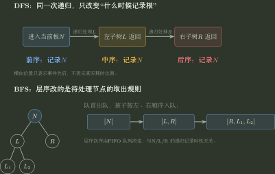
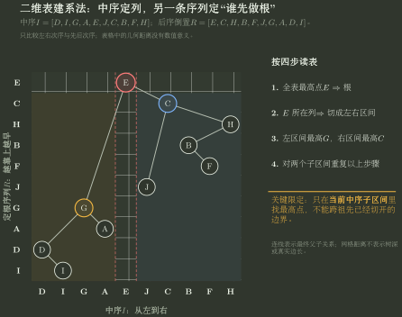
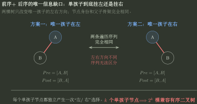

# 二叉树遍历与序列重建

> 训练定位：解决二叉树前序/中序/后序/层序的手算、DFS/BFS 识别、由遍历序列恢复二叉树、判断是否唯一、计算前序+后序的歧义数量，以及利用遍历次序判断祖先关系。  
> 模型归属：[DS04｜树与二叉树](./DS04_树与二叉树_方法论手册.tex)。遍历机制、结构信息与唯一性结论由 Canonical 正文拥有；本文件负责把这些机制压成可以直接落笔的题目表示、计算技巧、局部规则与验算方法。

## 一、先把题目分成三个问题族

树遍历题看起来变化很多，实际先分三类：

| 问题族 | 题目给什么 | 题目要什么 | 先看什么 |
|---|---|---|---|
| 正向遍历 | 一棵树 | 前/中/后/层序序列 | DFS 还是 BFS；根在什么时候记录 |
| 逆向重建 | 一条或多条遍历序列 | 树结构、唯一性或树的数量 | 谁定根，谁切左右，是否有额外结构约束 |
| 序列关系判断 | 前序、后序等相对位置 | 祖先、父子、分支关系 | 比较进入顺序与完成顺序 |

不要一上来背“前中可以、前后不可以”。先问：

> **当前信息到底告诉了我根、左右边界、还是额外形状约束？**

---

## 二、正向遍历：前中后序都是 DFS，层序才是 BFS

本文件统一使用“先序”和“前序”为同义词。

对当前节点记：

- `N`：当前根节点；
- `L`：左子树；
- `R`：右子树。

则：

| 遍历    | 顺序      | 搜索类型 | 根的记录时机         |
|---|---|---|---|
| 前序/先序 | `NLR`   | DFS  | 第一次进入当前节点时     |
| 中序    | `LNR`   | DFS  | 左子树完成后         |
| 后序    | `LRN`   | DFS  | 左右子树都完成后       |
| 层序    | 按深度从浅到深 | BFS  | 节点从 FIFO 队列取出时 |

所以前、中、后序不是三种不同的“走树方向”，而是**同一次深度优先递归过程，在三个不同事件点记录当前根**。

程序实现时只需要再记住：

- DFS：递归调用栈或显式栈；
- BFS：队列；
- 显式栈做前序时，因为后进先出，要先压右、再压左；
- 层序按左孩子、右孩子的顺序入队，才能保持同层从左到右。



这张图只表达两件事：前/中/后序的区别发生在**同一次 DFS 中记录根的时机**；层序的区别发生在**frontier 使用 FIFO 队列**。图中的横向间距不表示真实耗时。

### 局部规则：先写 `N/L/R`，再决定根放哪里

**触发信号**：题目给出一棵二叉树，要求写前序、中序或后序。

**第一动作**：先把当前子树压成 `N、L、R` 三块；前序写 `NLR`，中序写 `LNR`，后序写 `LRN`，每一块内部继续递归使用同一规则。

**检查与退出**：最终每个真实节点必须且只能出现一次；若某个节点重复或遗漏，先检查是不是跨出了当前子树边界。

### 局部规则：问“第几层、最近层、宽度”时优先想到 BFS

**触发信号**：题目按层访问、求某一层节点、树宽、最近叶节点或最小深度。

**第一动作**：把状态改写成 FIFO 队列；需要层号时记录每轮当前队列长度或显式保存 `(node, depth)`。

**检查与退出**：如果目标必须等左右子树结果都返回才能决定，例如高度、子树大小、平衡性、直径，停止强行使用层序，转回后序 DFS。

---

## 三、逆向重建只问两件事：根是谁，左右在哪里分开

由遍历序列恢复树时，始终问两件事：

$$
\boxed{\text{当前根是谁？}\qquad \text{左右子树在哪里分开？}}
$$

中序最特殊，因为对任一当前子树：

$$
\operatorname{Inorder}(T)
=
\operatorname{Inorder}(T_L)\;r\;\operatorname{Inorder}(T_R).
$$

只要根 $r$ 已知，它在**当前中序区间**里的位置就直接切出左右子树。

另一条序列负责给根：

- 前序：当前子树的第一个节点是根；
- 后序：当前子树的最后一个节点是根；
- 层序：属于当前子树的节点中，层序最先出现者是根。

所以比背“哪两种遍历可以还原”更重要的是记住：

> **中序负责切左右；前序、后序或层序负责确定当前根。**

---

## 四、唯一性结论总表：先看默认前提

下面默认：

1. 讨论普通**有序二叉树**，左、右孩子有区别；
2. 节点身份唯一；若只给值，则默认值互不相同；
3. 给出的序列确实彼此相容，除非题目专门让你判断合法性。

| 已知信息 | 一般能否唯一恢复 | 原因 |
| ---------------- | :-----------------: | ------------------------------------- |
| 仅前序 | 否 | 只知道根通常先于后代出现，不知道左右子树在哪里分开 |
| 仅中序 | 否 | 有左右相对位置，但不知道当前根是谁 |
| 仅后序 | 否 | 有完成次序，没有左右边界 |
| 仅层序 | 否 | 有深度优先级，没有左右空槽信息 |
| 前序 + 中序 | 是 | 前序定根，中序切左右 |
| 后序 + 中序 | 是 | 后序定根，中序切左右 |
| 层序 + 中序 | 是 | 当前区间内层序最早者定根，中序切左右 |
| 前序 + 后序 | 通常否 | 单孩子节点的孩子放左还是放右无法区分 |
| 前序 + 层序 | 通常否 | 两节点链已经存在左/右歧义 |
| 后序 + 层序 | 通常否 | 同上 |
| 单一遍历 + 已知为完全二叉树 | 是 | 节点数先唯一确定形状，序列只负责给固定位置赋值 |

> **边界：**若节点值允许重复，不能直接用“值在中序中的位置”定位节点。必须有唯一节点身份、出现次序标记或题目另给消歧规则。

### 局部规则：先问“普通二叉树还是带结构约束的二叉树”

**触发信号**：题目问“一条/两条遍历序列能否唯一确定二叉树”。

**第一动作**：先圈出题面有没有“完全二叉树、严格/正则二叉树、BST、节点互异”等附加条件，再判断这些序列究竟能提供哪些结构信息。

**检查与退出**：任何结论前都补一句适用对象。若题目已经给定完全二叉树或 BST，不要把“普通二叉树一般不唯一”的结论机械套过去。

---

## 五、有中序时：最稳的是“当前区间法”

不要每一步重新抄一整套子序列。草稿上始终维护：

- 当前中序区间；
- 当前根；
- 根左边有多少节点；
- 根右边有多少节点。

设当前中序区间为 $I[L\ldots R]$，根 $r$ 在中序下标 $m$，则左子树大小是

$$
s_L=m-L.
$$

### 前序 + 中序

若当前前序区间是 $P[p_L\ldots p_R]$：

- 根：$P[p_L]$；
- 左子树前序：$P[p_L+1\ldots p_L+s_L]$；
- 右子树前序：其余节点。

### 后序 + 中序

若当前后序区间是 $Q[q_L\ldots q_R]$：

- 根：$Q[q_R]$；
- 左子树后序：前 $s_L$ 个节点；
- 右子树后序：紧随其后的节点；
- 最后一个位置留给根。

### 层序 + 中序

层序不能简单按连续位置切片。先在中序中得到左右节点集合，再从原层序中过滤：

- 属于左集合的节点，按原层序相对顺序组成左子树层序；
- 属于右集合的节点，同理组成右子树层序。

### 局部规则：有中序就先圈“当前中序区间”

**触发信号**：已知中序，再给前序、后序或层序，要求画树或求某个孩子。

**第一动作**：先找当前根，然后只在当前中序区间中用根切左右；根一落下就写出左区间和右区间，后续递归不得跨区间。

**检查与退出**：若某一步选出的“孩子”跑到了祖先已经划给另一棵子树的中序区间，立即回退；这是最常见的区间越界信号之一。

---

## 六、手算特别法：把两条序列“建成一张二维表”

前面的区间法已经足够严谨，但真正手算时还可以进一步把“中序定左右、另一序列定根”直接画成一张表。这样不用反复抄子序列，父子关系会随着区间递归直接从图上长出来。

这张表只记录两个**先后顺序**：

- 横向：节点在中序中的左右次序；
- 纵向：在当前子树中，哪个节点应当先被认作根。越靠上，越先于自己的后代出现。

纵轴可以用前序、后序倒置或层序，因为它们都有同一个性质：**祖先一定先于后代出现**。这里把纵轴记作“定根序列”。它只负责在已经由中序圈定的区间里找当前根，并不意味着这三种遍历在别的问题上等价。

### 1. 建系：一条序列定列，一条序列定行

设中序为 $I$，纵向的定根序列为 $R$。纸面上按下面方法画：

1. 把中序 $I$ 从左到右写在表格下方，每个节点占一列；
2. 把定根序列 $R$ 从上到下写在表格左侧，每个节点占一行；
3. 同一节点的“中序列”和“优先级行”相交处画一个点；
4. 之后只在当前中序列区间内找**最高的点**。

节点身份互异时，每个节点在中序和定根序列中都只出现一次，所以恰好对应一个交点。整张表只是把两个顺序叠在一起，横纵距离没有数值意义。

给当前中序区间 $[a,b]$，记节点 $i$ 在定根序列中的名次为 $p(i)$。当前子树根就是

$$
\boxed{
 r=\operatorname*{arg\,min}_{i\in[a,b]}p(i)
}
$$

因为“名次越小”就是“在表中越靠上”。若根 $r$ 在中序中的列为 $m$，则：

$$
\boxed{
\begin{aligned}
\text{左孩子}&=\operatorname*{arg\,min}_{i\in[a,m-1]}p(i), && a\le m-1,\\
\text{右孩子}&=\operatorname*{arg\,min}_{i\in[m+1,b]}p(i), && m+1\le b.
\end{aligned}}
$$

这就是你说的“节点两侧最高的节点是孩子”的严格版本：**“两侧”不是整张表的左右两边，而是当前节点所负责的中序子区间。**

### 2. 为什么这个画法成立

它只依赖两个事实。

第一，中序遍历保证任意一棵子树的节点在中序序列中形成一个连续区间，并且根把这个区间切成

$$
\text{左子树区间}\;\vert\;r\;\vert\;\text{右子树区间}.
$$

第二，前序、后序倒置、层序都满足：若 $x$ 是 $y$ 的祖先，$x$ 一定先于 $y$ 出现。因此在一个已经确定的中序子区间里，最靠上的点不可能还有区间内的祖先，它只能是这棵子树的根。

于是递归关系自动成立：

$$
\boxed{
\text{当前区间最高点定根}
\;\to\;
\text{根列切左右}
\;\to\;
\text{左右区间各找最高点}
}
$$

从数据结构角度看，这也可以理解为：横向保持中序顺序，纵向满足“父节点优先级高于后代”的堆序；两种约束共同把树固定下来。

### 3. 完整手算例：中序 + 后序

给定

$$
I=[D,I,G,A,E,J,C,B,F,H],
$$

$$
Q=[I,D,A,G,J,F,B,H,C,E].
$$

后序本身是“后代先完成、祖先后完成”，所以先倒置：

$$
R=\operatorname{reverse}(Q)=[E,C,H,B,F,J,G,A,D,I].
$$

把 $I$ 横着写、$R$ 竖着写，再把同名节点落到行列交点：



读这张表时，按“**最高点定根，根列切区间**”循环：

- 全表最高点是 `E`，所以 `E` 是整棵树的根；
- `E` 在中序中把节点切成左区间 `[D,I,G,A]` 和右区间 `[J,C,B,F,H]`；
- 左区间最高点是 `G`，所以 `G` 是 `E` 的左孩子；右区间最高点是 `C`，所以 `C` 是 `E` 的右孩子；
- 进入 `G` 的当前区间 `[D,I,G,A]`：`G` 左侧当前子区间 `[D,I]` 的最高点是 `D`，右侧 `[A]` 只有 `A`，所以 `G` 的两个孩子分别为 `D,A`；
- 进入 `D` 的当前区间 `[D,I]`：`D` 左边为空，右边只有 `I`，因此 `I` 是 `D` 的右孩子；
- 进入 `C` 的当前区间 `[J,C,B,F,H]`：左边只有 `J`；右区间 `[B,F,H]` 最高点是 `H`，所以 `C` 的左右孩子为 `J,H`；
- `H` 的当前区间是 `[B,F,H]`，其左区间 `[B,F]` 最高点为 `B`；`B` 的右区间又只剩 `F`，所以 `H` 的左孩子是 `B`，而 `B` 的右孩子是 `F`。

把每次找到的父子点直接连起来，表内就已经得到整棵树。若题目要求画成普通树形，再把这些父子关系誊画一次即可；不需要重新推一遍。

### 4. 这张表最容易犯的三个错误

**错误一：跨祖先区间找“更高点”。** 例如已经知道 `E` 把整表切成左右两棵子树后，处理 `G` 时只能看 `[D,I,G,A]`，不能因为右边的 `C` 比 `D` 更高就把 `C` 接到 `G` 上。

**错误二：把“图上更近”当成父子。** 父子只由“当前区间的最高点”决定；横纵距离、线段长短都没有结构含义。

**错误三：直接把后序从上往下写。** 后序是“后代先、祖先后”，与纵轴“祖先优先”方向相反；用于这套建系法时必须先倒置。前序和层序则可以直接从上往下写。

### 局部规则：二维表建系法

**触发信号**：已知中序，再给前序、后序或层序，需要快速手画二叉树、判断父子位置，且节点身份可以唯一对应。

**第一动作**：中序从左到右写列；前序/层序直接从上到下写行，后序先倒置再从上到下写行；同名节点取交点。先找全表最高点，再用它的中序列切左右区间。

**检查与退出**：每次找孩子前先明确当前中序区间；任何父子边都不能跨出该区间。若节点值重复而无法唯一对应行列，停止使用这张表，先补节点身份或其他消歧信息。最后重新做一次题目给出的两种遍历验算。

---

## 七、前序 + 后序：先恢复骨架，再数单孩子歧义

给定当前子问题：

$$
P=P[p_L\ldots p_R],\qquad Q=Q[q_L\ldots q_R].
$$

根一定满足

$$
P[p_L]=Q[q_R].
$$

若当前子树不只有根，则 $P[p_L+1]$ 是根的第一棵非空孩子子树的根。去当前后序区间中找到它，假设位置为 $j$，则这棵孩子子树大小为

$$
s=j-q_L+1.
$$

接下来分两种情况：

### 情况 A：$s<n-1$

除根外还有节点没有被第一棵孩子子树吃掉，因此根必有两棵非空孩子子树。

- 第一棵是左子树；
- 剩余节点是右子树；
- 左右边界已经确定。

### 情况 B：$s=n-1$

除根外所有节点都属于同一棵孩子子树，说明当前根只有一个非空孩子。

这时两种不同结构会产生完全相同的前序和后序：



因此前序和后序只能确定“`B` 是 `A` 的唯一孩子”，不能继续推出“它是左孩子”或“它是右孩子”。

### 一个更快的单孩子判据

对当前规模 $n>1$ 的子问题，节点身份唯一时：

$$
\boxed{P[p_L+1]=Q[q_R-1]}
$$

当且仅当当前根只有一个非空孩子。

原因是：

- $P[p_L+1]$ 是第一棵孩子子树的根；
- $Q[q_R-1]$ 是最后完成的孩子子树的根；
- 如果根有两棵孩子子树，这两个根分别属于左、右子树，不可能是同一节点；
- 如果只有一棵孩子子树，它既是第一棵也是最后一棵。

### 歧义树数量

若整个递归过程中共有 $k$ 个单孩子节点，每个节点都可以独立选择“唯一孩子放左/放右”，因此：

$$
\boxed{N_{\text{trees}}=2^k}.
$$

唯一恢复等价于

$$
k=0.
$$

也就是不存在度为 1 的节点。

> **术语边界：**这里需要的是“严格/正则二叉树”：每个节点度为 $0$ 或 $2$。它不要求每一层都填满，因此不能把这个条件偷换成更强的“满二叉树”。

### 例：一个歧义点

$$
P=[A,B,D,E,C,F],
$$

$$
Q=[D,E,B,F,C,A].
$$

根为 `A`。

- `P` 中根后的第一个节点为 `B`；
- 在 `Q` 中，`B` 结束了 `[D,E,B]` 这棵子树；
- 所以 `A` 的左子树节点是 `{B,D,E}`，剩下 `{C,F}` 属于右子树。

对子树 `{C,F}`：

$$
P'=[C,F],\qquad Q'=[F,C].
$$

只能确定 `F` 是 `C` 的唯一孩子，却无法知道它在左还是右。因此这里 $k=1$，共有

$$
2^1=2
$$

棵兼容二叉树。

### 局部规则：前后序先数“单孩子节点”，不要直接猜左右

**触发信号**：只给前序和后序，要求唯一性、树的数量或恢复尽可能多的结构。

**第一动作**：每个当前子问题先用前序根后的第一个节点去后序定位第一棵孩子子树；若当前满足 $P[p_L+1]=Q[q_R-1]$，给单孩子计数 $k$ 加一。

**检查与退出**：单孩子节点只能确定父子关系，不能确定左右方向。若题目另给“每个非叶节点都有两个孩子”，则 $k=0$，歧义消失。

---

## 八、前序 + 后序倒置：同序不是“父子”，反序不是“兄弟”

定义：

- $pre(x)$：节点 $x$ 在前序中的位置；
- $post(x)$：节点 $x$ 在后序中的位置；
- $rpost(x)$：节点 $x$ 在“后序倒置”中的位置。

对两个不同节点 $x,y$，若前序中 $x$ 在 $y$ 前面，即

$$
pre(x)<pre(y),
$$

则分两种情况。

### 情况 1：后序倒置中仍是 $x$ 在 $y$ 前面

等价于原后序中 $x$ 在 $y$ 后面：

$$
post(x)>post(y).
$$

于是

$$
\boxed{x\text{ 是 }y\text{ 的祖先}}.
$$

这只能推出“祖先—后代”，不能直接推出“父子”。祖父和孙节点同样满足这个条件。

### 情况 2：后序倒置中顺序反过来

也就是：

$$
pre(x)<pre(y),\qquad post(x)<post(y).
$$

此时二者互不为祖先，必处于某个最近公共祖先的不同分支。

如果前序中 $x$ 更早，则在它们最近公共祖先处分叉时，$x$ 所在分支先被 DFS 访问，$y$ 所在分支随后被访问；但这仍然**不表示 $x,y$ 本身是兄弟**。

### 例：为什么“反序 = 右兄弟”不成立

若结构为

```text
        A
       / \
      B   C
     /
    D
```

`D` 和 `C` 在前序与后序倒置中的相对顺序会相反，但它们不是兄弟。它们只是位于最近公共祖先 `A` 的不同分支。

### 怎样继续判断“父亲”

若已经根据前/后序位置找到节点 $y$ 的全部严格祖先，那么它的直接父亲是这些祖先中**最深的那个**。

用前序位置表达，就是在所有满足

$$
pre(x)<pre(y),\qquad post(x)>post(y)
$$

的节点 $x$ 中，取 $pre(x)$ 最大者。

### 局部规则：把“同序/反序”只当祖先判据

**触发信号**：题目让你根据前序和后序判断祖先、父子或兄弟关系，或者你想使用“后序倒置”技巧。

**第一动作**：先比较两个节点在前序与后序倒置中的相对顺序；若前面的节点在两条序列中都更早，它就是后面节点的祖先；若相对顺序反转，则二者位于不同分支。

**检查与退出**：只有再证明中间不存在别的祖先，才能把祖先关系收紧成父子；只有证明直接父节点相同，才能把不同分支关系收紧成兄弟。

### 叶节点的相对次序：前序、中序、后序其实完全一致

这里有一个很适合选择题速判的结论：

> **把三种 DFS 遍历中的非叶节点全部删掉，只保留叶节点，得到的叶节点序列完全相同。**

原因不是“叶节点没有孩子”这么简单，而是任取两个不同叶节点 $u,v$，它们互不可能为祖先。令

$$
a=\operatorname{LCA}(u,v),
$$

则 $u,v$ 一定位于 $a$ 的两棵不同孩子子树中。若 $u$ 在左子树、$v$ 在右子树，那么无论前序、中序还是后序，都会先完整遍历 $a$ 的左子树，再遍历右子树，所以始终有：

$$
u\prec v.
$$

若两者左右位置相反，三种遍历也同时反过来。因此：

$$
\boxed{
\operatorname{Leaves}(Pre)
=
\operatorname{Leaves}(In)
=
\operatorname{Leaves}(Post)
}
$$

这里的等号只表示**抽取叶节点后的相对顺序相同**，不是说三条完整遍历序列相同。

### 中序“在前/在后”只编码左右次序，不自动编码祖先关系

中序的核心语义始终是：

$$
L\;N\;R.
$$

因此某节点左子树中的所有节点一定在它之前，右子树中的所有节点一定在它之后。但反过来，看到

$$
in(a)<in(b)
$$

只能说明 $a$ 在中序线性次序上位于 $b$ 左侧，不能仅凭这一条推出“$a$ 是 $b$ 的左孩子”“$a$ 在 $b$ 的左子树”或某种祖先关系。

这也解释了二维表建系法为什么把中序只当**横向左右坐标**：它负责分区，不负责单独给出父子层次。

### 局部规则：只比较叶节点时直接锁定相对次序

**触发信号**：题目比较叶节点在前序、中序、后序中的先后顺序，或问某种遍历是否会改变叶节点的相对排列。

**第一动作**：先忽略所有非叶节点；对任意两片叶子找它们的最近公共祖先，只判断谁在该祖先的左分支、谁在右分支。

**检查与退出**：该结论只对叶节点之间的相对顺序成立。若比较对象中包含祖先节点，立即回到“前序祖先先、后序祖先后、中序由左右子树位置决定”的一般规则。

---

## 九、两条遍历序列相等、逆序或相对次序反转时，先判树形

这类选择题通常不需要重建整棵树。先把三种局部顺序并排：

$$
\operatorname{Pre}=NLR,
\qquad
\operatorname{In}=LNR,
\qquad
\operatorname{Post}=LRN.
$$

下面默认节点身份唯一；若只比较可重复的节点值，序列偶然相等不能推出同样的结构。

### 1. 前序 = 中序：所有节点都没有左孩子

只要某个节点存在非空左子树，前序一定先写根，而中序一定先写左子树中的节点，两条序列立即在这一层发生次序冲突。

因此：

$$
\boxed{
\operatorname{Pre}(T)=\operatorname{In}(T)
\iff
\forall v,\ v.left=\varnothing
}
$$

整棵树只能沿右孩子方向形成单链。

### 2. 中序 = 后序：所有节点都没有右孩子

完全对偶：

$$
\boxed{
\operatorname{In}(T)=\operatorname{Post}(T)
\iff
\forall v,\ v.right=\varnothing
}
$$

整棵树只能沿左孩子方向形成单链。

### 3. 前序 = 后序：非空树只能有一个节点

前序根在首位，后序根在末位。节点身份唯一时，若两条完整序列完全相同，则根必须同时位于首尾，所以：

$$
\boxed{
\operatorname{Pre}(T)=\operatorname{Post}(T)
\iff
\lvert T\rvert\le1
}
$$

### 4. 前序 = 后序倒置：允许左右摇摆，但绝不允许分叉

后序倒置的局部顺序是：

$$
NRL.
$$

它要和前序的 $NLR$ 完全一致。若某个节点左右子树都非空，前序把整块左子树放在右子树前，而后序倒置恰好反过来，不可能相同。

因此：

$$
\boxed{
\operatorname{Pre}(T)=\operatorname{reverse}(\operatorname{Post}(T))
\iff
\forall v,\deg(v)\le1
}
$$

也就是树是一条不分叉的链，但每一层的唯一孩子可以独立选左或右。

### 5. 单链还有一个层序结论：前序恒等于层序

只要整棵树没有任何分叉，每一层恰有一个节点。此时无论唯一孩子在左还是右，前序和层序都按“根到叶”的顺序访问：

$$
\boxed{\deg(v)\le1\ \forall v\Longrightarrow\operatorname{Pre}(T)=\operatorname{Level}(T)}.
$$

若进一步所有节点都**没有左孩子**，则右链满足：

$$
\operatorname{Pre}=\operatorname{In}=\operatorname{Level};
$$

若所有节点都**没有右孩子**，则左链满足：

$$
\operatorname{In}=\operatorname{Post},
$$

同时 `Pre=Level` 仍然成立。这样遇到“某类单孩子树的两种遍历是否相同”时，不必逐节点模拟。

### 6. 前序与中序“相对次序反转”：早出现者是祖先，晚出现者在其左子树

若：

$$
pre(x)<pre(y),
\qquad
in(x)>in(y),
$$

则：

$$
\boxed{x\text{ 是 }y\text{ 的祖先，且 }y\text{ 位于 }x\text{ 的左子树}}
$$

理由是：若 $x,y$ 互不为祖先，它们在最近公共祖先的不同分支中，前序和中序都会保持“左分支整体先于右分支”，相对次序不会反转。发生反转，只能是前序先访问祖先 $x$，而中序必须先完成 $x$ 的左子树中的后代 $y$。

后序与中序有对偶结论：

$$
post(x)<post(y),
\qquad
in(x)>in(y)
$$

可推出：

$$
\boxed{y\text{ 是 }x\text{ 的祖先，且 }x\text{ 位于 }y\text{ 的右子树}}.
$$

> [!warning] “相对次序相同”通常信息不足
> 例如前序和中序都满足 $x$ 在 $y$ 前，可能是 $y$ 位于 $x$ 的右子树，也可能两者属于不同分支。只有**反转**是强信号。

### 局部规则：看到“两条遍历是否相同/相反”先比较局部块顺序

**触发信号**：题目说前序与中序相同、中序与后序相同、前序与后序正好相反，或只给两个节点在两条序列中的前后关系。

**第一动作**：先写 `NLR / LNR / LRN`；若涉及层序，再问每层是否只有一个节点。找哪一块顺序必须消失才能让两条序列兼容；若只是两个节点相对次序，优先检查是否发生“反转”。

**检查与退出**：结论依赖节点身份唯一；有重复值时不能只凭值序列相同直接推出树形。

---

## 十、完全二叉树：单一遍历为什么也能恢复

普通二叉树只有一条遍历通常不够，因为空槽位置未知。

完全二叉树不同：节点数 $n$ 一旦确定，树的形状就已经唯一确定。因此序列只负责把节点依次放进固定的遍历位置。

层序最直接：按完全二叉树的数组编号依次填入即可。

若只给前序、中序或后序，需要递归知道左子树到底有多少节点。

对 $n>1$，令

$$
h=\lfloor\log_2 n\rfloor,
$$

$$
r=n-(2^h-1),
$$

其中：

- $h$ 是最底层的深度；
- $2^h-1$ 是最底层之前已经填满的节点数；
- $r$ 是最底层实际出现的节点数。

左子树在最底层最多容纳 $2^{h-1}$ 个节点，因此

$$
\boxed{
 n_L=(2^{h-1}-1)+\min(r,2^{h-1})
}
$$

并且

$$
n_R=n-1-n_L.
$$

$n=1$ 时单独取 $n_L=n_R=0$。

知道 $n_L$ 后：

- 前序：根后面的 $n_L$ 个节点属于左子树；
- 后序：最前面的 $n_L$ 个节点属于左子树，末尾是根；
- 中序：第 $n_L+1$ 个位置就是根。

### 局部规则：完全二叉树先算形状，不先猜根

**触发信号**：题目只给一条遍历序列，但明确说明树是完全二叉树。

**第一动作**：先由序列长度得到 $n$，再计算左右子树节点数 $n_L,n_R$；结构边界先由“完全”约束确定。

**检查与退出**：若你正在套“单序列不能唯一恢复普通二叉树”，说明忽略了题面提供的形状约束。

---

## 十一、先判断“两条序列能不能来自同一棵树”，再讨论“有几棵”

在讨论唯一性之前，先做存在性检查。

给定两条声称属于同一棵树的遍历序列，至少检查：

1. 长度相同；
2. 节点身份集合相同；
3. 前序 + 后序时，前序首元素必须等于后序尾元素；
4. 每次递归切出的子树节点集合必须在另一条序列中能形成同一子问题；
5. 有重复值时，不能把“值相同”误当“节点身份相同”。

只要某一步不能形成一致的子树集合，结论应是：

$$
\boxed{\text{不存在对应二叉树}}
$$

而不是“存在但不唯一”。

### 局部规则：先问能不能存在，再问是否唯一，最后才计数

**触发信号**：题目给多条遍历序列，问能否确定、能确定几棵或要求判断序列是否合法。

**第一动作**：按“是否相容 → 若相容是否唯一 → 若不唯一有多少”的顺序判断。

**检查与退出**：一旦根、节点集合或递归划分冲突，立即停止计数；不存在的序列组合没有“歧义树数量”。

---

## 十二、程序构造时的两个效率点

完整代码由 Canonical DS04 与同目录 `code/` 拥有，这里只保留做题时最有用的复杂度判断。

### 1. 前序/后序 + 中序不要每层线性找根

如果每次都在当前中序区间从头扫描根位置，链状树上可能出现

$$
(n-1)+(n-2)+\cdots+1=\Theta(n^2).
$$

先建立

$$
\text{节点身份}\mapsto\text{中序下标}
$$

的哈希映射，就能把每次根定位降到平均 $O(1)$，总体构造时间降到 $O(n)$。

### 2. 递归参数传“区间”，不要反复复制子数组

子问题状态用几个下标描述：

```text
inL, inR
preL, preR
```

或

```text
inL, inR
postL, postR
```

这样不会因为每层切片复制再额外引入大量时间和空间成本。

### 局部规则：重建代码先写“子问题状态”

**触发信号**：要求编程由遍历序列构造二叉树。

**第一动作**：先定义递归函数参数代表哪两个序列区间，再建立中序下标映射；函数每次只做“定根—算左子树大小—递归左右”。

**检查与退出**：检查空区间是唯一递归出口；若代码靠复制临时子数组才能判断边界，先考虑是否能改成下标区间。

---

## 十三、最终验算：重新遍历一次

重建完成以后，不要只靠“树看起来像”。最独立的检查就是从得到的树重新生成题目给出的序列。

例如题目给中序和后序，就重新计算：

$$
\operatorname{Inorder}(T),\qquad \operatorname{Postorder}(T).
$$

二者都与题面完全一致，才能说明当前重建至少通过了序列约束。

对前序 + 后序不唯一的题，选择任意一种单孩子左右方向后，两条序列都应保持不变；这恰好也是 $2^k$ 歧义的验证方法。

---

## 十四、最后压成八句话

1. **前序、中序、后序都是 DFS；层序是 BFS。**
2. **有中序时：另一序列定根，中序切左右；二维表法就是把这两类信息画成横纵两个顺序。**
3. **前序 + 后序丢失的是单孩子的左右方向；有 $k$ 个单孩子节点就有 $2^k$ 棵兼容树。**
4. **前序与后序倒置同序，只能推出祖先—后代；反序，只能推出不同分支。**
5. **只抽取叶节点时，前序、中序、后序中的叶节点相对顺序完全相同。**
6. **遍历序列相等/逆序时先比较 `NLR/LNR/LRN`：`Pre=In` 排除所有左孩子，`In=Post` 排除所有右孩子，`Pre=reverse(Post)` 排除所有分叉。**
7. **完全二叉树由节点数先固定形状，所以单一遍历也可以恢复。**
8. **任何重建最后都重新遍历验算；先判存在，再判唯一，再计数量。**
