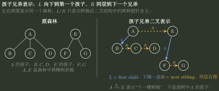

# 树、森林与孩子兄弟转换

> 训练定位：解决一般树/森林与孩子兄弟二叉树之间的结构翻译、遍历对应、子树规模、空指针数量和定长孩子域存储比较。  
> 模型归属：[DS04｜树与二叉树](DS04_树与二叉树_方法论手册.tex)。`firstChild/nextSibling` 的可逆表示与计数不变量由 Canonical 正文拥有；本文件负责把二叉树路径翻译回原树语义，并形成可直接手算的数量接口。

## 一、转换后不要再把“左/右”读成普通二叉树左右孩子

孩子兄弟表示只定义两种动作：

$$
\boxed{
L=\text{进入第一个孩子},
\qquad
R=\text{转到下一个兄弟}
}
$$

先把整类题压成这两条翻译规则。

- `L`：**下降一层**；
- `R`：**层数不变**，只换到同一父节点的下一个孩子；
- 森林的各棵树根也按 `R` 串起来，所以二叉表示根的右链是“下一棵树、再下一棵树……”。

> [!idea] 第一动作
> 看到转换后的二叉树，先不要按普通二叉树去理解“左孩子/右孩子”。把每条边改写成动作：`L=进入第一个孩子`，`R=转到下一个兄弟`。之后再判断原树中的亲属关系。



图中所有箭头都表示**转换后二叉表示中的指针方向**：实线 `L` 下降到第一个孩子，虚线 `R` 横移到下一个兄弟。尤其是 $A\xrightarrow{R}E$ 表示森林的下一棵树根，不表示原树中 `E` 是 `A` 的孩子。

---

## 二、原树“某个孩子”在二叉表示中不是一条 L，而是一条 $LR^k$

假设原树中节点 `x` 的孩子依次为：

```text
c1, c2, c3, ...
```

转换后：

```text
x --L--> c1 --R--> c2 --R--> c3 --R--> ...
```

因此：

$$
\boxed{
y\text{ 是 }x\text{ 的某个孩子}
\iff
x\xrightarrow{L R^k}y\quad(k\ge0)
}
$$

而两个节点处在同一条 `R` 链上，说明它们在原树中是兄弟，不是父子。

### 两步二叉路径直接列四格，不要靠想象“爷孙关系”

如果题目说二叉表示中 `u` 是 `v` 的“父亲的父亲”，本质只说明从 `u` 到 `v` 有两条二叉边。两条边各自可能是 `L` 或 `R`，所以只需枚举：

| 二叉路径 | 原树语义 |
| ----------- | -------------------------------------------------------- |
| `LL` | `u` 的第一个孩子的第一个孩子：`u` 是 `v` 的祖父 |
| `LR` | 先到 `u` 的第一个孩子，再到其下一兄弟：`u` 是 `v` 的父亲 |
| `RL` | 先到 `u` 的下一兄弟，再到该兄弟的第一个孩子：`u` 是 `v` 的父节点的前一个兄弟 |
| `RR` | 连续两个下一兄弟：`u` 与 `v` 是兄弟 |

这张四格表说明一个关键边界：**转换后二叉树中的父子关系，不一定还是原树中的父子关系。** 一条二叉边可能来自 `L`（原树父子），也可能来自 `R`（原树兄弟）。所以题目一旦说“转换后二叉树中的父节点/祖父节点”，必须先把每条边还原成 `L` 或 `R`，再判断原树关系。

### 局部规则：关系题先把二叉路径改写成 L/R 单词

**触发信号**：题目给转换后的二叉树，描述 `u` 是 `v` 的左孩子/右孩子/右孩子的右孩子/父亲的父亲，再问原树中两节点是什么关系。

**第一动作**：把每一步写成 `L` 或 `R`，逐字翻译：`L` 下降到第一个孩子，`R` 横移到下一个兄弟；两步关系直接枚举 `LL/LR/RL/RR`。

**检查与退出**：只要路径中出现 `R`，就不要把该边继续解释成“原树父子”。`R` 永远保持原树层级。

---

## 三、森林的两条规模公式：根左边是第一棵树，根右边是剩余森林

设森林：

$$
F=T_1,T_2,\ldots,T_k,
$$

节点数分别为：

$$
M_1,M_2,\ldots,M_k.
$$

对应二叉树根就是 $T_1$ 的根。

### 根的左子树

根的 `L` 进入第一棵树的第一个孩子，然后通过孩子之间的 `R` 链和后续 `L` 继续覆盖 $T_1$ 的全部后代，因此：

$$
\boxed{
\lvert B_{root.left}\rvert=M_1-1
}
$$

反过来，若二叉表示根的左子树有 $s_L$ 个节点，则第一棵树：

$$
\boxed{M_1=s_L+1}.
$$

### 根的右子树

根的 `R` 直接进入第二棵树根，之后右链继续接第三、第四棵树，所以：

$$
\boxed{
\lvert B_{root.right}\rvert=M_2+\cdots+M_k
}
$$

若森林总节点为 $N$，根右子树有 $s_R$ 个节点，则：

$$
\boxed{M_1=N-s_R}.
$$

### 局部规则：问根左右子树节点数时先恢复“第一棵/剩余森林”

**触发信号**：题目给森林各树节点数，问对应二叉树根的左/右子树规模；或反过来由二叉树子树规模求森林第一棵树大小。

**第一动作**：写 `root.left = T1 除根外`，`root.right = T2+T3+...`。

**检查与退出**：若把根右子树算进第一棵树，说明又把 `R` 错当成普通右孩子。

---

## 四、叶节点与空左指针是一一对应的

在原树中：

$$
\text{叶节点}
\iff
\text{没有孩子}
\iff
firstChild=NULL.
$$

转换后二叉树的 `left` 正是 `firstChild`，所以：

$$
\boxed{
\text{原树/森林叶节点数}
=
\text{转换后二叉树的空左指针数}
}
$$

这个等价关系可以直接把原树叶节点数换成转换后二叉树的空左指针数。

设森林共有 $N$ 个节点，叶节点数为 $L_0$。转换后二叉树总空孩子域仍是：

$$
N+1.
$$

其中空左指针已有 $L_0$ 个，因此空右指针数：

$$
\boxed{
N_{R=NULL}=N+1-L_0
}
$$

若原森林非叶节点数为 $K=N-L_0$，还可以直接写：

$$
\boxed{N_{R=NULL}=K+1}.
$$

这说明“空右指针”并不直接等于某类原树节点；它最好通过“二叉树总空槽 - 空左槽”间接求。

### 代表母题

若森林共有 $N$ 个节点，其中非叶节点有 $K$ 个，则：

- 原森林叶节点数：$N-K$；
- 二叉表示空左指针：$N-K$；
- 二叉表示全部空孩子域：$N+1$；
- 空右指针：

$$
(N+1)-(N-K)=K+1.
$$

### 局部规则：空指针题先数 `left=NULL`

**触发信号**：题目给森林叶子/非叶子数量，问转换后二叉树有多少空左/空右指针。

**第一动作**：先写 `left=NULL <=> 原节点无孩子 <=> 原叶节点`；右空不要硬猜，使用二叉树总空槽 $N+1$ 做差。

**检查与退出**：若算出空左 + 空右不等于 $N+1$，一定有一侧语义或节点总数算错。

---

## 五、存储节省题：比较每个节点固定分配了多少个指针字段

若一个 $m$ 叉树采用定长节点结构，每个节点固定保留 $m$ 个孩子指针，则 $N$ 个节点需要：

$$
mN
$$

个孩子指针槽。

孩子兄弟表示每节点固定只有两个槽：

$$
firstChild,\ nextSibling,
$$

因此共：

$$
2N.
$$

只比较这部分固定指针域，节省：

$$
\boxed{(m-2)N}.
$$

> [!warning] 这个式子有明确边界
> 它只比较“原结构每节点固定 $m$ 个孩子指针”和“孩子兄弟表示每节点两个指针”这部分字段。若节点还含 `parent`、tag、长度字段、动态链表头或存在额外内存对齐，就要重新把所有字段列出来再比较。

---

## 六、遍历对应不是巧合：右兄弟链正好接住“处理完当前子树后的下一个对象”

Canonical 中有：

$$
\boxed{
\text{树的先根遍历}
=
\text{对应二叉树先序遍历}
}
$$

以及：

$$
\boxed{
\text{树的后根遍历}
=
\text{对应二叉树中序遍历}
}.
$$

手算时不需要重新证明，但要理解路径：

- 先根：先访问自己，再从第一个孩子开始逐个兄弟展开；二叉先序正是 `N -> L -> R`；
- 后根：先完整处理孩子链，再访问自己；二叉中序正是 `L -> N -> R`，其中 `R` 把同层后续兄弟继续串起来。

森林比单棵树多一层：所有树根本身也是一条 `R` 兄弟链，所以遍历必须把后续树也包含进去。

---

## 七、关系题的四个最短翻译

看到对应二叉树时，优先使用下面四句，不重新画完整原树：

```text
x 的左孩子      -> 原树中 x 的第一个孩子
x 的右孩子      -> 原树中 x 的下一个兄弟
x 的左子树      -> 从 x 的第一个孩子开始，包含 x 的全部后代
根的右子树      -> 森林第 2 棵及以后所有树
```

尤其注意：

> [!danger] 二叉表示中的 parent 不等于原树 parent
> 若 `c2` 是 `c1` 的二叉右孩子，它们在原树中是兄弟；因此二叉树里的父指针关系不能直接反推原树双亲。

---

## 八、最后压成一个翻译协议

```text
1. 所有边先改写成 L / R。
2. L = first child：下降一层。
3. R = next sibling：原树层数不变。
4. 原树某个孩子 = L R*。
5. 根.left = 第一棵树除根外；根.right = 剩余森林。
6. 原树叶子 = 二叉表示 left=NULL。
7. 空右指针 = (N+1) - 叶数。
8. 若原结构每节点固定有 m 个孩子指针，改成两个指针后仅这部分字段节省 (m-2)N。
```

> [!summary]
> **孩子兄弟转换不是把多叉树改造成普通“左孩子/右孩子”语义，而是用 `L=进入第一个孩子`、`R=转到下一个兄弟` 两种指针保存原来的层次和兄弟顺序。关系题先翻译 L/R 路径；数量题先用 `left=NULL ↔ 原树叶节点`。**
