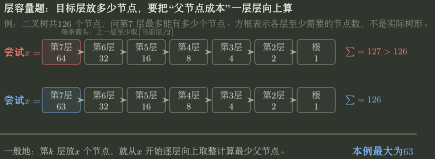
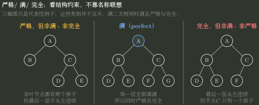

# 树的计数、层容量与存储账本

> 训练定位：解决“给节点总数、度数、叶数、高度、某层节点数、完全二叉树编号或指针字段后，怎样快速列式并完成手算”的题目族。  
> 模型归属：[DS04｜树与二叉树](DS04_树与二叉树_方法论手册.tex)。树的度与边数关系、层容量、链式表示和完全二叉树性质由 Canonical 正文解释；本文件只训练怎样列计数式、怎样处理局部变化、怎样从目标层向上反推必要节点，以及怎样数空指针。Huffman 与前缀码转入[Huffman 编码与前缀码](Huffman编码与前缀码.md)。

## 一、计数题先数边：同一批边从两个角度数

树的计数题最可靠的起点是边数：

$$
\boxed{E=n-1}
$$

因为除根外每个节点恰有一个父节点。另一方面，若 $n_i$ 表示度为 $i$ 的节点数，则每个节点贡献的孩子数之和也等于边数：

$$
\boxed{E=\sum_i i n_i}.
$$

再配合：

$$
\boxed{n=\sum_i n_i}.
$$

因此大多数“叶子、度数、节点总数”问题，本质上只是同一批节点被两种方式计数。

### 局部规则：看到“度”先确认它指孩子数

**触发信号**：题面出现“度为 0/1/2 的节点”“树的度为 $m$”。

**第一动作**：写下“树中节点的度 = 孩子数”，不要套图论的“入度+出度”。

**检查与退出**：如果你给根也补了一条“父边”，或把叶子的度写成 1，立即回退。

---

## 二、二叉树度数关系：从边数直接推出 $n_0=n_2+1$

设：

- $n_0$：叶节点数；
- $n_1$：度为 1 的节点数；
- $n_2$：度为 2 的节点数。

则：

$$
n=n_0+n_1+n_2,
$$

$$
E=n_1+2n_2=n-1.
$$

消去 $n,n_1$：

$$
\boxed{n_0=n_2+1}.
$$

这个关系对任意有限非空二叉树成立，不要求完全、满、平衡或 BST。

进一步：

$$
n=2n_0+n_1-1,
$$

所以：

$$
\boxed{n_0=\frac{n-n_1+1}{2}},
\qquad
\boxed{n_2=\frac{n-n_1-1}{2}}.
$$

这两个式子同时提供一个合法性检查：$n-n_1+1$ 必须为偶数，且算出的 $n_0,n_2$ 必须是非负整数。

### 局部变化用 $\Delta n_i$，不要重算整棵树

若一个叶节点被改造成度为 2 的节点，并新增两个叶孩子：

$$
\Delta n_0=-1+2=+1,
\qquad
\Delta n_1=0,
\qquad
\Delta n_2=+1.
$$

变化后仍应满足：

$$
(n_0+1)=(n_2+1)+1.
$$

### 局部规则：改度数就做增量账本

**触发信号**：题目说某节点“新增/删除孩子”“由度 0 变度 2”“把一个叶展开成两个孩子”等。

**第一动作**：旧类别先记 `-1`，新类别和新增节点再记 `+1`，只累计 $\Delta n_i$。

**检查与退出**：最后同时检查总节点增量与 $n_0=n_2+1$；二者只要有一个不满足，就漏记了节点。

### 单孩子节点还各自带来一次“放左还是放右”的选择

如果父子相连关系已经确定，只是不知道单孩子在左还是在右，而其中有 $k$ 个节点只有一个孩子，那么这 $k$ 个左右选择彼此独立：

$$
\boxed{2^k}.
$$

若 $n$ 个节点形成一条链，则有 $n-1$ 个单孩子内部节点，共：

$$
\boxed{2^{n-1}}
$$

种有序二叉树形态。这正是[遍历重建](二叉树遍历与序列重建.md)中“前序+后序出现 $2^k$ 种可能”的来源：每个单孩子节点都缺少一次左右方向信息。

---

## 三、一般树叶数：每个多分支节点会多产生多少条终止支路

由：

$$
\sum_i i n_i=\left(\sum_i n_i\right)-1
$$

可直接解得：

$$
\boxed{
n_0=1+\sum_{i\ge1}(i-1)n_i
}.
$$

它的直观意义是：

- 度 1 节点只让路径继续，叶子盈余贡献 0；
- 度 2 节点多分出 1 条支路，贡献 1；
- 度 3 节点贡献 2；
- 一般度 $i$ 节点贡献 $i-1$。

例如只可能有度 $0,1,3$ 的节点，已知 $n_1=4,n_3=5$：

$$
n_0=1+(3-1)\times5=11.
$$

> [!warning] 结果为负或非整数不是“特殊树”
> 它说明题面数据或你的度数解释不相容，应停止继续计算。

---

## 四、高度与层容量：向下看最多能放多少，向上看需要多少父节点支撑

### 1. 先统一高度口径

若根为第 1 层，高度 $h$ 表示总层数；若根深度为 0、最大深度为 $H$，则：

$$
\boxed{h=H+1}.
$$

后续公式必须先声明采用哪一种口径。

### 2. 向下看：每层最多装多少

若每节点至多有 $d$ 个孩子，根为第 1 层，则第 $i$ 层：

$$
\boxed{N_i\le d^{i-1}}.
$$

高度为 $h$ 的总节点数：

$$
\boxed{
N\le1+d+\cdots+d^{h-1}
=\frac{d^h-1}{d-1}
}
\qquad(d>1).
$$

二叉树取 $d=2$：

$$
N_i\le2^{i-1},
\qquad
N\le2^h-1.
$$

所以给定 $n$ 个二叉树节点，按层数计的最小高度：

$$
\boxed{h_{\min}=\left\lceil\log_2(n+1)\right\rceil}.
$$

若题目按根深度 0 计高度，再减 1。

### 3. “树的度为 $d$”还包含一个存在条件

“每个节点度不超过 $d$”只是上界；“树的度为 $d$”还要求至少有一个节点真的拥有 $d$ 个孩子。

若高度按层数为 $h\ge2$，最省节点的构造是保留一条含 $h$ 个节点的最长路径，并在路径某个非叶节点处补出其余 $d-1$ 个孩子：

$$
\boxed{N_{\min}=h+d-1}.
$$

因此“度为 4、高度 $h$”至少需要 $h+3$ 个节点。

### 4. 向上反推：第 $k$ 层想放 $x$ 个节点，上面至少要有多少节点支撑

若第 $k$ 层希望有 $x$ 个节点，每个父节点最多承载 $d$ 个孩子，则上一层至少要：

$$
\left\lceil\frac{x}{d}\right\rceil
$$

个节点，再上一层至少：

$$
\left\lceil\frac{x}{d^2}\right\rceil.
$$

所以支撑这 $x$ 个目标节点所需的最少节点总量是：

$$
\boxed{
M_d(x,k)=\sum_{j=0}^{k-1}
\left\lceil\frac{x}{d^j}\right\rceil
}.
$$

因此可行条件：

$$
\boxed{x\le d^{k-1}\quad\text{且}\quad M_d(x,k)\le n}.
$$

### 代表母题：126 个二叉树节点，第 7 层最多多少

尝试 $x=64$：

$$
64+32+16+8+4+2+1=127>126,
$$

不可行。

尝试 $x=63$：

$$
63+32+16+8+4+2+1=126,
$$

恰好可行，所以：

$$
\boxed{63}.
$$



这张图不是在画一棵具体二叉树，而是在画**每一层至少要有多少节点**。从目标层向根方向逐层取整，可以直接看出为什么 $64$ 个目标节点需要 127 个总节点，而 $63$ 个恰好只需要 126 个。

### 局部规则：只问理论上限就向下算；给总节点数就向上反推

**触发信号**：题面同时出现高度/第 $k$ 层/至多/总节点数。

**第一动作**：只问理论上界时用 $d^{i-1}$；如果还给了总节点数，就从目标层开始反推上一层至少需要 $\lceil x/d\rceil$ 个父节点，再逐层向上算到根。

**检查与退出**：目标层虽未超过理论上限，但“目标层+必要祖先”超过总节点数时，立即否决。

---

## 五、严格、满、完全二叉树：约束强度不同，不能越级调用

| 结构 | 真正约束 | 直接后果 |
|---|---|---|
| 严格/正则二叉树 | 每节点度只能为 0 或 2 | $n_1=0$，$n=2n_0-1$ |
| 满二叉树（perfect） | 每一层全部填满 | 根第1层时 $n=2^h-1$ |
| 完全二叉树 | 除最后一层外全满，最后一层从左向右连续 | 层序编号可直接恢复父子与叶区间 |

满二叉树若根为第 1 层、总层数 $h$：

$$
\boxed{n=2^h-1},
\qquad
\boxed{n_0=2^{h-1}}.
$$

若根深度 0、最大深度 $H$：

$$
n=2^{H+1}-1,
\qquad
n_0=2^H.
$$



> [!warning] “没有度为1节点”只推出严格/正则
> 它不能推出每层都满，也不能推出完全。满二叉树同时满足严格与完全，但这些名称不是互斥分类。

---

## 六、完全二叉树：先固定 0 基/1 基，再用编号

### 一基编号

$$
parent(i)=\left\lfloor\frac i2\right\rfloor,
\qquad
left(i)=2i,
\qquad
right(i)=2i+1.
$$

孩子下标越过 $n$ 就表示不存在。

最后一个非叶节点：

$$
\boxed{\left\lfloor\frac n2\right\rfloor}.
$$

叶节点编号：

$$
\left\lfloor\frac n2\right\rfloor+1,\ldots,n.
$$

叶节点数：

$$
\boxed{n_0=\left\lceil\frac n2\right\rceil}.
$$

### 零基编号

$$
parent(i)=\left\lfloor\frac{i-1}{2}\right\rfloor,
\qquad
left(i)=2i+1,
\qquad
right(i)=2i+2.
$$

### 完全二叉树某层已有 $x$ 个节点

若第 $k$ 层非空，则前 $k-1$ 层已经全部填满。因此能达到“第 $k$ 层恰有 $x$ 个节点”的最少总节点数：

$$
\boxed{N_{\min}=2^{k-1}-1+x}.
$$

若 $x<2^{k-1}$，第 $k$ 层必为最后一层。

### 局部规则：编号公式必须和下标起点一起抄

**触发信号**：数组顺序存树、父子编号、最后一个非叶节点。

**第一动作**：草稿左上角先写 `index from 0` 或 `index from 1`。

**检查与退出**：一基公式和 C/C++ 零基数组一旦混用，停止继续代数计算。

---

## 七、链式存储空指针：先数总指针字段，再减去非空字段

若每节点固定有 $c$ 个**孩子指针域**，则 $n$ 个节点共有：

$$
cn
$$

个孩子槽位。

树只有：

$$
n-1
$$

条真实父子边，每条恰占一个孩子指针，所以：

$$
\boxed{
N_{\text{null-child}}
=cn-(n-1)
=(c-1)n+1
}.
$$

于是：

| 表示 | $c$ | 空孩子指针 |
|---|---:|---:|
| 二叉链表 `left/right` | 2 | $n+1$ |
| 三叉树的三孩子定长链表 | 3 | $2n+1$ |

### 若再多一个 parent 指针

除根外每个节点的 `parent` 非空，所以又有 $n-1$ 个非空 parent 槽。

总槽位 $(c+1)n$，两类真实关系各占 $n-1$：

$$
\boxed{
N_{\text{null-all}}
=(c+1)n-2(n-1)
=(c-1)n+2
}.
$$

对二叉树 `left/right/parent`：

$$
\boxed{n+2}.
$$

必须区分：

- 节点**有几个字段**；
- 有几个字段**指向该节点**；
- 节点有几个**孩子**。

三者不是同一个计数对象。

### 局部规则：指针题先写“总字段数 - 非空字段数”

**触发信号**：问二叉链表、三叉链表、带 parent 的结构有多少空指针。

**第一动作**：写“每节点固定槽位数 × 节点数”，再逐类扣掉真实关系占用。

**检查与退出**：若 parent 与 child 都保存同一父子关系，它们是两个不同槽位，必须分别扣；题目若只统计孩子域，就不能把 parent 算进去。

---

## 八、陌生计数题的固定落笔协议

```text
1. 先确认“度”是孩子数，高度是层数还是最大深度。
2. 度数题先写 E=n-1，再写 E=sum(i*n_i)。
3. 二叉树立即检查 n0=n2+1；局部改动只记 Delta n_i。
4. 一般树叶数可用 n0=1+sum((i-1)n_i)。
5. 层容量只问理论上限就向下算；给总节点数时，要从目标层向上反推每一层至少需要多少父节点。
6. 严格/满/完全先辨约束，再调用对应性质。
7. 完全二叉树编号先固定 0 基或 1 基。
8. 空指针题先数总指针字段，再减去非空指针字段。
9. 最后检查整数性、非负性、层容量和空槽总数。
```

> [!summary]
> **树计数题可以压成三种数法：度数题数边；层容量题既看本层上限，也向上数必要父节点；存储题先数总指针字段，再减去已经被真实关系占用的字段。**
