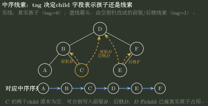

# 线索二叉树的前驱、后继与空链域

> 训练定位：解决先序/中序/后序线索二叉树中“某节点的前驱或后继是谁、能否直接找到、tag 怎样解释、线索化后还剩几个空链域”的问题。  
> 模型归属：[DS04｜树与二叉树](DS04_树与二叉树_方法论手册.tex)。线索化的写法、tag 含义，以及哪些前驱/后继能直接找到、哪些需要父节点，由 Canonical 正文解释；本文件只整理考场判断顺序和计算规则。

## 一、不要先背公式：先问这个指针现在表示“结构”还是“序列邻接”

线索二叉树最容易混乱的地方，是同一个 `lchild/rchild` 字段被赋予了两种可能语义：

| tag | 字段含义 |
|---|---|
| `ltag=0` | `lchild` 是真实左孩子 |
| `ltag=1` | `lchild` 是当前遍历下的前驱线索 |
| `rtag=0` | `rchild` 是真实右孩子 |
| `rtag=1` | `rchild` 是当前遍历下的后继线索 |

所以一道题看到 `p->rchild`，第一反应不应该是“它指向右孩子”，而是：

$$
\boxed{\text{先看 }rtag\text{，再决定它是结构边还是序列边。}}
$$

程序题还要再多一步：线索化过程中一旦把空孩子槽改成线程，之后递归只能沿 `tag=0` 的真实孩子边继续。尤其是先序线索化，若刚把空 `lchild` 写成前驱后又无条件递归 `lchild`，会直接沿线索回跳。

> [!idea] 先抓住一句话
> 线索化没有增加指针字段，只是把原来为空的孩子指针拿来保存“这一种遍历中的前驱或后继”。所以做题固定两步：**先看 tag，判断字段是孩子还是线索；再按遍历顺序求前驱/后继。**



图中实线只表示原树真实孩子关系，虚线只表示中序序列邻接。它刻意强调同一个 `lchild/rchild` 字段不能同时承担两种语义：例如 `C` 的两个孩子指针原本为空，所以可以分别线索化为指向前驱 `B` 和后继 `D`；`D` 的左右字段已有真实孩子，就仍由 `tag=0` 保持结构边。

---

## 二、真正决定难度的是：求这个邻接节点时，要不要先回到父节点

把三种 DFS 的局部顺序写出来：

$$
\text{Pre}=NLR,\qquad
\text{In}=LNR,\qquad
\text{Post}=LRN.
$$

线索只能写进原来为空的孩子指针。如果从当前节点沿真实孩子向下就能找到目标，通常可以直接求；如果必须先知道“当前节点是谁的孩子、在父节点哪一侧”，而节点又没有 `parent`，那就不能只靠当前节点完成。

| 线索类型 | 前驱 | 后继 | 考场结论 |
|---|---|---|---|
| **先序** | `ltag=1` 时线索直达；`ltag=0` 时通常要知道父层 | 可由真实左/右孩子或右线索继续 | **后继容易，前驱可能难** |
| **中序** | 左线索，或左子树最右节点 | 右线索，或右子树最左节点 | **前驱、后继都容易** |
| **后序** | 可由真实右/左孩子或左线索得到 | `rtag=1` 时直达；有真实孩子时通常要知道父层 | **前驱容易，后继可能难** |

这张表比逐条背结论更容易复原。它背后的对称关系是：

$$
\boxed{
\text{先序天然向后推进}
\quad\longleftrightarrow\quad
\text{后序天然向前回看}
}
$$

中序恰好处在中间，前驱和后继都能转化成“一侧子树的极端节点”。

### 局部规则：先写清“哪种遍历 + 求前驱还是后继”

**触发信号**：题目出现先序/中序/后序线索树，并问某节点的前驱、后继或能否高效找到。

**第一动作**：先写 `Pre/In/Post` 和 `pred/succ` 两个标签，再看 `ltag/rtag`；不要先顺着裸指针走。

**检查与退出**：如果下一步必须回到父节点，而节点结构没有 `parent`，就不能再说“只靠当前节点即可求出”；只能看是否已有线索、是否有头结点约定，或从根重新定位。

---

## 三、先序线索树：后继按“左优先、右其次、线索兜底”

对节点 `p` 求先序后继：

1. 若 `ltag=0`，存在真实左孩子，则后继就是 `p->lchild`；
2. 否则若 `rtag=0`，存在真实右孩子，则后继就是 `p->rchild`；
3. 若两边都不是孩子，则 `p->rchild` 是后继线索。

可以压成：

```text
有左孩子 -> 左孩子
否则有右孩子 -> 右孩子
否则 -> 右线索
```

为什么前驱不像后继这么顺？因为若 `p` 有真实左孩子，`lchild` 已经被结构占用，不能同时保存前驱；而先序中“谁刚刚访问完才来到 p”往往需要知道 `p` 是父节点的左孩子还是右孩子，属于向父层回退的信息。

> [!warning] 不要把 `lchild` 一律当先序前驱
> 只有 `ltag=1` 时它才是前驱线索。`ltag=0` 时它是左孩子，不能为了求前驱强行重新解释。

---

## 四、中序线索树：先判断是不是线索，否则去对应子树找极端节点

### 求前驱

```text
ltag = 1 -> lchild 就是前驱线索
ltag = 0 -> 进入左子树，再一直沿真实右孩子走到底
```

也就是：

$$
\boxed{
\operatorname{pred}_{in}(p)=
\begin{cases}
p.lchild,&ltag=1,\\
\text{左子树最右节点},&ltag=0.
\end{cases}}
$$

### 求后继

完全对称：

$$
\boxed{
\operatorname{succ}_{in}(p)=
\begin{cases}
p.rchild,&rtag=1,\\
\text{右子树最左节点},&rtag=0.
\end{cases}}
$$

因此如果题目说“节点 `X` 有左孩子”，中序前驱不是“左孩子中最左的节点”，而是：

$$
\boxed{\text{左子树中最右的节点}}.
$$

这来自中序的局部结构：

$$
\text{左子树}\to X\to\text{右子树},
$$

所以在访问 `X` 之前最后结束的节点必然是左子树的最右端。

### 局部规则：中序题先看 tag，再找“相反方向极端点”

**触发信号**：中序线索树，节点有真实左/右孩子，问前驱或后继。

**第一动作**：前驱看左侧：有线索直接走线索，否则进入左子树找最右；后继看右侧：有线索直接走线索，否则进入右子树找最左。

**检查与退出**：若你求前驱却进入右子树，或求后继却进入左子树，方向已经反了。

---

## 五、后序线索树：前驱能向孩子走，后继常常要回父层

后序是：

$$
L\to R\to N.
$$

所以如果节点 `p` 有真实右孩子，`p` 被访问之前最后完成的是右子树，而一棵子树的后序最后一个节点就是子树根。因此：

```text
有真实右孩子 -> 前驱是右孩子
否则有真实左孩子 -> 前驱是左孩子
否则 -> 左线索给前驱
```

可以压成：

$$
\boxed{
\operatorname{pred}_{post}(p)=
\begin{cases}
p.rchild,&rtag=0,\\
p.lchild,&rtag=1.
\end{cases}}
$$

第二行里，若 `ltag=0`，`lchild` 是唯一真实左孩子；若 `ltag=1`，`lchild` 本身就是前驱线索。考场不需要再把这两种情况拆成两条公式，记住一句即可：

> **后序的前驱就是“访问根之前最后完成的那棵非空孩子子树的根”；如果没有孩子，才用前驱线索。**

后序后继则经常需要父节点：若 `p` 是父亲的右孩子，或父亲没有右子树，则父亲就是 `p` 的后继；若 `p` 是父亲的左孩子且父亲还有右子树，则后继是父亲右子树中“后序第一个访问”的节点。没有 `parent` 时，这种判断不能仅靠 `p` 的真实孩子字段完成。

一个很典型的速判是：若 `X` 是叶节点并且存在左兄弟 `Y`，那么 `X` 必是其双亲的右孩子。后序顺序为“左子树 → 右子树 → 双亲”，所以：

$$
\boxed{\operatorname{succ}_{post}(X)=parent(X)}.
$$

由于 `X` 是叶节点，右孩子槽为空，可在线索化后由右线索直接指向这个双亲。

---

## 六、先区分“线索字段数”和“线索化后仍为空的链域数”

含 $n$ 个节点的普通二叉链表原本有 $n+1$ 个空孩子指针。完整线索化后，这些位置都不再表示真实孩子，而被标记为线索字段。因此如果题目问**线索字段一共有多少个**，答案仍是：

$$
\boxed{n+1}.
$$

但其中有些线索指向真实前驱/后继，有些位于整个遍历序列首尾，指针值仍然是 `NULL`。所以：

$$
\boxed{\text{线索字段数}\neq\text{值仍为 NULL 的线索字段数}}.
$$

下面的“空链域”专指**线索化完成后指针值仍为 `NULL`** 的字段。

### 空链域题：先找整个遍历序列的“无前驱”和“无后继”

不带头结点时，整个遍历的第一个节点没有前驱，最后一个节点没有后继。但是**只有对应字段原本就是空孩子槽时，这个“无邻接”才会表现为空链域**。

### 中序：非空树固定剩 2 个空链域

中序第一个节点一定是全树最左节点，所以它没有左孩子，其 `lchild` 可作为“无前驱”的空线索。

中序最后一个节点一定是全树最右节点，所以它没有右孩子，其 `rchild` 可作为“无后继”的空线索。

因此：

$$
\boxed{N_{\text{null after inorder threading}}=2}
$$

这里默认非空树、无头结点。

### 先序：固定有“最后节点的无后继”，是否还有“根的无前驱”取决于根左指针是否空

先序最后一个节点一定是叶节点，所以其右空指针会留下作为“无后继”：至少 1 个空链域。

先序第一个节点是根。根没有前驱，但只有根原本**没有左孩子**时，`lchild` 才有空槽可存“无前驱”。所以：

- 根有左孩子：通常只剩 1 个空链域；
- 根左子树为空：再多一个根的空前驱线索，共

$$
\boxed{2}
$$

个。

### 后序：与先序对偶

后序第一个节点是叶节点，因此其左空指针一定留下“无前驱”；后序最后一个节点是根，只有根原本没有右孩子时，才额外留下“无后继”的右空线索。

### 局部规则：数空链域不要从 $n+1$ 直接减

**触发信号**：题目问“线索化后还有几个空指针/空链域”。

**第一动作**：先确定遍历的第一个和最后一个节点，再问它们用于存无前驱/无后继的对应字段原本是不是空孩子槽。

**检查与退出**：`n+1` 是**线索化前**二叉链表全部空孩子域的总数；线索化后大多数已被前驱/后继填掉，不能继续直接写 `n+1`。

---

## 七、头结点会改变“空”这个边界表示

如果题目明确引入 Header，通常会让中序第一个节点的前驱、最后一个节点的后继都指向 Header，从而把线性序列首尾改造成环形边界。

因此同一道“有几个空链域”的题，一旦出现“带头结点”，必须先读取题目或教材对 Header 的具体约定，不能把无头结点结论机械搬过去。

---

## 八、考场最后只问四件事

遇到线索树题，只问：

1. **线索化的是哪一种遍历？**
2. **当前字段的 tag 是 0 还是 1？**
3. **目标邻接是前驱还是后继；能否只向孩子方向走，还是必须回父层？**
4. **首尾无邻接是否真的有一个空槽可以表示？题目有没有 Header？**

压缩成一句话：

> [!summary]
> **先看 tag，分清孩子指针和线索；再看遍历类型与方向：先序后继容易直接找，后序前驱容易直接找，中序前驱后继都能按固定规则找。空链域只可能出现在遍历首节点没有前驱、尾节点没有后继，并且对应孩子指针原本为空的位置。**
