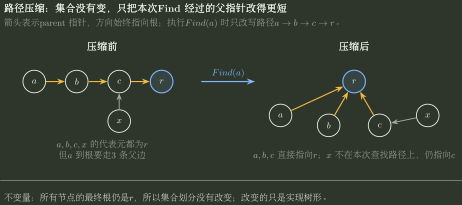

# 并查集父指针、合并与路径压缩

> 训练定位：解决“数组里的负数/父下标怎样解释”“一次 Union 后集合数和树高怎样变”“路径压缩到底改了什么”“按秩/按大小为何能控高”“并查集能不能判环/连通”等题目族。  
> 模型归属：[DS06｜Union-Find 与集合划分](DS06_UnionFind与集合划分_方法论手册.tex)。分区、代表元、Find、Union、按秩/大小合并与路径压缩机制由 Canonical 正文拥有；本文件只训练父指针状态翻译、操作推演、复杂度前提与能力边界。

## 一、先分清两件事：集合怎么分，父指针树怎么存

并查集真正维护的是一个集合划分：

$$
U=S_1\dot\cup S_2\dot\cup\cdots\dot\cup S_k.
$$

父指针树只是保存这种集合关系的一种方式。只要两个元素最终找到同一根，它们就在同一集合；题目若只问连通或是否同集合，父指针树具体长什么样通常并不重要。

因此要把两类“变化”分开：`Union` 成功时会真的把两个集合合成一个，同时改写父指针；带路径压缩的 `Find` **不会改变谁和谁属于同一集合**，只是把查找路径压短。选项如果只说“改变结构”，要先看它指的是集合划分，还是 parent 数组形成的树。

### 局部规则：先找根，不先看节点深度

**触发信号**：题目给 `parent[]`，问两个元素是否同集合、合并后有几个集合、某元素代表元是谁。

**第一动作**：沿父指针走到根；根相同才是同一集合。

**检查与退出**：路径压缩可能改变父指针和深度，但不会改变根所属的等价类；不要因为树形变化就误判集合变化。

## 二、数组表示常见两种口径

### 1. 根指向自己

```text
parent[root] = root
parent[x]    = x 的父节点
```

初始化：`parent[i]=i`。

### 2. 根存负值，非根存父下标

常见写法：

```text
parent[root] = -size(root)
parent[x]    = parent index
```

于是：

- `parent[x] < 0`：`x` 是根；
- `-parent[x]`：根所在集合大小；
- 非根位置的正数只是父下标，不能拿来当集合大小。

> **易错边界：**有的教材根存 `-height`、`-rank` 而不是 `-size`。题目必须先说明负数含义；只看到“负数”不能直接把绝对值解释成元素个数。

## 三、Union 的真正动作：只合并两个根

标准流程：

```text
ra = Find(a)
rb = Find(b)
if ra == rb:
    不改变分区
else:
    把一个根挂到另一个根
    集合数减 1
```

因此一次 Union 并不保证一定减少集合数；如果两元素原本已经同根，重复合并是空操作。

### 局部规则：集合数只数“成功合并”

**触发信号**：初始 $n$ 个单元素集合，执行若干次合并，问最后集合数或连通分量数。

**第一动作**：初值写 $components=n$；只有 `Find(a) != Find(b)` 时才减 1。

**检查与退出**：重复边、自环或同集合内合并不减；不能简单用“操作次数”代替“成功合并次数”。

## 四、为什么任意挂接可能退化成长链

若连续执行：

```text
1 挂到 2
2 挂到 3
3 挂到 4
...
```

父指针树可退化为链，单次 Find 最坏达到 $O(n)$。

所以优化不是为了正确性，而是为了限制路径长度。

## 五、按秩 / 按大小合并：控制“以后别长得太高”

### 按秩

把低秩根挂到高秩根；只有两根秩相同时，新根秩才加 1。

关键证明：秩为 $r$ 的根至少包含 $2^r$ 个元素，所以：

$$
r\le \lfloor\log_2 n\rfloor.
$$

因此只用按秩、不做路径压缩时，Find 也有 $O(\log n)$ 高度上界。

### 按大小

把较小集合根挂到较大集合根。一个元素每次深度增加时，它所在集合规模至少翻倍，因此深度也至多 $O(\log n)$。

### 局部规则：先辨认“负值表示什么”

**触发信号**：题目给根节点负数并要求执行 Union。

**第一动作**：确认绝对值是 `size` 还是 `rank/height`；再按题设的“较小挂较大 / 低秩挂高秩”更新。

**检查与退出**：更新后只有新根位置还表示集合大小或秩；被挂下去的旧根已经变成普通节点，不能继续保留原来的负值并被误认成第二个根。

## 六、路径压缩：只改实现路径，不改集合答案

递归版：

```text
Find(x):
    if x is root: return x
    parent[x] = Find(parent[x])
    return parent[x]
```

回溯时把沿途节点直接接到根。

路径压缩前：

```text
a -> b -> c -> r
```

一次 `Find(a)` 后可能变成：

```text
a -> r
b -> r
c -> r
```

但所有节点的代表元仍是 `r`。



图里特意保留了旁支节点 `x`：`Find(a)` 只把本次查找路径上的 `a,b,c` 改为直接指向根，`x` 没有被顺手改写。这样可以同时看见“父指针树变了”和“集合划分没变”这两个层次。

### 局部规则：压缩题只改“查找路径上的节点”

**触发信号**：给一棵并查集父指针树，执行一次 Find 并要求更新数组。

**第一动作**：先完整记录从查询点到根的路径。

**检查与退出**：路径上的节点可直接改指根；不在本次路径上的其他分支不应被顺手重写。

## 七、复杂度必须写优化前提

| 实现 | 单次/摊还 Find 典型界 | 说明 |
|---|---:|---|
| 任意合并，无压缩 | 最坏 $O(n)$ | 可退化成长链 |
| 按秩/按大小，无压缩 | $O(\log n)$ | 树高受控 |
| 路径压缩 + 按秩/大小 | 摊还 $O(\alpha(n))$ | 近似常数，但不是“数学上严格 $O(1)$” |

> **易错边界：**题目若没有说明采用何种 Union 规则，就不能自动拿 $O(\alpha(n))$；经典反阿克曼界绑定“路径压缩 + 按秩/按大小”的组合。只写“路径优化/路径压缩”而未说明 Union 挂接策略时，先把它视为条件不完整，而不是默认双优化。

## 八、并查集适合判什么，不适合判什么

并查集擅长：

- 无向图动态加边后的连通性；
- Kruskal 中判断一条边是否连接两个不同分量；
- 统计成功合并次数与连通分量数；
- 维护“只合并、不拆分”的等价类。

它不直接提供：

- 两点之间具体路径；
- 最短路径长度；
- 有向图可达性；
- 删除边后的在线动态连通；
- 集合内部有序关系。

### 判无向图加边成环

处理边 $(u,v)$：

```text
if Find(u) == Find(v):
    这条边会在当前分量内闭合一个环
else:
    Union(u,v)
```

这是 Kruskal 避环的同一个判据。Kruskal 需要维护多个连通分量，所以自然调用 Union-Find；Prim 的主状态是一棵当前生成树及其割边/`best[]`，不把并查集作为核心状态。看到“最小生成树”不能因为两个算法目标相同就一律选择并查集。

## 九、树高类选择题先问“合并规则是否受控”

若题目只说“任选两个集合合并”而不规定按秩/按大小，树高可以随着操作顺序显著变化；若又说“每次随机选择元素再合并”，需要明确 Union 的具体挂接规则才能唯一推出父指针树高度分布。

因此：

### 局部规则：树高题先检查题面有没有把合并规则说完整

**触发信号**：问执行若干次随机/任意 Union 后“树高一定是多少、平均是多少”。

**第一动作**：找题面是否给出“哪个根挂哪个根”“按秩/按大小”“是否路径压缩”。

**检查与退出**：如果这些规则没有说明，而不同挂接方式会得到不同树高，就应判为条件不足；不要默认某一种教材实现就是唯一实现。

## 十、代表练习：一题串起 Find、Union、路径压缩和判环

与其保留多道只问一个术语的小题，更值得保留一题包含以下连续状态：

1. 给出 `parent[]`，判断当前有几个集合；
2. 执行一次 Find，写出路径压缩后的数组变化；
3. 执行一次按大小 Union，判断新根和 size；
4. 再加入一条连接同根节点的边，判断是否形成环；
5. 比较“无优化 / 按大小 / 双优化”的复杂度。

这一道综合题就能同时练到：**读 parent 数组、找代表元、更新合并状态、判环，以及判断复杂度结论需要哪些前提**。

## 十一、最后记住八句话

```text
1. 并查集维护的是分区，父指针树只是实现。
2. Find 先走到根；根相同才同集合。
3. Union 只合并根；同根重复合并不减集合数。
4. 负值先确认表示 size 还是 rank/height。
5. 按秩/大小控制未来树高；路径压缩缩短已访问路径。
6. 双优化摊还 O(alpha(n))，结论必须绑定实现前提。
7. 无向加边判环：两端同根则成环，否则合并。
8. 问随机 Union 后树高时，先检查挂接规则是否充分。
```
