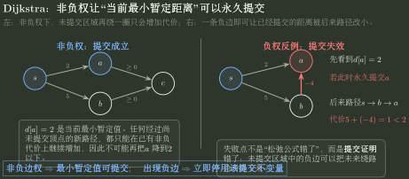
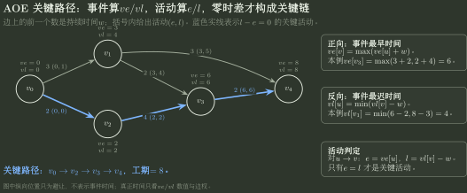

# MST、最短路与拓扑状态推演

> 训练定位：解决“给一张带权图/DAG，要求手算 Prim、Kruskal、Dijkstra、Floyd、拓扑排序或关键路径”的题目族。  
> 模型归属：[DS08｜图上的结构算法](DS08_图上的结构算法_方法论手册.tex)。各算法的目标、不变量、提交条件与失败证据由 Canonical 正文拥有；本文件只训练候选域账本、逐轮状态表和验算。

## 母题表示：先写五栏，再认算法

```text
Goal
Candidate Domain
Local Action
Commit Point
Failure Evidence
```

如果只会写“每次选最小”，Prim、Kruskal、Dijkstra 很容易互串。

| 算法 | 候选是谁 | 什么时候永久提交 |
| --------- | --------------------------- | ---------------------------------- |
| Prim | 当前树到树外的跨割边/树外点 best | 最小跨边把新点接入当前树 |
| Kruskal | 全局剩余边 | 当前最轻且两端不同分量的边加入森林 |
| Dijkstra | 暂定距离 | 非负权前提下最小未确定距离被取出 |
| Floyd | 点对 $(i,j)$ | 完成第 $k$ 轮后允许中间点集合扩到前 $k$ 个 |
| Kahn | 当前入度为 0 的点 | 输出该点并删除其出边约束 |

## 问题一：Prim 是“一棵树向外长”

维护：

- $S$：已经进入 MST 的顶点；
- `best[v]`：从 $S$ 跨到 $v$ 的最轻边；
- `parent[v]`：产生这个 best 的树内端点。

每轮：

```text
选树外 best 最小顶点 v
-> 提交 parent[v]-v
-> v 加入 S
-> 用 v 的邻边更新其他树外点 best
```

### 检查与退出

若树外仍有顶点，但所有 `best=∞`，图不连通；不能硬凑一条 MST。

### 关键区别

Prim 的候选域只看**当前树的边界**。一条全图很小的边，如果两端都在树外，此刻不是 Prim 候选。

## 问题二：Kruskal 是“全局边排序 + 森林合并”

先按权从小到大扫描边：

```text
if endpoints in different components:
    accept edge
    union components
else:
    reject edge (would create cycle)
```

终止：接受 $V-1$ 条边。

### 局部规则：并列边权可能导致边集不唯一

**触发信号**：多个相同权值边。

**第一动作**：只要每次仍满足“不同分量 + 当前最小可选权级”，多种 tie-break 可能都合法。

**检查与退出**：边集不同不等于总权错误；若题目问 MST 是否唯一，需要额外唯一性证据。

## 问题三：Prim 和 Kruskal 的“最小”不是同一个最小

- Prim：当前割上的最小安全边；
- Kruskal：全图尚未处理的最小边，只要不成环。

因此纸面状态表也不同：

```text
Prim:    S / best[] / parent[]
Kruskal: sorted edges / components / accepted edges
```

不要用一张表混写。

## 问题四：Dijkstra 的核心是“暂定值什么时候可以永久化”

初始化：

$$
d[s]=0,\qquad d[v]=\infty.
$$

每轮：

1. 取未确定顶点中 $d$ 最小者 $u$；
2. 在**非负边权**前提下提交 $u$；
3. 对每条 $u\to v$ 松弛：

$$
d[v]\leftarrow\min(d[v],d[u]+w(u,v)).
$$

### 局部规则：负权边不是“结果可能不准”，而是提交证明失效

**触发信号**：图出现负边。

**第一动作**：停止使用 Dijkstra 的“最小出队即确定”；转 Bellman-Ford/Floyd 等适用模型。

**检查与退出**：若后续推理仍把某个当前最小暂定距离当成永久最短距离，说明还在偷用 Dijkstra 的非负权证明；存在负环时还要进一步停止谈有限最短路。



图中左侧说明非负权为什么允许“当前最小暂定距离”永久化；右侧只改变一条边为负权，用最小反例直接显示后续路径可以把已经提交的距离继续降低。

## 问题五：Dijkstra 与 BFS 的区别是代价模型

BFS：每条边代价相同，因此 FIFO 层次就是代价层次。  
Dijkstra：边权非负但可不同，需要按当前累计距离的优先级选最小候选。

两者都在维护“当前最早可提交的 frontier”，但排序标准不同。

## 问题六：Floyd 一定把“允许的中间点”放最外层

递推：

$$
D^{(k)}[i][j]
=
\min\left(D^{(k-1)}[i][j],
D^{(k-1)}[i][k]+D^{(k-1)}[k][j]\right).
$$

因此循环语义是：

```text
for k:
    for i:
        for j:
            try path i -> k -> j
```

完成第 $k$ 轮后，整个矩阵才统一表示“只允许前 k 个点做中间点”。

### 检查

若最终：

$$D[i][i]<0,$$

说明存在负环证据；此时相关“最短路”不再有有限最小值。

## 问题七：拓扑排序用“释放约束”而不是背队列序列

Kahn：

```text
统计 indegree
把所有 indegree=0 的点放入候选集
while candidate not empty:
    choose/output u
    for u->v:
        indegree[v]--
        if indegree[v]==0: add v
```

### 唯一性

- 某一步候选集有多个点 → 拓扑序至少不唯一；
- 每一步都恰有 1 个候选，且最终输出全部顶点 → 唯一。

### 判环

若最终输出数 $<V$，剩余约束无法释放 → 有环。

## 问题八：关键路径必须正向 + 反向两遍

AOE 网：

### 正向拓扑序

$$
ve[v]=\max_{u\to v}(ve[u]+w(u,v)).
$$

求事件最早时间和总工期。

### 反向逆拓扑序

$$
vl[u]=\min_{u\to v}(vl[v]-w(u,v)).
$$

活动 $u\to v$：

$$
e=ve[u],\qquad l=vl[v]-w(u,v).
$$

若：

$$e=l,$$

该活动零时差，是关键活动。



图中节点只承载事件的 $ve/vl$，边承载活动持续时间与 $(e,l)$；几何高低只为避让，不代表事件发生时间。

> 只做正向最长路只能求工期，不能判断哪个活动可以延迟。

### 关键活动不等于“改它一点，工期一定同样改一点”

关键路径可能不唯一。一个零时差活动只说明它至少位于一条当前最长路径上；改变其持续时间以后，最长路径集合可能重新竞争。

- **增加**某个关键活动的持续时间 $\Delta>0$：包含它的那条原关键路径会变长，因此项目总工期至少增加 $\Delta$；
- **缩短**某个关键活动：若还有另一条同长关键路径不经过它，项目工期可能完全不变；即使只有一条当前关键路径，缩短到一定程度后也可能被次长路径“接管”；
- 若想保证“缩短该活动 $\Delta$ 就让总工期恰好缩短 $\Delta$”，需要它位于所有当前竞争的关键路径上，并且缩短后没有其他路径追平/超过。

所以题目出现“任意关键活动缩短都会缩短关键路径”“关键活动持续时间变化必使关键路径集合不变”这类绝对表述，应直接回到“所有源到汇路径的最大长度”定义，而不是只看当前的零时差标签。

### 局部规则：关键路径扰动题重新比较最长路径

**触发信号**：题目问某关键活动延长/缩短后，工期或关键路径是否一定改变。

**第一动作**：先区分“工期数值”和“关键路径集合”，再检查是否存在多条同长关键路径以及次长路径的余量。

**检查与退出**：只凭“活动当前 $e=l$”不能推出缩短它一定缩短总工期；若题目没有唯一关键路径或路径余量信息，停止做过强结论。

## 代表母题：Prim 与 Kruskal 为什么轨迹不同

边：

```text
0-1(1), 1-2(2), 2-3(1), 0-3(8)
```

从 0 做 Prim：

```text
S={0}
-> accept 0-1(1)
S={0,1}
-> accept 1-2(2)
S={0,1,2}
-> accept 2-3(1)
```

Kruskal：

```text
accept 0-1(1)
accept 2-3(1)
accept 1-2(2)
```

总权都为 4，但 Prim 始终维护一棵连接起点的树，Kruskal 中间允许多个分量。

## 代表母题：Dijkstra 状态表

建议手算表固定列：

| round | committed | $d[A]$ | $d[B]$ | $d[C]$ | predecessor change |
| -------- | -------------- | ---------: | --------: | --------: | ------------- |
| 0 | source | ... | ... | ... | ... |
| 1 | ... | ... | ... | ... | ... |

每轮只做两件事：选最小未提交顶点；用它的出边松弛。最后沿 predecessor 反向恢复路径，不要从距离值“猜路径”。

## 陌生图算法题固定落笔协议

```text
1. Goal：MST / single-source / all-pairs / topo / critical path？
2. Candidate：割边 / 全局边 / 暂定距离 / 点对 / 零入度点？
3. Commit：本轮结束后什么从候选变永真？
4. Update：best / component / distance / indegree / ve-vl？
5. Failure：非连通 / 负边 / 负环 / 有环 / 不可达？
6. Prim/Kruskal 分开维护状态，不因都“选最小”而合并。
7. Dijkstra 看到负边立即停用提交证明。
8. 最后用边数、连通性、距离三角关系或拓扑输出数做独立核验。
```

## 最短压缩

> **图算法不背代码，背“候选域 + 提交点”：Prim 在割边上长一棵树，Kruskal 合并森林，Dijkstra 非负权下提交最近点，Floyd 按中间点集合扩张。**
