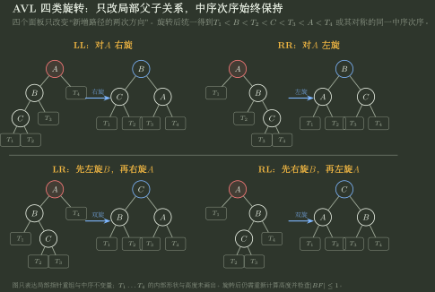

# 折半查找、BST 与 AVL 推演

> 训练定位：解决“给有序表/判定树/BST/AVL，要求比较次数、ASL、插入删除、旋转或判断结构”的题目族。  
> 模型归属：[DS09｜查找与有序索引](DS09_查找与有序索引_方法论手册.tex)。折半查找、BST、AVL/B 树等机制由 Canonical 正文拥有；本文件只训练区间/路径/高度状态和独立验算。

## 母题表示：查找题先问“秩序存在哪里”

- 有序连续表：秩序在数组位置，可随机访问 → 二分；
- BST：秩序在根到叶的比较路径；
- AVL：在 BST 秩序之外，再维护高度平衡；
- B/B+：把高扇出索引放进外存页，降低树高。

同样是“有序”，维护成本与可用操作不同。

## 问题一：折半查找先写区间不变量

闭区间模板：

```text
目标若存在，一定在 [low, high]
while low <= high:
    mid = low + (high-low)/2
    compare a[mid] with key
    排除 mid 后严格缩小区间
```

### 局部规则：命中是否立即返回取决于接口

**触发信号**：折半查找存在重复 key，题目要求“任意命中 / 第一个 / 最后一个 / lower bound / upper bound”。

**第一动作**：先写返回契约，再决定命中后的区间更新：

- 任意一个 key：命中可返回；
- 第一个 key：命中后记录答案，继续 `high=mid-1`；
- 最后一个 key：命中后记录答案，继续 `low=mid+1`；
- lower bound：找第一个 `a[i] >= key`；
- upper bound：找第一个 `a[i] > key`。

**检查与退出**：若两元素区间某次更新后 `low/high` 不变，说明中点取法与边界更新不匹配；若接口要求边界位置却命中即停，也说明返回契约被偷换。

## 问题二：二分判定树和 AVL 不是同一个对象

上传速记稿把“二分判定树 vs AVL”作为对比，这个方向是对的，但要明确：

- 折半判定树描述**静态有序数组上比较过程**；
- AVL 是**动态 BST 的一种存储结构**，要支付插入/删除后的旋转维护。

二者都可能有近似对数高度，却不能因为“树形差不多”而互换存储和更新结论。

### 判定树中的失败节点

$n$ 个关键字会形成 $n+1$ 个失败区间。成功 ASL 和失败 ASL 的分母、路径对象不同：

- 成功：内部关键字节点；
- 失败：外部空区间。

因此失败 ASL 不能机械拿成功的 $n$ 作分母。

## 问题三：BST 的复杂度先写 $O(h)$，再判断是否平衡

查找/插入/删除都沿一条根叶路径：

$$
T=O(h).
$$

普通 BST 在极端插入顺序下可以退化成链：

$$h=\Theta(n).$$

只有额外平衡约束才能保证对数高度。

### 局部规则：任何 “BST 查找 O(log n)” 都要补高度前提

**触发信号**：选择题出现“二叉排序树查找一定为 $O(\log n)$”。

**第一动作**：找题面是否给 AVL/平衡/随机平均假设；没有则最坏应保留 $O(n)$。

**检查与退出**：若插入顺序可以构成单支链，就已经给出 $h=n$ 的反例；此时停止把普通 BST 当成平衡树。

## 问题四：BST 删除固定三分支

删除节点 $x$：

1. 叶节点：直接断开；
2. 单孩子：孩子接替 $x$ 的位置；
3. 双孩子：用中序前驱或后继替代 key，再在原位置删除那个替代节点。

### 检查

删除后最短验证是中序遍历：结果必须继续满足题设的严格/非严格有序规则。

## 问题五：AVL 旋转不要背四张图，先看两次方向

节点平衡因子：

$$BF=h_L-h_R.$$

失衡条件：

$$|BF|>1.$$

插入后从修改点向上找第一个失衡祖先 $z$。

然后看：

1. $z$ 的重子树在左还是右；
2. 重子树内部的增长又在左还是右。

得到：

| 路径  | 类型  | 修复             |
| --------- | ------- | --------------------- |
| 左-左 | LL  | 对 $z$ 右旋       |
| 右-右 | RR  | 对 $z$ 左旋       |
| 左-右 | LR  | 先左旋左孩子，再右旋 $z$ |
| 右-左 | RL  | 先右旋右孩子，再左旋 $z$ |



四个面板只改变“从失衡点到新增分支的两次方向”；$T_1\sim T_4$ 只表示保持原有中序区间的子树，不承诺它们的具体形状。

### 局部规则：旋转必须同时保持两类不变量

**触发信号**：AVL 插入/删除后出现失衡，准备做单旋或双旋。

**第一动作**：先按从失衡点向新增/缩短分支的两次方向确定 LL/RR/LR/RL，再执行对应旋转。

**检查与退出**：旋转后同时验证：1）BST 中序次序不变；2）当前子树高度平衡恢复。只把图形“转平”但破坏 key 次序，或仍存在 $|BF|>1$，都不是合法修复。

## 问题六：AVL 插入与删除的停止条件不同

插入时，修复第一个失衡祖先后，整棵相关子树的高度常恢复到插入前水平，因此经典插入可停止继续旋转。

删除可能让修复后的子树高度继续下降，祖先还可能再次失衡，因此要继续向根检查。

> 不要把“修第一个失衡点就结束”无条件套到 AVL 删除。

## 问题七：AVL 高度为什么是 $O(\log n)$

高度为 $h$ 的最少节点数满足：

$$
N(h)=1+N(h-1)+N(h-2).
$$

它按 Fibonacci 量级增长，所以反推：

$$
h=O(\log n).
$$

### 检查

AVL 不等于完全二叉树；它只约束左右高度差，不要求最后一层连续填充。

## 问题八：分块查找是“两级成本”，不能只算索引

块间有序、块内可无序：

```text
index search
-> locate candidate block
-> sequential search within block
```

若 $b$ 块、每块 $s$ 项且两层都顺序：

$$
ASL\approx\frac{b+1}{2}+\frac{s+1}{2},\qquad bs=n.
$$

只减少块大小会增加索引项数量；最优来自两段工作的平衡，而不是某一段单独最小。

## 代表母题：AVL 插入

依次插入：

```text
30, 10, 20
```

普通 BST 形状：

```text
    30
   /
  10
    \
     20
```

失衡祖先 30：重方向左；其左孩子 10 的重方向右 → LR。

修复：

```text
先对 10 左旋
再对 30 右旋
```

结果：

```text
   20
  /  \
 10  30
```

中序仍是 `10,20,30`，高度差恢复。

## 代表母题：二分失败比较次数

给一个具体有序表时，最稳的方法不是只写“约 $\log n$”，而是按二分规则画判定树：

- 内部节点：比较到某 key；
- 外部空区间：失败入口。

题目问失败 ASL，就统计这 $n+1$ 个外部入口分别经过多少次关键字比较，再按题设概率加权。

## 陌生查找题固定落笔协议

```text
1. 返回契约是什么：存在/位置/首个/末个/范围？
2. 秩序存在哪里：数组区间、BST 路径、平衡树高度？
3. 二分先写区间不变量和严格缩小条件。
4. ASL 分成功内部节点与失败外部节点。
5. BST 复杂度先写 O(h)，再判断 h 是否有保证。
6. AVL 先找第一个失衡祖先，再看两次方向 LL/RR/LR/RL。
7. 删除后继续向祖先检查，不照搬插入停止规则。
8. 最后用中序有序 + 高度差做独立验算。
```

## 最短压缩

> **折半查找维护候选区间，BST 维护有序路径，AVL 再维护高度；“都像平衡树”不等于同一结构，所有复杂度都要把秩序前提写出来。**
