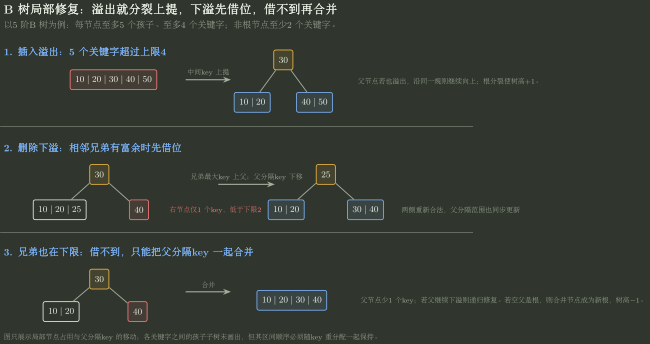

# 红黑树、B 树与 B+ 树状态判断

> 训练定位：解决“红黑树哪些颜色/高度结论是真的”“B 树的阶、关键字数、分裂合并怎样计算”“B+ 树为什么内部命中还要下到叶层”等平衡索引判断题。  
> 模型归属：[DS09｜查找与有序索引](DS09_查找与有序索引_方法论手册.tex)。红黑树颜色不变量、B/B+ 树分裂与查找机制由 Canonical 正文拥有；本文件只训练约定翻译、计数边界、插删状态与易错命题判定。

## 一、先把三种“平衡”分开

| 结构 | 有序性 Owner | 平衡约束 | 主要目标 |
|---|---|---|---|
| AVL | BST 中序有序 | 任一节点左右高度差至多 1 | 更严格控制高度 |
| 红黑树 | BST 中序有序 | 颜色 + 黑高不变量 | 用较松约束换较低更新修复成本 |
| B/B+ 树 | 多路有序分隔 | 节点占用下限 + 所有叶同层 | 降低外存树高 / I/O |

看到“平衡树”三个字不要共享同一套判据。

## 二、红黑树：五条不变量要连着 NIL 一起看

常见定义把所有空孩子视为黑色外部 NIL。稳定检查表：

1. 每个节点红或黑；
2. 根为黑；
3. 所有 NIL 为黑；
4. 红节点不能有红孩子；
5. 从任一节点到其所有后代 NIL 的路径，黑节点数相同。

第五条定义黑高，是高度证明的核心。

### 局部规则：判断题按“不变量编号”核对

**触发信号**：红黑树性质选择题。

**第一动作**：把命题翻译成是否由上面五条直接推出。

**检查与退出**：如果命题谈“红节点数量恰好多少、叶节点一定什么颜色、树一定完全”，先找反例；这些通常不是五条不变量直接保证的结论。

## 三、几个高频红黑树边界

### 1. 红节点的孩子一定黑，但黑节点的孩子不一定红

“不能红红相连”只有单向限制。

### 2. 全部内部节点都黑时，树必须满足所有根到 NIL 路径黑高相同

因此不能随意拿一棵高度极不平衡的普通 BST 全染黑就称红黑树。全黑并不自动合法；还要检查黑高。

### 3. 红黑树不要求叶层连续，也不是完全二叉树

高度只保证 $O(\log n)$，结构可以明显不完全。

### 4. 最长根到 NIL 路径不超过最短路径的 2 倍

最短路径可以全黑；最长路径最多在相邻黑节点之间插一个红节点。

若黑高为 $bh$，则：

$$
h_{max}\le 2bh,
$$

同时含黑高 $bh$ 的子树至少有：

$$
2^{bh}-1
$$

个内部节点，于是：

$$
h\le 2\log_2(n+1).
$$

> **易错边界：**这是上界，不意味着所有红黑树高度都接近这个值，更不意味着查询一定比 AVL 少比较。

## 四、红黑树插入：新节点先红，修的是“红红冲突”

新节点通常先染红，因为这样不会立刻增加所有路径黑高。

若父黑：结束。

若父红：祖父必存在且为黑，再看叔：

```text
叔红：父、叔变黑；祖父变红；冲突上移
叔黑：按 LL/LR/RR/RL 旋转 + 重着色
```

根最终强制黑。

### 局部规则：先看父颜色，再看叔颜色

**触发信号**：红黑树插入后修复。

**第一动作**：定位新节点、父、祖父、叔四个角色。

**检查与退出**：每次修复后同时复查 BST 次序、无红红、各路径黑高；只把图形“旋平”不够。

## 五、B 树第一动作：先抄“阶”的定义

教材对“$m$ 阶 B 树”可能有不同记号口径。本手册默认常见 408 口径：**一个节点至多有 $m$ 个孩子，因此至多 $m-1$ 个关键字。**

在这一口径下，除根外内部节点至少有：

$$
\left\lceil\frac m2\right\rceil
$$

个孩子，所以至少有：

$$
\left\lceil\frac m2\right\rceil-1
$$

个关键字。

若树非空且根不是叶，根至少 2 个孩子、至少 1 个关键字。

### 局部规则：所有 B 树公式先写 `max children = ?`

**触发信号**：题目给“$m$ 阶 B 树”。

**第一动作**：在草稿写：`max children = m, max keys = m-1`，并核对题目是否采用此定义。

**检查与退出**：若题目明确把“阶”定义成最大关键字数，就整套平移；不要混用两套教材公式。

## 六、B 树的关键字数与孩子数

对任一内部节点：

$$
\#children=\#keys+1.
$$

因此若一个节点已有 $m-1$ 个关键字，再插入 1 个就达到 $m$ 个关键字，超过最大容量，必须分裂。

### 插入分裂

满节点临时得到 $m$ 个关键字，选中间关键字上升父节点，左右各保留一部分。

判断“中间是谁”时要按关键字总数和教材分裂约定取位置，不背固定下标。

### 删除下溢

删除后若非根节点少于最小关键字数：

1. 优先向相邻兄弟借一个；
2. 借不到则与兄弟合并，并把父分隔关键字下移；
3. 父节点可能继续下溢，向上递归；
4. 根若最后只剩 0 个关键字且有一个孩子，树高减 1。



图只展示局部节点占用和父分隔关键字怎样移动；真实孩子子树没有展开，但每次修复后都必须继续满足“节点内有序、孩子区间正确、所有叶同层”。

## 七、B 树高度：先做“最少节点”与“最多节点”两侧夹逼

若根为第 1 层、高度为 $h$：

### 最大关键字数

每个节点尽量满，孩子数按 $m$ 扩张。第 $i$ 层最多 $m^{i-1}$ 个节点，每节点最多 $m-1$ 个关键字：

$$
N_{max}(h)
=(m-1)\sum_{i=0}^{h-1}m^i
=m^h-1.
$$

### 最小关键字数

令：

$$
t=\left\lceil\frac m2\right\rceil.
$$

非叶根至少 2 个孩子；其余非根内部节点至少 $t$ 个孩子。高度 $h\ge2$ 时，第 $i$ 层最少节点数为：

```text
第1层：1
第2层：2
第3层：2t
第4层：2t^2
...
```

再乘各节点关键字下限即可得到最小关键字数界。

### 局部规则：问高度就做容量夹逼

**触发信号**：给 $n,m$ 问 B 树最小/最大高度。

**第一动作**：

- 最小高度：每节点尽量满；
- 最大高度：除根外每节点尽量保持最小合法占用。

**检查与退出**：高度口径先确认根算第 1 层还是深度 0；所有指数会因此平移 1。

### B 树查找的 I/O 不是直接等于比较次数

外存题通常把一个 B 树结点放在一个磁盘页/块中：在页内做多次关键字比较，仍只算一次页读。于是一次查找的 I/O 主要由根到目标/失败叶的**经过页数**决定，而不是由节点内二分比较次数决定。

若树高按“根为第 1 层”记为 $h$：

- 根也在磁盘、且每层都需新读一页时，最坏约需 $h$ 次页 I/O；
- 若题目明确“根结点常驻内存/已经读入内存”，根这一层不再产生磁盘读，最坏约为 $h-1$ 次页 I/O；
- 若内部节点也可能命中缓存，实际 I/O 还能更少，但没有缓存命中信息时不能自行扣减。

B 树与 B+ 树的高度比较也必须在相同页大小和记录布局下进行：B+ 树内部节点不存完整记录，通常扇出更大，所以常能减少页层数；这是一种外存布局收益，不是把树查找变成 $O(1)$。

### 局部规则：B 树 I/O 先把“页内比较”和“跨页访问”分栏

**触发信号**：题目给 B 树高度，并说明根已在内存、磁盘块大小或问最多几次 I/O。

**第一动作**：先数根到叶需要经过多少个结点页，再把已经驻留内存的层扣掉；节点内部的多次关键字比较另算 CPU 比较，不叠加成多次 I/O。

**检查与退出**：若题目没有说明根缓存，就不要默认免费；若一个页能装多个 B 树结点，也必须按题设块布局重新计算。

## 八、B+ 树：内部关键字是导航副本，叶层才是完整检索序列

B+ 树与 B 树最重要的题面差异：

```text
B 树：内部节点也可以拥有真实记录 / 命中即成功
B+树：非叶节点只导航，真实记录集中在叶层
```

所以 B+ 树查找即使在内部节点遇到相等关键字，仍然要继续下降到叶节点。

所有叶节点通常按关键字顺序串成链：

- 等值查找：根到叶；
- 范围查找：先定位起始叶，再沿叶链顺序扫描；
- 全表有序遍历：沿叶链。

### 局部规则：先问“记录到底在哪一层”

**触发信号**：比较 B 树和 B+ 树查找、范围查询、叶链。

**第一动作**：标记“内部 key 是真实记录还是导航副本”。

**检查与退出**：若是 B+ 树，不允许因为内部比较相等就提前返回真实记录。

## 九、B+ 树为什么常有更大扇出

在同样大小的磁盘页中，B+ 树内部节点不存完整记录，只存导航 key 与孩子指针，因此通常能容纳更多分支，树高更低。

这不是说它渐近复杂度从 $O(\log n)$ 变成 $O(1)$；优势体现在：

- 更大的底数 $m$；
- 更少的页 I/O；
- 叶链范围扫描更自然。

## 十、选择题中的四类“绝对化陷阱”

### “红黑树查询一定优于 AVL”

错。两者都 $O(\log n)$；AVL 更严格平衡，查找路径甚至常更短。红黑树的优势主要在更新约束较松。

### “红黑树任意节点左右子树高度差不超过 2”

这不是红黑树定义。红黑约束的是黑高和红红关系，普通高度差可以大于 2。

### “B 树所有叶结点都在同一层，所以所有节点都在同一层”

前半是真正平衡条件，后半当然不成立。

### “B+ 树内部出现目标 key 就查找成功”

若真实记录只在叶层，则内部相等只是导航命中，仍需下行。

## 十一、代表母题应该怎样融合

建议把多道零散判断压成一题三段：

1. **红黑树段**：给局部颜色结构，判断是否合法，并用黑高解释最长/最短路径界；
2. **B 树段**：给 $m$、高度与关键字数，先算节点容量界，再执行一次插入分裂或删除合并；
3. **B+ 树段**：同一组关键字改成 B+ 树，比较等值查找和范围查找路径。

这样同时训练：**不变量、容量、修复、I/O/范围查询语义**，比把十几条性质逐条背成判断题更有迁移价值。

## 十二、压缩

```text
1. AVL 看高度差；红黑看颜色 + 黑高；B/B+ 看多路节点占用。
2. 红黑树把 NIL 当黑节点一起检查；全黑不等于自动合法。
3. 红黑最长路径 <= 最短路径的 2 倍，但不是完全树。
4. B 树先确认“阶”的定义，再写最大/最小孩子与关键字数。
5. B 树内部节点：children = keys + 1。
6. 插入满则分裂并上提；删除下溢先借、借不到再合并。
7. B 树高度用最大容量/最小占用两侧夹逼。
8. B+ 树内部只导航，叶层拥有完整检索序列与有序链。
9. B+ 范围查找 = 根到起始叶 + 叶链扫描。
```
