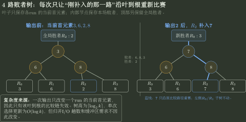

# 多路归并、败者树与虚段

> 训练定位：解决“数据不能全进内存时，给 $N/M/k/r$、缓冲块、初始 runs 或段长，要求归并趟数、I/O、败者树比较次数、最佳归并树虚段数”的题目族。  
> 模型归属：[DS12｜外部排序](DS12_外部排序_方法论手册.tex)。初始 run、置换选择、多路归并、败者树、缓冲与虚段的机制归 Canonical；本文件只训练参数账本和 I/O 计算。

## 母题表示：外排先把成本模型从“比较”切成“块 I/O”

草稿第一行固定写：

```text
N = 总记录/块数
M = 内存一次可处理规模
r = 初始 run 数
k = 归并路数
S = 归并趟数
```

普通初始段：

$$
r=\left\lceil\frac NM\right\rceil.
$$

平衡 $k$ 路归并：

$$
S=\lceil\log_k r\rceil.
$$

若每趟把全部数据读一遍、写一遍，归并阶段 I/O 量级：

$$
2NS.
$$

## 问题一：$k$ 不能只为了少趟数无限增大

每个输入 run 至少需要输入缓冲，输出还要缓冲。

若内存有 $B$ 个缓冲块，经典最小配置通常要求：

$$
k+1\le B.
$$

因此先由缓冲预算求可行 $k$，再算 $\log_k r$。

### 局部规则：归并路数先过缓冲预算

**触发信号**：题目同时给“缓冲区数量”和“k 路归并”。

**第一动作**：先检查 $k$ 是否可实现，不要直接把题目中最大的 $k$ 代入趟数公式。

**检查与退出**：至少要为每个输入路和输出保留题设要求的缓冲；若内存预算不支持该 $k$，停止计算 $\lceil\log_k r\rceil$，先降低可行路数。

## 问题二：多路归并的候选集合只有“每路当前首元素”

```text
run1 -> current head
run2 -> current head
...
runk -> current head
```

每次输出全局最小候选后，只推进它所属的那一路，再补入该路的新首元素。

### 不变量

- 每条尚未耗尽的 run 在候选结构中恰有一个当前项；
- 已输出序列不大于任何当前候选；
- 每一路内部指针只向前。

把所有未输出记录一次性放入堆，会丢失“每条 run 已有序”的结构优势。

## 问题三：败者树优化的是“每次选冠军的比较路径”

朴素从 $k$ 个首元素线性找最小：每输出一个记录约需 $k-1$ 次比较。

败者树维护一棵比较树：每次某一路补入新值，只沿该叶到根的路径重新比赛，更新成本约：

$$O(\log k).
$$



图中内部节点保存本轮比较的败者，顶部单独保留全局胜者；某一路输出并补入新值后，只有它到根的比较链失效，其他子树不需要重赛。

### 边界

败者树不改变：

- 多路归并的 I/O 趟数；
- 每一路必须有序；
- 缓冲块需求。

它主要降低内部选择当前最小候选的比较代价。

## 问题四：置换选择要维护“活动/冻结”两种槽位

输出当前 run 的最小活动记录 $x$ 后读入新记录 $y$：

- 若 $y\ge x$：仍可留在当前 run，设为活动；
- 若 $y<x$：冻结到下一 run。

当活动记录全部耗尽：当前 run 结束，把冻结集合解冻，开始新 run。

### 检查与退出

“冻结”不等于输入已经结束；输入结束后，当前内存中剩余活动记录仍要继续输出。

随机输入下平均 run 长度常约为 $2M$，这是统计性教材结论，不是每个输入都恰好 $2M$。

## 问题五：最佳归并树先补虚段，再做 $k$ 叉 Huffman

若初始段长度不等，较短 run 应尽量早合并，减少长 run 被重复读写的层数。

把每个 run 长度看成叶权，构造 $k$ 叉 Huffman 式归并树。

严格 $k$ 叉树要求：

$$
\frac{r-1}{k-1}\in\mathbb Z.
$$

令：

$$
u=(r-1)\bmod(k-1).
$$

若 $u\ne0$，需要补：

$$
\boxed{k-u-1}
$$

个权值为 0 的虚段。

### 代表母题：4 路归并，6 个初始段

$$
(r-1)\bmod(k-1)=5\bmod3=2.
$$

所以补：

$$
4-2-1=1
$$

个虚段。

之后以 7 个叶子做严格 4 叉最优归并树。

### 局部规则：虚段是“结构补位”，不是外存真实数据

**触发信号**：$k$ 路最佳归并树的初始段数不满足严格 $k$ 叉树叶数同余条件，需要补虚段。

**第一动作**：求最小 $s\ge0$ 使 $(r+s-1)\bmod(k-1)=0$，补 $s$ 个权值 0 的虚段后再做 $k$ 叉 Huffman 合并。

**检查与退出**：虚段只参与归并树计算，权值为 0，不产生真实记录 I/O；若把它当成真实 run 计读写量，或补段后仍不满足同余条件，立即重算。

## 问题六：为什么虚段要放在最底层

虚段权为 0，应让它承担尽可能深的位置，避免真实 run 因补位而多经过一层归并。

等价理解：若第一趟无法凑满 $k$ 路，可先做一个较少路数的归并，使后续结构成为严格 $k$ 叉树。

不能把“最后一趟少合几路”当成同样效果；那可能让真实大 run 已经重复参与额外 I/O。

## 问题七：归并趟数与最佳归并树是两类题

### 初始 runs 等长、每趟平衡合并

重点是：

$$S=\lceil\log_k r\rceil.$$

### runs 长度不等、问总读写代价最小

重点转成带权路径长度：

$$
I/O\ cost\propto2\times WPL.
$$

此时不能只用 $\lceil\log_k r\rceil$ 判断总成本，因为不同 run 在不同深度会被重复读写不同次数。

## 问题八：缓冲块耗尽 ≠ run 耗尽

- 某输入 buffer 空：只说明要从该 run 再读一个块；
- run 真正耗尽：才从候选集合中移除该路；
- 输出 buffer 满：触发一次块写；
- 全部 run 耗尽：整个归并结束。

把块级 I/O 事件与记录级顺序事件分开，是外排计算不乱的关键。

## 代表母题：等长 runs 的趟数

若：

```text
r = 25 initial runs
k = 5-way merge
```

则：

$$
25\to5\to1
$$

共 2 趟：

$$S=\lceil\log_5 25\rceil=2.$$

若总数据规模为 $N$ 个块，归并阶段读写约：

$$4N
$$

块 I/O（每趟读 $N$、写 $N$）。初始 run 生成阶段的读写是否另计，以题目口径为准。

## 陌生外排题固定落笔协议

```text
1. 先确认数据是否真的不能全进内存；能进则转 DS11。
2. 写 N、M、r、k、buffer budget。
3. 普通初始段 r=ceil(N/M)；置换选择则按实际/题设 run 长度。
4. 先检查 k 路是否满足输入+输出缓冲预算。
5. 等长平衡 runs 用 S=ceil(log_k r)。
6. 每趟 I/O 分读 N + 写 N，是否包含初始段生成单独声明。
7. 段长不等时转最佳归并树：先补虚段，再反复合并最小 k 个权。
8. 败者树只优化候选比较，不改变 I/O 趟数。
9. 最后检查：虚段数是否满足 (r'-1)%(k-1)=0。
```

## 最短压缩

> **外排先数 I/O：初始 run → 可行 k 路 → 归并趟数；段长不等时把 run 长当 Huffman 权值，先补零权虚段，再让短段更深、早合并。**
