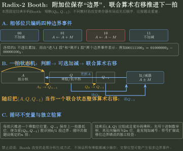

# 移位、Booth 乘法与迭代除法

> 训练定位：解决“给有限位宽机器数、联合寄存器或逐拍状态，要求移位、Booth 补码乘法、恢复/不恢复除法过程与溢出判断”的题目族。  
> 模型归属：[CO-01｜数据表示与运算](CO-01_数据表示与运算_方法论手册.tex)。有限位宽解释、移位语义、乘除算法机制与溢出边界由 Canonical 正文拥有；本文件只训练版本声明、逐拍账本和最终回算。

## 母题表示：先锁四个前提，再做一位操作

所有定点移位/乘除题草稿第一行固定写：

```text
width = ? bit
interpretation = unsigned / two's complement / sign-magnitude ?
register layout = ?
algorithm version = ?
```

题目给联合寄存器图时，以图为最高优先级。不同教材的“先移位还是先加减”、商位方向、附加位位置可以不同；不能把某一套节拍口诀跨版本套用。

## 问题一：逻辑移位与算术移位先问“要保持什么解释”

### 逻辑左移/右移

空位补 0，适合把位串当无符号量或纯逻辑字段处理。

### 算术右移

补码下复制符号位，使符号扩展语义保持：

```text
0xxxx -> 00xxx
1xxxx -> 11xxx
```

### 左移

无论 unsigned 还是补码，低 $n$ 位都相当于乘 $2^k$ 后取模 $2^n$；但真值是否仍等于数学乘法，要额外检查被丢高位是否构成合法扩展。

### 局部规则：移位题先写“丢了什么、补了什么”

**触发信号**：算术/逻辑左移右移、乘/除 $2^k$、溢出。

**第一动作**：标出被移出的高/低位与新补入位，再解释结果位串。

**检查与退出**：补码负数算术右移通常趋向负无穷取整，不能无条件等同高级语言“向零截断”的 signed division。

## 问题二：左移溢出不能只看最终符号位

对补码左移，数学值应乘 2；若被丢掉的高位不再只是新符号位的合法符号扩展，就发生有符号溢出。

例如 8 位补码：

```text
0011 0000 = 48
左移1 -> 0110 0000 = 96   合法
0110 0000 = 96
左移1 -> 1100 0000 = -64  数学上应为192，溢出
```

> **检查：**不要用“结果仍有 8 位”作为没溢出的证据；有限位宽本来就会始终保留 8 位。

## 迭代运算的时间题：先数轮次，再给每轮动作定价

乘除算法题若额外给“加法一次多少 ns、移位一次多少 ns”，时间不是由数学表达式中的运算符数量直接决定，而是由硬件迭代状态机真正执行了多少轮、每轮最坏需要哪些动作生成。

例如 $n$ 位原码一位乘法若题设版本规定每轮最多执行“一次加法 + 一次移位”，且共进行 $n$ 轮，则最坏时间为

$$
T_{max}=n(T_{add}+T_{shift}).
$$

若某轮可以跳过加法，只会降低实际时间，不改变上述 worst-case 上界。不同教材若把最后一次移位省略、加法/移位可重叠，必须按题设重新计价。

### 局部规则：迭代算法性能先写 action bundle

**触发信号**：题面同时给乘法/除法算法、位数与“加法/移位/比较一次耗时”，要求最多/最少/实际执行时间。

**第一动作**：先确定循环次数，再写每一轮的 `mandatory actions + conditional actions`；最坏时间只把可能发生的条件动作按每轮最坏情况计入。

**检查与退出**：确认题目问的是 latency 还是吞吐，并检查最后一轮是否仍执行移位、动作能否并行。若题设给出具体逐拍时序，以题设状态机为准，不套固定 $n(T_{add}+T_{shift})$。

## 问题三：乘法先区分“完整乘积”和“目标宽度结果”

两个 $n$ 位整数的精确积最多需要 $2n$ 位承载。

若只保留低 $n$ 位：

- unsigned 与补码乘法的低 $n$ 位位模式可以相同；
- 但完整高半部与溢出解释不同。

### 局部规则

**触发信号**：题目问乘法结果、溢出或“高 n 位/低 n 位”。

**第一动作**：先在 $2n$ 位语境中想完整积，再按题目要求截断。

**检查与退出**：只观察最终 carry 或低半部不能证明有符号乘法未溢出。

## 问题四：Radix-2 Booth 先抄动作表

经典补码 Booth 使用附加位 $Q_{-1}$，每拍观察：

$$
(Q_0,Q_{-1}).
$$

常见动作：

| $Q_0Q_{-1}$ | 动作 |
|---|---|
| 00 | 不加减 |
| 01 | $A\leftarrow A+M$ |
| 10 | $A\leftarrow A-M$ |
| 11 | 不加减 |

随后对联合寄存器：

$$
(A,Q,Q_{-1})
$$

做**算术右移**。

### 为什么 01 加、10 减

Booth 把连续 1 段写成边界差。例如：

$$
00111100_2=01000000_2-00000100_2.
$$

于是内部连续多个加法被压到两个边界事件。



图中箭头表示一拍内的状态依赖：先由 $(Q_0,Q_{-1})$ 选择是否更新 $A$，再把 $(A,Q,Q_{-1})$ 作为一个联合状态做算术右移。若题图改变附加位位置、寄存器宽度或先后顺序，应保留“边界重编码”的机制，但重新定义局部状态机。

## 问题五：Booth 纸面题固定五列

每一拍表格建议：

| cycle | $Q_0Q_{-1}$ | add/sub | shift 前 $(A,Q,Q_{-1})$ | shift 后状态 |
|---|---|---|---|---|

### 局部规则：算术右移作用于“联合状态”

**触发信号**：题面给 Booth 联合寄存器 $(A,Q,Q_{-1})$，或明确说加减后对联合寄存器算术右移。

**第一动作**：先把联合状态完整写成一条位串，标出符号扩展位与两个寄存器边界，再执行一次整体右移；不要先分别移动 $A$、$Q$ 后再猜边界位。

**检查与退出**：确认 $A$ 的最低位进入 $Q$ 的最高位、$Q$ 的最低位进入 $Q_{-1}$，且 $A$ 的最高位按算术右移复制。若题设使用另一种寄存器布局或先后顺序，停止沿用本模板，按题图重新定义联合状态。

### 最终检查

把最终 $2n$ 位乘积重新按补码解释，并与十进制数学乘法回算：

$$
product_{machine}=x\times y.
$$

若不一致，优先检查：动作表正负号、$Q_{-1}$ 初值、算术右移符号扩展、循环次数。

## 问题六：Booth 不保证所有输入都减少操作

连续 1 很长时 Booth 可明显减少加法；交替位型可能并不更少，甚至产生较多边界动作。

所以稳定结论是：

> Booth 通过重编码连续 1 段来改变部分积生成方式，而不是“对任何乘数都更快”。

## 问题七：除法先写最终商余不变量

任何整数除法过程最终都要满足：

$$
\boxed{Dividend=Quotient\times Divisor+Remainder}.
$$

对通常的非负绝对值除法还要求：

$$
0\le R<|Divisor|.
$$

符号规则以题设算法为准。

### 局部规则：逐拍算法忘了也先保住最终检查

**触发信号**：恢复余数、不恢复余数、联合寄存器除法。

**第一动作**：先写寄存器分别承载 partial remainder、quotient/dividend、divisor 的哪一部分，最后用商余关系回代。

**检查与退出**：最终必须满足 $Dividend=Quotient\times Divisor+Remainder$ 以及题设规定的余数范围/符号条件；若回代失败，先检查商位方向、最后修正和算法版本，不用错误的最终值去倒改中间表。

## 问题八：恢复余数法的关键是“减失败就恢复”

经典抽象：

```text
形成/移位 partial remainder
-> 尝试减 divisor
-> 若 remainder >= 0：商位记1，保留
-> 若 remainder < 0：商位记0，并加回 divisor 恢复
```

具体“先左移还是先减”以及寄存器宽度必须跟题设版本。

## 问题九：不恢复余数法把恢复推迟到下一拍

常见抽象：

- 当前余数非负：下一拍尝试减除数；
- 当前余数为负：下一拍加除数；
- 依据结果决定商位；
- 最后若余数仍负，再做一次修正。

它减少“每次失败立即恢复”的动作，但状态机更依赖余数符号。

### 停止条件

不要把恢复法的某一拍顺序与不恢复法混成同一表；二者共享最终商余不变量，不共享所有局部动作。

## 问题十：除零与最小负数除以 -1 是两类异常边界

- divisor = 0：硬件可检测，但架构结果是异常/规定值由 ISA 决定；
- $n$ 位补码最小负数：

$$
-2^{n-1}/(-1)=2^{n-1}
$$

超出同宽 signed 最大值 $2^{n-1}-1$，因此有溢出风险。

## 本批题库的攻击证据

- **Q256**：左移结果位模式相同，不代表 signed/unsigned 的“溢出”判据相同；必须先锁解释与目标位宽。
- **Q259**：算法时间来自 `循环轮数 × 每轮真实动作`，不是看到“4 位乘法”就背固定纳秒数；最后一轮是否移位、动作能否重叠都属于算法版本。
- **Q260–262**：`x/2`、`2y`、加减与 OF 同题时，必须逐个中间结果保留目标位宽语义，不能只对最终数学表达式一次性求值后猜溢出。

正式题面与解析见 [02｜数据表示与定点/浮点运算](../../../archives/408/题库/计算机组成原理/02_数据表示与定点浮点运算_选择题.md) 与其同名答案文件。

## 代表母题：Booth 训练时怎样验算

假设题设给 4 位补码乘法，$M=0011_2=3$，$Q=1101_2=-3$，附加位初始 0。

不要只抄最终表。先写预期数学积：

$$3\times(-3)=-9.$$

8 位补码应为：

$$11110111_2.$$

逐拍 Booth 表完成后，最终 $(A,Q)$ 必须回到这个位串。这个“先生成预期输出，再攻击逐拍过程”的方法能快速发现中间一拍移位或加减号错误。

## 陌生乘除/移位题固定落笔协议

```text
1. 写位宽、signedness、编码和寄存器布局。
2. 移位先写丢弃位/补入位，再解释真值。
3. 乘法先保留 2n 位完整积，再判断截断与溢出。
4. Booth 先抄 00/01/10/11 动作表和 Q_-1 初值。
5. 每拍记录判断位、加减、联合移位、循环后状态。
6. 除法先声明恢复/不恢复版本与商位方向。
7. 最终用 Dividend=Q*D+R 或数学乘积做独立回算。
8. 单列 divisor=0、minint/-1 和目标位宽溢出。
```

## 最短压缩

> **定点运算题先锁版本：移位问“丢什么补什么”，Booth 看 $(Q_0,Q_{-1})$ 边界并联合算术右移，除法始终用商余关系回算；逐拍口诀不能跨寄存器布局复用。**
