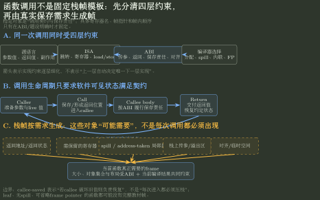

# 函数调用、ABI 与编译器边界

> 训练定位：面对函数调用、参数传递、返回值、保存寄存器、栈帧和具体汇编代码时，先判断当前结论来自源语言、ISA、ABI 还是编译器选择，避免把某套机器的常见写法当成所有架构都必须遵守的规则。
> 模型归属：[CO-02｜ISA 与机器级程序](CO-02_ISA与机器级程序_方法论手册.tex)。函数调用的软件可见语义、ISA 原语和 ABI 边界由 Canonical 正文拥有；本文件只训练分层判断、状态表示和题面调用。

## 母题表示：同一个函数调用同时经过四层约束

函数调用题最容易混淆，是因为题面经常把四种不同来源的事实写在一起：

| 层次 | 它决定什么 | 不能直接推出什么 |
|---|---|---|
| 源语言语义 | 调用哪个函数、参数值、返回值以及可观察副作用 | 参数一定放哪个寄存器、一定怎样建栈帧 |
| ISA | 有哪些寄存器、跳转/调用/返回、load/store 等软件可见原语 | 哪些寄存器由 caller 或 callee 保存 |
| ABI | 参数/返回值位置、caller-saved / callee-saved、栈对齐和调用约定 | 编译器一定会为每次调用生成同一种栈帧 |
| 编译器选择 | 寄存器分配、是否 spill、是否省略 frame pointer、是否内联等具体实现 | 不能反过来修改 ISA 或 ABI 的稳定约束 |

所以看到一段机器级函数调用，不先问“这是什么固定模板”，而先问：

> **这条结论到底由哪一层保证？**

## 局部规则：先给每条结论标来源层

**触发信号**：题目出现函数调用、参数寄存器、返回地址、栈指针、保存寄存器、局部变量、递归或栈帧。

**第一动作**：把题面中的关键事实分别标成 `语言 / ISA / ABI / 编译器`。只有 ISA 或 ABI 已明确的内容才能作为稳定约束；具体寄存器分配和栈帧形状若只是某段汇编的结果，就按当前代码读取，不上升成普遍规律。

**检查与退出**：如果推理中出现“函数调用一定用这个寄存器”“每个函数一定建立完整栈帧”“某寄存器名天然就是返回地址”之类结论，立即检查题目是否给出了具体架构和 ABI。没有给出时，不自行补一套 MIPS、x86 或其他架构习惯。

## 状态表示：先写调用前后必须成立的事实

分析一次调用，先写最少的状态变化：

```text
调用前：
- 参数值当前在哪里？
- 当前 PC / 返回位置是什么？
- 哪些寄存器或内存值调用后仍必须保持？

调用发生：
- 控制流如何进入 callee？
- 返回位置怎样被保存？
- 参数怎样按当前 ABI 交付？

返回后：
- 返回值在哪里？
- 哪些保存责任已经履行？
- SP 等架构状态是否恢复到 ABI 要求的位置？
- Next PC 是否回到正确返回点？
```

这里关心的是**软件可见状态是否满足调用契约**，不是先背某张栈帧图。



图中上层箭头表示约束逐层细化，不表示上一层唯一决定下一层；下半部分列出的返回状态、保存寄存器、spill、栈上传参和对齐空间都是“按当前函数需求可能出现”的对象，而不是固定栈帧槽位。

## 局部规则：保存寄存器先问“谁有责任保持”

**触发信号**：题目问 caller-saved、callee-saved，或者要求判断调用前后某寄存器值是否仍可靠。

**第一动作**：先读取当前 ABI 对该寄存器的保存责任；再看调用方或被调用方是否真的需要保存。`callee-saved` 表示 callee 若要破坏旧值就负责恢复，不表示每次进入函数都必须机械压栈；`caller-saved` 也不表示 caller 每次都必须保存，只在调用后仍需要旧值时才有保存需求。

**检查与退出**：若题目没有给 ABI，而答案依赖具体保存集合，则不能从“通用函数调用”推出唯一寄存器名单。转回题设或明确所采用的 ABI。

## 局部规则：栈帧按真实需求生成，不套固定形状

**触发信号**：要求判断局部变量、返回地址、保存寄存器、参数溢出区或递归调用在栈上的位置。

**第一动作**：从当前函数真正需要长期保存的对象开始：哪些值无法一直留在寄存器、哪些状态跨调用必须保留、局部对象是否需要内存地址、ABI 有什么对齐要求。再由这些需求推导栈空间，而不是先画一个固定模板。

**检查与退出**：叶函数、被内联函数、没有 spill 的函数或允许省略 frame pointer 的实现，都可能没有教材图中的完整结构。只有题设/ABI 固定的部分才能当硬约束。

## 一个最小对照：叶函数与再次调用其他函数

假设两个函数计算相同类型的局部结果：

- 函数 A 不再调用其他函数；
- 函数 B 在返回前还要调用函数 C。

两者的源语言目标可能很接近，但机器级保存需求不同。B 必须额外考虑“调用 C 以后，自己仍要使用的值和返回路径由谁保护”。因此：

```text
同样是 function call
≠
同样的寄存器保存数量
≠
同样的栈帧大小
```

真正稳定的是当前 ISA/ABI 的责任边界，而不是某张固定帧图。

## 与相邻 Topic 的停止边界

- 已经开始追 ALU、MUX、总线和控制信号：转 [CO-03](../30_CPU数据通路与控制/README.md)；
- 已经开始比较多条调用相关指令的 need / ready / stall：转 [CO-04](../40_流水线与指令级并行/README.md)；
- 已经进入虚拟地址、Cache、页表或缺页：转对应存储 Owner；
- 已经讨论系统调用、异常入口或 OS 保存进程上下文：转跨科 Bridge / OS，而不是继续把它当普通 ABI 调用。

## 变式轴

同一问题族通常通过这些条件变化：

- 改架构或 ABI；
- 参数数量超过寄存器参数区；
- leaf / non-leaf；
- 是否递归；
- 是否需要 spill；
- 是否省略 frame pointer；
- 返回值大小或传递方式变化；
- 编译器开启不同优化。

每次只改一个条件时，应能指出变化发生在语言、ISA、ABI 还是编译器层。

## 压缩

函数调用题先问四层：

```text
语言要求什么
→ ISA 提供什么原语
→ ABI 规定谁负责什么
→ 当前编译器实际怎样实现
```

> **最重要的边界：ABI 约定不是 ISA 天然行为，某次编译结果也不是 ABI 的唯一实现。**
